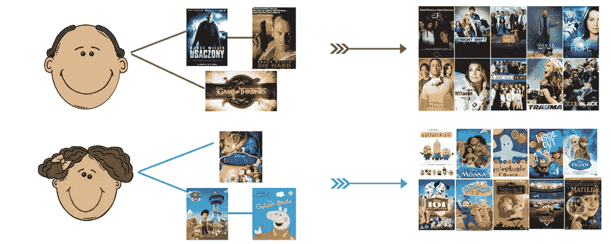
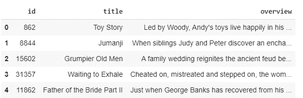
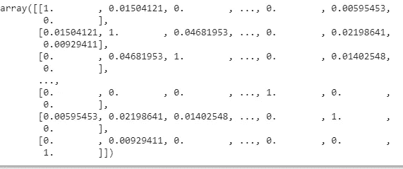
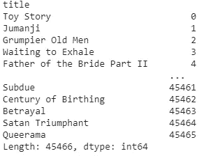
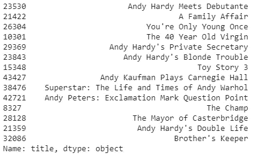

# Python 中基于内容的推荐系统

> 原文：<https://medium.com/analytics-vidhya/content-based-recommender-systems-in-python-2b330e01eb80?source=collection_archive---------1----------------------->

## *本博客用 python* 说明了一个 ***基于内容的推荐系统***

**

*这是我在从 2020 年开始的新十年中的第一个博客系列，因此我非常兴奋。在开始用 python 演示基于内容的推荐系统之前，我建议您花 4 分钟阅读这篇博客，它用外行的术语定义了推荐系统及其类型。*

*[https://medium . com/@ saketgarodia/the-world-of-recommender-systems-e4ea 504341 AC？source = friends _ link&sk = 508 a 980d 8391 DAA 93530 a 32 e 9c 927 a 87](/@saketgarodia/the-world-of-recommender-systems-e4ea504341ac?source=friends_link&sk=508a980d8391daa93530a32e9c927a87)*

*通过这篇博客，我将展示如何在 Kaggle 的 MovieLens 100k 数据集上用 Python 实现一个基于内容的推荐系统。*

*[](https://www.kaggle.com/prajitdatta/movielens-100k-dataset) [## MovieLens 100K 数据集

### 稳定的基准数据集。1000 名用户对 1700 部电影的 100，000 次评分

www.kaggle.com](https://www.kaggle.com/prajitdatta/movielens-100k-dataset) 

让我们开始实施它。

# **问题表述**

*构建一个推荐系统，根据之前看过的电影的剧情推荐电影。*

# 履行

首先，让我们导入所有必要的库，我们将使用它们来创建一个基于内容的推荐系统。让我们也导入必要的数据文件。

```
#importing necessary librariesimport numpy as npimport pandas as pdfrom sklearn.metrics.pairwise import cosine_similarityfrom sklearn.metrics import mean_squared_errorfrom sklearn.model_selection import train_test_splitfrom sklearn.feature_extraction.text import TfidfVectorizerfrom sklearn.metrics.pairwise import linear_kernel#putting movies data on 'movies' dataframemovies = pd.read_csv('movies_metadata.csv')
```

因为我们正在构建一个基于情节的推荐系统，所以让我们只选择我们将要使用的列。我们将使用电影' *id'* 、电影'*标题*和'*概述* ' ( *概述*详述每部电影的情节)。

这是现在的数据。



让我们看看电影情节在数据集中是什么样子的。

```
movies[‘overview’][0]
```

电影《玩具总动员》的剧情在数据集中是这样的:*“在伍迪的带领下，安迪的玩具们在他的房间里快乐地生活，直到安迪的生日将巴斯光年带到了现场。由于害怕失去在安迪心中的地位，伍迪密谋反对巴兹。但当情况将巴斯和伍迪与它们的主人分开时，这对搭档最终学会了抛开他们的分歧。*

我们有一个大约 45466 部电影的数据集，足以建立一个基于情节向我们推荐电影的模型。这将会非常有趣。

作为**的第一步**，我们将使用 **TfidfVectorizer** ，它将基本上把我们的' **overview** '(一个文本列)转换成数字。由于计算机只能理解 0 和 1，所以所有的数据科学模型都是基于数值运行的。

TF-IDF 基本上就是**词频-逆文档频**。它创建的特征数量等于概览列中使用的不同单词的总数，并且这些值与特定单词的使用次数成正比，与使用该单词的文档(此处为电影)的数量成反比。它会处罚一个单词，即使这个单词在一部电影中有很大的数量，但在许多电影中是常见的。在许多电影中多次出现但却很常见的词无论如何都不能帮助区分不同的电影。

```
tfidf = TfidfVectorizer(stop_words=’english’)movies[‘overview’] = movies[‘overview’].fillna(‘’)#Construct the required TF-IDF matrix by applying the fit_transform method on the overview featureoverview_matrix = tfidf.fit_transform(movies[‘overview’])#Output the shape of tfidf_matrixoverview_matrix.shape#Output
(45466, 75827)
```

现在，我们有了所有电影的“tfidf”特征矩阵。每部电影都有 **75927** 个**个**个【字】。现在，为了找到电影之间的相似性，我们将使用**余弦 _ 相似性。**在我们的例子中，linear_kernel 函数将为我们进行同样的计算。

**余弦 _ 相似度**基本上是 2 个向量之间相似度的度量。这个度量是它们之间角度的余弦。这里，每部电影有 75927 个特征(tfidf 值)。现在让我们使用线性核函数来找到相似性矩阵:

```
similarity_matrix = linear_kernel(overview_matrix,overview_matrix)similarity_matrix
```



相似矩阵

现在，让我们创建一个系列，将矩阵的索引映射到电影名称，这样我们只需输入电影名称就可以轻松获得推荐。

```
#movies index mappingmapping = pd.Series(movies.index,index = movies[‘title’])mapping
```



现在，我们将制作一个**推荐函数**，它将使用余弦相似度为我们推荐电影。我们的函数将电影名称作为输入，然后使用上面找到的余弦相似性矩阵找到前 15 部电影。

```
**def recommend_movies_based_on_plot(movie_input):**movie_index = mapping[movie_input]#get similarity values with other movies#similarity_score is the list of index and similarity matrixsimilarity_score = list(enumerate(similarity_matrix[movie_index]))#sort in descending order the similarity score of movie inputted with all the other moviessimilarity_score = sorted(similarity_score, key=lambda x: x[1], reverse=True)# Get the scores of the 15 most similar movies. Ignore the first movie.similarity_score = similarity_score[1:15]#return movie names using the mapping seriesmovie_indices = [i[0] for i in similarity_score]return (movies[‘title’].iloc[movie_indices])
```

现在让我们试着从上面的推荐函数中获取一个关于电影《安迪·哈代的生活》的推荐，看看它会输出什么。

```
recommend_movies_based_on_plot(‘Life Begins for Andy Hardy’)
```



我们最终可以看到，当我们**输入一部电影《安迪·哈代的人生》(Life Begins for Andy Hardy)**时，我们会得到 15 部与这部电影情节相似的电影推荐。太神奇了。不是吗？

要了解基于元数据和协同过滤的方法，请浏览我的以下博客:

1.  基于元数据的推荐系统:[*https://medium . com/@ saketgarodia/metadata-based-Recommender-Systems-in-python-c 6 aae 213 b 25 c*](/@saketgarodia/metadata-based-recommender-systems-in-python-c6aae213b25c)
2.  使用协同过滤的推荐系统:[*https://medium . com/@ saketgarodia/recommendation-system-using-Collaborative-Filtering-cc 310 e 641 FDE*](/@saketgarodia/recommendation-system-using-collaborative-filtering-cc310e641fde)

感谢阅读。

请做帖子反馈。*