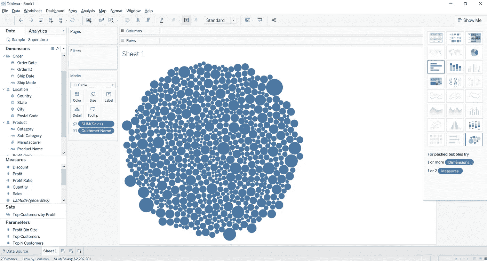
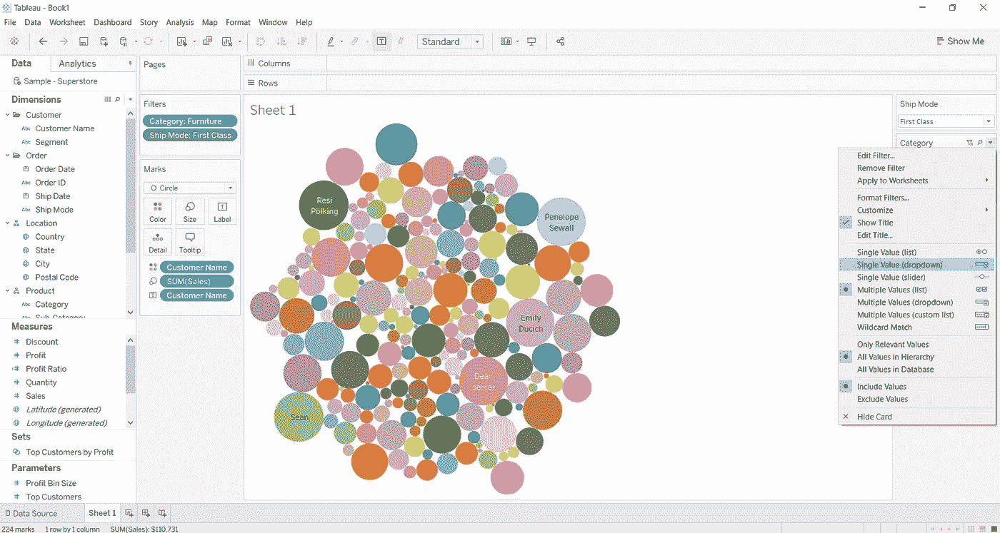
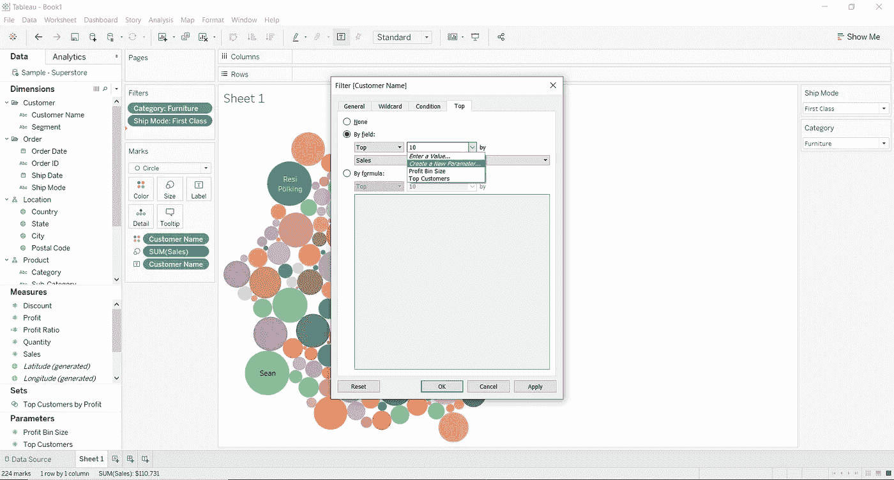
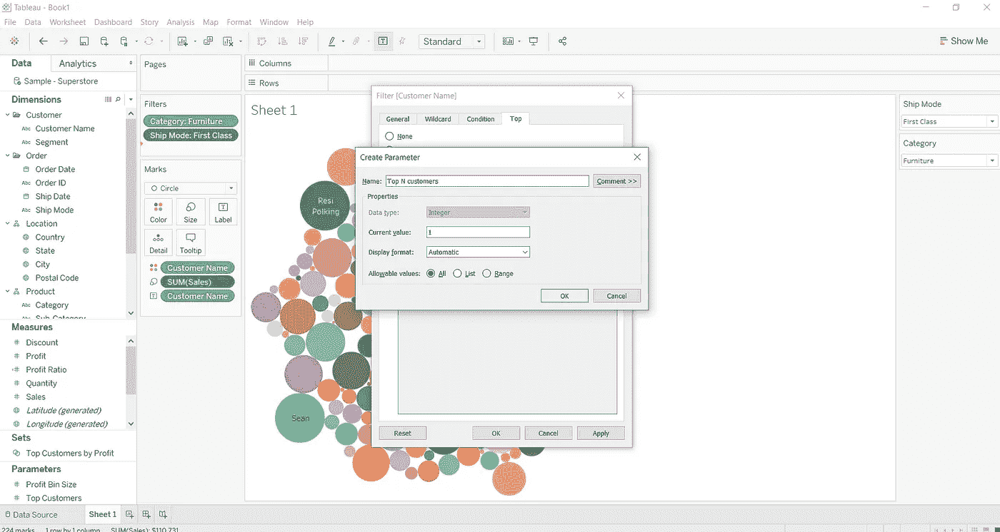
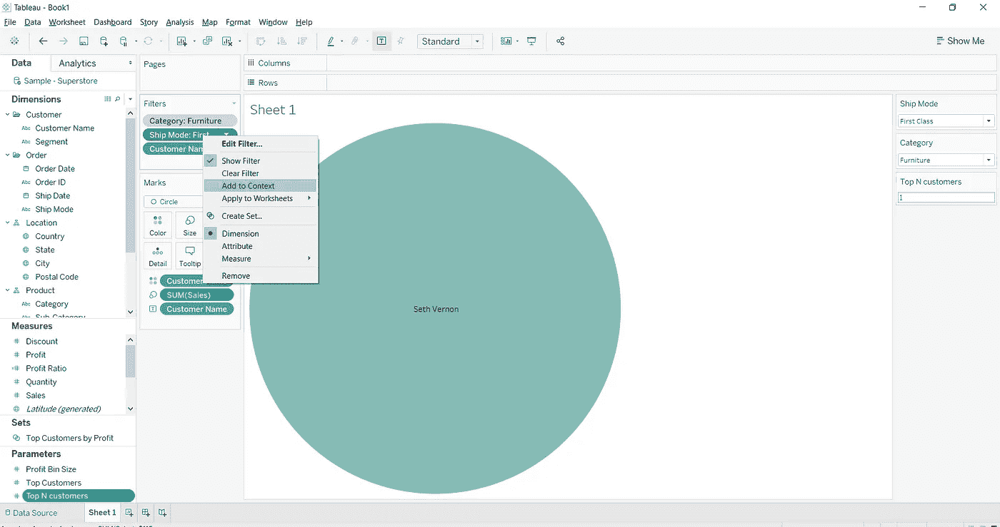

# Tableau 中的上下文过滤器

> 原文：<https://medium.com/analytics-vidhya/context-filters-in-tableau-24eecd70f0d9?source=collection_archive---------15----------------------->

## 通过示例了解

如果希望处理大型数据集，并且不希望性能有任何滞后，那么需要知道什么是上下文过滤器，以及它们如何帮助处理大型数据集。

Tableau 中的快速过滤器独立过滤数据，也就是说，它读取数据中的所有行，然后应用过滤器产生所需的结果。但是当用户需要两个或更多过滤器时，由于快速过滤器的独立性质，结果可能不是用户想要的。

为了更好地理解上下文过滤器，我们将尝试解决一个使用上下文过滤器来帮助我们的例子。

出于本教程的目的，我们将使用示例 Tableau 中提供的超市数据。我们将根据销售额计算前 N 名客户，其中 N 可以是用户想要的任何整数。我们将按类别和运输模式过滤数据。当上下文过滤器的使用第一次出现时，我将解释上下文过滤器的使用。

## 按销售额查找前 N 名客户的步骤

第一步:加载完样本—超市数据后，将**客户姓名**添加到**标签**中，将**销售**添加到**尺寸**中。现在从“演示”选项卡中选择**包装气泡**。

第二步:为了使图表更加丰富多彩和易于区分，将**客户名称**添加到**颜色中。**向过滤器添加**类别**和**车间模式**尺寸，并为两个过滤器选择任意一个值。此外，在两个过滤器中选择菜单上的**显示过滤器**选项，并选择**单值下拉菜单。**

步骤 3:现在，要添加所需的前 N 个功能，请将**客户名称**字段添加到过滤器中，从可用选项中选择**使用所有**并转到过滤器中的**顶部**选项卡，通过字段选择**并创建一个新参数。**

步骤 4:创建截图中的前 N 个参数。一旦您在创建参数后按下 OK，您将会发现气泡图要么消失，要么只有几个值，这些值将少于您指定的值的数量。这是因为**快速过滤器**独立工作。但是 **Top N** 过滤器本身是一个不同的过滤器，这意味着它将根据指定的条件过滤所有数据。这样，它将为我们提供全局**前 N 个值**，而不是为我们提供与指定的其他过滤器相关的**前 N 个值**。因此，我们只能看到位于前 N 名值**和用户指定的**类别**和**发货模式**之间的气泡图。**

步骤 5:通过打开两个维度的过滤器选项卡中的下拉菜单，将**类别**和**运输模式**过滤器添加到**上下文**中。您将能够获得想要的视图。

现在，你可以使用过滤器，通过各种**商店模式**和**类别的销售来获得顶级客户。**