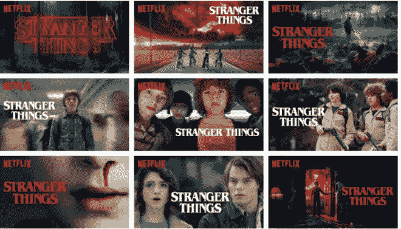
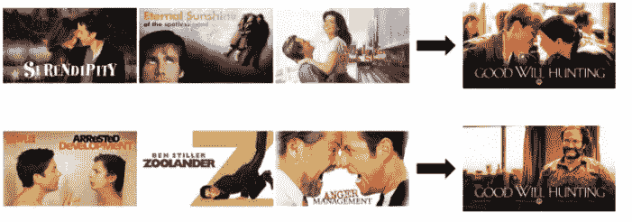

# 语境化的多臂强盗——(网飞作品推荐背后的直觉)

> 原文：<https://medium.com/analytics-vidhya/contextual-multi-armed-bandit-intuition-behind-netflix-artwork-recommendation-b221a983c1cb?source=collection_archive---------12----------------------->

*通过网飞的作品例子理解多臂强盗算法*

各种各样的艺术品

我先说一个有趣的案例。假设**网飞**即将上映**陌生人的事情**。为了吸引更多的观众，它将如何决定该系列的**作品**(或缩略图)？您一定听说过 **A/B 测试**，它被所有公司用于不同的用例，以测试各种 UX 和建议更改，但是您认为网飞可以在这种情况下使用 A/B 测试吗？好吧，首先我来回答一下什么是 A/B 测试，然后我再回到这个问题上来。 **A/B 测试是一种统计测试**或实验，其中向一些客户展示具有一些新添加的功能的网站(实验组 A，**例如:**注册按钮的改变的颜色)，向另一组人展示没有实现的功能的网站(控制组 B)，然后使用各种统计测试来分析是否应该实现新功能。大多数在线零售商和大型科技公司在工作中几乎都会定期进行 A/B 测试。例如，为了检查**改变注册按钮**的颜色和大小是否会导致点击率增加，统计人员需要进行 A/B 测试，以分析并得出该改变是否具有统计显著性，从而得以实施。如果你想了解更多关于 A/B 测试的细节，我建议你去看看谷歌顶级统计师的课程:[https://www.udacity.com/course/ab-testing-ud 257](https://www.udacity.com/course/ab-testing--ud257)。

现在让我们回到我们的问题，网飞有能力为像《奇怪的东西》这样的新系列作品进行 A/B 测试吗？为了进行这项测试，可能需要一两周的时间来获得足够的数据，以分析哪些作品的效果更好。但是，如果网飞因为一些用于测试的艺术品而失去了客户的兴趣呢？如果这种糟糕的艺术品继续使用一两个星期，网飞可能会失去许多客户，导致损失。在这种情况下，如果公司因为时间限制而负担不起 A/B 测试，他们会采用一种叫做多臂强盗的强化学习概念。我来给你解释一下多臂土匪算法背后的直觉。想象一下，你去一个有 3 台机器的赌场。所有 3 台机器需要相同的钱玩，但有不同的奖励。你的目标是最大化你的回报。您可以在一台机器上开始赢钱，然后继续在这台机器上玩，而不检查其他机器上的奖励，或者您可以尝试探索其他机器，最后继续在这台机器上玩，并获得最佳奖励。当有许多机器类似于我们在网飞的例子中的艺术品数量时，这个问题开始变得复杂。我们不能因为长时间展出的劣质艺术品而失去顾客。

所以基本上，多武装匪徒的问题可以归结为勘探和开发的问题。探索意味着探索新事物以了解其回报，而开发意味着不去探索而利用当前最好的。

因此，在我们的问题中，像网飞这样的公司可以从一组通过市场研究和调查入围的陌生事物艺术品开始。假设他们有大约 20-30 件艺术品。现在，他们可以开始随机分配艺术品给不同的客户，然后根据测试和使用多臂土匪算法实时点击进行调整。A/B 测试有一个缺点，即没有关于每个测试比其他测试更好或更差的统计数据，但是当涉及到像这样有时间限制的决策时，在更短的时间内获得更多的视图更重要，因此使用了强化学习的概念。多臂 Bandit 算法优于 A/B 测试的这一优势也被称为**,将遗憾最小化，因为它有助于减少长时间显示的坏例子，从而失去客户。**

现在我们有了多臂 bandit 算法背后的直觉，让我们理解什么是上下文多臂 Bandit 算法。如果你是一个数据狂，你一定注意到了网飞电影和节目的艺术作品因人而异。这就是“语境”发挥作用的地方。网飞向不同类型的人展示相同内容的不同作品。

让我们考虑尝试个性化的形象来描绘电影《心灵捕手》。在这里，网飞可以根据会员对不同流派和主题的偏好程度来个性化这个决定。如果网飞展示包含马特·达蒙和明妮·德瑞弗的艺术作品，观看过许多浪漫电影的人可能会对《心灵捕手》感兴趣，而如果网飞使用包含著名喜剧演员罗宾·威廉姆斯的艺术作品，则观看过许多喜剧的成员可能会被该电影吸引。

嗯，我觉得这个概念很有意思。我希望你理解直觉。

**总结一下**，转换和体验优化的世界每天都要运行几次实验和测试。即使是这些测试，也要看测试是为了什么目的。如果目的是最小化遗憾，如在我们的例子中，可以使用多臂 bandit 算法来代替 A/B 测试，而在统计和统计差异比遗憾更重要的情况下，或者当由于试验而失去客户的机会小于 A/B 测试时，使用。

谢了。如果你喜欢这个博客，请鼓掌。**快乐学习数据科学。**

***参考文献*** :

 [## 网飞的艺术品个性化

### 艺术品不仅是个性化我们推荐的东西，也是个性化我们如何推荐的第一个例子。

netflixtechblog.com](https://netflixtechblog.com/artwork-personalization-c589f074ad76) 

[https://vwo.com/blog/multi-armed-bandit-algorithm/](https://vwo.com/blog/multi-armed-bandit-algorithm/)