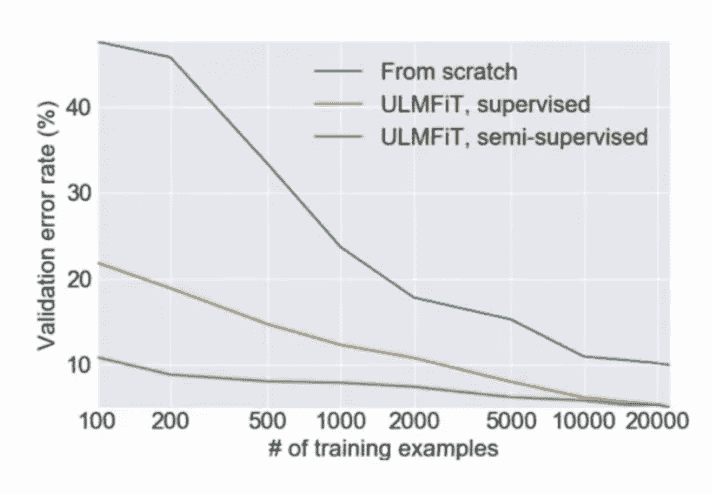

# 语境词嵌入—第一部分

> 原文：<https://medium.com/analytics-vidhya/contextual-word-embeddings-part1-20d84787c65?source=collection_archive---------4----------------------->

## 这个故事包含三个部分:对文字表述的思考，前 ELMO 和 ELMO，以及乌尔姆菲特和以后。这个故事是对[` Stanford cs 224n:NLP with Deep Learning，class 13`](https://www.youtube.com/watch?v=S-CspeZ8FHc&list=PLoROMvodv4rOhcuXMZkNm7j3fVwBBY42z&index=13) 的一个简短总结。

这个故事包含三个部分:对文字表述的思考，前 ELMO 和 ELMO，以及乌尔姆菲特和以后。这个故事是 [`Stanford CS224N:深度学习的 NLP，13 班`](https://www.youtube.com/watch?v=S-CspeZ8FHc&list=PLoROMvodv4rOhcuXMZkNm7j3fVwBBY42z&index=13)的总结。

# 1.单词的表示

也许你已经知道，我们可以训练一个单词向量来获得单词的一种表示，比如 word2vec、GloVe 和 FastText 嵌入。我们可以从随机单词向量开始，在我们感兴趣的任务上训练它们。**但在大多数情况下，使用预先训练的单词向量是有帮助的，因为你可以从更多的数据中训练它们，它们可以知道更多的词汇。他们用生僻字帮忙。**

至于未知单词的单词向量，历史上最常见的是你已经得到了四个监督训练数据，你定义了一个词汇，这个词汇可能是在你的监督训练数据中出现 5 次或更多次的单词。你把其他一切都当成 UNK。你也可以通过 UNK 矢量进行训练。但这有一些问题，*你无法区分不同的 UNK 词，无论是身份还是意义*。**对于问答系统来说，这往往是个问题，在问答系统中，匹配单词身份是很重要的，甚至对于你的单词向量词汇表之外的单词也是如此。*一个解决办法是“字由字构成”。*** 你可以**使用字符表示来学习其他单词的单词向量，**虽然这种方法增加了一些复杂性。有几个小技巧。第一个是，*当你在测试时遇到新单词，可能是你的无监督单词，预训练的单词嵌入比你的实际系统有更大的词汇量。* **因此，任何时候你遇到一个不在你的词汇库中但在*预训练单词嵌入*中的单词，只需获取该单词的单词向量并开始使用它。** 还有第二个可能的提示，如果你看到一个仍然是未知单词的东西，**而不是把它当作 UNK，你只是当场分配它，一个随机的单词向量，所以这有一个效果，每个单词都有一个唯一的身份**，这意味着如果你在问题和一个潜在的答案中看到相同的单词，它们会以一种精确的方式完美地匹配在一起，这是你不能用 UNK 匹配得到的，这些可以是一种有用的想法。

回到单词表示，对于 word2vec、GloVe 和 FastText 嵌入，**有两个问题。*首先，无论一个单词出现在什么样的上下文中，它总是有相同的表示方式*** ，我们可能想要非常细粒度的词义消歧 ***。其次，我们对一个词只有一种表示，但词有不同的方面，包括语义、句法行为和语域/内涵*** 。例如，在某种意义上，` arrival '和` arrival '的语义几乎相同，但它们是不同的词类:` arrival '是动词，` arrival '是名词，因此它们可以出现在完全不同的地方。您可能希望在依赖解析器中对它们做不同的事情。所以我们可能也想在这个基础上区分单词。这就是我们想要用新的上下文单词嵌入来解决的问题。

我们一直都有解决这些问题的方法吗？在神经语言模型(NLM)中，我们立即通过 LSTM 层粘贴单词向量。 ***那些 LSTM 层被训练来预测下一个单词。但是这些语言模型在每一个位置上都产生了上下文特定的单词表示！***

NLM 模型结构示例。[来源:课程幻灯片](https://www.youtube.com/watch?v=S-CspeZ8FHc&list=PLoROMvodv4rOhcuXMZkNm7j3fVwBBY42z&index=13)

左边显示了一个 NLM 的例子。在底部，你将单词向量(`my favorite season is spring`)输入模型，然后你穿过一个或多个循环层(类似于 LSTM 层)，它正在计算位于每个单词上方的这些表示。那些隐藏状态的角色有点矛盾。它们用于预测，也用于下一个隐藏状态和输出状态等等。但是在很多方面你可以认为，这些表征实际上是一个单词在上下文中的表征。如果你想一想问答系统发生了什么，那就是它们是如何被使用的。我们对 LSTM 的文章中的一个问题前后对照，然后这些单词很好地代表了一个单词的意思和上下文。所以看起来我们似乎已经发明了一种方法来表达特定语境的单词。

# 2.前 ELMO 和 ELMO

## 2.1 ELMO 之前

做上下文表示的第一件事是马特·皮特斯在 2017 年写的一篇[论文](https://arxiv.org/pdf/1705.00108.pdf)，这是这些上下文敏感单词嵌入的现代版本的一种前身。他和其他作者一起提出了一篇名为 ***TagLM*** 的论文。

我们希望在命名实体识别等任务上做得更好。我们想做的是了解一个词在上下文中的意思。但标准来说，如果我们正在进行命名实体识别，我们只是在 50 万字的监督数据上训练它。对于学习单词和上下文的意思来说，这并不是一个很好的信息来源。那么我们为什么不采用半监督的方法呢？

TagLM 结构。来源:[课程幻灯片](https://www.youtube.com/watch?v=S-CspeZ8FHc&list=PLoROMvodv4rOhcuXMZkNm7j3fVwBBY42z&index=13)

**我们从大量未标记的数据开始，从这些未标记的数据中，我们可以训练传统的单词嵌入模型，如 Word2Vec，但我们也可以同时训练神经语言模型，如双 LSTM 语言模型*。*** 到目前为止，当我们想要在顶部学习我们的监督词性标记器时，我们要做的是*对于输入单词* `*New York is located*` *，我们不仅可以使用与上下文无关的单词嵌入，还可以使用我们训练的递归语言模型，并在这个导入中运行它，然后我们将在我们的双 LSTM 语言模型中生成隐藏状态，我们还可以将这些作为特征输入到我们的序列标记模型中，这些特征将使它更好地工作*。

序列标签。来源:[课程幻灯片](https://www.youtube.com/watch?v=S-CspeZ8FHc&list=PLoROMvodv4rOhcuXMZkNm7j3fVwBBY42z&index=13)

这是第二张图，更详细地展示了这一点。**对于 LM，应用双 LSTM 对大量无监督数据进行训练，以获得上下文相关的单词嵌入**。右图显示了预训练的 bi-LM 模型。在右下方，句子`New York is located`被分别馈入两个 LM 模型:前向 LM 和后向 LM。获得每个单词的*隐藏状态表示。来自后向 LM 和前向 LM 的隐藏状态表示被连接，这给出了一组连接的 LM 嵌入。这些上下文相关的嵌入作为特征被输入到命名实体识别器(NER)中。*在预训练模型的训练期间，该模型在给定当前输入单词的情况下预测下一个单词。*NER(左侧)在监督下接受训练。*左下方显示的是同一句话`New York is located`正在接受训练。这个句子可以用 word2vec 风格的令牌嵌入和带有字符级 CNN 和/或 rnn 的字符级表示来表示。然后，这两个表示被连接起来，并被送入双 LSTM 层*。该双 LSTM 层的输出与 LM 嵌入的每个输出(来自预训练的 bi-LM)连接，因此这些事物中的每一个都成为一对状态*。这些线对然后被送入第二层双 LSTM。在顶部应用 Softmax 分类，以生成像位置的开始/结束这样的标签。

**在某种意义上说它是预训练的主要原因是这个(左预训练 bi-LM)首先被训练。** *但人们认为这是预训练的主要原因是在你训练完这个****之后，它就被冻结了****。*这就是你可以用参数来运行的东西，它会给你一个向量，这是你每个位置的上下文单词表示，然后它将在这个系统中使用。* ***当你在训练系统时，没有梯度流回这个改变和更新它的神经语言模型；只是固定了*** 。这就是人们谈论预训练时的感觉。*

***TagLM 命名为“Pre-ELMO”，**在“十亿字基准”的 8 亿训练词上进行训练。 [*本文*](https://arxiv.org/pdf/1705.00108.pdf) *表明，对于语言模型(LM)观测，一个在监督数据上训练的 LM 并无帮助；有一个双向 LM 有一点帮助；拥有一个巨大的 LM 设计有助于一个较小的模型。* [*本文*](https://arxiv.org/pdf/1705.00108.pdf) *还表明，对于特定任务的 BiLSTM 观测值，仅仅使用 LM 嵌入进行预测并没有多大的作用*。请查看这篇[论文](https://arxiv.org/pdf/1705.00108.pdf)中的一些细节。有些外卖是 **1)。有一个双向的语言模型是有用的，而不是单向的；** 2) **有一个大的语言模型是有用的，可以获得很多收益，**你需要在更多的数据上训练这个语言模型。如果你只是在你监督的训练数据上训练它，那就没用了。*

*那段时间出现了一篇类似的[论文](https://arxiv.org/pdf/1708.00107.pdf)`***Cove***`。*它还具有使用经过训练的序列模型来为其他 NLP 模型提供上下文的思想*。*据说机器翻译是为了保留意义，所以这也许是个好目标？* **它使用 2 层双 LSTM，即 seq2seq(注意)NMT 系统的编码器作为上下文提供者。**结果表明，CoVe 向量在各种任务上确实优于 GloVe 向量。但是结果没有更简单的 NLM 训练强，也许 NMT 只是比 LM 更难。*

# *2.前 ELMO 和 ELMO*

## *2.2 ELMO*

*ELMO 是来自语言模型的嵌入，是深度语境化的词汇表征。它是**单词标记向量或上下文单词向量**的突破版本，它使用长上下文而不是上下文窗口来学习单词标记向量。它学习深度双 NLM，并在预测中使用它的所有层。*

*从某种意义上来说，【TagLM 和 Elmo 之间的差异有点小，这是一种细节上的差异。大致来说，他们又做了完全一样的事情，但是稍微好一点。他们做双向语言模型有点不同，实际上他们的关注点之一是尝试并提出一个紧凑的语言模型，即使他们没有世界上最强大的计算机硬件，人们也可以很容易地在其他任务中使用。因此，他们决定完全放弃单词表示，只使用字符 CNN 来构建单词表示，因为这样可以减少必须存储的参数数量，减少必须使用的大型矩阵。他们将隐藏维度扩展到 4096 维，然后用一种前馈投影层将其投影到 512 维，这是一种相当常见的技术，可以再次降低模型的参数化。因此，它们有许多当前方向的参数，但你需要更小的矩阵来包含下一级的输入。**在各层之间，他们现在使用剩余连接，并做一些参数绑定**。因此，ELMO 培养了一个双向 LM，目标是高性能但不过大的 LM。为此，它使用了两个 BiLSTM 层。它还使用字符 CNN 来构建初始表示，该表示包含 2048 个字符 n-gram 过滤器和 2 个公路层以及 512 个 dim 投影。它使用 4096 个 dim 隐藏/单元 LSTM 状态，512 个 dim 投影到下一个输入。它还使用剩余连接。它将令牌输入和输出(softmax)的参数联系起来，并将这些参数在前向和后向 LMs 之间联系起来。ELMo 倾向于任务特定的 biLM 表示组合。这是一项创新，改进了仅使用 LSTM 堆栈顶层的情况。*

**

*ELMO 方程式。γ^{task}标度 ELMo 对任务的总体有用性，s^{task}是 softmax 归一化混合模型权重。本质上，我们在语言模型中的特定位置 j 计算单词 k 的隐藏状态，(h)，然后我们将学习该级别(s)的权重，并将它们相加(σ)。Gamma 是特定任务的全局比例因子。来源:[课程幻灯片](https://www.youtube.com/watch?v=S-CspeZ8FHc&list=PLoROMvodv4rOhcuXMZkNm7j3fVwBBY42z&index=13)*

***因此，在 TagLM 中，从预训练的 LM 输入到主模型中的只是 NLM 堆栈的顶层**，这在当时完全是标准的礼节，你可能有 3 层神经语言模型，你认为在顶层，你可以真正捕捉句子的意思，而在底层，你可以处理它。ELMo 假设 ***实际上使用神经语言模型的 biLSTM 的所有层而不仅仅是顶层是有用的。*** 原来左复方程是这么回事。这个等式是每个位置的隐藏层的加权平均值，这将作为我们的基本表示。他们发现不同的任务可能偏好不同的层。*学习特定任务的全局比例因子 Gamma。这使得他们能够控制上下文单词嵌入对于某些任务可能真的有用，而对于其他任务，它们可能不那么有用。所以你只是在学习一种特定的，对整个任务有用的东西。* **ELMO 认为，一个单词可能有更多的语法意义和语义意义，可能这些可以在你的神经语言模型的不同层次上表现出来，然后对于不同的任务，你可以有区别地加权它们**。*

*将 ELMO 应用到任务中怎么样？我们首先运行 Bi-LMs 来获得每个单词的表示。然后，我们让(无论什么)最终任务模型使用这些表示:1)为了监督模型的目的，我们冻结 ELMO 权重的权重；2)我们将 ELMO 权重连接到特定于任务的模型中，其中细节取决于任务。您可能希望将它连接到中间层，就像 TagLM 所做的那样，这可能很好。但是在产生输出时使用这些 ELMo 表示可能也是有用的。*

**

*序列标签中的 ELMo。来源:[课程幻灯片](https://www.youtube.com/watch?v=S-CspeZ8FHc&list=PLoROMvodv4rOhcuXMZkNm7j3fVwBBY42z&index=13)*

*序列标记器中的 ELMo 行为与 TagLM 相似。您已经计算了每个位置的 ELMo 表示，作为加权平均值，然后您将它连接到受监控系统的隐藏状态，并生成您的输出。*

*人们对 ELMo 感到兴奋的是，这些 ELMo 表示可以应用于几乎任何 NLP 任务，并且非常有用，可以获得很好的收益。*

**

*ELMo 适用于不同的任务*

*左图显示了一大堆截然不同的任务:小组问答、自然语言推理、语义角色标注、共同参照、NER 和情感分析。各种不同的 NLP 任务，他们有一个先进的系统。基线通常有点类似于先前的技术状态，但通常实际上比当前的技术状态差一点。[结果](https://arxiv.org/abs/1802.05365)显示，*在每种情况下，将 ELMo 向量添加到基线模型中间的隐藏表示中有助于您获得更好的结果，大约有 3%的增益。* ***值得注意的是，两个 biLSTM 层具有不同的用途/含义。较低层更适合于较低层的语法，*** ，这对于诸如词性标注、句法依赖和 NER 之类的任务很有用。 ***虽然更高层对于更高标签的语义更好，但是*** 对于情感分类、语义角色标注、问题回答和 SNLI 等任务是有用的。*

# *3.乌尔姆菲特及以后*

*大约在同一时间，在 2018 年，另一个作品问世，就是这个作品，*[***通用语言模型文本分类微调，或 ULMfit。***](https://arxiv.org/abs/1801.06146) 本质上，这与从学习一个大的 LM 模型到将这个 LM 信息应用到一个特定的 NLP 任务中的迁移学习具有相同的一般思想。**

****

**ULMFit 结构。来源:[课程幻灯片](https://www.youtube.com/watch?v=S-CspeZ8FHc&list=PLoROMvodv4rOhcuXMZkNm7j3fVwBBY42z&index=13)**

**ULMFit 首先使用 biLM 在大型通用领域语料库上训练 LM，然后在目标任务数据上调整 LM，最后在目标任务上作为分类器进行调整。更具体地说，[作者](https://arxiv.org/abs/1801.06146)使用具有 3 个隐藏层的更深 NLM 来训练一个大的无监督语料库。然后你在你感兴趣的实际领域微调你的神经语言模型，这是他们做的额外阶段(b)。最后，介绍分类目标。本文将分类器应用于文本分类。他们做了一些不同的事情，这在某种意义上预示了后来在《变形金刚》中的工作。 ***因此，他们并不仅仅是将这些功能输入到一个完全不同的网络中，而是继续使用同一个网络，但他们在顶部引入了一个不同的目标*** 。因此，你可以用这个网络做的一件事是用它来预测下一个单词作为语言模型，所以在这一点上，他们冻结了顶部 softmax 的参数(这就是为什么它用黑色显示)。但相反，他们可以坚持不同的预测单元，在那里它为特定的任务预测东西。因此，它可能在文本分类任务或类似的任务中预测积极或消极的情绪。 ***所以在他们的模型中，他们在某种程度上重用了同一个网络，但坚持在那个网络的顶部，一个不同的层，来完成新的分类任务*** 。**

**ULMfit 有一些重点。首先，它使用了一个合理大小的“1 GPU”语言模型，而不是真正的大模型。第二，在 LM 微调中有很多注意事项，例如不同的每层学习速率和倾斜三角形学习速率(STLR)时间表。在学习分类器时，它逐渐解冻层和 STLR。对于分类，它使用串联(= [h_{T}，maxpool(h)，meanpool(h)]。请将[纸](https://arxiv.org/abs/1801.06146)取出。**

****

**ULMfit 迁移学习。来源:[课程幻灯片](https://www.youtube.com/watch?v=S-CspeZ8FHc&list=PLoROMvodv4rOhcuXMZkNm7j3fVwBBY42z&index=13)**

*****结果显示，如果你能在大量数据上训练这只 NLM，这意味着你将能够在你监督的任务上做得很好，即使是在非常少的数据上训练*。**这是错误率，低就是好。X 轴显示了训练样本的数量，这是在对数尺度上完成的。所以蓝线是如果你只是在监督数据上从头开始训练一个文本分类器，所以你需要很多数据才能做得很好。但是如果你从一个预先训练好的语言模型中利用这种迁移学习，你可以用很少的训练例子就能做得很好。 ***本质上，一个数量级，更少的训练例子会给你同样多的表现*** 。*这两条线(橙色和绿色线)之间的差异对应于它们中间的额外阶段，也就是说，无论您是否正在对目标领域进行这种额外的微调，这都是您流程的一部分，他们发现这非常有帮助*。**

**这是第一部分，请查看第二部分以便进一步阅读。**

# **参考:**

1.  **[斯坦福 CS224N: NLP 与深度学习| Winter 2019 |讲座 13 —上下文单词嵌入](https://www.youtube.com/watch?v=S-CspeZ8FHc&list=PLoROMvodv4rOhcuXMZkNm7j3fVwBBY42z&index=13)**
2.  **[使用双向语言模型的半监督序列标记](https://arxiv.org/pdf/1705.00108.pdf)**
3.  **[深度语境化的词汇表征](https://arxiv.org/abs/1802.05365)**
4.  **[文本分类通用语言模型微调](https://arxiv.org/abs/1801.06146)**