# 语境词嵌入—第二部分

> 原文：<https://medium.com/analytics-vidhya/contextual-word-embeddings-part2-bb4888310be1?source=collection_archive---------15----------------------->

## 这个故事介绍了变压器架构和 BERT。这是来自斯坦福大学深度学习 NLP(第 13 讲)的简短总结。

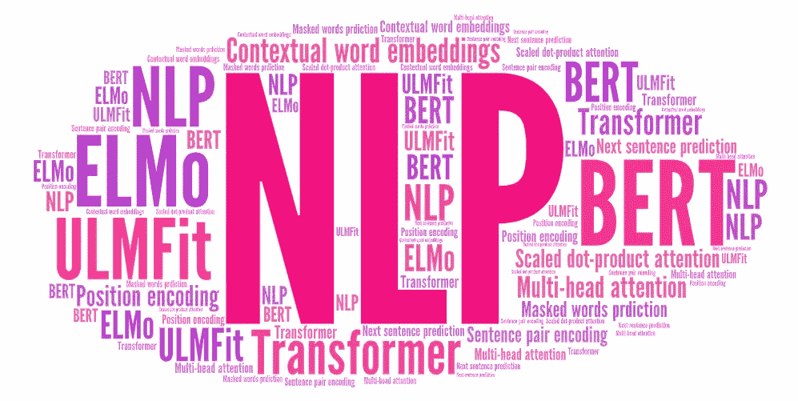

这个故事包含变压器架构和 BERT。这是[“语境词嵌入—第一部分”的后续。](/@rachel_95942/contextual-word-embeddings-part1-20d84787c65)它是[Stanford cs 224n:NLP with Deep Learning | Winter 2019 |第十三讲——语境词嵌入](https://www.youtube.com/watch?v=S-CspeZ8FHc&list=PLoROMvodv4rOhcuXMZkNm7j3fVwBBY42z&index=13)的总结。

# 4.变压器架构

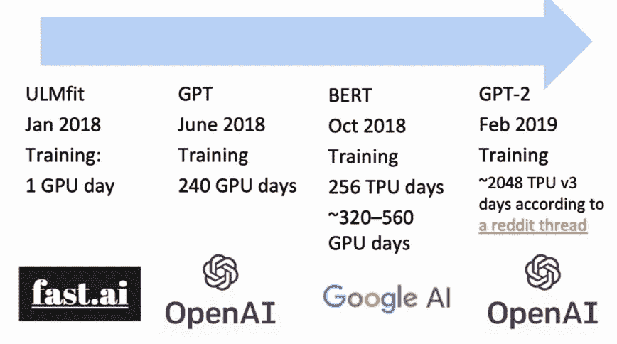

来源:[课程幻灯片](https://www.youtube.com/watch?v=S-CspeZ8FHc&list=PLoROMvodv4rOhcuXMZkNm7j3fVwBBY42z&index=13)

ULMfit 是一种你可以在 1 个 GPU 日内训练的东西，但 OpenAI 的人建立了一个预训练语言模型(GPT)，并在更大的计算量上对大量数据进行训练，使用了大约 242 个 GPU 日，它工作得更好。谷歌用 256 个 TPU 日训练了一个模型(BERT)，这意味着计算量增加了一倍左右。然后 OpenAI 再次变得更大，并为大约 2000 个 TPU 版本 3 天训练了一个模型(GPT-2)，它将能够再次做得更好。

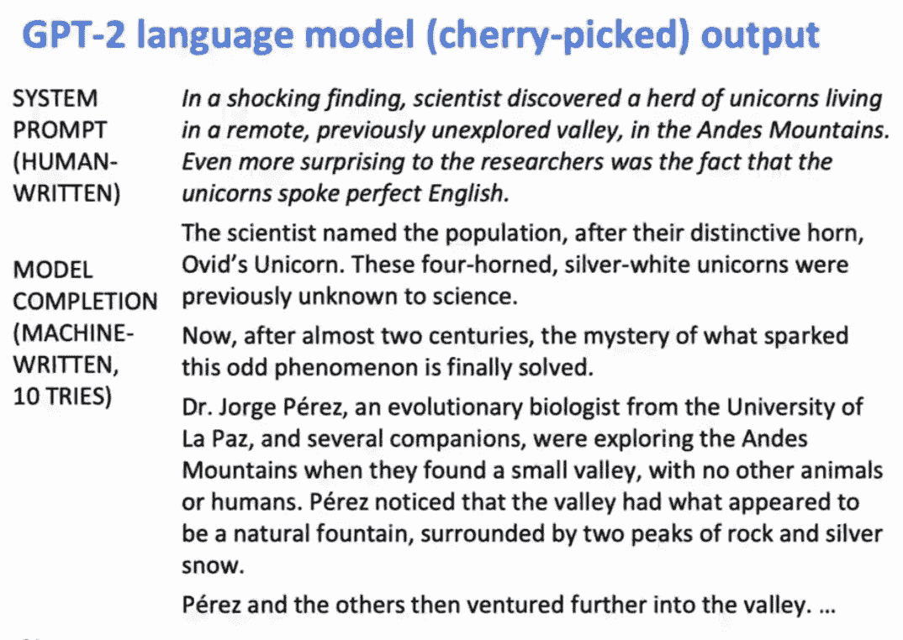

来源:[课程幻灯片](https://www.youtube.com/watch?v=S-CspeZ8FHc&list=PLoROMvodv4rOhcuXMZkNm7j3fVwBBY42z&index=13)

GPT2 模型印象非常深刻。当他们展示如果你在一个非常大的数据上建立一个非常非常庞大的语言模型，然后你说语言模型在这个特定的主题上产生一些文本，它实际上可以很好地产生文本。

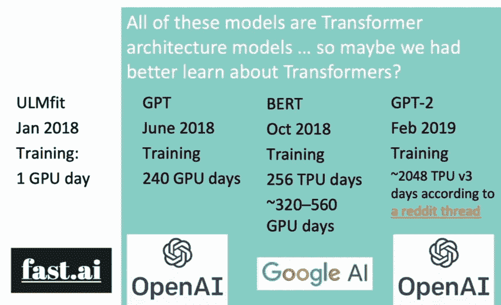

来源:[课程幻灯片](https://www.youtube.com/watch?v=S-CspeZ8FHc&list=PLoROMvodv4rOhcuXMZkNm7j3fVwBBY42z&index=13)

**故事的一部分是这些东西变得越来越大**，但故事的另一部分是 ***所有这 3 个都是使用变压器架构的系统*** *。变压器架构不仅非常强大，而且在技术上允许扩展到更大的尺寸。*

***变形金刚的动机本质上是我们希望事情进行得更快，这样我们就可以建立更大的模型，*** *这些 LSTM 或一般任何递归模型的问题是，它们是递归的，这意味着它们不能进行同一种并行计算。*但是 GPU 喜欢你可以做卷积神经网络之类的事情。此外，尽管 LSTMs 和 GRUs 之类的门控循环单元优于循环单元，**它们在长序列长度内存在问题，这可以通过添加注意机制来改善**。*既然注意力的作用如此之大，也许我们可以利用注意力，去掉模型中的循环部分，这就是变压器架构的用武之地。*尽管有 GRUs 和 LSTMs，rnn 仍然需要注意机制来处理长程相关性——否则，状态之间的路径长度会随着序列而增长。

# 4.变压器架构

## 4.1 变压器架构

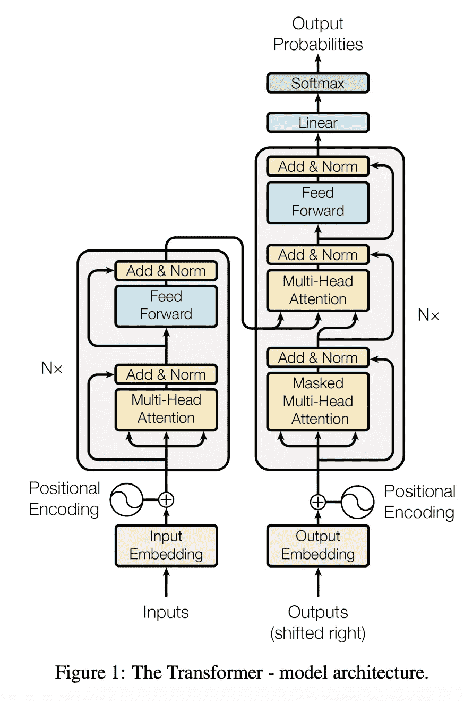

来源:[‘注意力是你需要的全部’](https://arxiv.org/pdf/1706.03762.pdf)。

关于变压器架构的原始论文名为[‘注意力是你需要的全部’](https://arxiv.org/pdf/1706.03762.pdf)。所以在最初的工作中，他们专注地执行神经机器翻译。他们想*建立一个复杂的编码器和一个复杂的解码器，它们非递归地工作，*并且仍然能够通过利用大量的注意力分布来很好地翻译句子。现在:让我们定义变压器网络的基本构件:首先，新的关注层。**基本思路是，他们要利用注意力无处不在来计算事情**。有不同类型的注意:线性乘法注意和前馈网络加法注意。他们倾向于最简单的注意力，注意力只是两个事物之间的点积。出于各种目的，他们在两个事物之间做更复杂版本的点积，*键和值。* *所以对于点积注意力来说，输入是一个查询 q，输出是一组 ley-vale (k-v)对。查询、键、值和输出都是向量。* *输出是值的加权和，其中每个值的权重由查询和对应的键的内积计算*。

# 4.变压器架构

## 4.2 多头缩放点积注意

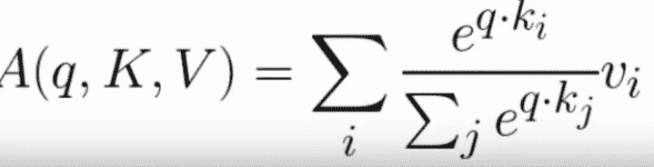

点积注意力。来源:[课程幻灯片](https://www.youtube.com/watch?v=S-CspeZ8FHc&list=PLoROMvodv4rOhcuXMZkNm7j3fVwBBY42z&index=13)

左侧显示了点积关注度，其中 softmax 应用于查询、关键相似度(查询和关键点之间的点积)以生成基于关注度的权重。权重应用于相应的值(vi)。**实际上所有的查询关键字和值都是完全一样的，它们都是来自源语言的单词。**

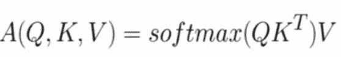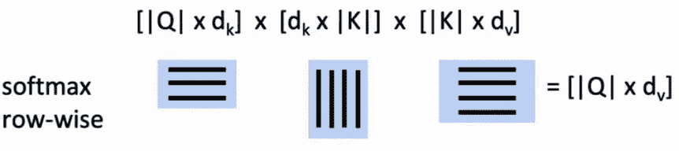

。来源:[课程幻灯片](https://www.youtube.com/watch?v=S-CspeZ8FHc&list=PLoROMvodv4rOhcuXMZkNm7j3fVwBBY42z&index=13)矩阵中的点积注意

矩阵表示法中的点积注意是当我们有多个查询时，我们把它们堆在一个矩阵中。

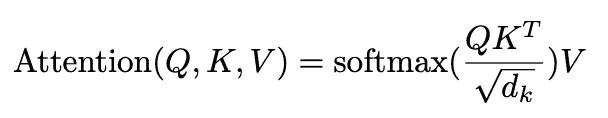

成比例的点积注意力。来源:[课程幻灯片](https://www.youtube.com/watch?v=S-CspeZ8FHc&list=PLoROMvodv4rOhcuXMZkNm7j3fVwBBY42z&index=13)

*上述关注的问题是，随着 d_{k}变大，q^{T}k 的方差增加，这导致 softmax 内的一些值变大，这导致 softmax 变得非常尖峰，因此其梯度变小。* ***这个的解决方案是通过查询/关键向量来伸缩。***

输入单词向量是查询、键和值*。在顺序词中，词向量自己选择对方。*字向量栈等于 Q 等于 K 等于 v 我们会在解码器里看到为什么我们在定义里把它们分开。

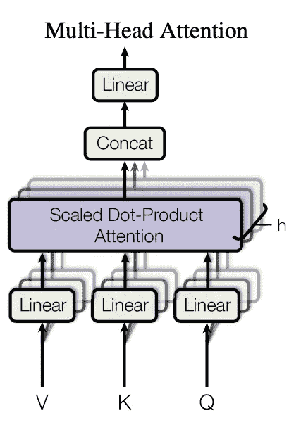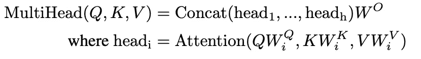

多头关注。来源:[课程幻灯片](https://www.youtube.com/watch?v=S-CspeZ8FHc&list=PLoROMvodv4rOhcuXMZkNm7j3fVwBBY42z&index=13)

***单纯的自我关注的问题在于，词语之间只有一种互动方式*** *。* ***如果能从一个位置参加到各种事情就好了。*** 比如你训练依存解析器。如果你是一个单词，你可能想注意你的中心词，但你也可能想注意你的从属词。如果你碰巧是一个代词，你可能要注意这个代词指的是什么。你可能想得到更多的关注。*解此 i* ***s 多头注意力，*** *其中首先通过 W 矩阵将 Q，K，V 映射到 h(等于文中的 8)低维空间，然后你用其中的每一个来计算点积注意力，这样你就可以同时兼顾不同的。然后连接输出并通过线性层*。这种多头关注是变形金刚非常成功的想法之一，使他们成为一个更强大的架构。

# 4.变压器架构

## 4.3 变压器组。

让我们完成变压器块。 *每个区块有 2 个“子层”:1)多线程关注；2)带 ReLU 的两层前馈神经网络。这两个步骤中的每一个也具有 1)残留(短路)；2)连接和层名。*

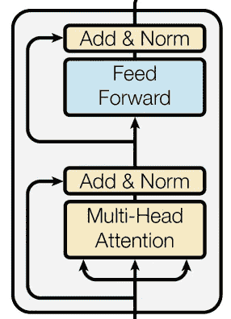

变压器块。来源:[课程幻灯片](https://www.youtube.com/watch?v=S-CspeZ8FHc&list=PLoROMvodv4rOhcuXMZkNm7j3fVwBBY42z&index=13)

***从我们的词向量开始，我们要对多个不同的事物进行关注，同时我们有一个围绕它们短路的剩余连接。将这两者相加后，归一化就完成了。所以块的输出是*** `***LayerNorm(x+Sublayer(x))***` ***。值得注意的是，这是层规范化，而不是批量规范化。***[***layer norm***](https://arxiv.org/pdf/1607.06450.pdf)***将输入特征更改为每层均值为 0，方差为 1(并增加了两个参数)*** 。对于一个变压器模块，然后进行多头关注，通过一个前馈层，该层也有一个残差连接，对这些输出求和，然后再次进行另一层归一化。这是基本的变压器模块，你可以在任何地方使用。为了构建完整的架构，他们将开始堆叠这些变压器块，形成一个非常深的网络。从某种意义上来说，我们发现变形金刚表现得非常好。

但是没有免费的午餐。你现在不再得到重复出现的信息，实际上是被一个序列携带的。你在某个位置说了一个词，这可能会引起其他词的注意。所以，如果你想让信息在一条链中传递，你首先要走完这条链的第一步，然后你需要有另一个垂直层，它可以走完这条链的下一步，然后你需要有另一个垂直层，它可以走完这条链的下一步。因此，你正在摆脱序列中的循环，但是你正在替换一些深度以允许事情沿着多跳进行。 *然而，这在 GPU 架构中非常有利，因为它允许您使用并行化来同时计算每个深度的所有内容*。

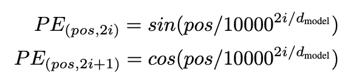

位置编码

对于编码器输入，他们使用字节对编码(BPE)。但是如果你什么都不做，你只是把单词输入到这个单词向量中，你不知道你是在句子的开头还是结尾。虽然， ***他们有一种位置编码的方法，可以给你一些想法来定位你的单词在句子*** 中的位置。

# 4.变压器架构

## 4.4 编码器

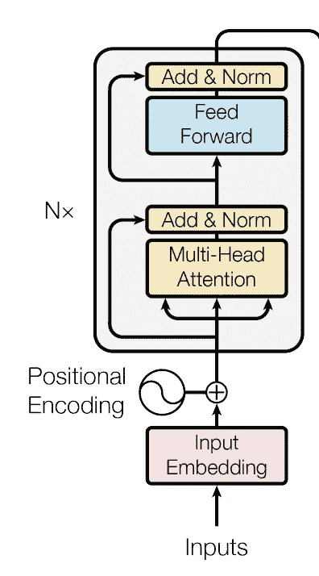

编码器。来源:[课程幻灯片](https://www.youtube.com/watch?v=S-CspeZ8FHc&list=PLoROMvodv4rOhcuXMZkNm7j3fVwBBY42z&index=13)

这是一种编码系统。所以从单词来看，他们有一个初始单词嵌入。你加入他们的位置编码。你进入变压器组，然后重复 n 次。因此，这些变压器模块会垂直堆叠在一起。所以你会多次对句子的其他部分进行多头关注，计算值，前馈一个值，通过一个完全连接的层，然后你会对句子中的不同地方进行关注。获取你所有的信息，把它放入一个完全连接的层，然后向上，深入向上。编码器工作得很好，可能是因为你可以用你的多头注意力和句子中的各种其他地方，积累信息，把它推到下一层。如果你这样做 6 次(上面的 N=6)，你就可以开始沿着序列向任一方向逐步推进信息，以计算感兴趣的值。

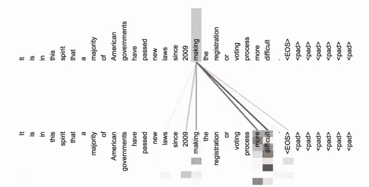

第五层的注意力视觉化。来源:[课程幻灯片](https://www.youtube.com/watch?v=S-CspeZ8FHc&list=PLoROMvodv4rOhcuXMZkNm7j3fVwBBY42z&index=13)

有趣的是*这些模型在学习关注语言结构中的有趣事物方面表现得非常好。*这些只是一种提示性的图表，但这是查看变压器堆栈的第 5 层，并查看不同的注意力集中在哪些单词上。这些不同的颜色对应不同的注意头。这句话是`in this spirt, that a majority of American governments have passed new laws since 2009 making the registration or voting process more difficult.`我们看到的是大部分注意力从“制造”转移到“更难”这个词上，这似乎很有用。其中一个注意力头似乎在看单词本身(“making”)，这可能没问题。然后，其他人开始关注“法律”和“2009”。

# 4.变压器架构

## 4.4 解码器

***对于 transformer 解码器，解码器中的 2 个子层发生变化:1)屏蔽解码器对先前生成的输出的自我关注；2)在编码器-解码器关注中，查询来自先前的解码器层，而密钥和值来自编码器*T3 的输出。**

# 5.伯特

## 5.1 填银行字目标

帮助你完成任务的最新和最棒的上下文单词表示是这些 [BERT](https://arxiv.org/abs/1810.04805) vectors， ***，其中 BERT 是来自 Transformers 的双向编码器表示。*** 本质上，它使用的是变压器网络中的编码器。他们为网络架构做了几个选择。

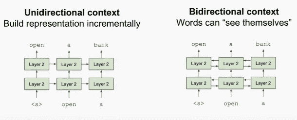

伯特选择了双向性而不是方向性。来源:[课程幻灯片](https://www.youtube.com/watch?v=S-CspeZ8FHc&list=PLoROMvodv4rOhcuXMZkNm7j3fVwBBY42z&index=13)

首先，他们选择双向性而不是单向性。语言模型只使用左语境或右语境，但语言理解是双向的。*标准语言模型有* ***单向*** *，*这很有用，因为 ***它给出了一个语言模型*** 的概率分布。但这是不好的，因为你希望能够从两方面进行预测，以理解词义和上下文。

当您以两种方式整合信息时，您可以创建双向模型。但是这也有点问题，因为这样你就会有串音。假设*您运行一个 BiLSTM，然后通过连接合并表示，然后将它们送入下一层。当你运行下一层的时候，前锋 LSTM 就已经从第一层得到了关于未来的信息。所以它以已经预见未来的词语结束*。所以你有这种复杂的非生成模型。不知何故，他们想做一点不同的事情，这样他们就可以有双向的上下文，而没有文字可以看到他们自己。***BERT 的解决方案是屏蔽掉 k%(通常是 15%)的输入单词，然后预测被屏蔽的单词。*** *对于输入，BERT* 屏蔽掉句子中的一些单词。例如，句子`the man went to the [mask] to buy a [mask] of milk'`被单词`store`和`gallon`屏蔽了。所以 BERT 中的 LM 不再是一个真正的 LM，它产生一个句子的概率，这是标准的从左到右的工作，而是填充空白的目标。现在，你的训练目标是试着预测被屏蔽的单词是什么，你可以在一定程度上利用交叉熵损失做到这一点。所以你训练一个模型来填补这些空白(屏蔽词)。 ***他们空白单词的比率基本上是 7 个单词中有 1 个。他们还讨论了这是一种怎样的权衡，因为如果你空白的单词太少，训练的成本就会很高。如果你漏掉了很多单词，你就漏掉了一个单词的大部分上下文，*** ，这意味着它对训练没什么用，他们发现大约七分之一的单词对他们来说似乎很有用。

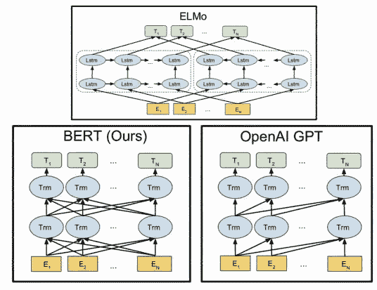

埃尔莫，伯特和奥佩利 BERT。来源:[课程幻灯片](https://www.youtube.com/watch?v=S-CspeZ8FHc&list=PLoROMvodv4rOhcuXMZkNm7j3fVwBBY42z&index=13)

论文还比较了 GPT 和埃尔莫。它指出*对于 OpenAI 的 GPT 来说，也是一个 transformer 模型，这是一种从左到右工作的经典语言模型，所以你只能得到左上下文。至于 ELMo 语言模型，虽然它从左到右和从右到左运行语言模型，这意味着在某种意义上它具有来自两侧的上下文，但这两种语言模型是完全独立训练的，然后您只是将它们的表示连接在一起。因此，我们实际上没有一种模型，在建立预先训练的上下文单词表示时，联合使用双方的上下文。*因此，作者希望在 transformer 模型中使用这种隐藏单词并使用整个上下文进行预测的技巧，这将允许他们使用双面上下文，并且更加有效。

# 5.伯特

## 5.2 ***学习句子之间的关系*** *s 目的*

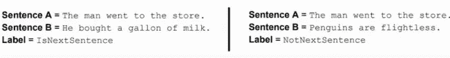

下一句预测。来源:[课程幻灯片](https://www.youtube.com/watch?v=S-CspeZ8FHc&list=PLoROMvodv4rOhcuXMZkNm7j3fVwBBY42z&index=13)

除了填充银行单词目标的语言建模目标之外， ***BERT 还有第二个目标来学习句子*****之间的关系，这对于像问题回答或自然语言推理任务这样的任务是有用的。让我们有两个句子，这些句子可能是课文中连续的两个句子，或者是一个句子后面跟着一个别处的随机句子。我们希望训练系统来预测你什么时候会看到正确的下一句话，而不是随机的一句话*。所以你也在训练一个基于下一句话预测任务的损失。*

*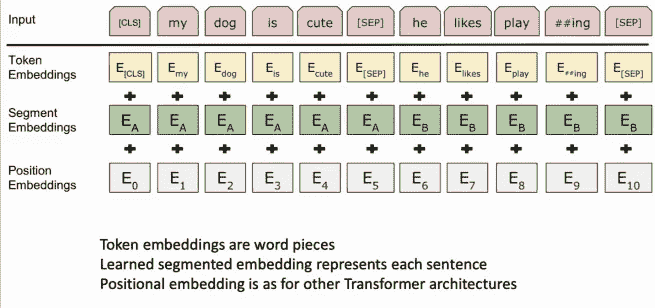*

*句子对编码。来源:[课程幻灯片](https://www.youtube.com/watch?v=S-CspeZ8FHc&list=PLoROMvodv4rOhcuXMZkNm7j3fVwBBY42z&index=13)*

*像 ***这样的句子成对编码。*** 对于输入，他们会有一对句子:`my dog is cute[separate] He likes playing`。单词被表示为单词片段。*所以每个词块都有标记嵌入。然后每个单词都有一个位置嵌入，这个位置嵌入会和记号嵌入相加。最后，每个单词片段都有一个片段嵌入，简单来说，它是来自分隔符之前或之后的第一个句子还是第二个句子。所以，你把这三样东西加在一起，得到了表征* **。**然后，您将在变压器模型中使用它们，在这种模型中，您的损耗会达到无法预测屏蔽词的程度。然后你的二元预测函数，关于是否有正确的下一个句子，这是训练架构。*

# *5.伯特*

## *5.3 微调*

*有一些关于伯特的细节。*首先，它是用自我注意训练出来的，没有地点偏见，使远距离语境具有“平等机会”。每层一次乘法使其在 GPU/TPU 上高效运行。*伯特在维基百科和图书语料库上接受培训。它有两种型号规格: *1)伯特基* (12 层，768 隐，12 头)；以及 2) *BERT-Large* (24 层，1024 隐藏，16 头)。伯特在 4x4(或 8x8) TPU 切片上接受了 4 天的训练。*

*我们可以利用 ***对*** 这个预先训练好的 BERT 进行微调，它将对各种任务非常有用，比如命名实体识别、问题回答和自然语言推理等等。我们要做的方式有点像*做与 ULMFit 模型相同的事情，*并且它不像上下文单词表示(s.t ELMo)所做的那样。*

*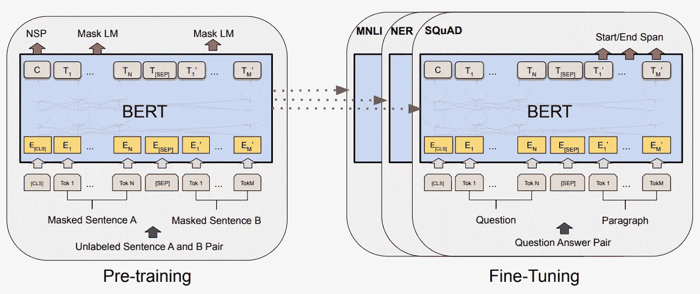*

*微调预训练伯特。来源:[课程幻灯片](https://www.youtube.com/watch?v=S-CspeZ8FHc&list=PLoROMvodv4rOhcuXMZkNm7j3fVwBBY42z&index=13)*

*相反，我们只是继续使用我们作为语言模型训练的变压器网络，但针对特定任务对其进行微调。现在，您将运行这个转换器，计算特定任务的表示。我们要改变的是，我们要移除最顶层的预测。预测大众语言模型和下一句预测的位。我们将在上面替换一个适合任务的最终预测层。因此，如果我们的任务是小组问答，我们最终的预测层将预测跨度的开始和结束，类似于 DrQA。如果我们在做 NER 任务，我们最终的预测层将会像标准的 NER 系统一样预测每个令牌的命名实体识别类。*

*所以他们建立了这个系统，并在一大堆数据集上进行测试。他们测试的主要内容之一是这个 ***胶水数据集*** ，它有一大堆任务。GLUE benchmark 以自然语言推理任务为主。例如，给你一个句子，比如`Hills and mountains are sepeicall sancially sanctified in Janism.`，然后你可以在`Janism hates nature`上写一个假设。你要做的是， ***假设是否从前提而来，与前提相矛盾，或者与前提无关。*** *那是一个三路分类*。所以这与前提相矛盾。还有其他各种各样的任务，比如 GLUE 中的语言可接受性任务。实验表明，BERT 在胶合任务上取得了良好的效果。*

## *参考:*

1.  *[斯坦福 CS224N: NLP 与深度学习| Winter 2019 |讲座 13 —上下文单词嵌入](https://www.youtube.com/watch?v=S-CspeZ8FHc&list=PLoROMvodv4rOhcuXMZkNm7j3fVwBBY42z&index=13)*

*2. [BERT:用于语言理解的深度双向转换器的预训练](https://arxiv.org/abs/1810.04805)*

*3.[注意力是你所需要的一切](https://arxiv.org/pdf/1706.03762.pdf)*