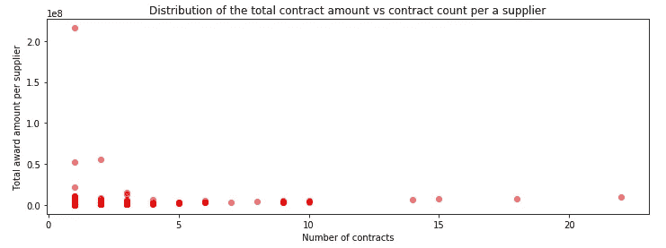

# 是否可以使用其描述来预测合同授予金额？

> 原文：<https://medium.com/analytics-vidhya/contract-awards-data-analyze-770925a6a6b5?source=collection_archive---------28----------------------->

## 让我们利用世界银行提供的金融数据来找出答案


来源:[https://international finance . com/world-bank-group-credit-reporting-Europe-central-Asia/](https://internationalfinance.com/world-bank-group-credit-reporting-europe-central-asia/)

# 1.商业理解

世界银行集团的企业采购部门负责协调和监督全球 150 多个办事处的货物、服务、建筑和咨询服务的采购战略、选择和合同执行。在这个项目中，我们将关注世界银行集团公司采购部门提供的数据集。

该项目的目标是分析数据集[公司采购合同授予](https://finances.worldbank.org/Procurement/Corporate-Procurement-Contract-Awards/a3d9-f9xv)。公司采购部门使用给定的数据集，同时确保采购合同符合采购政策和程序，因为业务部门负责业务需求、支出政策、要求规格和供应商选择。

> 这组数据包括世界银行集团根据其机构采购政策和程序执行的大额合同授予清单。该清单包括估价超过 250，000 美元的固定价格不确定交付/不确定数量(IDIQ)合同。

通过这篇文章，我们将试图找到这些问题的答案:

*   Q1。供应商合同编号和决标金额之间是否有任何联系？
*   Q2。描述合同最常用的词是什么？
*   Q3。合同描述和奖励金额有关系吗？

为了找到这些问题的答案，我们从导入所需的库开始。我使用 **pyspark** 和库 **ml** 、 **sql** 和 **matplotlib** 来探索给定的数据集。

# 2.数据理解

在加载和数据清理之后，我们探索数据，以便找到问题的答案。数据头类似于:

```
Row(_c0='Award Date', _c1='Quarter and Fiscal Year', _c2='Commodity Category', _c3='Contract Description', _c4='WBG Organization', _c5='Selection Number', _c6='Supplier', _c7='Supplier Country', _c8='Supplier Country Code', _c9='Contract Award Amount', _c10='Fund Source', _c11='VPU description')
```

数据集中出现最多的前 10 个县:

```
+--------------+-----+
|     Countries|count|
+--------------+-----+
|           USA|  464|
|United Kingdom|  180|
|        France|   82|
|         India|   76|
|   Netherlands|   71|
|       Germany|   44|
|         Spain|   36|
|         Kenya|   35|
|       Denmark|   28|
|     Indonesia|   28|
+--------------+-----+
```


前 10 个合同和授予金额最大的国家

```
+--------------------+---------+-----------+
|                 _c3|      _c7|        _c9|
+--------------------+---------+-----------+
|Food & Catering a...|      USA|     2.16E8|
|Travel Management...|      USA|     5.27E7|
|PHARMACY BENEFIT ...|      USA|      5.2E7|
|    Global Custodian|      USA|2.1941912E7|
|Somalia  Monitori...|      USA|1.2054287E7|
|Ethiopia Technica...|      USA|     1.16E7|
|Food & Catering a...|      USA|    1.125E7|
|Global Multiproto...|Mauritius|1.0871742E7|
|     GLOBAL PAYMENTS|      USA|      1.0E7|
|Global Multiproto...|      USA|  9544230.0|
+--------------------+---------+-----------+
```

每份合同中获得较大金额的类别


**Q1。供应商合同编号和决标金额之间是否有任何联系？**

```
supplier_df_count = df.select(“_c6”).groupby(“_c6”).count()\
.orderBy(desc(“count”))supplier_df = df.select(“_c6”,     “_c9”).groupby(“_c6”).sum(“_c9”).orderBy(desc(“sum(_c9)”))new_supplier_df = supplier_df.alias(‘a’).\
join(supplier_df_count.alias(‘b’),col(‘b._c6’) == col(‘a._c6’)).\
 select([col(‘a.’+xx) for xx in supplier_df.columns] +[col(‘b.count’)])
```



上图描述了这两个国家之间的关系。正如我们从图表中看到的，它们是不相关的。

# 3.准备数据

为了回答 Q2 的问题，我们必须使用文本处理工具做一些数据准备，比如 RegexTokenizer、StopWordsRemover 和 CountVectorizer。

```
regexTokenizer = RegexTokenizer(inputCol=”_c3", outputCol=”wordList”)
data_df = regexTokenizer.transform(df)stopWordsRemover = StopWordsRemover(inputCol=”wordList”, outputCol=”cleanWordList”)
data_df = stopWordsRemover.transform(data_df)cv = CountVectorizer(inputCol=”cleanWordList”, outputCol=”TF”, vocabSize=1000)
cvmodel = cv.fit(data_df)
```

**Q2。描述合同最常用的词是:**

```
['services', 'development', 'support', 'program', 'project',
 'management', 'technical', 'survey', 'consultant', 'public']
```

我们继续进行数据准备，以便获得合同描述的 TF-IDF 向量(_c9)并保存在 TFIDF 列中。我们将使用这个新列来训练回归模型并预测奖励金额(_c9)。

# 4.数据建模

我们将数据集分成两部分:用于训练和测试。对于预测，让我们使用**线性回归**和**决策树回归器**创建回归模型。我们将数据传递给模型来训练和预测结果。

*   **线性回归**

```
lr = LinearRegression(featuresCol =’Features’, labelCol = ‘_c9’, maxIter=5, regParam=0.0, fitIntercept=False, solver=”normal”)
lrModel = lr.fit(rest)
lrPredictions = lrModel.transform(validation)
```

*   **决策树回归器**

```
dt = DecisionTreeRegressor(featuresCol ='Features', labelCol = '_c9')
dtModel = dt.fit(rest)
dtPredictions = dtModel.transform(validation)
```

# 5.评估结果

我们使用回归评估器来评估模型 lrModel 和 dtModel 的预测结果。

**线性回归结果**:

lrModel.r2 = 0.65 %

```
+--------------------+---------+--------------------+
|          prediction|      _c9|            Features|
+--------------------+---------+--------------------+
| -290797.60198603506| 439921.0|(1000,[19,36,85],...|
|   5140235.828518745| 999671.0|(1000,[5,7,35,77,...|
| -1288037.6153147744|481963.34|(1000,[32,102,170...|
|1.1439009726993315E7|531296.75|(1000,[11,17,28,3...|
|   277338.5157081769| 393310.0|(1000,[14,21,41,1...|
|   455824.6088107006|360903.72|(1000,[0,7,278,32...|
|   440127.2384942813| 363411.0|(1000,[6,50,100],...|
|    84638.6229614776| 493043.0|(1000,[126],[4.51...|
|   584871.7840514984| 392120.0|(1000,[10,13,15,2...|
|  -984782.8991670524|342760.06|(1000,[10,13,15,4...|
|  202106.55295227905| 499920.0|(1000,[5,70,120,1...|
|  1818003.3578549554| 500000.0|(1000,[1,28,86],[...|
| -286324.74035095086| 270187.7|(1000,[22,30,65,8...|
|   78965.34471193032| 429350.0|(1000,[247,348,42...|
|   636847.2108542032| 651706.0|(1000,[5,9,26,155...|
|  1616184.1969578827|354885.22|(1000,[25,40,73,8...|
|  -167486.8741742194|275643.97|(1000,[8,46,352,5...|
|   576264.5478086167|388824.47|(1000,[30,79,81,3...|
|   2116516.356030904| 535365.0|(1000,[4,6,7,22,1...|
|   902461.1673980198| 600000.0|(1000,[81,115,244...|
+--------------------+---------+--------------------+
only showing top 20 rows

Root Mean Squared Error (RMSE) on test data for linear regression = 9.8932e+06
R2 on test data for linear regression = -0.00310965
```

**决策树回归器结果**:

```
+-----------------+---------+--------------------+
|       prediction|      _c9|            Features|
+-----------------+---------+--------------------+
|572582.6692662078| 439921.0|(1000,[19,36,85],...|
|572582.6692662078| 999671.0|(1000,[5,7,35,77,...|
|572582.6692662078|481963.34|(1000,[32,102,170...|
|           1.16E7|531296.75|(1000,[11,17,28,3...|
|572582.6692662078| 393310.0|(1000,[14,21,41,1...|
|572582.6692662078|360903.72|(1000,[0,7,278,32...|
|572582.6692662078| 363411.0|(1000,[6,50,100],...|
|572582.6692662078| 493043.0|(1000,[126],[4.51...|
|572582.6692662078| 392120.0|(1000,[10,13,15,2...|
|572582.6692662078|342760.06|(1000,[10,13,15,4...|
|572582.6692662078| 499920.0|(1000,[5,70,120,1...|
|572582.6692662078| 500000.0|(1000,[1,28,86],[...|
|572582.6692662078| 270187.7|(1000,[22,30,65,8...|
|572582.6692662078| 429350.0|(1000,[247,348,42...|
|572582.6692662078| 651706.0|(1000,[5,9,26,155...|
|572582.6692662078|354885.22|(1000,[25,40,73,8...|
|572582.6692662078|275643.97|(1000,[8,46,352,5...|
|572582.6692662078|388824.47|(1000,[30,79,81,3...|
|572582.6692662078| 535365.0|(1000,[4,6,7,22,1...|
|572582.6692662078| 600000.0|(1000,[81,115,244...|
+-----------------+---------+--------------------+
Root Mean Squared Error (RMSE) on test data for decision tree = 9.77069e+06
R2 on test data for decision tree = 0.0215811
```

**Q3。合同描述与中标金额的关系**

从我们的两个模型获得的非常低的精度结果，我们可以得出结论，根据其描述来预测合同授予金额不是一个非常好的主意。实际上这两个信息是不相关的。

# 结论

在数据探索和模型训练之后，我们能够回答所提出的问题。合同编号和合同金额之间没有关联，合同授予金额和合同说明之间也没有关系。更多细节，请查看我的 [GitHub](https://github.com/sushseqi/data_analysis) 仓库中的笔记本。

A bientô:)