# R — 4 中的控制语句和循环

> 原文：<https://medium.com/analytics-vidhya/control-statement-and-loops-in-r-4-3663b782b064?source=collection_archive---------9----------------------->

> 如果您还没有阅读 R 基础系列的第 3 部分，请阅读下面的文章，在这篇文章中我们讨论了在 R — 2 中编写函数。本系列涵盖了 R 的基础知识，包括数据类型、控制结构、循环、函数和高级数据结构。
> 
> 如果您已经熟悉这些主题，并且正在使用 r 寻找统计和机器学习中所有重要主题的全面介绍，请从以下系列开始，其中讨论了与数据科学相关的所有必要主题。
> 
> [将数据读入 R — 1 的多种方式](/@viveksrinivasan/many-ways-of-reading-data-into-r-1-52b02825cb27)
> 
> 这篇文章的内容是我在 IIM-B 时代得到介绍的几本书的要点。
> 
> 人人为我——贾里德·p·兰德
> 
> 实用数据科学与 R — Nina Zumel 和 John Mount
> 
> 文中讨论的所有代码块都以 R markdown 的形式出现在 [Github 链接](https://github.com/viveksrinivasanss/Data_Science_Using_R)中。
> 
> 请使用链接 [Vivek Srinivasan](/@viveksrinivasan) 查看我写的所有文章。

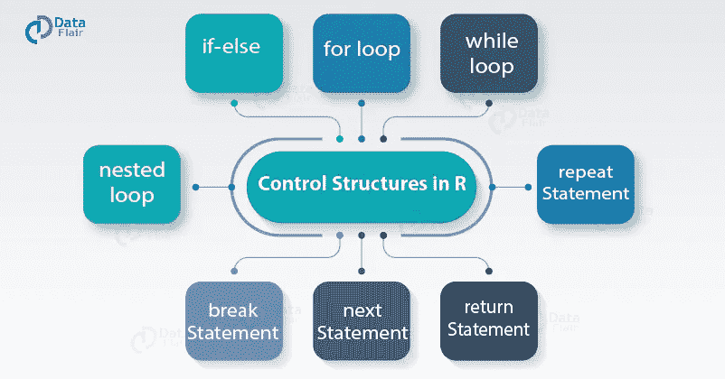

控制语句允许我们控制编程的流程，并根据测试的值导致不同的事情发生。测试产生一个逻辑、`TRUE` 或`FALSE`，用于 if 类语句。主要控制语句有`if`、`else`、`ifelse` 和开关。

## 如果和否则

最常见的测试是 if 命令。它本质上是说。如果某事是`TRUE`，则执行某个动作；否则，不要执行该操作。我们测试的东西放在`if`命令后面的括号里。

最基本的检查有:等于`(==)`，小于`(<)`，大于等于`(>=)`，不等于`(!=)`。如果这些测试通过，则导致`TRUE`，如果测试失败，则导致`FALSE`。如前所述，`TRUE` 在数字上等同于`1`,`FALSE` 等同于`0`。

```
# set up a variable to hold 1
toCheck <- 1# if toCheck is equal to 1, print hello
if(toCheck == 1)
{
  print("hello")
}
```

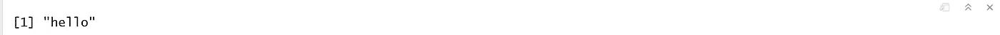

注意`if`语句类似于函数，因为所有的语句(可以是一个或多个)都在花括号内。

生活并不总是如此简单，以至于只有在某些关系是`TRUE`的情况下，我们才想要行动。如果那种关系是`FALSE`，我们通常想要不同的行动。在下面的例子中，我们将一个`if`语句后跟一个`else` 语句放在一个函数中，这样就可以重复使用。

```
# first create the function
check.bool <- function(x)
{
  if(x == 1)
  {
    # if the input is equal to 1, print hello
    print("hello")
  }else
  {
    # otherwise print goodbye
    print("goodbye")
  }
}check.bool(0)
```

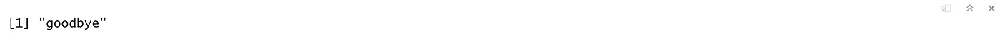

除了`1`之外的任何东西都会导致该函数打印“再见”这正是我们想要的。通过`TRUE` 会打印“hello”，因为`TRUE` 在数字上与`1`相同。也许我们想连续测试几个案例。这就是我们可以使用`else if`的地方。我们首先测试一个语句，然后进行另一个测试，然后可能会陷入无所不包的境地。我们将修改`check.bool`来测试一个条件，然后测试另一个条件。

```
check.bool <- function(x)
{
  if(x == 1)
  {
    # if the input is equal to 1, print hello
    print("hello")
  }else if(x == 0)
  {
    # if the input is equal to 0, print goodbye
    print("goodbye")
  }else
  {
    # otherwise print confused
    print("confused")
  }
}check.bool(2)
```

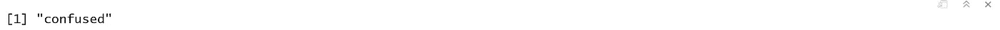

## Switch 语句

如果我们有多个案例要检查，重复编写`else if` 可能会很麻烦且效率低下。这就是`switch` 最有用的地方。第一个参数是我们正在测试的值。后续的参数是一个特定的值，应该是什么结果。最后一个参数，如果没有给定值，就是默认结果。为了说明这一点，我们构建了一个接受一个值并返回相应结果的函数。

```
use.switch <- function(x)
{
  switch(x,
         "a"="first",
         "b"="second",
         "z"="last",
         "c"="third",
         "other")
}use.switch("a")
```

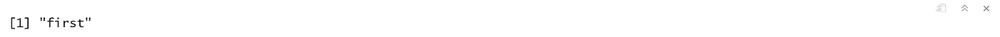

如果第一个参数是数字，则它在位置上与后面的参数匹配，不管后面的参数的名称是什么。如果数值参数大于后续参数的数量，则返回`NULL` 。

```
# nothing is returned
is.null(use.switch(6))
```

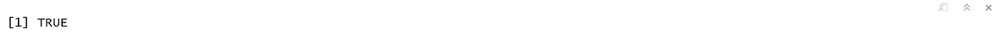

## ifelse

而`if`就像传统语言中的 if 语句`ifelse`更像 Excel 中的`if`函数。第一个参数是要测试的条件(很像传统的 if 语句)，第二个参数是测试为`TRUE` 时的返回值，第三个参数是测试为`FALSE`时的返回值。与传统的 if 不同，这里的妙处在于它可以处理矢量化的参数。

正如 R 中经常出现的情况，使用矢量化可以避免`for` 循环，并加快我们的代码。`ifelse` 的细微差别可能很棘手，所以我们展示了许多例子。我们从一个非常简单的例子开始，测试 1 是否等于 1，如果是`TRUE`，则打印`“Yes”`，如果是`FALSE`，则打印`“No”`。

```
# see if 1 == 1
ifelse(1 == 1, "Yes", "No")# see if 1 == 0
ifelse(1 == 0, "Yes", "No")
```

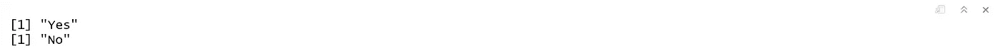

这显然给了我们想要的结果。`ifelse` 使用之前见过的所有常规等式测试和任何其他逻辑测试。然而，值得注意的是，如果只测试单个元素(长度为 1 的向量或简单的 is.na)，使用`if` 比`ifelse`更有效。这可能会导致我们代码的加速。接下来，我们将说明矢量化的第一个参数。

```
toTest <- c(1, 1, 0, 1, 0, 1)
ifelse(toTest == 1, "Yes", "No")
```

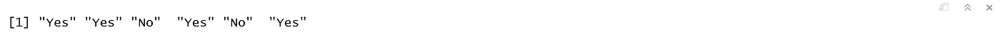

现在假设 toTest 有`NA`元素。在这种情况下，来自`ifelse` 的相应结果是`NA`。

```
toTest <- c(1, 1, 0, 1, 0, 1)
ifelse(toTest == 1, toTest*3, toTest)## vectors with NA values
toTest <- c(1, NA, 0, 1, 0, 1)
ifelse(toTest == 1, toTest*3, toTest)
```

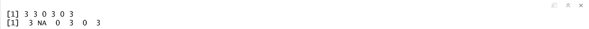

## 复合测试

用`if`、`ifelse` 和`switch` 测试的语句可以是导致逻辑`TRUE` 或`FALSE`的任何参数。这可以是相等性检查，甚至是`is.numeric`或`is.na`的结果。有时我们想一次测试多种关系。这是使用逻辑运算符`and`和`or`完成的。这些是用于`and` 的`&`和`&&`以及用于`or`的`|`和`||`。

这些差别很细微，但会影响我们代码的速度。`if` 最好用双面`(&& or ||)` ，而`ifelse`需要单面`(& or |)`。double 表单只比较每边的一个元素，而 single 表单比较每边的每个元素。

```
a  <- c(1, 1, 0, 1)
b  <- c(1, 0, 0, 1)# this checks each element of a and each element of b
ifelse(a == 1 & b == 1, "Yes", "No")# this only checks the first element of a and the first element of b
# it only returns one result
ifelse(a == 1 && b == 1, "Yes", "No")
```

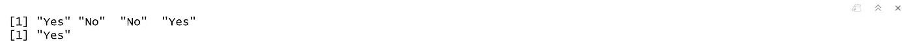

`double` 和`single` 表单的另一个区别是它们的处理方式。当使用单个表单时，总是检查操作符的两侧。使用`double` 表单，有时只需要检查左侧。例如，如果测试`1 == 0 && 2 == 2`，左侧失败，那么没有理由检查右侧。同样，测试`3 == 3 || 0 == 0`时，左侧通过，所以无需检查右侧。如果左侧失败，右侧会抛出一个错误，这可能特别有帮助。

可以测试不止两个条件。许多条件可以使用多个`and` 或`or` 操作符串在一起。就像数学运算一样，不同的子句可以用括号分组。没有括号，运算顺序类似于`PEMDAS`，其中`and` 相当于乘法，`or` 相当于加法，所以`and` 优先于`or`。

## 循环，迭代的非 R 方式

当开始使用`R`时，大多数人在需要迭代`vector`、`list` 或`data.frame`的元素时都会使用循环。虽然在其他语言中这样做很自然，但对于 R，我们通常希望使用`vectorization`。也就是说，有时循环是不可避免的，所以 R 同时提供了`for` 和`while` 循环。

## 对于循环

最常用的循环是`for` 循环。它遍历一个`index` ——作为一个`vector` 提供——并执行一些操作。使用`for`声明该循环，它将一个貌似英语的参数分成三部分。

第三部分是任何类型的任何`vector` 值，最常见的是`numeric` 或`character`。第一部分是从第三部分的向量中迭代赋值的变量。中间部分简单的就是单词`in` 表示变量(第一部分)在向量中(第三部分)。

```
# build a vector holding fruit names
fruit  <- c("apple", "banana", "pomegranate")for(a in fruit)
{
  print(sprintf("Length of %s is %s",a,as.character(nchar(a))))
}
```

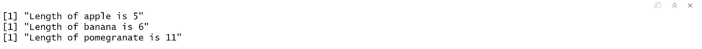

同样，R 的内置矢量化功能可以让这一切变得更加容易。

```
nachar(fruit)
```

## while 循环

虽然在`R`中使用的频率远不如`for` 循环，但是`while` 循环实现起来也一样简单。只要测试的条件证明为真，它就重复运行括号内的代码。在下面的例子中，我们打印 x 的值，并迭代它，直到它达到 5。这是一个非常简单的例子，但是仍然展示了它的功能。

```
x  <- 1
while(x <= 5)
{
  print(x)
  x <- x + 1
}
```

## 控制回路

有时我们不得不跳到循环的`next` 迭代，或者完全`break` 退出。这是通过`next` 和`break`完成的。我们用一个`for` 循环来演示。

```
## Example for skipping an iteration
for(i in 1:10)
{
  if(i == 3)
  {
    next
  }
  print(i)
}
```

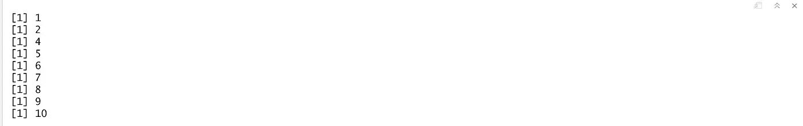

```
## Example for breaking the loop
for(i in 1:10)
{
  if(i == 3)
  {
    break
  }
  print(i)
}
```

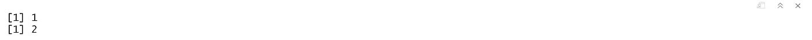

在这里，即使我们告诉`R`迭代前十个整数，它在 2 之后停止，因为我们在 3 处中断了循环。

两个主要的循环是`for`，它遍历一个固定的元素序列，以及`while` ，只要某个条件成立，它就继续循环。如前所述，如果解决方案可以通过`vectorization` 或`matrix algebra`在没有循环的情况下完成，则避免循环。避免嵌套循环尤为重要。在`R`中，其他循环内部的循环速度极慢。

所以我们已经全面地介绍了 R 编程的基础知识。如果您有兴趣学习 R 中的一些高级编程和机器学习，请从下面给出的链接中的高级 R 系列开始。

> [将数据读入 R — 1 的多种方式](/@viveksrinivasan/many-ways-of-reading-data-into-r-1-52b02825cb27)
> 
> 一定要通过评论和分享文章来分享你的想法和支持。