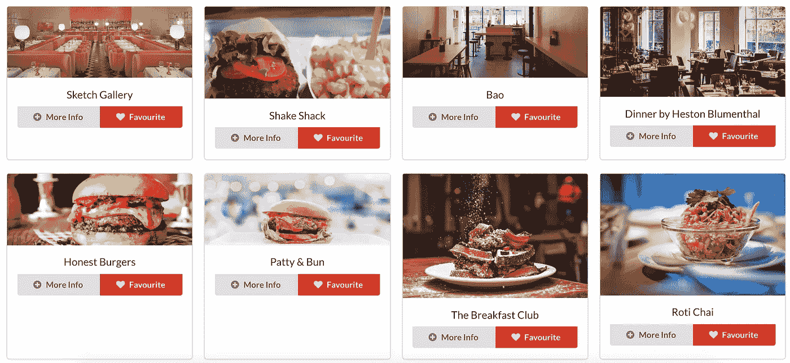
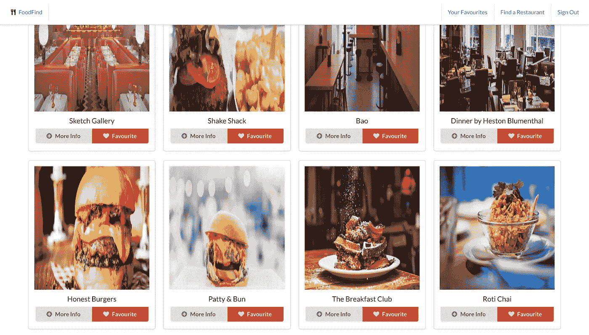
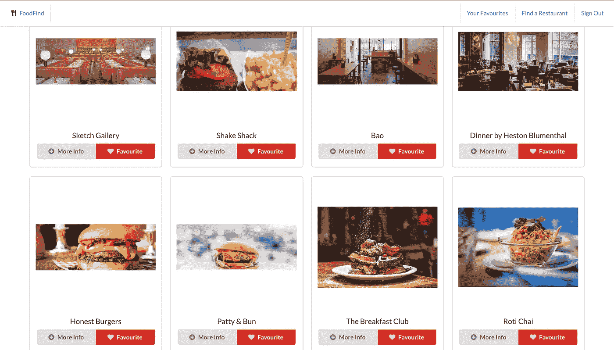
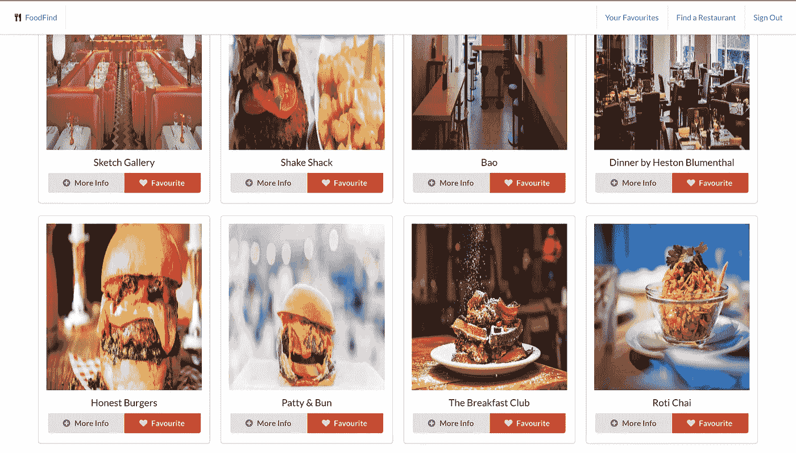
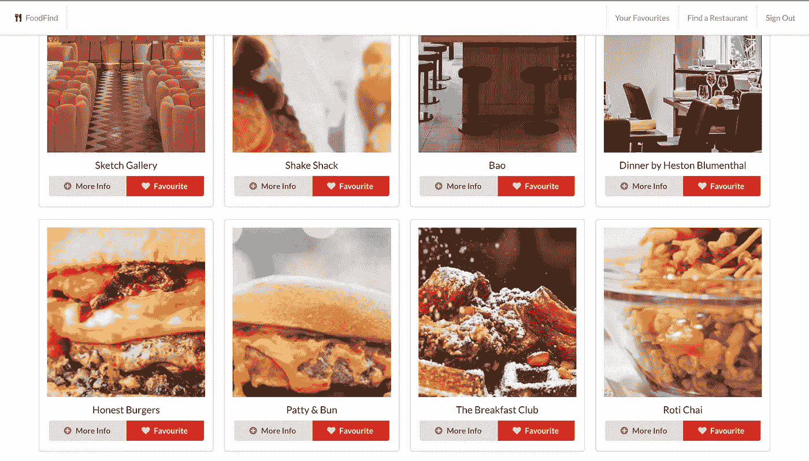
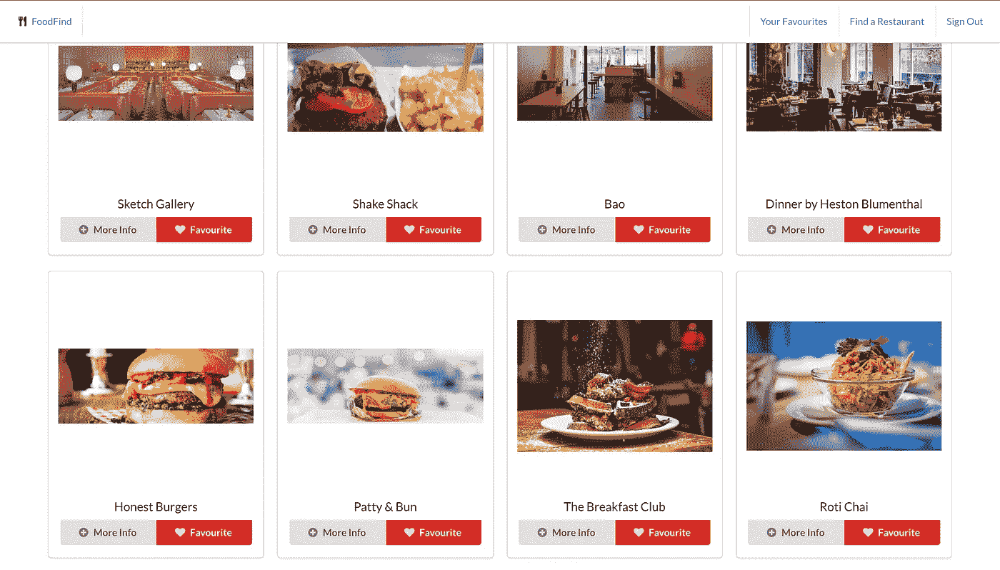
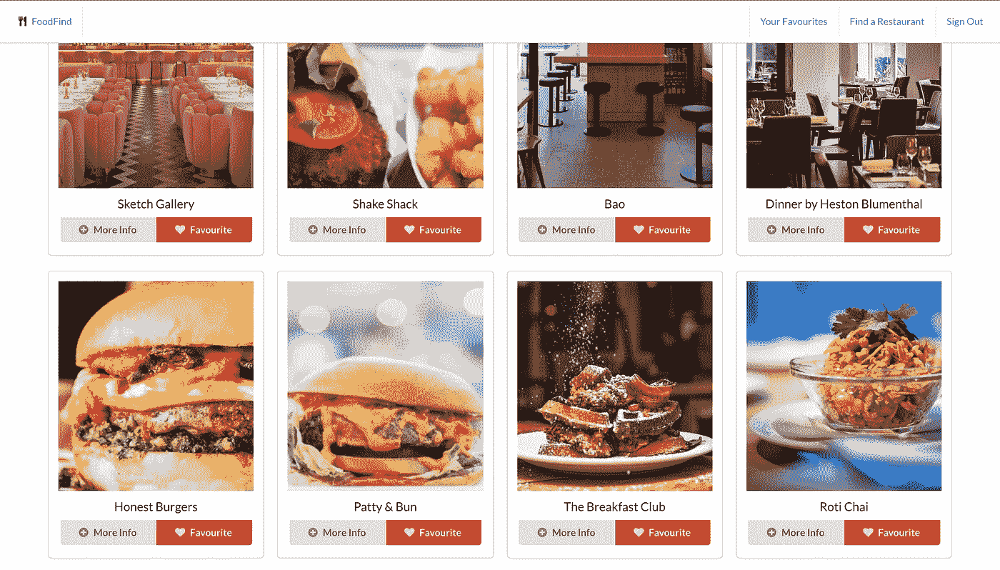
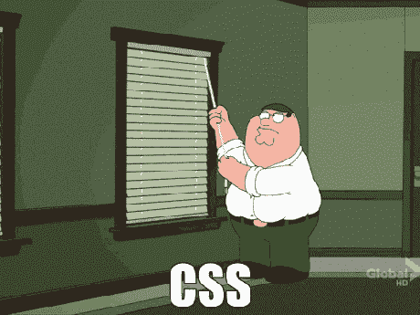

# 使用 CSS 控制图像

> 原文：<https://medium.com/analytics-vidhya/controlling-images-using-css-5b7697d75696?source=collection_archive---------24----------------------->

你有没有试过从一个 API 渲染图像，发现都是大小不一的？你曾经想要一个图像正好适合给定的尺寸，但同时保持其长宽比，并避免有一个压扁的图像吗？这是我本周早些时候遇到的一个问题，经过一段时间的反复试验，我使用 CSS 的 object-fit 属性找到了答案。

你可能已经知道，CSS 属性有 3 个共同的基本值: **inherit，initial** 和 **unset** 。 **inherit** 从父元素获取属性， **initial** 引用属性的默认值，如果父元素有匹配的值，unset 将充当 **inherit** ，否则将充当 **initial。**

以我目前正在开发的 React 应用程序为例，我将解释并演示 **object-fit** 属性给我们的其他五个可能值: **contain、cover、fill、none** 和 **scale-down。**

我的应用程序目前正在从一个 API 渲染图像，如你所见，我无法控制图像的大小和尺寸。



为了解决这个问题，我做的第一件事是在我的 CSS 中添加一个图像容器，并在我的。图像容器的 id。然后，我给这个图像一个类名，并将它添加到 CSS 文件中。我的代码目前看起来像这样:

```
src/App.css#imageContainer {
  height: 310px;
}.image {
  padding: 1em;
  /* object-fit: ; */
  width: 300px;
  height: 330px;
}src/Components/RestaurantCard.js<Card>
  <div **id="imageContainer**">
    <Card.Img
      variant="top"
      alt="restaurant pic"
      src={restaurant.featured_image}
      **className="image"** />
  </div>
</Card>
```

仅仅添加一点 CSS 样式就已经很有帮助了。然而，正如你在上面的图像中看到的，餐馆图像都是不同的大小，所以正如你在下面的图像中看到的，给图像一个固定的大小会扭曲图像。



# **对象适合:包含**

**object-fit** 的这个属性保持图像的原始纵横比，但是会调整它的大小，以便原始图像的最大高度或宽度能够适合给定的尺寸(在本例中为 300px/330px)。在我的 CSS 中更改它会产生以下结果:



# 对象适合:填充

图像将填充其给定的区域，即使这意味着失去其纵横比。这基本上等同于根本不使用 object-fit 属性。



# 适合对象:无

这一次，图像完全不调整大小，原始图像大小填充给定区域。然后，您可以使用另一个名为 object-position 的 CSS 属性来精确控制要呈现的图像部分。在这种情况下，它不会为我工作，因为我所有的图像是不同的大小，我可能会希望每个图像的不同部分被渲染。



# 对象适合:缩小

这将使**包含**或**不包含**中较小的一个，在这个特定的例子中是**包含**。



# 对象适合:封面

这使得图像保持其原始纵横比，并确保图像区域(您已定义)被完全覆盖。



在这个特定的例子中，我决定最适合的属性是 **object-fit: cover** ,因为它与 RestaurantCard 从 API 接收到的任何图像一起工作效果最好。如果我没有根据搜索结果收到不同的图像，我可能会使用 object-position 属性来更改图像可见部分的位置，但在我的具体示例中这似乎是多余的。

CSS 在开始时可能会令人沮丧，因为它非常复杂，很难传达你脑海中描绘的图像或编程语言中的线框格式。CSS 是强大的，因为它的表达潜力，即使有时需要耐心，时间和大量的测试来让你的应用程序呈现你想象中的样子。祝你好运！

