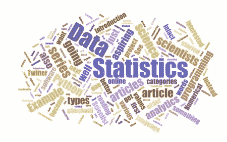

# 统计学和数据科学的难题

> 原文：<https://medium.com/analytics-vidhya/conundrum-of-statistics-and-data-science-8b7b92080b18?source=collection_archive---------9----------------------->

当我开始从 BI 世界到数据科学/ML 世界的旅程时，每个人过去谈论的话题之一是统计。

关于学习数据科学的第一点是，Google/Youtube 上的每个博客/大师过去谈论的都是统计数据，当我一跳入这个话题，我总是感觉被淹没了。这个主题太难了，我找不到任何结构化的方法来在实现它的同时继续学习统计学。

第二个主要障碍是统计和机器学习的学习一直在筒仓中进行，很难找到一个人解释统计并告诉你这个概念在数据科学中的应用。

这就是我受益于 Analytics Vidhya 的统计学课程的地方。他们以非常有效的方式解释了基础知识，并解释了为什么以及如何在 ML 中应用这些概念。

现在我将分享一些统计学的主题，以及在解决 ML 问题时在哪里以及如何应用这些主题。

**最基本的统计学概念是**数据的中心**和**数据的分散**。这意味着你应该知道数据变量的众数、中位数和均值，以及范围、方差和标准差。**

**这些概念在模型建立过程中的应用是->**

*   **单变量分析**
*   **缺失值插补**
*   **离群点检测**

****B】**统计概念，如**卡方检验、双样本 T 检验和相关性**–**

**这些都是统计学的前沿话题，当你开始疯狂学习统计学的时候，事情已经变得像个怪物一样了。因此，我们应该记住，在建立模型时，这些测试有着非常重要的作用。**

**这些概念在模型构建过程中的应用:**

*   **双变量分析——该分析将告诉我们两个变量是如何显著影响彼此的，也称为显著性检验。**
*   **连续-连续变量二元**
*   **相互关系**
*   **分类连续变量二元**
*   **双样本 T 检验**
*   **分类-分类变量**
*   **卡方检验**

**C **数据变量的正态分布和偏态**—正态分布有很多名称。很少是高斯型的，钟形弯曲的。了解数据集中连续变量的分布以及它们是左/右偏斜还是正态分布非常重要。**

**这些概念在模型建立过程中的应用是->**

*   **变量变换**

**正如我在上面试图展示的那样，所有这些基本的和高级的统计概念都与我们最终要做的模型构建练习有关，因此它们在构建稳健的模型中起着非常重要的作用。**

**上面的文字显然没有涵盖所有的统计概念及其在模型建立中的应用；也许我会试着在未来的博客中涉及它们。😊**

**继续学习…**

**特瓦里特**