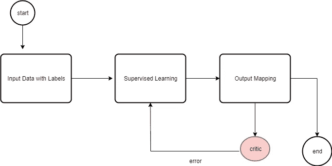
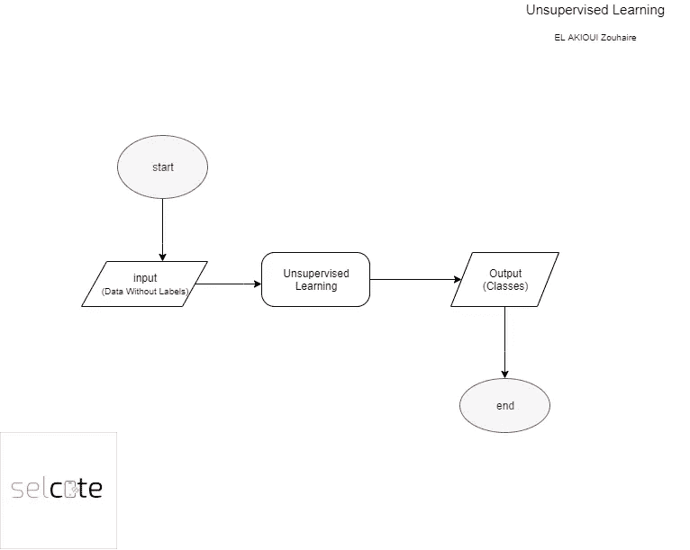

# ML 算法的传统智慧

> 原文：<https://medium.com/analytics-vidhya/conventional-wisdom-for-ml-algorithms-158f1f51af0f?source=collection_archive---------19----------------------->

在 [Unsplash](https://unsplash.com?utm_source=medium&utm_medium=referral) 上由 [Aron 视觉](https://unsplash.com/@aronvisuals?utm_source=medium&utm_medium=referral)拍摄的照片

这里有一个关于算法选择的传统智慧。以下问题的答案有助于确定哪种算法最适合您的模型:

你有多少数据？

你想预测什么？

数据是有标签的还是无标签的？

您需要增量培训还是批量培训？

随着经验的积累，您可以快速确定哪种算法最适合您的问题和数据。

# **算法风格**

ML(机器学习)算法的世界分为两个同样重要和有用的类别。在介绍科学家用来描述每个类别的花哨术语之前，让我们先看看定义每个类别的数据类型。

**标记数据与未标记数据**

我将术语 ***标签*** 定义为你试图预测或预测的东西，一些组织认为有标签的数据比无标签的数据更有价值。

组织有时甚至认为未标记的数据毫无价值。这大概是短视的。您将看到 ML 可以使用有标签和无标签的数据。

数据是否包含标签是决定 ML 算法风格的关键因素。ML 算法分为三种一般的 ML 风格:

*   监督学习
*   无监督学习
*   半监督学习

**监督学习**

输入训练数据具有已知的标签，通过纠正错误的预测来准备模型。训练过程继续进行，直到达到期望的精度。

**无监督学习**

输入数据没有标记，也没有已知的结果。通过推断输入数据中存在的结构来提取规则，或者通过相似性来组织数据，来准备模型。

**半监督学习**

输入数据是有标签和无标签的混合。有一个期望的预测。但是模型必须学习结构并做出预测。

最重要的算法属于这些类别之一。监督算法使用带有标签的数据。无监督算法使用没有标签的数据。半监督算法使用带标签和不带标签的数据。

监督学习是最容易理解的 ML 学习风格。监督学习算法对带有标签的数据进行操作。

使用 ML，很难避免手工处理数据。我引用西尔弗先生有趣的话

> 在我们对数据有更多期待之前，先对自己有更多期待。

结论:

开发人员回避部署 ML 的主要原因是算法选择和模型创建过于复杂。幸运的是，通过学习一些基本原理并理解与 ML 算法相关的科学语言，您可以克服算法复杂性问题。