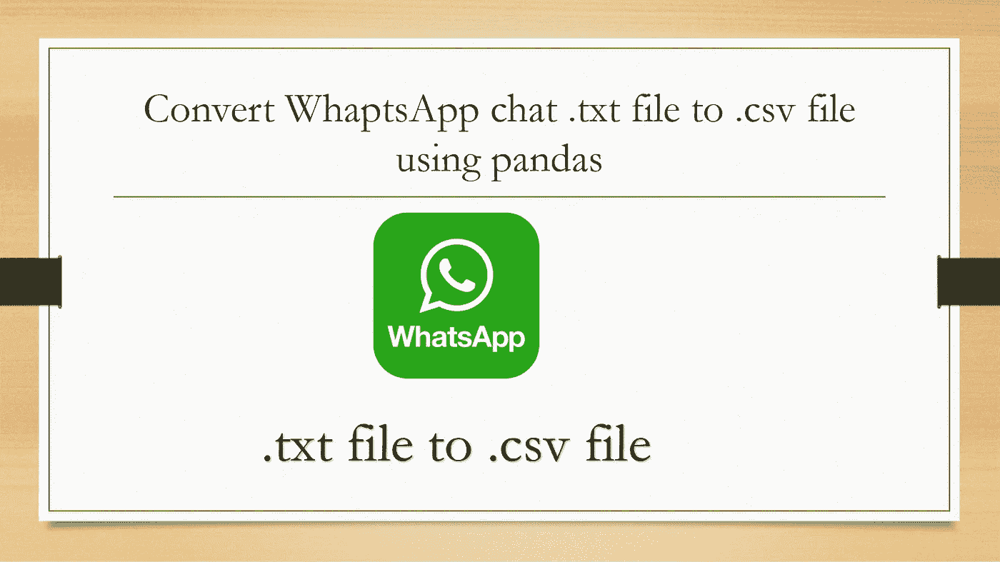
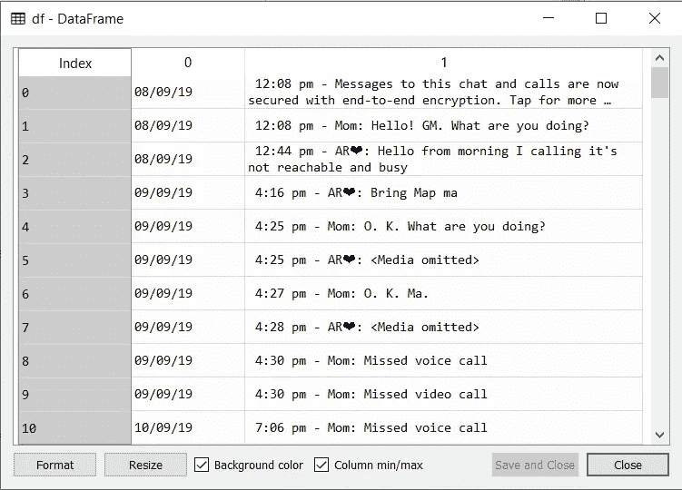
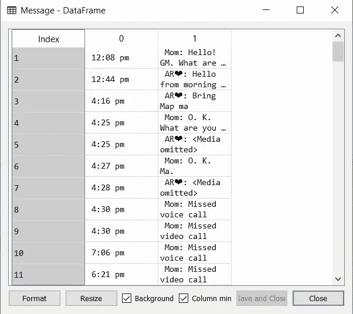
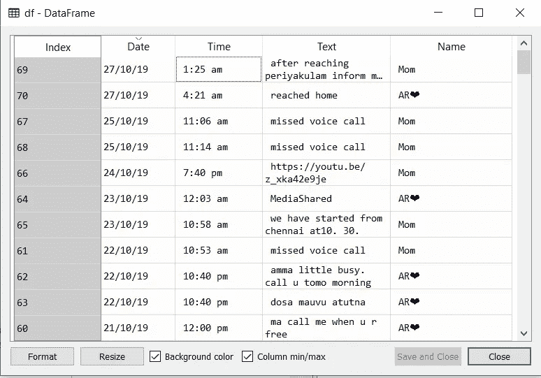
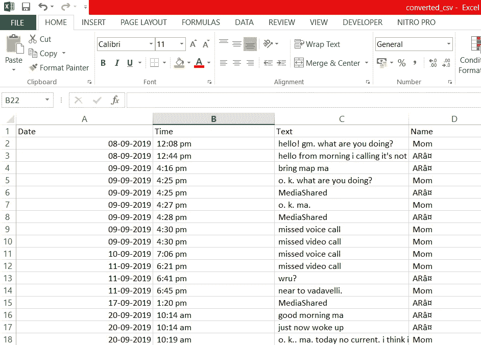

# WhatsApp 的转换。文本文件到。CSV |熊猫|简单方法

> 原文：<https://medium.com/analytics-vidhya/conversion-of-whatsapp-text-file-to-csv-pandas-simple-way-c721cddd97bd?source=collection_archive---------4----------------------->

如今的交流方式已经变成了 WhatsApp。通过 WhatsApp 传递了很多信息。

为了分析人与人之间的这种信息，我们需要数据。WhatsApp 提供了将一个人的聊天内容导出为文本文件的选项。

用于分析目的的文本文件的可用性有点复杂。因此需要将文本文件转换成可用文件。csv 文件格式。最初，当我开始做这样的转换时，我在网上查阅了许多代码，这些代码是以一种非常复杂的方式编写的。

为了进行简单的转换，我使用了熊猫。



```
import pandas as pdfilename="whatsappchat.txt"df=pd.read_csv(filename,header=None,error_bad_lines=False,encoding=’utf8')
```



当 read_csv 从 pandas 读取原始 WhatsApp 文本文件时

```
df= df.drop(0)
df.columns=['Date', 'Chat']
```

数据集的第一行有“邮件加密详细信息”，它不希望我删除数据集的第一行。接下来，我将这些列命名为“日期”和“聊天”

```
Message= df[“Chat”].str.split(“-”, n = 1, expand = True)
```



从数据集“聊天”列创建为一个独立的数据框，将时间和人名、消息合二为一。

```
df[‘Time’]=Message[0]
df[‘Text’]=Message[1]
```

上述代码在取自“消息”**数据帧的数据中创建“时间”**列**。**代码的第二行创建“文本”。

```
Message1= df[“Text”].str.split(“:”, n = 1, expand = True)
```

数据集的“文本”列创建另一个数据集“消息 1”，因为“文本”列由聊天人姓名和聊天消息组成。从“Message1”数据集中，使用“:”拆分人和聊天消息。

```
df[‘Text’]=Message1[1]
df[‘Name’]=Message1[0]
```

现在，我们可以创建仅包含文本消息的“文本”列和包含各个消息的聊天人姓名的“姓名”列。

```
df=df.drop(columns=[‘Chat’])
df[‘Text’]=df[‘Text’].str.lower()
```

现在，我们已经从数据集中删除了“聊天”列。为简单起见，所有文本都转换为小写(可选)

```
df[‘Text’] = df[‘Text’].str.replace(‘<media omitted>’,’MediaShared’)
df[‘Text’] = df[‘Text’].str.replace(‘this message was deleted’,’DeletedMsg’)
```

在“文本”列中，媒体省略的单元格和删除的消息被替换为字符串“媒体共享”和“删除的消息”



转换后的文本文件作为数据框的最终结果

```
df.to_csv("converted_csv.csv",index=False)
```

数据框被转换为. csv 文件并保存以备将来使用。



转换的. csv 文件

现在，您的文件已准备好进行简单的分析。

下面你可以复制完整的代码

```
import pandas as pd
filename="mom.txt"df=pd.read_csv(filename,header=None,error_bad_lines=False,encoding='utf8')
df= df.drop(0)
df.columns=['Date', 'Chat']
Message= df["Chat"].str.split("-", n = 1, expand = True) 
df['Date']=df['Date'].str.replace(",","") 
df['Time']=Message[0]
df['Text']=Message[1]
Message1= df["Text"].str.split(":", n = 1, expand = True) 
df['Text']=Message1[1]
df['Name']=Message1[0]
df=df.drop(columns=['Chat'])
df['Text']=df['Text'].str.lower()
df['Text'] = df['Text'].str.replace('<media omitted>','MediaShared')
df['Text'] = df['Text'].str.replace('this message was deleted','DeletedMsg')    
f.to_csv("converted_csv.csv",index=False) 
```

谢谢你。快乐分析！！

如果你喜欢，请鼓掌。意味着很多。