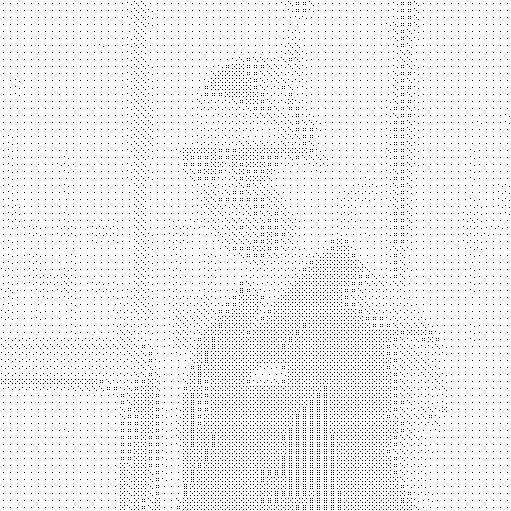

# 将图像转换成由骰子组成的图像

> 原文：<https://medium.com/analytics-vidhya/convert-an-image-into-one-comprised-of-dice-4a3cbcb241c5?source=collection_archive---------2----------------------->

这个项目始于一个朋友问我是否可以制作一个程序，将照片转换成骰子制成的黑白图像。该程序将按如下方式运行:

1.  导入图像
2.  将图像转换为灰度
3.  计算每个 7x7 像素正方形的平均饱和度
4.  将每个 7x7 正方形转换成六面骰子的图像。最低饱和度(0)被转换到管芯的 1 侧，最高饱和度(255)被转换到 6 侧
5.  导出新图像

听起来很简单。

我做了些调查。我发现 PIL(Python 图像库)包含了我需要的所有工具。我做了一些挖掘，找到了教程“[Python](https://www.codementor.io/isaib.cicourel/image-manipulation-in-python-du1089j1u)中的图像处理”，作者是 Isai B. Cicourel。稍加修改，我就能使用本教程中的方法将图像转换成灰度。

```
from PIL import Image # Create a Grayscale version of the image
def convert_grayscale(image):
 # Get size
 width, height = image.size # Create new Image and a Pixel Map
 new = Image.new("RGB", (width, height), "white")
 pixels = new.load() # Transform to grayscale
 for i in range(width):
  for j in range(height):
   # Get Pixel
   pixel = image.getpixel((i,j)) # Get R, G, B values (This are int from 0 to 255)
   red = pixel[0]
   green = pixel[1]
   blue =  pixel[2] # Transform to grayscale
   gray = (red * 0.299) + (green * 0.587) + (blue * 0.114) # Set Pixel in new image
   pixels[i, j] = (int(gray), int(gray), int(gray)) # Return new image
 return new
```

这是一个好的开始，但是我仍然需要代码将灰度图像转换成骰子图像。下面的代码块是我第一次尝试转换图像的方法。

```
# Create a version of the image made of dice
def convert_dice(image):
 # Get size
 width, height = image.size
 # Create new Image and a Pixel Map
 new = Image.new(width, height)
 pixels = new.load() # Transform to dice                        
 1 = 0
 j = 0
 while j < height:                         
  while i < width:                          
   # Get saturation                          
   saturation = 0                          
   for k in range(7):                           
    for l in range(7):                            
     pixel = get_pixel(image, i+l, j+k)                                
     saturation += pixel[2]                            
     saturation = saturation/49 # calculate average for k in range(7):                           
    for l in range(7):                                  
     pixels[i+l, j+k] = (255,255,255) # draw die                          
   if saturation > 212.5:                           
    pixels[i+3, j+3] = (0,0,0)                          
   elif saturation > 170:                           
    pixels[i+1, j+2] = (0,0,0)                                
    pixels[i+5, j+4] = (0,0,0)                          
   elif saturation > 127.5:                           
    pixels[i+1, j+1] = (0,0,0)                               
    pixels[i+3, j+3] = (0,0,0)                                 
    pixels[i+5, j+5] = (0,0,0)                          
   elif saturation > 85:                           
    pixels[i+2, j+2] = (0,0,0)                               
    pixels[i+2, j+4] = (0,0,0)                           
    pixels[i+4, j+2] = (0,0,0)                           
    pixels[i+4, j+4] = (0,0,0)                          
   elif saturation > 42.5:                                 
    pixels[i+1, j+1] = (0,0,0)                           
    pixels[i+5, j+1] = (0,0,0)                           
    pixels[i+3, j+3] = (0,0,0)                           
    pixels[i+1, j+5] = (0,0,0)                           
    pixels[i+5, j+5] = (0,0,0)                          
   else:                           
    pixels[i+2, j+1] = (0,0,0)                           
    pixels[i+4, j+1] = (0,0,0)                           
    pixels[i+2, j+3] = (0,0,0)                           
    pixels[i+4, j+3] = (0,0,0)                           
    pixels[i+2, j+5] = (0,0,0)                           
    pixels[i+4, j+5] = (0,0,0)                                
   i+=7                         
  i=0                         
  j+=7                                                

 # return new image                        
 return new
```

然后我添加了“main”方法。

```
def main():                       
 # Load Image (JPEG/JPG needs libjpeg to load)                        
 original = Image.open('img_001.png')                                                 # Convert to Grayscale and save                        
 new = convert_grayscale(original)                           
 new.save('gray.png')                                                 # Load gray image                        
 gray = Image.open('gray.png')                                                 # Crop and save gray image                        
 width, height = gray.size                        
 gray.crop((0,0,width-width%7,height-heiht%7)).save('gray.png','png')  # makes sure that width and height (pixels) are multiples of 7                                             # Re-load gray image                        
 gray = Image.open('gray.png')                                               # Convert to dice and save                        
 new = convert_dice(gray)                        
 new.save('dice.png')# run the script
if __name__ == "__main__":
 main()
```

这是一个好的开始。当我运行这段代码时，它转换了这个图像:


原象

对此:



骰子做成的图像

这个图像满足了我开始时的所有要求，但是您很难看出新图像是由原始图像制作的。我知道我可以做得更好。

接下来，我尝试提高分辨率，并根据原始图像的最大饱和度调整饱和度。我没有把每一个 7x7 像素的正方形变成一个骰子的边，而是把每一个像素变成一个骰子的边。下面是我修改的“convert_dice”方法。

```
# Create a version of the image made of dice
def convert_dice(image): # Get size
 width, height = image.size # Create new Image and a Pixel Map
 new = Image.new("RGB", (width*7, height*7), "white")
 pixels = new.load() i = 0
 j = 0
 maxSaturation = 0
 count = 0 while i < height:
  while j < width:
   pixel = image.getpixel((i,j))
   if pixel[2] > maxSaturation:
    maxSaturation = pixel[2]
   count += 1
   j+=1
  i+=1 i = 0
 j = 0 # Transform to dice
 while j < height:
  while i < width:
   # Get saturation
   saturation = 0
   pixel = image.getpixel((i,j))
   saturation += pixel[2] for k in range(7):
    for l in range(7):
     pixels[(i*7)+l, (j*7)+k] = (255,255,255) # Transform to dice
   if saturation > maxSaturation*(5/6):
    pixels[(i*7)+3, (j*7)+3] = (0,0,0)
   elif saturation > maxSaturation*(2/3):
    pixels[(i*7)+1, (j*7)+2] = (0,0,0)
    pixels[(i*7)+5, (j*7)+4] = (0,0,0)
   elif saturation > maxSaturation*(1/2):
    pixels[(i*7)+1, (j*7)+1] = (0,0,0)
    pixels[(i*7)+3, (j*7)+3] = (0,0,0)
    pixels[(i*7)+5, (j*7)+5] = (0,0,0)
   elif saturation > maxSaturation*(1/3):
    pixels[(i*7)+2, (j*7)+2] = (0,0,0)
    pixels[(i*7)+2, (j*7)+4] = (0,0,0)
    pixels[(i*7)+4, (j*7)+2] = (0,0,0)
    pixels[(i*7)+4, (j*7)+4] = (0,0,0)
   elif saturation > maxSaturation*(1/6):
    pixels[(i*7)+1, (j*7)+1] = (0,0,0)
    pixels[(i*7)+5, (j*7)+1] = (0,0,0)
    pixels[(i*7)+3, (j*7)+3] = (0,0,0)
    pixels[(i*7)+1, (j*7)+5] = (0,0,0)
    pixels[(i*7)+5, (j*7)+5] = (0,0,0)
   else:
    pixels[(i*7)+2, (j*7)+1] = (0,0,0)
    pixels[(i*7)+4, (j*7)+1] = (0,0,0)
    pixels[(i*7)+2, (j*7)+3] = (0,0,0)
    pixels[(i*7)+4, (j*7)+3] = (0,0,0)
    pixels[(i*7)+2, (j*7)+5] = (0,0,0)
    pixels[(i*7)+4, (j*7)+5] = (0,0,0)
   i+=1
  i=0
  j+=1 # Return new image
 return new
```

结果如下:


由骰子制成的高分辨率图像

我对这个结果非常满意；然而，我也希望能够将图像作为参数传递给脚本，并认为脚本可以使用一些错误处理。下面是我最后的代码。

```
from PIL import Image
import sys# Create a Grayscale version of the image
def convert_grayscale(image):
 # Get size
 width, height = image.size # Create new Image and a Pixel Map
 new = Image.new("RGB", (width, height), "white")
 pixels = new.load() # Transform to grayscale
 for i in range(width):
  for j in range(height):
   # Get Pixel
   pixel = image.getpixel((i,j)) # Get R, G, B values (This are int from 0 to 255)
   red = pixel[0]
   green = pixel[1]
   blue =  pixel[2] # Transform to grayscale
   gray = (red * 0.299) + (green * 0.587) + (blue * 0.114) # Set Pixel in new image
   pixels[i, j] = (int(gray), int(gray), int(gray)) # Return new image
 return new# Create a version of the image made of dice
def convert_dice(image): # Get size
 width, height = image.size # Create new Image and a Pixel Map
 new = Image.new("RGB", (width*7, height*7), "white")
 pixels = new.load() i = 0
 j = 0
 maxSaturation = 0
 count = 0 while i < height:
  while j < width:
   pixel = image.getpixel((i,j))
   if pixel[2] > maxSaturation:
    maxSaturation = pixel[2]
   count += 1
   j+=1
  i+=1 i = 0
 j = 0 # Transform to dice
 while j < height:
  while i < width:
   # Get saturation
   saturation = 0
   pixel = image.getpixel((i,j))
   saturation += pixel[2] for k in range(7):
    for l in range(7):
     pixels[(i*7)+l, (j*7)+k] = (255,255,255) # Transform to dice
   if saturation > maxSaturation*(5/6):
    pixels[(i*7)+3, (j*7)+3] = (0,0,0)
   elif saturation > maxSaturation*(2/3):
    pixels[(i*7)+1, (j*7)+2] = (0,0,0)
    pixels[(i*7)+5, (j*7)+4] = (0,0,0)
   elif saturation > maxSaturation*(1/2):
    pixels[(i*7)+1, (j*7)+1] = (0,0,0)
    pixels[(i*7)+3, (j*7)+3] = (0,0,0)
    pixels[(i*7)+5, (j*7)+5] = (0,0,0)
   elif saturation > maxSaturation*(1/3):
    pixels[(i*7)+2, (j*7)+2] = (0,0,0)
    pixels[(i*7)+2, (j*7)+4] = (0,0,0)
    pixels[(i*7)+4, (j*7)+2] = (0,0,0)
    pixels[(i*7)+4, (j*7)+4] = (0,0,0)
   elif saturation > maxSaturation*(1/6):
    pixels[(i*7)+1, (j*7)+1] = (0,0,0)
    pixels[(i*7)+5, (j*7)+1] = (0,0,0)
    pixels[(i*7)+3, (j*7)+3] = (0,0,0)
    pixels[(i*7)+1, (j*7)+5] = (0,0,0)
    pixels[(i*7)+5, (j*7)+5] = (0,0,0)
   else:
    pixels[(i*7)+2, (j*7)+1] = (0,0,0)
    pixels[(i*7)+4, (j*7)+1] = (0,0,0)
    pixels[(i*7)+2, (j*7)+3] = (0,0,0)
    pixels[(i*7)+4, (j*7)+3] = (0,0,0)
    pixels[(i*7)+2, (j*7)+5] = (0,0,0)
    pixels[(i*7)+4, (j*7)+5] = (0,0,0)
   i+=1
  i=0
  j+=1 # Return new image
 return newdef main():
 # process input
 input = sys.argv[1].strip()
 delimiter = "" if "/" in input:
  delimiter = "/"
 elif "\\" in input:
  delimiter = "\\" input = input.split(delimiter)
 file = input[-1]
 path = "" if len(input) != 1:
  path = delimiter for i in range(len(input)-1):
  path += input[i] + delimiter try:
  # Load Image (JPEG/JPG needs libjpeg to load)
  original = Image.open(path + file) except FileNotFoundError:
  print(path + file)
  print("File not found. Please make sure your path and file name are correct and try again.") else:
  suffix = "." + file.split(".")[-1] # Convert to Grayscale and save
  new = convert_grayscale(original)
  new.save(path + 'gray' + suffix) # Load gray image
  gray = Image.open(path + 'gray' + suffix) # Convert to dice and save
  new = convert_dice(gray)
  new.save(path + 'dice' + suffix)if __name__ == "__main__":
 main()if __name__ == "__main__":
 main()
```

你有它！如果你想使用这段代码或建议修改，请查看 [GitHub 库](https://github.com/shepnathand/2dice)！感谢阅读！