# 将 midi 文件转换为 numpy 数组(钢琴卷帘窗)

> 原文：<https://medium.com/analytics-vidhya/convert-midi-file-to-numpy-array-in-python-7d00531890c?source=collection_archive---------2----------------------->

最近在探索一个有趣的话题，神经音乐生成。在试验不同的神经网络结构之前，有一些重要的工作要做:数据收集和数据准备。

# 数据收集

我已经从[**kunsterfuge**](http://kunstderfuge.com/)订阅了*好友等级* (20 欧)，收集了足够多的优质古典钢琴 midi 文件。

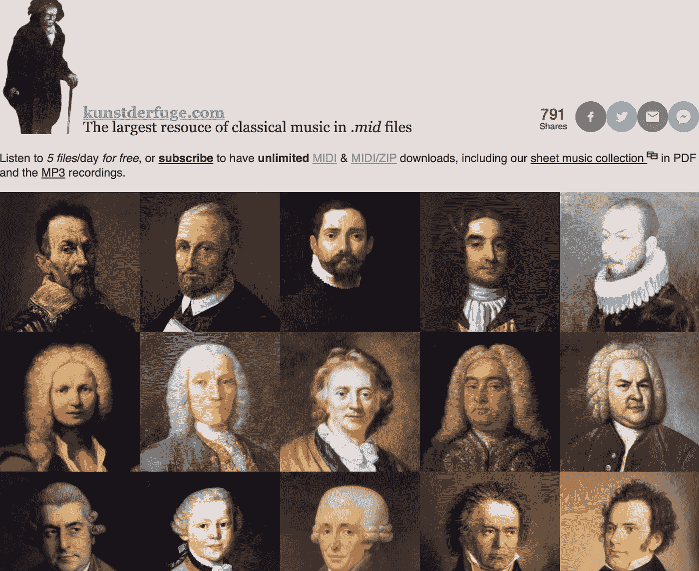

从[http://kunstderfuge.com/](http://kunstderfuge.com/)下载高质量的古典 midi 文件

# Midi 文件

让我们以肖邦的 D 大调 ***夜曲****op .****27*******№2***为例，研究一下 midi 文件是什么样子的，我们能从中提取出哪些重要的信息。下面是 ***GarageBand*** 中“*nocturne _ 27 _ 2 _(c)inoue . mid”*的截图。我们可以看到 5 个音轨，似乎只有第二、第三和第四个音轨可以发声。*

*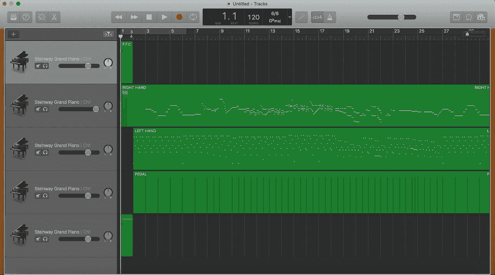*

*要查看更多细节，我们可以通过 ***Mido*** 在 Python 中打开(pip install mido)。*

*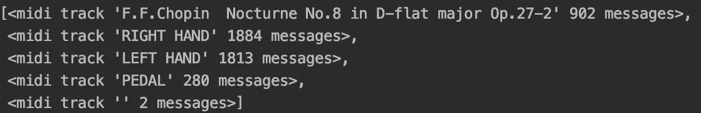*

*midi 文件包含一个或多个可以同时播放的轨道。*

*让我们检查一下‘夜曲 _ 27 _ 2 _(c)inoue . mid’的曲目内容:*

*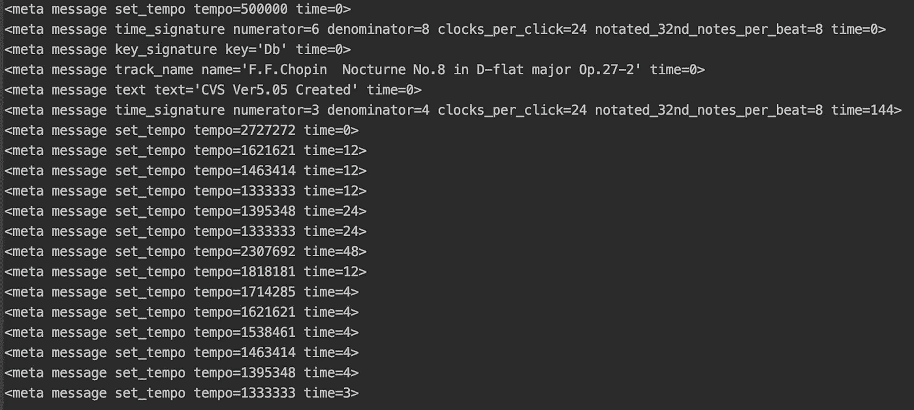*

*轨道 0 中的前 20 条消息*

****第一轨道(轨道 0)*** 包含存储诸如文件描述、拍号、调号、速度等信息的元消息。消息按顺序发送。请注意，在每条消息的末尾都有一个参数“time ”,它用于告知在发送最后一条消息之后和发送当前消息之前的等待时间。在这个音轨中，通过设置“速度”和“时间”，我们可以决定 midi 文件在每个时间段播放的速度。默认速度是 500000。*

*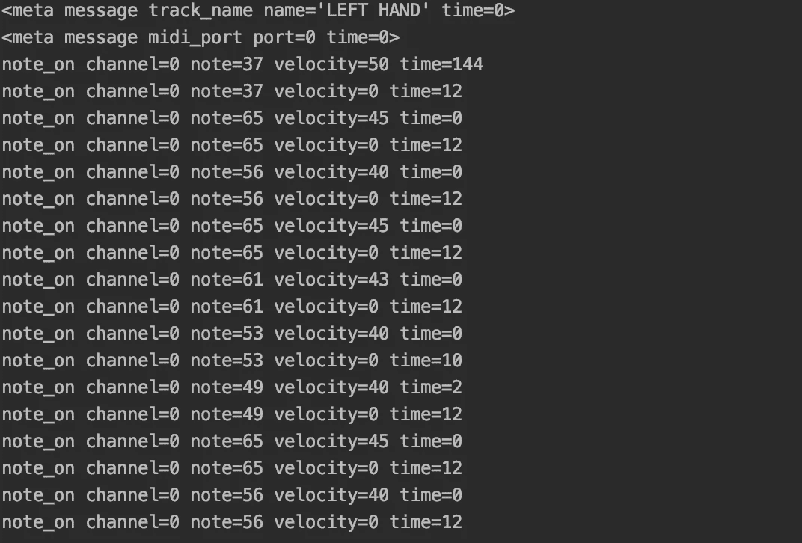*

*曲目 2 中的前 20 条消息*

****第二轨道(轨道 1)*** 和 ***第三轨道(轨道 2)*** 包含类似的信息:一些元消息，以及主要部分——在什么时间以什么方式演奏什么音符。让我们仔细看看 ***第三轨(track 2)*** 。*

*   *“note_on”告知按键被按下(或释放，如果力度=0)。*
*   *“note_off”告知要释放按键(力度应始终设定为 0)。*
*   *“通道”告知声音将被发送到哪个通道。标准 midi 同时支持 16 个通道。*
*   *“note”告诉它是哪个键。我们可以参考下面的地图，找到钢琴键盘上每个 midi 音符 id 的对应键。*
*   *“力度”告诉击键的速度，速度越快，声音越大。*
*   *“时间”告诉我们上一次操作和当前操作之间的等待时间。音符的时间长度是同一音符的两个最近的信息之间的每个信息的“时间”之和，其中第一个信息告诉您打开音符(当您看到“音符开”且“力度”> 0 时)，最后一个信息告诉您关闭音符(当您看到“音符关”或“音符开”且“力度”=0 时)。*

*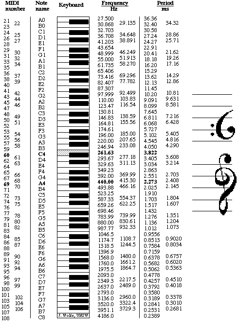*

*midi 音符和 88 键键盘之间的映射*

*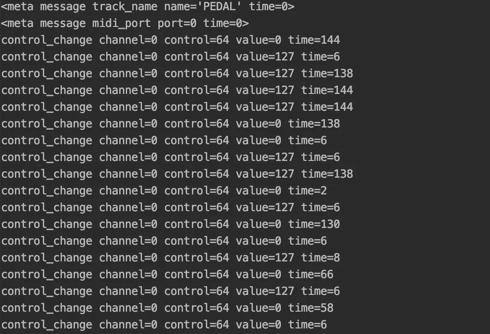*

*曲目 3 中的前 20 条消息*

****第四轨道(轨道 3)*** 主要是包含以“control_change”开头的消息，这与踏板的控制有关。因为我主要关心的是笔记，所以现在我将忽略这种类型的消息。*

*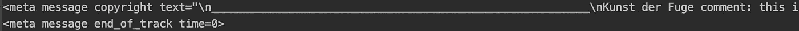*

****第五轨道(轨道 4)*** 只有包含 2 个元消息，这对我们的问题并不重要。*

*下面是消息类型和参数值范围的汇总:*

*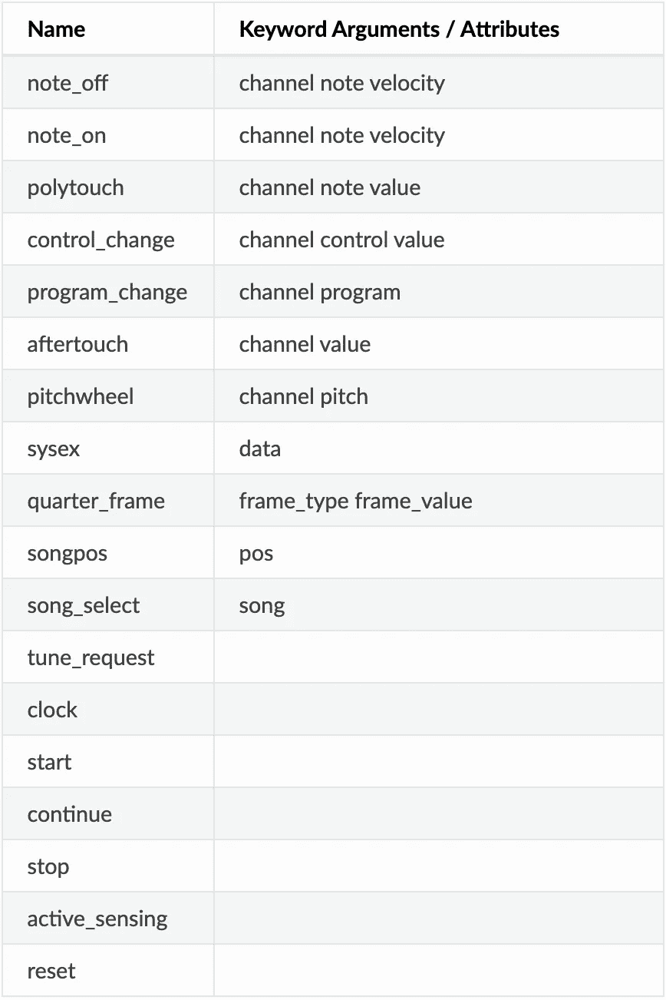**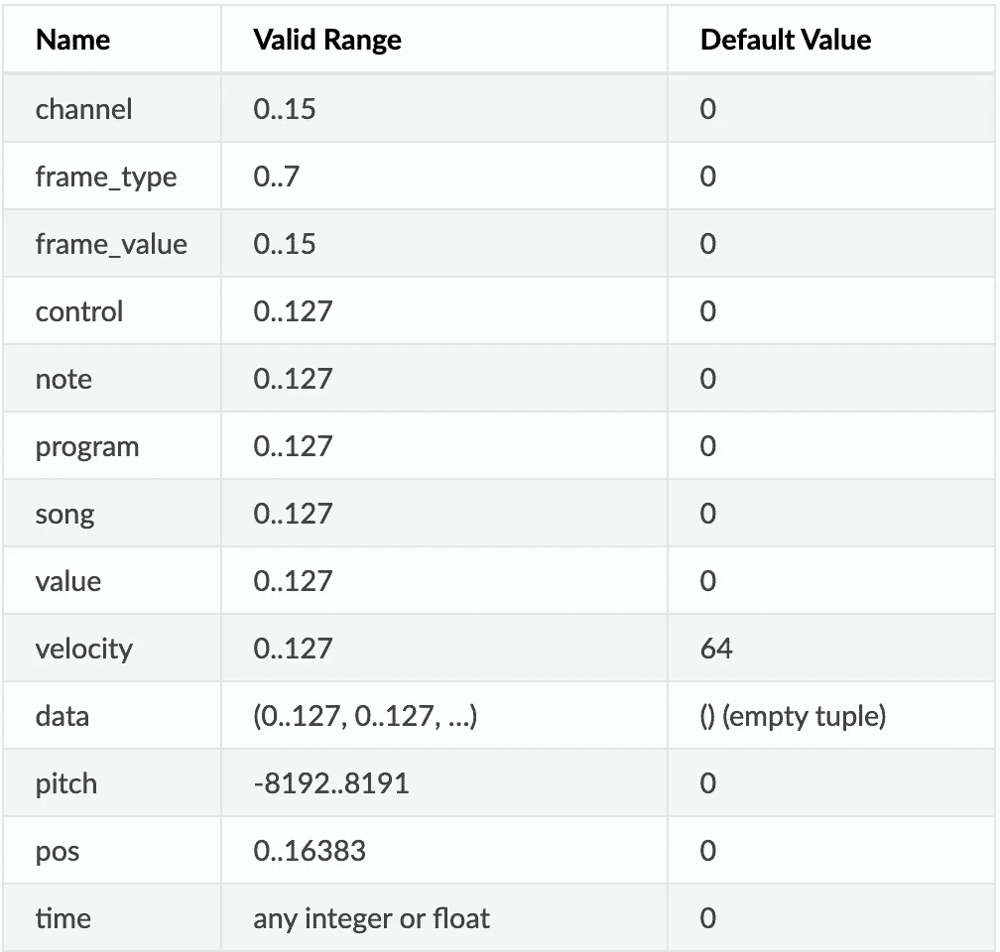*

*参数类型和范围([https://mido . readthedocs . io](https://mido.readthedocs.io/en/latest/message_types.html)*

# *密码*

*有了对 midi 文件的基本了解，我们现在可以写一些代码把 midi 文件转换成 ***numpy 数组*** 。*

*所需的数组格式:*

*   *Dimension = n 行* 88 列，每行包含 88 个音符在特定时间步长的状态。超出钢琴键盘范围的音符将被忽略。*
*   *数组中的值表示力度(0 表示音符关，而(0:127)表示音符开)。*
*   *该阵列组合其消息数量不小于阈值的所有轨道的音符信息。阈值被计算为最长轨道的消息数量的 10%。*

*函数 ***msg2dict*** 从每条信息中提取重要信息(音符、力度、时间、开或关)。*

*函数 ***switch_note*** 根据音符、力度、音符开或音符关的新值改变 last_state(前一时间步 88 音符的状态)。每个时间步长的状态包含 88 个值。*

*函数 ***track2seq*** 将一个轨道中的每条消息转换为一个 88 值的列表，并将每个列表按顺序存储在结果列表中。*

*函数 ***track2seq*** 在过滤轨迹时考虑最小消息数的阈值，将所有轨迹组合成一个 numpy 数组。如果两个音轨同时放在同一个音符上，它取较大的力度。*

*让我们来看看结果:*

*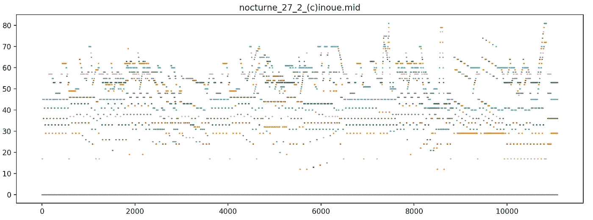*

*让我们将转换后的模式与原始模式进行比较:*

*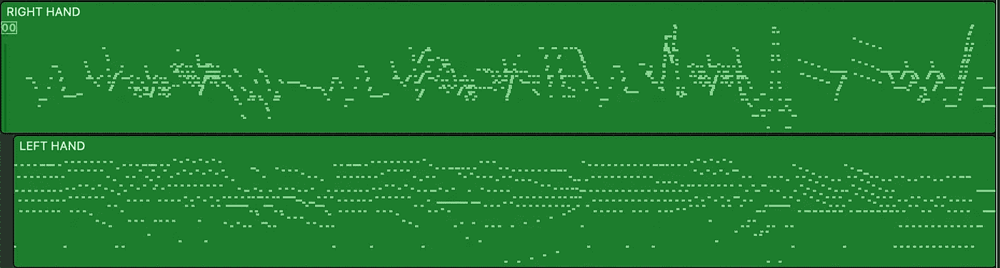*

*我们还可以将结果 numpy 数组转换为 midi 文件，其中一个轨道只包含音符力度值的信息。*

*函数 ***arry2mid*** 计算相邻时间步长的速度值差值，并将差值转换为轨迹中的信息。*

*我们可以在 ***GarageBand*** 中打开 **mid_new.mid** ，播放一下，看看听起来是不是和原版差不多。*

*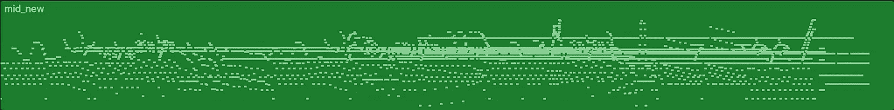*