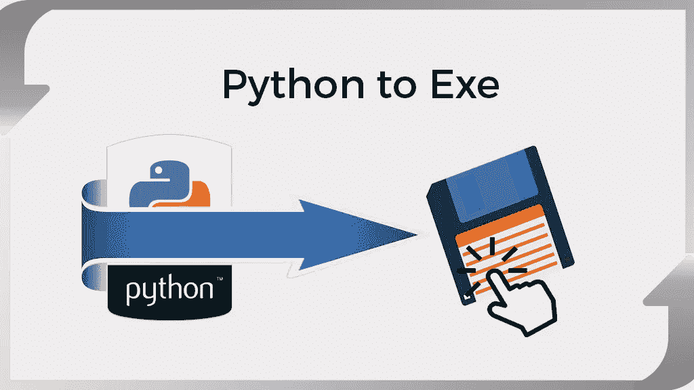
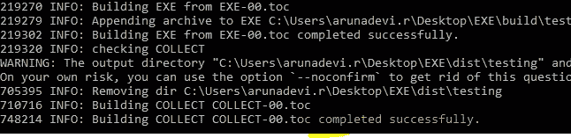
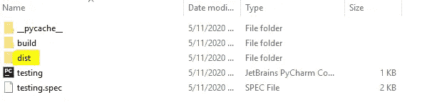
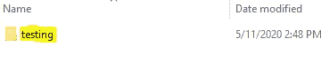
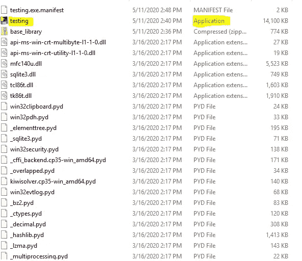
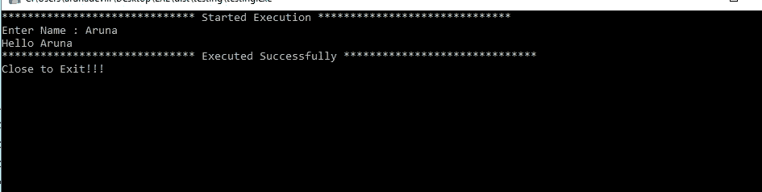

# 如何转换。py to。使用 pyinstaller？

> 原文：<https://medium.com/analytics-vidhya/convert-py-to-exe-file-bc8721e318b8?source=collection_archive---------0----------------------->



图片来自谷歌。

什么是 exe 文件？

exe 文件是一种可执行文件格式。它包含一个程序，并且能够作为一个程序在计算机中运行。它不需要执行任何导入语句。只需双击即可运行 exe 文件。

希望，python 已经安装在你的系统里了。使用 pip 安装 PyInstaller。

**pip 安装 pyinstaller**

让我们开始吧。

1.  创建一个 python 文件。打开命令提示符并运行 python 文件，检查代码是否成功运行，没有任何错误。
2.  创建一个 exe 文件。

*   转到存放。py 文件已保存。打开该文件夹中的命令提示符。type**py installer testing . py**

示例代码:

```
import warnings
warnings.filterwarnings("ignore")
# It's always good to import warnings
import pandas as pd
print("****************************** Started Execution ******************************")
n1 = input("Enter Name : ")
print("Hello {0} " .format(n1))
print("****************************** Executed Successfully ******************************")
input( " Close to Exit " )
```

如果代码运行成功，您将在 cmd 中看到这一点。



*成功完成

现在去那个文件夹。py 文件被放置。您将看到几个新创建文件夹。分布->测试->测试



***打开分发文件夹***



***打开测试文件夹***



***双击测试应用***

单击测试应用程序。它将打开一个命令提示符并执行代码。



pyinstall 命令可能会在 dist 文件夹中创建大量文件。如果你想有一个单一的应用程序文件。

运行**py installer—one file testing . py**

`--onefile`

> *将整个应用程序打包成一个可执行文件。*

```
# Build the .exe, .app
pyinstaller hello.py

# Create only a single file (slower to run, easier to distribute)
pyinstaller hello.py -F

# Tell application not to launch console (e.g. PyQt5, GTK+, tkinter GUIs)
pyinstaller hello.py --noconsole

# Specify the icon file to use
pyinstaller hello.py --icon=path/to/icon.ico 
```


图片来自谷歌。

# 部署时可能出现的错误:

1.  ImportError:无法导入所需的依赖项:numpy: **没有名为“numpy.random.common”的模块**

解决方案 1:在 python 文件中添加以下代码

```
import numpy.random.common
import numpy.random.bounded_integers
import numpy.random.entropy
```

解决方案 2:在 pyinstaller 命令中隐藏模块。

py installer-hidden-import = " numpy . random . common "--hidden-import = " numpy . random . bounded _ integers "--hidden-import = " numpy . random . entropy " testing . py

2.输出提示立即关闭。

解决方案 1:在代码末尾添加 input()。通过添加，它不会关闭提示，直到您退出。

3.错误如没有名为 sklearn.tree 的模块，[py installer；ModuleNotFoundError:没有名为“sklearn.utils._cython_blas”的模块](https://stackoverflow.com/questions/57108026/pyinstaller-modulenotfounderror-no-module-named-sklearn-utils-cython-blas)

解决方案 1:通过`pyinstaller -F --hidden-import="sklearn.utils._cython_blas" --hidden-import="sklearn.neighbors.typedefs" --hidden-import="sklearn.neighbors.quad_tree" testing.py`隐藏模块

解决方案 2:当您运行 pyinstaller 命令时，它将创建一个 ***testing.spec*** 文件。

*   打开 testing.spec 文件
*   在 hiddenimports 中添加所有导入。

`hiddenimports=['cython','pymysql','pandas._libs.tslibs.timedeltas','sklearn.neighbors.typedefs','sklearn.utils.typedefs'],`

快跑。`pyinstaller testing.spec`