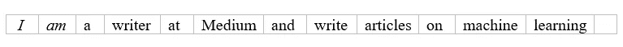

# 将文本转换成矢量

> 原文：<https://medium.com/analytics-vidhya/convert-text-into-vectors-12285b65d0b4?source=collection_archive---------21----------------------->

自然语言处理是一种处理文本数据的技术，简而言之，它被称为 NLP。它用于语言翻译应用程序、文字处理器、交互式语音响应(IVR)、个人助理应用程序，如 ok google、Siri、Cortana。

有许多方法可以将文本转换成矢量。在这里，我们将讨论最受欢迎的。

# 单词袋(BOG)

这是文本处理中最简单的方法之一，将文本转换成向量。它是数据中单词出现的表示。它涉及两件事

*   所有已知单词的词汇表。
*   已知单词的存在。

它不关心数据中的信息。它只关心数据中单词的频率，这就是为什么它被称为**包。**

# 克

克也用于将文本转换成矢量。首先，它在处理之前将单词转换成组。它可以是 2、3 或 n 组。在这种技术中，单词被称为克。

让我们看看这意味着什么:

*句子:我是 medium 的作家，写关于机器学习的文章。*

**Uni-gram —** 一次只需要一个单词就可以转换成向量。

双元语法 —一次需要两个单词才能转换成向量。

**Tri-gram** —一次需要三个单词才能转换成向量。

**N 元语法** —一次需要 N 个单词才能转换成向量。

二元/三元/多元语法也保存了句子信息。

# 术语频率(TF)

它使用词频将文本转换成向量。数据中出现的次数除以数据中的总字数。

# 反向数据频率(IDF)

它用于衡量术语的稀有程度。对于我们正在查看的每个术语，我们获取文档集中的文档总数，并将其除以包含我们术语的文档数。这给了我们一个稀有的标准。

# TF-IDF

正如我们上面讨论的

TF =单词在数据中出现的次数/数据中的总单词数

IDF = ln(文档数/该术语出现的文档数)

TF-IDF 得分越高，该术语越罕见，反之亦然。

# 密码

[笔记本](https://github.com/namratesh/Machine-Learning/blob/master/Convert%20text%20into%20vectors.ipynb)此处链接。

**导入库**

**句子**

**单词的标记化**

**删除停用词**

## 克

**双字母组合**

**三元组**

**n-gram**

# TF-IDF

感谢阅读！！！

欢迎建议！！！

参考资料:

 [## 什么是自然语言处理？

### 自然语言处理，简称 NLP，被广泛定义为自然语言的自动操作…

machinelearningmastery.com](https://machinelearningmastery.com/natural-language-processing/) 

[https://towards data science . com/machine-learning-text-processing-1 d5a 2d 638958](https://towardsdatascience.com/machine-learning-text-processing-1d5a2d638958)