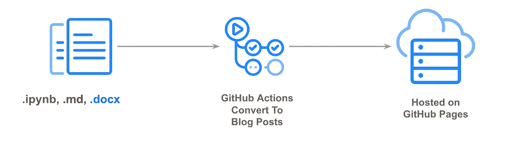
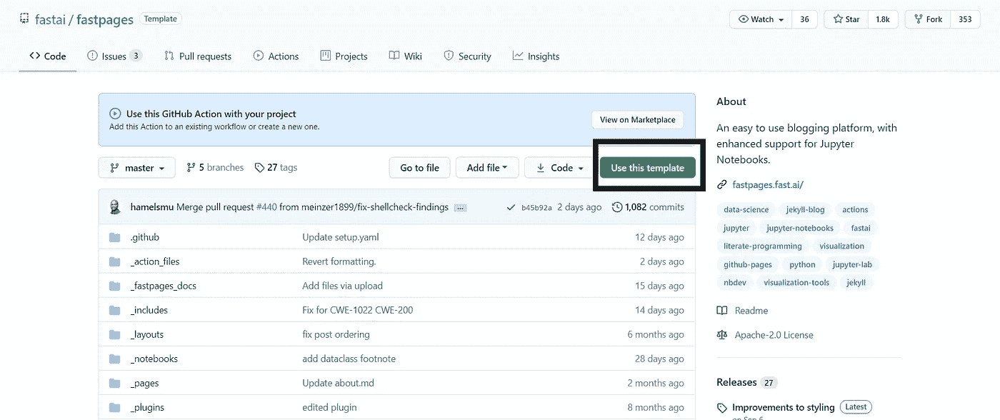
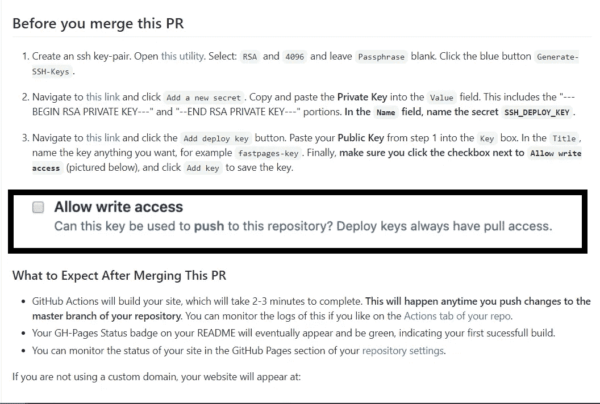
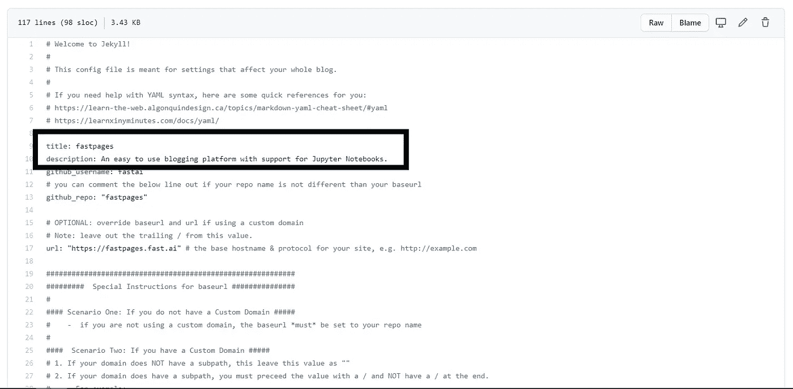
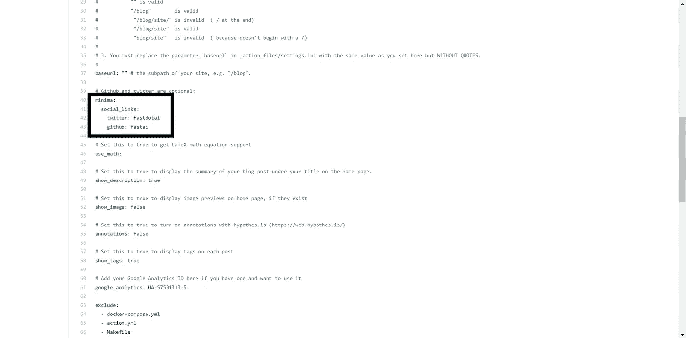
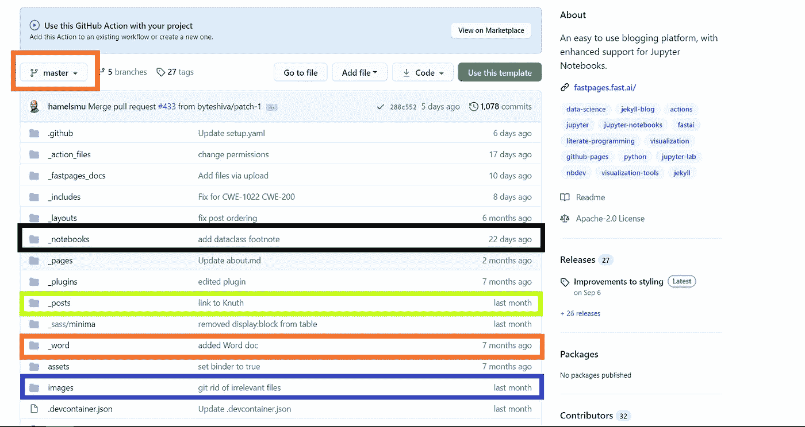

# 使用 Github-action 将您的 Jupyter-notebook 转换为 Github 页面

> 原文：<https://medium.com/analytics-vidhya/convert-your-jupyter-notebook-to-github-pages-with-github-action-fa2ce9b4182a?source=collection_archive---------5----------------------->

照片由 [Richy Great](https://unsplash.com/@richygreat?utm_source=medium&utm_medium=referral) 在 [Unsplash](https://unsplash.com?utm_source=medium&utm_medium=referral) 上拍摄

作为一名数据科学家和机器学习工程师，Jupyter 笔记本是您可以使用的便利工具。

**如果你能在 5 分钟内将笔记本转换成博客，那该有多酷？**

现在有了 [Github](http://www.github.com) action 和 [Fastpages](https://fastpages.fast.ai/) 模板，这就成为可能。

Github 上 [fastai/fastpages](https://fastpages.fast.ai/) 的照片

你可以在这里找到现场演示。

## 1.要求

*   Github 账户

## 2.紧随其后的步骤

*   打开 Github 帐户并使用 fastpages 模板，您可以在这里找到链接。

*   Github-action 在 30 秒内生成一个 pull 请求。在合并拉取请求之前，请遵循以下步骤。

*   确保您检查了这个**允许写访问**。
*   合并 pull 请求并等待，直到 Github-action 生成 Github 页面。
*   现在你可以在你的 Github repo 自述文件中找到一个链接，在那里你可以找到演示文章。

## 3.更改名称和描述

*   你可以在你的 Github repo 的 master/main 分支下找到 **_config.yml** 文件。
*   在编辑模式下打开文件。
*   根据自己的目的更改名称和描述。

*   你也可以在这个文件中添加你的社交链接。

# 4.如何添加自己的笔记本？

*   除了笔记本，你还可以添加 markdown 和 word 文件。
*   请确保您将这些内容直接添加到主分支中。
*   将您的笔记本、markdown 和 word 文件添加到 ***_notebook*** 、 ***_posts*** 、 ***_word*** 文件夹中，并使用正确的名称格式。

*   你可以在这里阅读[更多关于名称格式和其他文档的](https://github.com/fastai/fastpages)。
*   如果要使用本地图像，请将所有图像上传到主分支的 images 文件夹中。

> **快乐博客**

*原载于 2020 年 10 月 24 日*[*【https://vivek2509.blogspot.com】*](https://vivek2509.blogspot.com/2020/10/convert-your-jupyter-notebook-into-blog.html)*。*