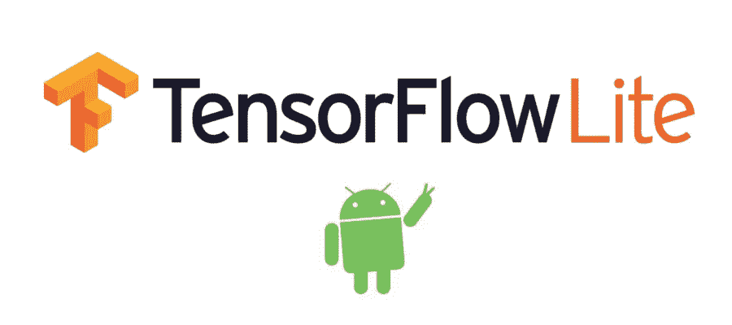
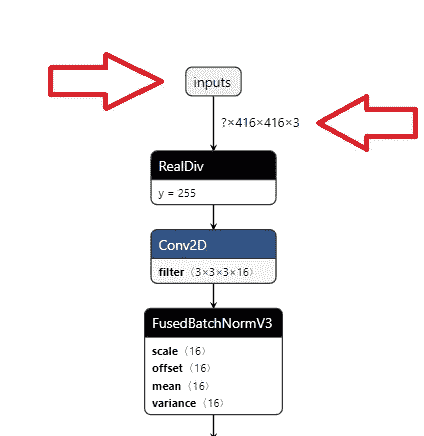
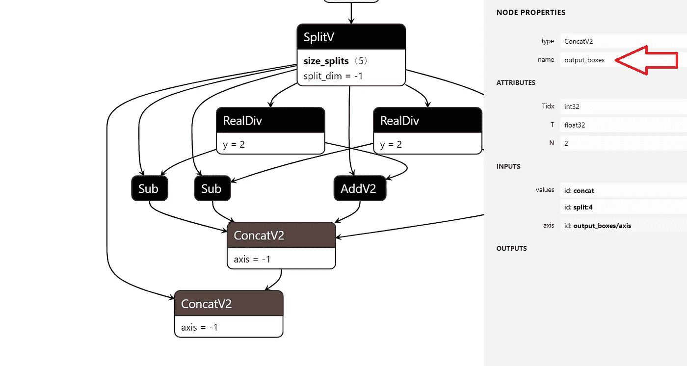

# 将自定义暗网模型转换为 TensorFlow Lite

> 原文：<https://medium.com/analytics-vidhya/converting-a-custom-darknet-model-to-tensorflow-lite-ffdd48d58082?source=collection_archive---------2----------------------->



Tensorflow 的移动设备框架

# 介绍

你是否尝试过构建一个定制的 Darknet 模型，并意识到这个模型在移动应用程序上运行将非常困难？您是否发现自己正在寻找一种方法来将这种模型转换为移动兼容的格式(TensorFlow lite)？嗯，我希望我使用的解决方案对你有用。(跳到我用什么来转换？解决方案部分)

长话短说，我设法使用 [darknet](https://github.com/AlexeyAB/darknet) 框架训练了一个定制的 tiny-Yolo V3 模型，并需要将我的模型转换为 Tensorflow Lite 格式。如果你想知道为什么，请阅读下面的两个部分。

# 什么是 Tensorflow Lite？

[Tensorflow Lite](https://www.tensorflow.org/lite/guide) 是一个开源框架，旨在移动设备、物联网设备和嵌入式设备上运行 Tensorflow 模型。它将优化模型，使其使用非常少的手机资源。

# 为什么我需要转换？

默认情况下，一旦模型为 Flatbuffer 文件格式(.tflite)，它是由张量流转换器生成的。在此之前，我们需要将 darknet 模型转换为 Tensorflow 支持的 Protobuf 文件格式(。pb)。

为您简化一下:

yolo v3-tiny . weights→tiny-yolo-v3 . Pb→tiny-yolo-v3 . tflite。

# 。重量->。Pb 转换

我使用了 TF-Slim 中 Yolo v3 的 [mystic123 的](https://github.com/mystic123/tensorflow-yolo-v3)实现来进行转换。在克隆此存储库之前，您需要 Python 版本≥ 3.5，Tensorflow 版本≥ 1.11。我用的是 Python 3.7.4 和 Tensorflow 1.15。

要转换的命令。重量为。pb 是:

```
python convert_weights_pb.py --class_names "~YOUR PATH~/class.names" --weights_file "~YOUR PATH~/yolov3-tiny.weights" --data_format "NHWC" --tiny
```

我强烈建议使用绝对路径，因为它保证脚本会找到您需要的文件。一个好路径的例子是**D:/tensor flow-yolo-v3-master/data/tiny-yolo . weights .**

运行之后，你将得到 Protobuf 文件，现在你需要把它转换成 tflite 格式。您也可以尝试使用 NCHW，但这给我的下一步带来了一些问题。

# 。Pb ->。Tflite 转换

要执行这种转换，您需要确定输入的名称、输入的维度以及模型输出的名称。如果您已经知道这些值，那么跳到下面的命令。

如果您不知道这些值，那么您需要下载 [Netron](https://github.com/lutzroeder/netron) 。Netron 将帮助你想象你的。pb 文件，并将显示模型中的所有层。启动 Netron 后，请确保打开。pb 文件，并查找输入层的名称、下面的尺寸，双击最后一层可以找到输出名称。



使用 Netron 获取输入图层值



使用 Netron 获取输出层值

要运行下面的命令，您需要安装 tflite_convert。如果您的 Tensorflow 版本≥ 1.9，则它已经安装。命令是:

```
tflite_convert --graph_def_file=~YOUR PATH~/yolov3-tiny.pb --output_file=~YOUR PATH~/yolov3-tiny.tflite --input_format=TENSORFLOW_GRAPHDEF --output_format=TFLITE --input_shape=1,416,416,3 --input_array=~YOUR INPUT NAME~ --output_array=~YOUR OUTPUT NAME~ --inference_type=FLOAT --input_data_type=FLOAT
```

这将生成一个名为 yolov3-tiny.tflite 的文件。如果是这样，那么恭喜你，因为这种转换并不容易！如果这对你有用，那么我非常高兴，如果没有，那么你应该非常接近解决方案。保重，再见！