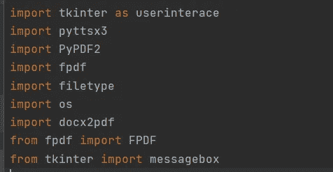
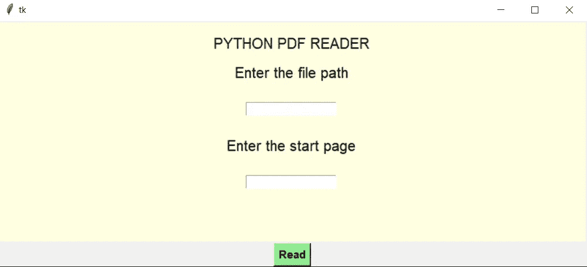
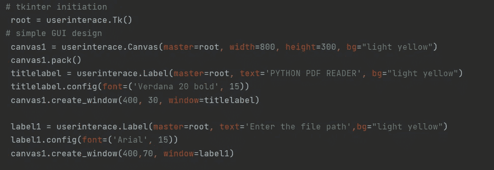
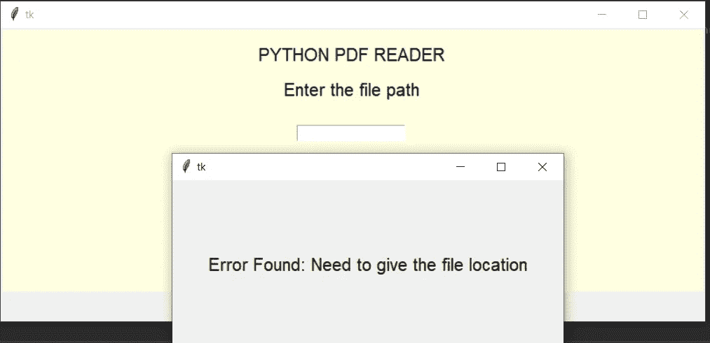
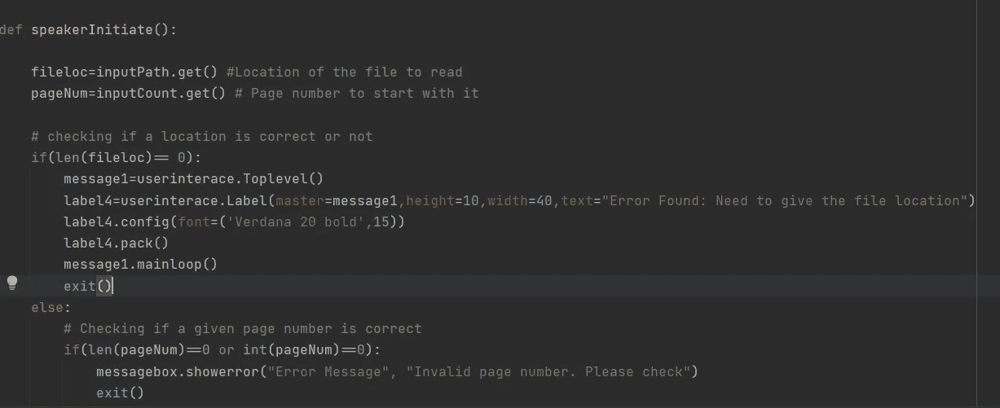
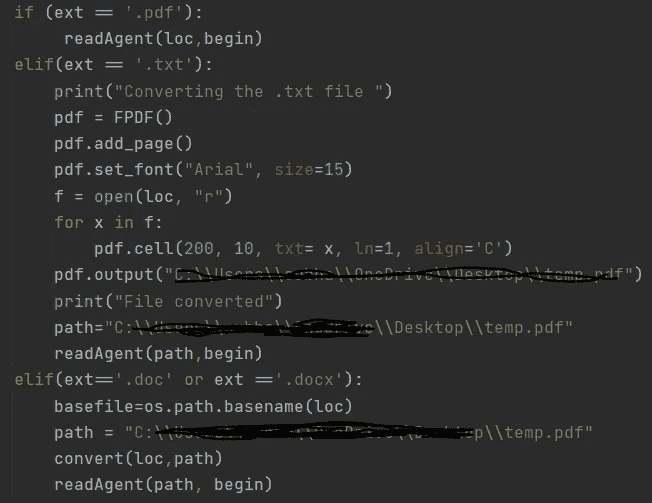
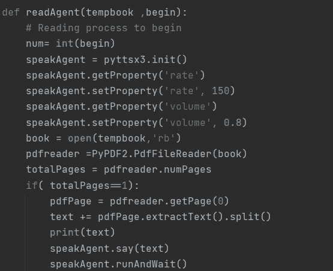

# 使用 Python 通过语音选项转换和读取文档。

> 原文：<https://medium.com/analytics-vidhya/converting-and-reading-a-document-in-with-speech-option-using-python-876860dea05b?source=collection_archive---------14----------------------->

如何使用 Python 和 PyCharm IDE 设计一个简单的 GUI，可以读取 pdf 文件，同时可以转换任何文件。txt，。doc，。docx 文件转换为 pdf 文件。**只是为了好玩！！**

**概述:**

pyttsx3、tkinter、pyPDF2 等各种 python 库和包被用于应用程序的前端和后端实现。简单的功能是读出在文件位置中提供给 GUI 的文件以及感兴趣的页码，作为 GUI 的输入，应该从该页码开始读取。如果给定文件有扩展名，如。txt，。doc，。docx 文件将被转换为 pdf，并保存在代理可以读取的位置。

**库和包:**

已经使用的库和包

首先，在使用 pip 实现之前，使用以下命令安装软件包和库:

**pip 安装 tkinter**

**pip 安装 pyPDF2**

我确实遇到了识别文件的问题，为此我必须重新安装 py win32(Python for Windows extension ),而且一切正常！！。

**GUI 设计:**

我猜这个 GUI 是使用 Python 的 tkinter 包制作的最简单的 GUI。！。

基本组件是从 tkinter 作为 Tk()启动的根。该组件包含文本字段，用于捕获要读取的文件的位置和应该开始读取的页码。提供适当的输入后，应用程序将检查输入的位置是否指向 pdf。以防万一。txt，。doc 或. docx 文件，那么在阅读之前，它将被提取并转换为 pdf。

GUI 的外观

GUI 代码片段

错误消息也被检查:使用从 tkinter 调用的 messagebox 和使用 tkinter 的顶层类定制的错误框检查错误消息，该错误框将消息框架放在根框架上。

对于空文本字段。

错误检查的代码片段

pdf 文件以外的文件转换发生在后端，如下面的代码所示。用户可以自定义路径来保存转换后的 pdf 文件，否则它会将文件存储在 PyCharm 文件的 venv 文件夹中。变量“ext”包含使用 Python 的“ **os** ”模块在提供的文件位置检查的文件的扩展名。

下面的代码片段显示了使用 Python 的 PyPDF2 和 pyttsx3 库启动阅读代理，朗读文件的提取文本。一个页面的条件只是一个显示的提示，但是使用 for…循环，可以读取多个页面。速度(“速率”)、音量等属性已修改如下:

阅读代理的几行代码

我保留了默认的声音选择，但它可以改变。:)

当您点击所有有效输入的“阅读”按钮时，pdf 的音频开始播放。这对于一个初学者的工作来说是令人愉快的！！

更多详情，可参考以下链接:

[https://github . com/EVA 86271/audio python/blob/master/venv/pdf reader . py](https://github.com/Eva86271/AudioPython/blob/master/venv/PDFReader.py)

干杯！！