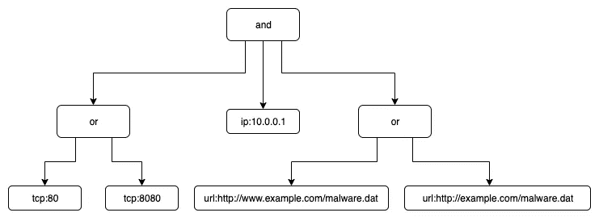
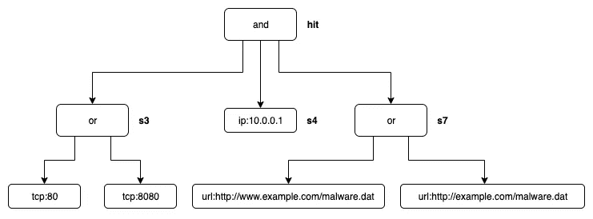
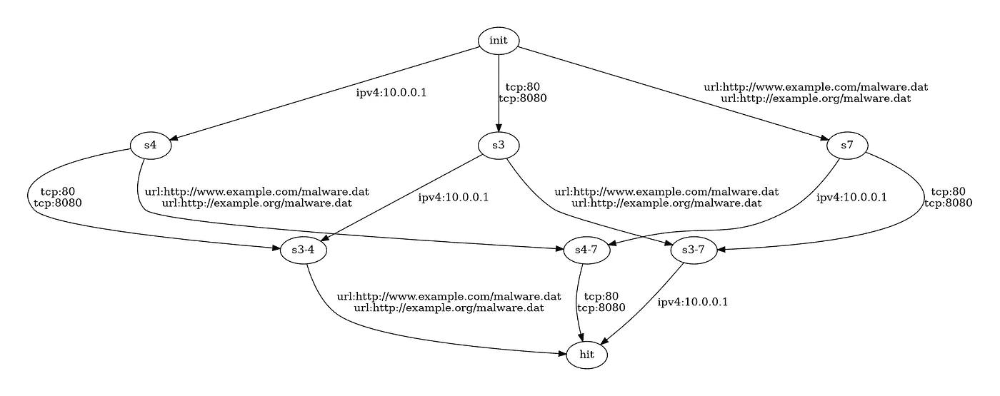
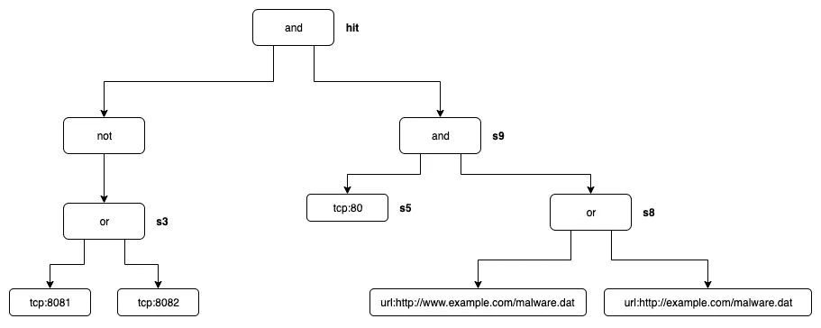
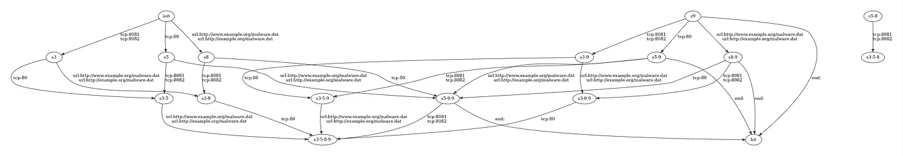
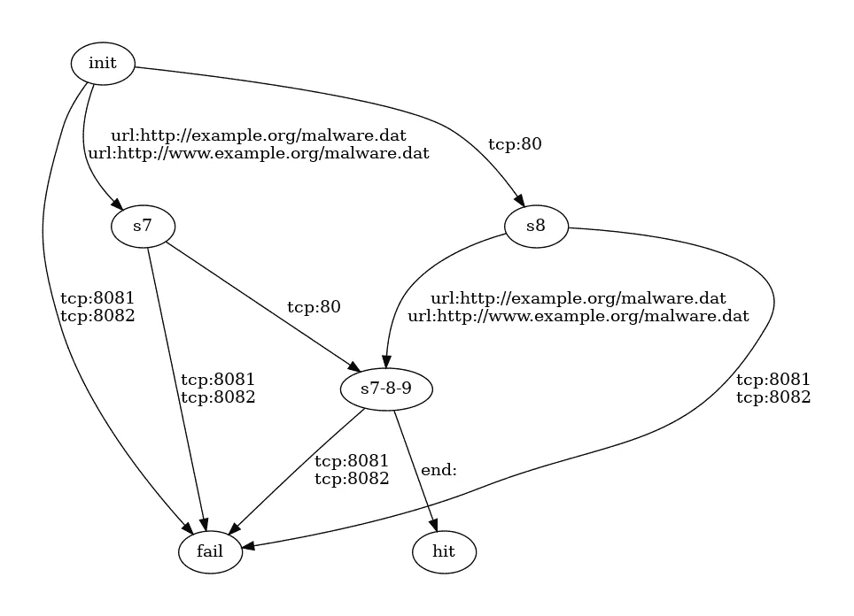
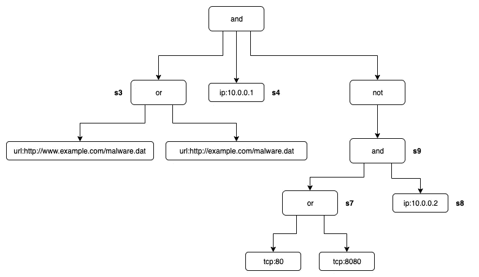
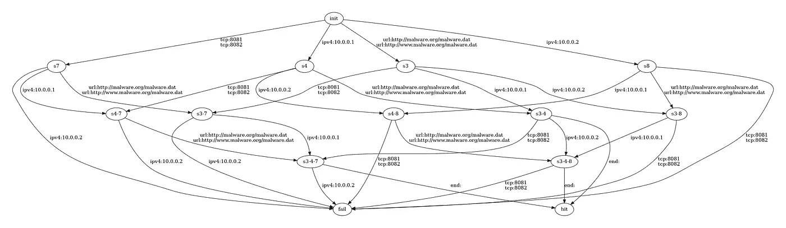
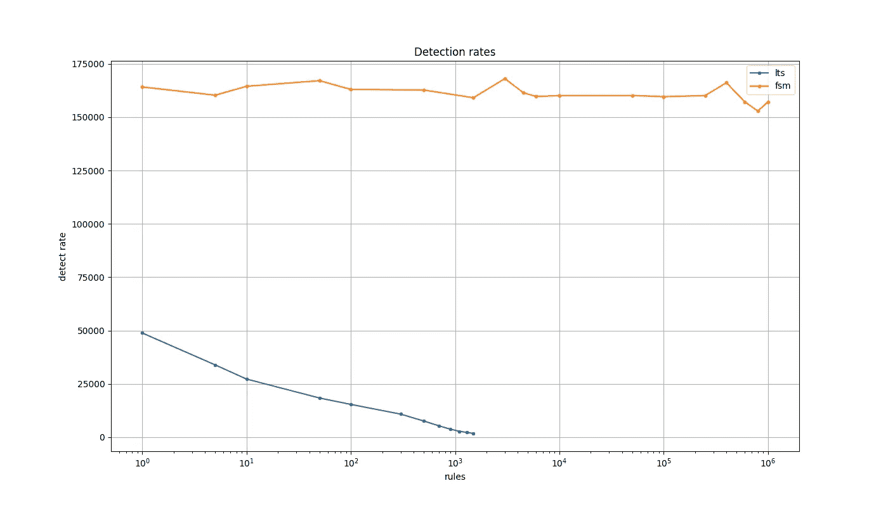

# 将布尔逻辑决策树转换为有限状态机

> 原文：<https://medium.com/analytics-vidhya/converting-boolean-logic-decision-trees-to-finite-state-machines-180ad195abf2?source=collection_archive---------3----------------------->

## 更简单、高性能地检测网络安全事件

在分析网络安全事件时，检测算法根据布尔表达式评估属性，以确定事件是否属于某个类别。本文描述了如何将布尔表达式转换为有限状态机，以实现更简单、更高性能的评估。

开源项目 Cyberprobe 以这种实现为特色。用 Python 实现了规则到有限状态机(FSM)的转换以及 FSM 形式的规则的应用。Cyberprobe 支持使用数百万条规则，这些规则可以在单个处理器内核上以每秒 20 万次以上的速度应用。

# **问题**

将布尔逻辑标准应用于事件解决了许多扫描和检测问题。例如，发生了一个事件，该事件是由与受保护的服务的交互产生的。该事件具有以下属性:

*   源地址:`123.123.123.123:14001`
*   目的地地址:`192.168.0.1:19001`
*   网址:`https://myservice.com/path1`

我试图检测的事物类别的一个或多个布尔表达式:

> 如果 TCP 端口号是 80 或 8080，IP 地址是 10.0.0.1，URL 是 http://www.example.com/malware.dat 或 http://example.com/malware.dat…

目的是对照一大组布尔表达式来分析这种事件的高速率流，以便对事件进行分类。

对于没有内置运算符优先级的英语，布尔表达式很快变得不可读。

# **布尔表达式**

布尔运算符表示为函数，`**type:value**`表示属性类型/值匹配项。

```
and(
    or(
        tcp:80, tcp:8080
    ),
    ipv4:10.0.0.1,
    or(
        url:http://www.example.com/malware.dat,
        url:http://example.com/malware.dat
    )
)
```

布尔表达式由、`**and(…)**`、`**or(…)**`和`**not(…)**`函数的组合以及`**type:value**`匹配项组成。我使用`**type:value**`对匹配术语，因为这在我工作的领域很有用，但是我们也可以很容易地使用字符串。

# **输入**

当评估事件的属性时，属性是`**type:value**`对。例如

```
ipv4:123.123.123.123
tcp:14001
ipv4:192.168.0.1
tcp:19001
url:https://myservice.com/path1
```

# 基本评估算法

使用`**type:value**`对输入评估布尔表达式的简单方法是将布尔表达式表示为一棵树，然后使用`**type:value**`对触发评估。观察值存储在树中。



根据事件评估布尔树的规则是:

*   对于每个`**type:value**`属性，查看布尔树中是否有对应的`**type:value**`项。如果存在，将 term node 设置为 true，并计算父节点。
*   在对父节点 ***或*** 求值时，当任一子节点为真时，则 ***或*** 节点为真，并对其父节点求值。
*   评估父节点 ***和*** 时，如果所有子节点都为真，则 ***和*** 节点为真，评估其父节点。
*   当评估一个父 ***非*** 节点时，当子节点为真时， ***非*** 节点为假。一旦所有属性的评估完成，如果一个 ***而不是*** 节点没有因为其子节点为假而被视为假，则它被评估为真，并且它的父节点被评估。

这是一个简单的算法。本文的重点是提供一种优化。

这里有一个折衷，将布尔树转换成 FSM 的算法是计算密集型的:它的复杂性与节点的数量成非线性关系:它与组合节点(如下所述)和`**type:value**`项的乘积成线性关系。在实际场景中，当规则被解析时，布尔表达式将被转换成 FSM，此后 FSM 可以被多次使用。

# 转换为有限状态机

## **第一步:识别“基本状态”**

为了找到 FSM，我们寻找布尔树中的所有节点，在这些节点中，随着评估的进行，需要观察状态。如果你看上面的例子，你可以看到 ***或*** 节点和 ***和*** 节点是不同的。 ***或*** 节点的子节点在被评估为真时立即导致其父节点为真，因此不需要保持关于 ***或*** 节点的子节点的状态。然而，当 ***和*** 节点的子节点为真时，这可能需要被存储用于以后的评估，以确定 ***和*** 节点可以被评估为真的点。

对 ***而非*** 节点的评估也是复杂的:一个 ***而非*** 节点可以被评估为真，因为它的子节点在分析期间保持假评估。

我们这里陈述的规则是，布尔树中的某些节点可以描述为 ***基本状态*** :

1.  树根本质上是一个`**hit**`状态，这意味着布尔表达式为真。这是一个基本状态。
2.  一个 ***非*** 节点永远不是一个 ***基本状态*** 。
3.  ***和*** 节点的子节点是基本状态，除非它是 ***而不是*** 节点。
4.  一个 ***非*** 节点的子节点是一个基本状态，除非它是一个 ***非*** 节点本身。

在上面的例子中，基本状态是两个 ***或*** 节点，以及`**ip:10.0.0.1**`节点。所有人都符合规则 3。

该实现给每个状态一个状态名，由字母 ***s*** 加上一个唯一的数字组成，以深度优先的方式分配。带有状态的布尔树示例如下所示； ***和*** 节点的三个子节点是给定的状态，父节点 ***和*** 代表命中状态。



## **第二步:识别“组合状态”**

基本状态是需要记录部分状态的节点。FSM 中的一个节点同时代表*所有*状态，即所有有效的基本状态组合。于是 ***组合状态*** 集合包含了 ***基本状态*** 的所有组合。这包括空集和所有状态的联合。

组合状态需要有一个状态名:在我的实现中，我通过排序将状态组合成一个名称，用一个前面带`**s**`的连字符分隔状态号。例如，状态`**s4**`、`**s7**`、`**s13**`的组合被称为`**s4–7-13**`。

空集有一个特殊的名字，我们称之为`**init**`。它表示 FSM 的初始状态，其中没有任何信息是已知的。

有一种特殊的状态`**hit**`,用于描述包括根节点评估为真的基本状态的任意组合。其他状态的组合被忽略。

在上面的例子中，组合状态集包括:

*   `**init**`:空集
*   `**s3**`:第一个 ***或*** 节点:
*   `**s4**`:节点`**ip:10.0.0.1**`
*   `**s7**`:第二个 ***或*** 节点
*   `**s3-4**`:第一个 ***或*** 节点和`**ip:10.0.0.1**`
*   `**s4-7**`***:***`**ip:10.0.0.1**`节点和第二个 ***或*** 节点
*   `**s3-7**`:第一个和第二个 ***或*** 节点
*   `**hit**` ***:*** 根节点

## **第三步:找到所有匹配项**

这是布尔表达式树中所有`**type:value**`匹配节点的集合。

## **步骤 4:查找所有转场**

这一步本质上是计算出所有的`**type:value**`匹配节点对所有的组合状态做了什么。有一个特殊的匹配术语，`**end:**`，用于评估术语列表完成时 ***而非*** 节点会发生什么。

算法是:

```
For every combination state:
    Work out the state name of that 'input' combination state
    For every match term:
        Given the input state
        What state results from evaluating that term as true?
        Work out the state name of that 'output' combination state
        Record a transition (input, match term, output)
    Given the input state
    What state results from evaluating end: as true?
    Work out the state name of that 'output' combination state
    Record a transition (input, end:, output)
```

对于这个分析，当整个布尔表达式评估为真时，即布尔表达式的根节点为真时，我们给它一个特殊的名称`**hit**`。

结果是一套完整的三元组: ***(输入，术语，输出)*** 。如果输入和输出状态相同，我们可以忽略转换，这样 FSM 只包含改变状态的边沿。

在这一点上，FSM 有一些低效之处:FSM 可能有一些区域无法从`**init**`导航到。这将在下一步中解决。

## **第五步:移除无效过渡**

不是所有的组合状态都可以从`**init**`到达，因此发现的一些转换可以作为不相关的被丢弃。

我们首先构建一组可以导航到`**hit**`的状态:

1.  创建一个仅包含组合状态`**hit**`的集合。
2.  迭代 FSM，添加导航到集合中任何状态的所有转换。
3.  重复 2。直到发现完整的状态集。

此时，我们知道了所有可能导致`**hit**`的状态。然而，将会有导致不在该集合中的状态的转变，因此永远不能行进到`**hit**`。因此，对无效转换的第一个简化是将所有不在这个集合中的转换减少到名为`**fail**`的单个状态。

FSM 还有第二个简化:有些状态从`**init**`开始就不可导航，可以删除:

1.  构造一个只包含`**init**`的集合。
2.  迭代 FSM，找到从集合中的任何状态都有导航的所有转换。
3.  重复 2。直到发现该组状态。

此时，我们知道了 FSM 中不可触及的区域，它们可以被移除。

## **合成有限状态机**

上述二叉树的有限状态机描述如下。`**init**`状态代表初始 FSM 状态。`**hit**`状态表示布尔表达式成功评估为真。我们已经提到了`**fail**`状态，该状态仅在使用 ***而非*** 表达式时出现，不会作为上述布尔表达式的结果出现。下面是一个例子。



## 使用有限状态机

使用 FSM 评估布尔表达式很简单:

*   FSM 在`**init**`状态下启动。
*   当发现属性时，将`**type:value**`与当前状态的转换进行比较。如果存在转换，则 FSM 进入新状态。
*   当达到`**hit**`状态时，这相当于布尔表达式评估为真。
*   当达到`**fail**`状态时，不需要进一步的属性发现，并且评估可以快速失败。

对于每一项，只需要一次 FSM 查找，这意味着这种方法具有性能优势。

# 示例 2:使用 not

对于本例，使用的是 ***而不是*** 节点:

```
and(
    not(
        or(
            tcp:8081, tcp:8082
        )
    ),
    and(
        tcp:80,
        or(
            url:http://www.example.com/malware.dat,
            url:http://example.com/malware.dat
        )
    )
)
```



在删除无效转换和发现故障状态之前查看此图是很有趣的。一些示例工件:

*   没有到仅由状态`**s9**`组成的组合状态的转换。这是因为在没有将`**s5**`和`**s8**`都评估为真的情况下，不可能达到这种状态。有从`**s9**`到 hit 的转换，但是没有通向`**s9**`状态的路径，所以它们永远不会被采用。
*   状态`**s5-8**`同样无效，如果`**s5**`和`**s8**`被评估为真，`**s9**`也为真。在这两种情况下，这个条件的有效状态都是`**s5-8-9**`。这导致具有两个节点的 FSM 的不可到达部分不与 FSM 的其余部分连接。
*   任何`**s3**`为真的状态都不能导致`**hit**`，因为根 ***和*** 节点必然为假。所有包含`**s3**`的节点都可以被替换为`**fail**`状态。



在移除无效转换和映射到失败状态之后，FSM 更容易理解:



这个例子说明了`**fail**`状态:一旦转换导致这个状态，就不可能有进一步的信息允许转换到`**hit**`状态。发现`**tcp:8081**`或`**tcp:8082**`处于任何状态都会导致转换到`**fail**`状态。根据您的分析策略，失败状态可能是有用的:它可能是快速失败和进一步评估的捷径。该示例还说明了导致`**hit**`的特殊`**end:**`术语。

# 示例 3:更多状态

由于所有的 ***和*** 条件，这个例子需要保存更多的状态。

```
and(
    or(
         url:http://www.example.com/malware.dat,
         url:http://example.com/malware.dat
    ),
    ipv4:10.0.0.1,
    not(
        and(
            or(
                tcp:8081,
                tcp:8082
            ),
            ipv4:10.0.0.2
        )
    )
)
```



结果得到的 FSM 具有许多状态:



# 同时评估多个规则

FSM 模型有助于使用大量规则进行高性能扫描，每个规则都使用上述方法转换为 FSM。虽然理论上可以从单个 FSM 制造出超精细 FSM，但是 FSM 的尺寸很快变得难以控制。因为对于该组有贡献的 FSM 中的每个状态组合，在超级 FSM 中需要有单个状态。

然而，同时跟踪大量的 FSM 状态可能是计算密集型的。

一种简单的评估方法是识别一组 ***启动器*** ，它们是每个 FSM 中脱离`**init**`状态的一组项。如果在分析属性时检测到任何启动器，则相应的 FSM 将被激活，并放在 FSM 集上，在随后的匹配项评估中跟踪该 FSM 集的状态变化。这种方法减少了需要跟踪的 FSM 的数量。我发现在实践中，这导致了用于评估的一小组 FSM。

使用这种方法，使 FSM 快速失效并将其从被跟踪的 FSM 集合中移除是不合适的；必须跟踪 FSM 到故障状态，以防止 FSM 随后被重新激活。

# 实施:网络调查指标

cyberprobe 项目包括一个以 JSON 格式编写规则的方法[。有许多实用程序可以解析规则格式并输出 FSM 信息，例如`**indicators-show-fsm**`获取一个规则/指示器文件并转储文件中每个规则的 FSM。这是以人类可读的形式显示状态转换的输出:](https://cybermaggedon.github.io/cyberprobe-docs/cyberprobe.html#Cyberprobe-indicator-format)

```
[indicators]$ **indicators-show-fsm case1.json** 
3ce77704-abe4–4527–84e6-ed6a745aebcf: URL of a page serving malware
 init — tcp:8080 -> s6
 init — tcp:80 -> s6
 init — url:http://example.org/malware.dat -> s3
 init — url:http://www.example.org/malware.dat -> s3
 s3 — tcp:8080 -> hit
 s3 — tcp:80 -> hit
 s6 — url:http://example.org/malware.dat -> hit
 s6 — url:http://www.example.org/malware.dat -> hit
```

`**indicators-graph-fsm**`是一个实用程序，它接受一个规则/指示器文件和一个规则 ID，并输出一个描述 FSM 的 Graphviz 格式的图，这就是我如何生成本文中的图:

```
[indicators]$ **indicators-graph-fsm case1.json \
    3ce77704-abe4–4527–84e6-ed6a745aebcf > graph.dot**
[indicators]$ **dot -Tpng graph.dot > graph.png**
```

`**indicators-dump-fsm**`是一个获取指示器文件并以 JSON 格式输出 FSM 的实用程序。

您可以使用`[**cyberprobe.fsm_extract**](https://github.com/cybermaggedon/cyberprobe/blob/master/indicators/cyberprobe/fsm_extract.py)`模块在代码中嵌入 FSM 转换:

```
#!/usr/bin/env python3import sys
import cyberprobe.fsm_extract as fsme
from cyberprobe.logictree import And, Or, Not, Matchexpression = And([
    Or([
        Match("tcp", "80"), Match("tcp", "8080")
    ]),
    Match("ipv4", "10.0.0.1"),
    Or([
        Match("url", "[http://www.example.com/malware.dat](http://www.example.com/malware.dat)"),
        Match("url", "http:/example.com/malware.dat")
    ])
])fsm = fsme.extract(expression)# Dump out FSM
for v in fsm:
    for w in v[1]:
        print("  %s -- %s:%s -> %s" % (v[0], w[0], w[1], v[2]))
```

# 简单说一下性能

为了对我的算法进行基准测试，我将 FSM 方法的性能与上面“基本算法”中讨论的基本布尔树算法进行了比较，两者都用 Python 进行了编码。下图以使用中的规则数为 x 轴，以事件处理率为 y 轴。这是显示正在使用的规则数量如何影响事件吞吐量的一种方式。橙色线代表 FSM 的性能。您可以看到，使用的规则数量对算法吞吐量的影响非常小。注意 x 轴上的对数刻度。

这是在我的旧 MacBook 上的 VirtualBox 上运行的，例如，期望从云虚拟机获得更好的性能。

这是对性能的一个快速浏览，也许我会在后面写一篇关于性能的后续文章。



# 结论

在本文中，我讨论了:

*   布尔表达式如何表示为树
*   将布尔表达式映射到有限状态机
*   FSM 的使用如何简化检测逻辑并实现性能优势
*   如何使用多个有限状态机计算并发布尔表达式
*   FSM 方法在开源 cyberprobe 项目中实现