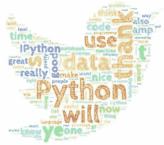

# 将 WhatsApp 聊天数据转换为单词云| Python |简单方法

> 原文：<https://medium.com/analytics-vidhya/converting-whatsapp-chat-data-into-a-word-cloud-python-simple-way-1f003b03f5f9?source=collection_archive---------10----------------------->



我在学习熊猫及其应用时，偶然发现了 python 中的 word cloud 模块。

在我们继续之前，我想浏览一下我们将使用的模块，即 pandas、matplotlib 和 word cloud。

所以， **pandas** 是一个为 Python 编程语言编写的软件库，用于数据操作和分析。

**matplotlib** 。 **pyplot** 是使 **matplotlib** 像 MATLAB 一样工作的函数集合。

MATLAB 用于在一个易于使用的环境中集成计算、可视化和编程。

**单词云**或标签云是一种数据可视化技术，用于表示文本数据，其中每个单词的大小表明其频率或重要性。

**停用词**是对句子没有多大意义的英语单词。它们可以被安全地忽略，而不会牺牲句子的意义。例如，像 the，he，have 等这样的词。

现在，让我们开始吧。

**1)导出 WhatsApp 聊天**

当我这样做的时候，我得到了一个. txt 文件。

(WhatsAppChat.txt)

2)转换。txt 文件到。csv 文件

为了做到这一点，我用了熊猫。

首先，我在我的计划中引进了熊猫。然后，我创建了一个数据帧来读取。txt 文件。的。txt 文件没有像。csv 文件。

```
import pandas as pddf=pd.read_csv(r”WhatsAppChat.txt”,header=None,error_bad_lines=False,encoding=’utf8’)
```

然后，我将数据分成列，方法是将它们分开并给每一列一个名称。聊天文件中数据集的第一行包含加密细节，这里不需要。所以，我在数据集中删除了那条线。然后，我将剩下的两个部分命名为 Date 和 Convo，两个部分都用逗号分隔，即“，”。

```
df= df.drop(0)
 df.columns=['Date', 'Convo']
```

现在，我将 Convo 数据集分为“时间”和“内容”两列，两列之间用连字符分隔，即“-”。Convo 列中的数据被制成一个数据帧 **Chat。**

```
Chat = df[“Convo”].str.split(“-“, n=1, expand=True)df[‘Time’] = Chat[0]df[‘Content’] = Chat[1]
```

内容列被创建到另一个数据集 **Chat1** 中，以将其进一步分成两列，“用户”和“消息”，两列都用冒号分隔，即“:”。

```
Chat1 = df[“Content”].str.split(“:”, n=1, expand=True)df[‘User’] = Chat1[0]df[‘Message’] = Chat1[1]
```

现在，删除 Convo 列并将 Message 列转换为小写。所有列媒体省略的单元格和删除的消息都被替换为字符串“媒体共享”和“删除的消息”。

```
df=df.drop(columns=[‘Convo’])df[‘Message’] = df[‘Message’].str.lower()df[‘Message’]=df[‘Message’].str.replace(‘<media omitted>’, ’Media Shared’)df[‘Message’] = df[‘Message’].str.replace(‘this message was deleted’, ’DeletedMsg’)
```

最后，将数据帧转换为名为“new_csv.csv”的. csv 文件。

```
df.to_csv(“new_csv.csv”,index=False)
```

**万岁！！！**

最后，。txt 被转换成。csv 文件。

**下一步**:

**3)使用转换后的。csv 聊天文件做一个文字云。**

为此我们需要 word cloud 和 matplotlib.plyplot 包。

首先，我导入了数据可视化和从聊天文件创建单词云所必需的包。

(附:确保你已经安装了它们。您可以使用“pip install <package name="">”命令来完成。)</package>

```
import   matplotlib.plyplot as mplfrom worcloud import WordCloud,STOPWORDS
```

我使用 new_csv.csv 文件从其中读取数据并创建数据框。

我创建了一组停用词和一个变量来存储 WordCloud 函数生成的所有数据。我从包含所有聊天文本的消息列中提取数据，并将其转换为小写字符串。

```
df1=pd.read_csv(“new_csv.csv”)stopwords=set(STOPWORDS)words=’’.join(df1.Message.astype(str)).lower()wordcloud=WordCloud(stopwords=stopwords, min_font_size=10,background_color=’white’,   width=800,height=800,color_func=random_color_func).generate(words)
```

在这里，我创建了一个名为“random_color_func”的函数，用来给单词渲染随机的橙色。这是通过更改 hsl(色调、饱和度、亮度)值来实现的。

```
def random_color_func(word=None, font_size=None, position=None,  orientation=None, font_path=None, random_state=None):h = int(360.0 * 21.0 / 255.0)s = int(100.0 * 255.0 / 255.0)l = int(100.0 * float(random_state.randint(60, 120)) / 255.0)
```

然后，我用 mpl 对 wordcloud 变量中的单词进行了绘图和可视化。

```
mpl.figure(figsize=(8,8),facecolor=None)mpl.imshow(wordcloud, interpolation="bilinear")mpl.axis("off")mpl.tight_layout(pad=0)mpl.show()
```


WordCloud 已生成。耶耶耶！！！

完整的代码如下:

```
import pandas as pdimport matplotlib.plyplot as mplfrom worcloud import WordCloud,STOPWORDSdf=pd.read_csv(r”WhatsAppChat.txt”,header=None,error_bad_lines=False,encoding=’utf8’)df= df.drop(0)
 df.columns=['Date', 'Convo']Chat = df[“Convo”].str.split(“-“, n=1, expand=True)df[‘Time’] = Chat[0]df[‘Content’] = Chat[1]Chat1 = df[“Content”].str.split(“:”, n=1, expand=True)df[‘User’] = Chat1[0]df[‘Message’] = Chat1[1]df=df.drop(columns=[‘Convo’])df[‘Message’] = df[‘Message’].str.lower()df[‘Message’]=df[‘Message’].str.replace(‘<media omitted>’, ’Media Shared’)df[‘Message’] = df[‘Message’].str.replace(‘this message was deleted’, ’DeletedMsg’)df.to_csv(“new_csv.csv”,index=False)def random_color_func(word=None, font_size=None, position=None,  orientation=None, font_path=None, random_state=None):h = int(360.0 * 21.0 / 255.0)s = int(100.0 * 255.0 / 255.0)l = int(100.0 * float(random_state.randint(60, 120)) / 255.0)df1=pd.read_csv(“new_csv.csv”)stopwords=set(STOPWORDS)words=’’.join(df1.Message.astype(str)).lower()wordcloud=WordCloud(stopwords=stopwords, min_font_size=10,background_color=’white’, width=800,height=800,color_func=random_color_func).generate(words)mpl.figure(figsize=(8,8),facecolor=None)mpl.imshow(wordcloud,interpolation="bilinear")mpl.axis("off")mpl.tight_layout(pad=0)mpl.show()
```

感谢阅读。给一个👏如果你喜欢的话。

[**我也会很快在 GeeksforGeeks**](https://www.geeksforgeeks.org/) 上发表

**< >同♥.**