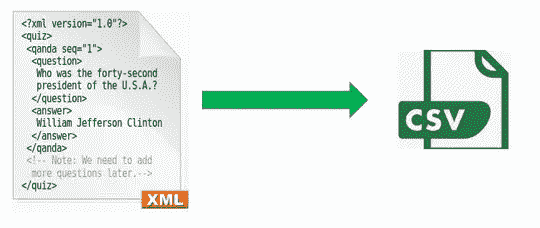
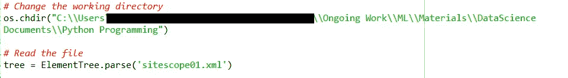
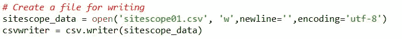
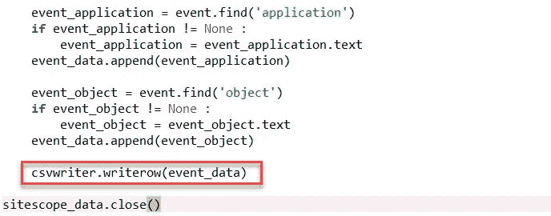
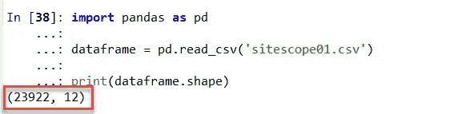

# 使用 Python 将 XML 数据转换为 CSV 格式

> 原文：<https://medium.com/analytics-vidhya/converting-xml-data-to-csv-format-using-python-3ea09fa18d38?source=collection_archive---------0----------------------->

我遇到了将 XML 数据转换成 CSV 格式的需求。XML 数据的来源是 MF Sitescope 产品创建的档案。sitescope 产品是一款无代理监控软件，可远程监控系统、应用程序和数据库的运行状况。在监控过程中，站点范围会产生大量的事件。历史事件定期存档。存档的事件可以以 XML 格式导出。对于我的数据分析之旅，我想将 XML 数据转换成 CSV 格式。这里我使用 python 脚本来完成。

1.  导入必要的 python 库。

2.更改工作目录并读取 xml 文件。

3.创建一个输出 csv 文件，用于写入从 xml 文件中提取的内容。

4.创建列名列表，并将其写入 csv 文件。这是标题行。

5.现在创建 xml 树的根对象。xml 转储有大量的事件，对于每个事件，我想提取一个重要的属性，如事件标题、描述、状态、解决方案、严重性、事件创建时间等。这是通过下面的代码片段实现的。

该代码检查提取的字段是否为 None，并将提取的数据追加到列表中。

提取完成后，列表将被写入 csv 文件，如下所示。同时关闭文件描述符。

6.让我们导入 pandas 库并读取 csv 文件。

这是输出。我们有 23，922 个警报，每个警报有 12 个属性。

我会让你了解分析的下一步。