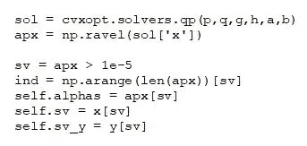
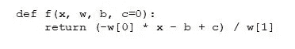

# 凸优化和 SVM(支持向量机)

> 原文：<https://medium.com/analytics-vidhya/convex-optimization-and-svm-support-vector-machines-cdeeed3a7e85?source=collection_archive---------13----------------------->

SVM 在机器学习领域并不是一个新名字。从初学者到专业人士，每个人都是这个分类模块的粉丝。由于其广泛的拟合模块和灵活性，它在一些机器学习爱好者和数据科学家的心中占据统治地位。但是等等，你知道里面发生了什么吗？

好的，我将向你展示如何编码 SVM。有大量的视频和网站展示了 SVM 运行背后的复杂数学。这很复杂，对吗？嗯，我们会考虑的……

**知道模块吗？？**

在对 SVM 代码进行建模时，需要考虑一些重要的模块。可以有更多的模块。这取决于你如何创造性地为自己编写代码。你越有创造力，你的实现就变得越有效率和漂亮。这是我的方法。

在这里，我为方法的构思实现了“cvxopt”。cvxopt 代表“凸优化”。这是 SVM 用来解决朗格朗问题的方法之一。这让工作变得更容易。其余的对你来说很明显…

**让我们来定义这个类**

好的，从数据集中获取特征是对 SVM 代码建模的最重要的部分。机器学习中的一切都是在数据集和特征上进行的。所以取特征，提取重要特征(*就是所有的特征和样本！我们可以计算 SVM 的数学。*

SVM 致力于内核化的原则。SVM 类中定义了一些内核方法，这使得 SVM 更容易从特定数据集的角度根据最接近的拟合方法对自身进行建模。我认为有必要用一些数学实例来说明我为什么要这么做。

**一些数学……**

这是我们将在博客中实现的二次规划(QP)的标准形式。CVXOPT QP 框架通过参数{ *P，q，G，h，A，b* }，期望出现上述形式的问题；p 和 q 是必需的，其他是可选的。那么，在编程方面如何申请呢？

现在，既然我们已经定义了程序参数，我们必须求解生成的方程，因此我们需要某种解算器来求解方程。(*机械笑话:这就像 ANSYS，你会神奇地得到所有问题的解决方案！*)。几个函数作为解算器工作。在 [cvxopt 文档](http://cvxopt.org/documentation/)中描述了一个完整的列表。但是为了本教程的方便，我将实现简单的“QP”(二次规划)。

**选择边界和其他参数…**

同样的解决方案将以 python 字典的形式出现，根据我们想要做的工作，有许多选项可供选择。因为我们正在实现 SVM，所以我们将从字典中选择“X”。现在，使用 NumPy 'ravel '函数，我将制作一个解的线性矩阵。

**偏差和权重…**

现在，您必须知道 SVM 定义中使用的基本函数。现在应该很明显了。如果你不记得了，那么请在这里投入一些时间[。我保证你不会后悔的。](https://www.youtube.com/watch?v=lDwow4aOrtg&ab_channel=stanfordonline)

在这里，我们已经实例化了要使用的整个类的权重和偏差。偏差和权重的使用在 SVM 研究中很普遍，因为我们必须注意数据集和噪声，否则，可能会因为“欠拟合”或“过拟合”而出现反弹。基于这些参数，我们已经定义了这些参数，并在一个循环中更新了它们。

**预测功能**

现在，最重要的功能。“预测”函数被定义用于获得“SVM”中的类，因此需要显示函数的符号。请记住，我们实现的是一个双变量类，因此将只考虑类的'+1 '和'-1 '。

**f 功能**

不是*俚语*！这是视觉化的功能。SVM 的成功也离不开视觉视角。显然，使用算法指出它…

**测试阶段…**

现在，一切都做好了。让我们运行这个软件，看看我们如何理解分类算法。

使用“make_blobs”函数准备模型数据集。因为我们是为'+1 '和'-1 '类生成的，所以让我们基于相同的来准备模型。到目前为止，我们已经定义了确定精确度的模型。好吧，让我们想象一下。

这些是实施 SVM 的最后步骤。让我们看看结果。

**结果**

好吧，我不打算展示它。自己试试，搜索更好的答案。谁知道呢，也许你就是下一个数据科学明星。也许就在今天，你会接到“霍马”的电话？干杯！

如果你需要完整的代码，请访问[这个地方](https://colab.research.google.com/drive/1-qD31Af9AZOKGtyviDtieaBoIrUHdfLU?usp=sharing)。