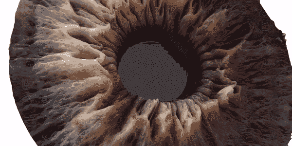

# 卷积神经网络 101

> 原文：<https://medium.com/analytics-vidhya/convolution-neural-network-101-56d63e286c68?source=collection_archive---------17----------------------->

卷积神经网络(CNN，ConvNet)是一类用于分析视觉图像的深度前馈人工神经网络。图像是高维向量，需要大量参数来表征神经网络。

为了解决这个问题，卷积神经网络被提出来减少参数的数量和适应网络结构