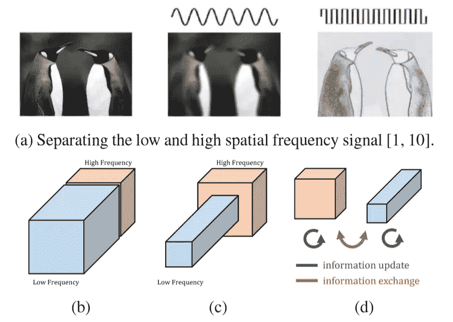
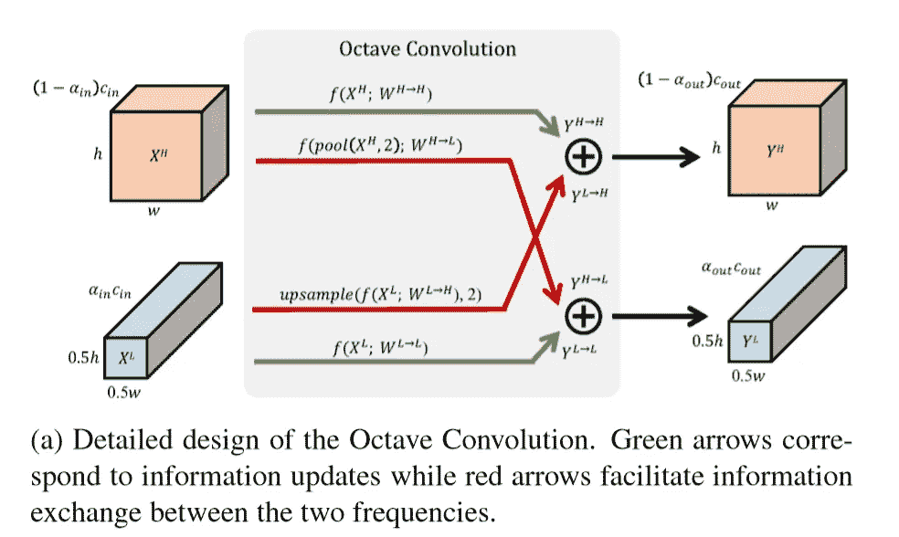

# 卷积旋转- OctConv

> 原文：<https://medium.com/analytics-vidhya/convolution-revolution-octconv-d96a957b1d7?source=collection_archive---------12----------------------->

来源:https://arxiv.org/abs/1904.05049

看图像时，人们先看到轮廓，然后才看到细节。传统卷积层的替代物基于粗糙和精细特征之间的这种区别来分解图像。

## 新功能:

新加坡国立大学脸书 AI 和易图科技的研究人员设计了 [OctConv](https://www.google.com/url?q=https%3A%2F%2Finfo.deeplearning.ai%2Fe2t%2Fc%2F*W4gF4vS1z-DbcN196QJqb9SsF0%2F*W6f7NdR8Wc3rZW2Dbxh-7fB4dR0%2F5%2Ff18dQhb0SbTL8XJblHN7fK6lMHyjJqW8q-qpC3MPfv6W3hHhcV2P7_nXVcnTGj98kKZ3W5CGRMX2yZ4kcW2Jzhfd5v0wL-Vf6nlP5wTCNBW6PVKcr6N3nBLN8xGZKNYFgMgVdr-4p7lPpn4W523krd5ZpycSW57-ZBT83C5JPW1Z6f6D83KHrFW7J3nFC2-kz7vW9dH8_66V4mf7W52pPPT8QKpyrW4sj3hV2BcyM9W1mGWjz1c6JlkMdnLJw3knpcW8pHdxD5CF1LZW4Dctlz6b7DQmVPrbkw5cZf-YW2gQRXL42lJLCW2n_XMf8K5hPtW5bZMll5d0JS-W41l8V42BZCyjN37dQQrbHtD7W3MSx4T3JVS-JW4qVhMX4WpYJWW4L3zb936vKwxW6bC-D83B3lprW1nlHW119bNv6W7-82637qqL2jW53NYtc4PLwTVW7pNRTb6Mrx_QW6pzHwr1jr3pWW1L6_pX1km2KyW14-PqX8mQCt3Vd8rw02-XBLjW7s5Psd4DxB3xW5-5RQp7QRm5RW1HMgbR6wc1jVN64kTPzrVprCW56gBW-6tGqRFf3Gk2R804&sa=D&sntz=1&usg=AFQjCNFhaCeBK9rAwkake2zkO2m9ZwpRjw) 、**一种卷积滤波器，可以在不降低性能的情况下降低图像处理网络的计算成本和内存占用** 。

## 关键见解:

彭云·陈和他的合作者从信号处理中获得了灵感:音频信号可以表示为一组离散的频率，而不是单一的波形。类似地，可以说一幅图像包含的低频信息在空间上不会发生很大变化，而高频图像会发生很大变化。低频图像特征是形状，而高频图像特征包括纹理等细节。通过分别捕获它们，OctConv 可以减少冗余信息。

## **工作原理:**

卷积图层的隐藏单元的输出是保存 2D 空间信息的要素地图。特征图通常会对图像颜色通道中的冗余信息进行编码。OctConv 通过使用频率通道表示而不是通常的颜色通道表示来减少冗余。

来源:[https://arxiv.org/abs/1904.05049](https://arxiv.org/abs/1904.05049)

*   在 OctConv 中，卷积层的每个通道编码低频或高频数据。低频通道对特征图进行下采样，而高频通道保持特征图的原始分辨率。用户定义的参数控制低频与高频通道的比率。
*   独立的分辨率滤波器在高频和低频通道之间共享信息。四个滤波器负责通道输入和输出的所有组合。虽然这种安排可能需要四倍于标准卷积层的参数，但低频通道具有 50%的分辨率，因此总参数较少。

## **结果:**

*使用 OctConv 而不是 CNN 过滤器的 ResNet-152 在 ImageNet 上比第二好的模型精确 0.2%，在测试期间计算量减少 15%。在 Kinetics-600 上，带有 OctConv 过滤器的 I3D 模型对的准确性提高了 2%，而计算量减少了 10%。*

## **为什么重要:**

OctConv 滤波器可以取代标准卷积滤波器，实现更好的性能、更低的计算量和更小的尺寸。作者建议在低频和高频方案之外进行细分。这将在规模和训练时间上产生更大的节约，但它对性能的影响是进一步实验的主题。

## **外卖:**

内存压缩和修剪技术对于在智能手机和其他低功耗、低内存设备上部署神经网络非常重要。OctConv 是一种新的缩小图像处理网络的方法，它考虑了内存和计算原语。

## 代码:

 [## SSusantAchary/OctaveConv _ py torch

### 这是以下文章的第三个奇偶校验实现(非官方)。降一个八度:减少空间冗余…

github.com](https://github.com/SSusantAchary/OctaveConv_pytorch) 

请鼓掌，喜欢就分享；更多信息的评论

继续探索(_/\_)。

如果喜欢:-)