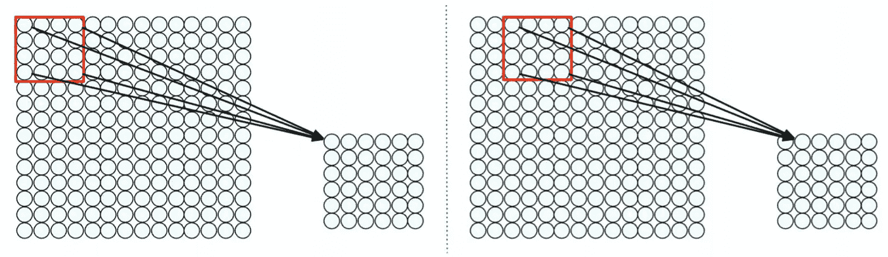

# 卷积神经网络——非正式介绍(一)

> 原文：<https://medium.com/analytics-vidhya/convolutional-neural-network-an-informal-intro-part-1-db9fca86a750?source=collection_archive---------13----------------------->

[http://introtodeeplearning.com/](http://introtodeeplearning.com/)

卷积神经网络(又名 CNN)已经成为图像分类和检测的实际应用。像 PyTorch 和 TensorFlow 这样的机器学习框架提供了快速构建 CNN 的便利手段。因此，我们不太可能需要完全从零开始一个 CNN 项目，因为已经存在公开的 CNN 架构，如(AlextNet，VGG16，Darknet19 等)。)可以容易地适用于图像分类和检测项目。然而，当我们需要处理任何图像分类和检测任务时，很好地理解 CNN 是如何工作的是很重要的。

# 全连接网络

图 1:图像分类任务(【http://introtodeeplearning.com/】T2

图像分类的目的是根据图像的基本特征，将由 2D(灰度)或 3D (RGB)像素阵列表示的图像分类到特定的组中。

通过将像素阵列转换成其相应的向量，可以使用普通的全连接网络来执行分类任务。全连接网络的示例如图 2 所示。第一层节点是输入(像素向量)，最后一层是输出。中间层被称为“隐藏层”，用于提取特征。

图 2:一个全连接的网络(【http://introtodeeplearning.com/】T4)

当使用全连接网络来分类图像时，存在两个主要问题:

1-没有像素的空间信息输入到网络中。通常，像素的位置携带重要信息(例如眼睛靠近鼻子)。

2-可训练参数过多。如果所有像素都连接到隐藏层中的所有节点，则要学习的权重数量太多。

因此，提出了一种基于滤波器的方法来捕获输入中的空间结构。

# 盘旋

图 3:卷积运算([http://introtodeeplearning.com/](http://introtodeeplearning.com/))

想法是有一个滑动窗口(例如。图 3 中的 4 乘 4)来将一片输入连接到后续层中的单个神经元。滑动窗口在输入层上移动给定的步幅(例如图 3 中的 2 个像素)以获得如图 3 所示的后续层中的结果神经元。

补丁操作(通过滑动窗口在输入补丁上)被称为“卷积”,它对输出进行逐元素乘法和求和。滑动窗口被称为“内核”或“过滤器”。图 4 给出了一个示例。

图 4:卷积运算的图示(3 乘 3 滤波器和 1 个像素的步距)([https://giphy.com/explore/convolution](https://giphy.com/explore/convolution))

与卷积相关的另一个关键方面是零填充。这里的想法是通过添加零值的额外像素来允许对边缘像素进行适当的卷积操作。

图 5:1 像素零填充卷积

通过了解滤波器(或内核)大小、步幅和填充，输出特征的大小由下式给出:

图 6:输出大小的计算

# 池化—最大值和平均值

输出要素地图的大小可能非常大，因此最好在保留空间信息的同时缩小比例。这可以通过合用来实现。池的思想非常简单，如图 7 所示。有两种类型的池，即:平均和最大。

图 7:池层(【http://introtodeeplearning.com/】T2

# 多通道—输入和输出

上述卷积运算的描述和说明仅针对 1 个输入映射和 1 个过滤器。但是，在使用 CNN 时，输入地图可以有多个频道(例如彩色(RGB)图像有 3 个通道)，输出也是如此。

要处理像 RGB 图像这样的多通道输入，滤镜必须是 3D 的(例如 3 乘 3 乘 3)，如图 8 所示。本质上，输入通道的数量等于滤波器的深度。

图 8:卷上的卷积(【https://www.youtube.com/watch?v=KTB_OFoAQcc】T4)

要生成多个输出要素地图，需要多个过滤器。这如图 9 所示。

图 9:多个 3D 滤镜([https://www.youtube.com/watch?v=KTB_OFoAQcc](https://www.youtube.com/watch?v=KTB_OFoAQcc))

下面是一个 Conv 图层的演示，其中 K = 2 个过滤器，每个过滤器的空间范围 F = 3，以步幅 S = 2 移动，输入填充 P = 1。

图 10:多个输入通道和滤波器的演示(CS231 注释)

# 卷积神经网络

到目前为止，我们已经解释和说明了 CNN 的关键组件。现在我们准备看看 CNN 的全貌。

CNN 在计算机视觉方面的成功在于使用了过滤器或(内核)。过滤器从输入图像中提取感兴趣的特征。下面是一些提取某些特征的内核列表。

图 11:图像处理中的一些示例内核

不可能手动设计滤波器来提取用于图像分类和检测任务的特征。CNN 的主要思想是从数据集中学习特征表示(过滤器)。所以过滤器是可训练的重量。CNN 中过滤器的使用可以总结在图 12 中。

图 12:应用过滤器提取特征

如图 13 所示，有 3 个级别的特性——低、中和高。CNN 的浅层捕捉高级特征(例如垂直/水平边缘、结构)。中间层提取中级特征。而深层则专注于人眼无法理解的低级特征。最终的特征图通常被输入到分类器(SVM，MLP 用于分类任务)或检测器(Yolo，用于对象检测任务)。

图 13:特性的层次结构([http://introtodeeplearning.com/](http://introtodeeplearning.com/))

简而言之，CNN 通过一系列特征提取卷积层和池层学习分类或检测，然后是如图 14 所示的分类器/检测器。

图 14:典型的 CNN 架构

# 总结

在这篇文章中，我们已经介绍了 CNN 的基本概念，这是卷积神经网络的第一部分——一个非正式的介绍系列。在下一篇文章中，我们将探索现代 CNN 架构，如剩余网络、网络中的网络、批量标准化。此外，我们将介绍 Darknet-19 的 PyTorch 实现。