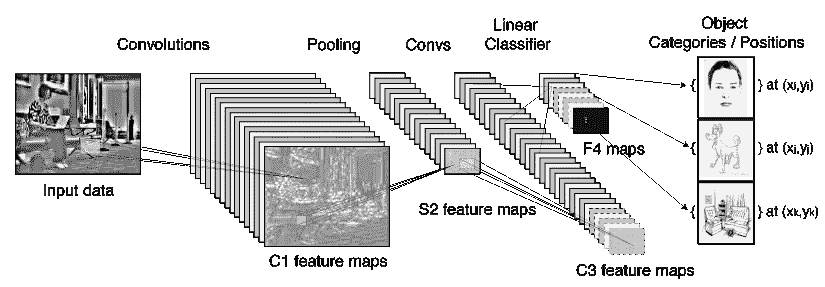

# 卷积神经网络——动态阅读

> 原文：<https://medium.com/analytics-vidhya/convolutional-neural-network-an-on-the-go-read-c1d279ac07ff?source=collection_archive---------27----------------------->

随着最近许多有趣的计算机视觉项目的出现，有一种内在的需要去理解这些项目下的模型是如何工作的。为了触及这些项目的基础，我将谈论卷积神经网络或 CNN，它是一种多层神经网络，具有特殊的架构来检测数据中的复杂特征。CNN 已经用于图像识别，增强现实项目，当然还有你的特斯拉！

# 卷积是什么意思？

卷积是这样一个过程，先用一点数学知识将输入图像的一小块转换成输出图像的一个像素，然后对输入图像的每个区域重复这一过程。

然后，输入到模型中的图片被分成数字行和数字列。它可以被称为矩阵。这些数字是在矩阵的特定部分测量特定颜色的强度。图片有一定的宽度、高度和深度，深度通常为 3，对应于红色、绿色和蓝色(RGB)。

如图所示，CNN 有以下几层:(如果你感兴趣的话)

*   ReLU 层
*   池层(使用固定函数转换激活)
*   Conv 层(有需要训练的重量)
*   全连接层

然后你可以查看这个图像的一小块，并检查小块中一条线的垂直**强度(或锐度)。如果 10x10 像素的小块是由尖锐的垂直线组成的，我们将赋予它一个高值。我们采取自下而上的方法，因此，我们通过将我们的发现组合在一起并检查它们的强度来迭代。因此，我们然后检查作为一个整体的垂直线**的**强度的补丁。重复这个过程，直到我们**覆盖整个图像**。类似地，其他属性——如平滑度、色彩强度、密度——也可以用同样的方法来覆盖。**

初始图像可能有 3 个通道(RGB ),随着图像复杂性的增加，下一层可能有更多的层。因此，最好只检查一个小区域。

注意，这仅针对一层的**进行。随着我们进一步深入，图像会根据我们在第一层的发现进行更深入的处理。我们继续发现这幅画的更多方面，直到我们能够认识这幅画的全貌。这将使我们能够在图像识别模型中识别整个图像。**

# 那有什么大不了的？

作为人类，挑战在于找出图像中要探索的方面。例如，在一张猫的图片中，就垂直线和水平线而言，什么属性会构成一只猫？

通过猫的脸、瞳孔距离和面部结构得出多条线并不难——但是你如何为它编写大量代码呢？

这就是神经网络发挥作用的地方。你向神经网络提供一些描述，并在此基础上——它提出问题并得出结论。你给网络看一张你已经知道它包含什么的图片，然后你要求网络找出它是什么。基于概率—神经网络可能会得出该图片的特定属性。当这种情况发生时，你会修改进入你个人问题的数学，使之更有信心，而当它出错时，你会降低信心。你重复这个几百万次，最终，这个描述可能会被塑造成一个垂直线检测器，或者如果它在后面的层中，它可能会变成一个“平滑”检测器。

任何碰巧对手头的任务有用的特征最终都会被学习，这意味着你不再需要人类来确定你需要在图像中寻找什么，而不是如何寻找它们。这意味着我们可以拥有一个 200+层的网络，而不是手写几层来检测简单的东西！