# 卷积神经网络:基本概念

> 原文：<https://medium.com/analytics-vidhya/convolutional-neural-network-basis-concepts-e059a76d9161?source=collection_archive---------23----------------------->

在这篇文章中，我们将基于神经网络的背景知识，探索什么是 CNN。在继续之前，我建议您学习一些神经网络的基本术语以及它们是如何工作的。

我会试着用通俗的语言解释这些概念。我们会慢慢建立我们的知识库。相信我，如果你对计算机视觉感兴趣，你不会想只是一个工程师，拿着预定义的代码，运行模型，然后就完事了。我们是深度学习工程师。

> 如果你在火箭飞船上得到一个座位，不要问是什么座位！上车吧。

准备好了吗？让我们跳进来。

卷积神经网络与普通神经网络非常相似。

1.神经元接收一些输入

2.执行点积

3.以非线性跟随它

完整的网络表达了一个单一的可微得分函数。

**那么为什么不使用普通的神经网络呢？**

这类问题中使用的图像通常是 224x224 或更大的尺寸。想象一下，建立一个神经网络来处理 224x224 彩色图像。那将是

224 * 224 * 3 = 150528 个输入特征。

3 这里是图像中的颜色通道(RGB)。

假设在下一个隐藏层中有 1024 个神经元，那么我们可能需要训练

150528 * 1024 = 154M+

仅第一层就有超过 1.5 亿个参数。

下一个原因是位置可以改变。您希望您的网络能够检测图像中的狗，而不管它在哪里。我的意思是，一只狗可以在一个角落的形象或小狗或无论是特写镜头。
这种图像不会激活完全连接的神经网络中的相同神经元，因此网络会做出不同的反应。

关于图像重要的一点是**像素在其邻居**的上下文中是最有用的特征。

ConvNet 架构明确假设输入是镜像。这使得转发功能更有效地实现，并大大减少了网络中的参数数量。

## 你的大脑可能在愚弄你！！！

来，看看这张照片。

上面的图像是黑白图像，上面有彩色网格。缩小和放大来看魔术。

> 在 CNN 中，颜色不是一个可靠的特征。

# **术语**

每幅图像都可以表示为像素值的矩阵。

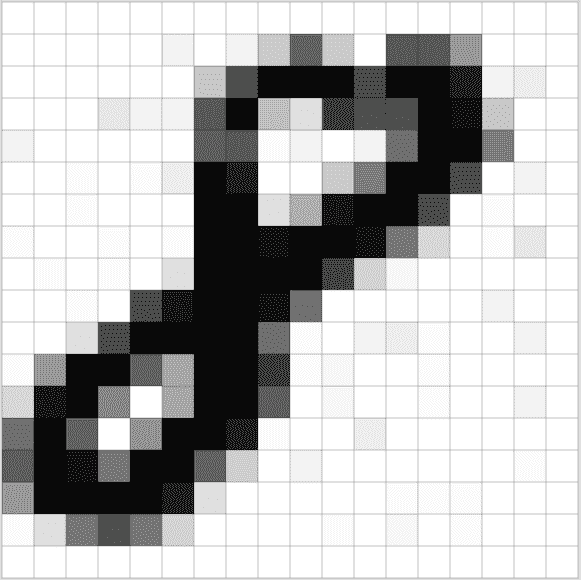

# **什么是渠道？**

通道是一个卷积术语，用于表示图像的某些特征。实际上，来自标准数码相机的图像将具有 3 个通道(RGB(红、绿、蓝))。印刷在报纸上的图像有 4 个通道(CMYK)。您可以想象三个 2d 矩阵相互重叠，每个矩阵的像素值都在[0，255]的范围内。

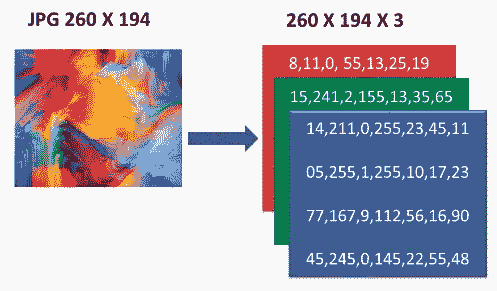

灰度图像只有一个通道。矩阵中每个像素的值范围从 0 到 255，0 表示黑色，255 表示白色。

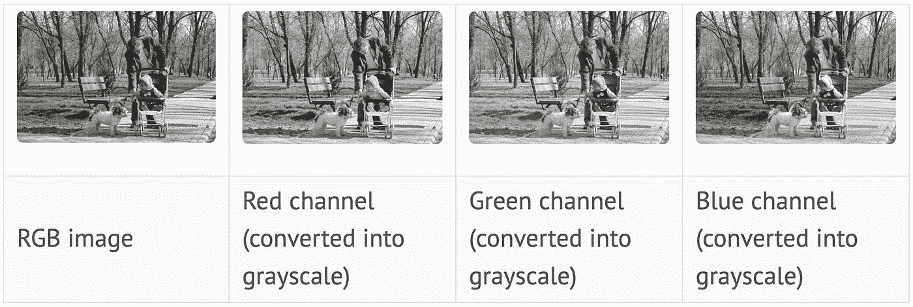

在上面的图像中，红色通道中的红色服装比其他两个通道中的要亮得多，而图片的绿色部分在绿色通道中显示得更亮。

您不应该担心 RGB 或 CMYK 特定通道。它们就像定义图像的矩阵。这里的主要概念是“T0”通道“T1”。一幅图像可以分成任意数量的通道，例如幻灯机。你可以把每张幻灯片想象成一个通道，这些幻灯片的重叠将形成一个图像，投影到屏幕上。

当你向网络提出一个问题时，例如，给我找一朵全是黄色的花，处理一个特定的颜色特征可能是有用的。

> ****通道*** *是可关联特征的集合。**
> 
> **频道；同义词:**
> 
> **特征映射、卷积特征、激活映射**

*让我们以这张图片为例来解释一下渠道可以是什么。*

*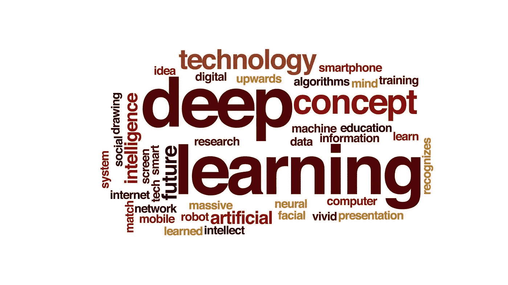*

*现在想象一下，对于给定的图像，我们有 26 个通道。假设我们的频道是 A-Z，因为有 26 个字母，所以有 26 个频道。*

*   *通道 A:从图像中过滤掉所有的 *a* (无论它们在哪里，无论它们在哪里，只是 *a**
*   *通道 B:从图像中过滤掉所有的 *b* 。*
*   *以此类推，直到通道 z。*

*让我们来谈谈通道 a。现在，该通道中的一个特定的 *a* 被称为` ***特征*** `,它可以是大的、小的、倾斜的，但不是相同的特征。*

*现在，当我让你从图像中过滤掉一个或提取一个字母来创建一个通道时，你可能需要一个提取器来完成。这个提取器被称为` ***内核*** `。如果你需要提取比如说 *c* ，你需要这个 *c* 过滤器。*

> **内核；同义词:**
> 
> **特征提取器，n×n 矩阵，过滤器，权重**
> 
> **每个滤镜给我们一个通道。**

# ***卷积神经网络的构建模块***

*卷积的主要目的是从输入图像中提取特征。正如我们所了解的，如何说一个单词首先要学习什么是字母表，类似地，CNN 也有积木。*

*就像英语一样，我们可以将积木定义为:*

> **字母组合= >单词组合= >句子组合= >段落组合= >故事组合**

*同样在视觉上，*

> **>渐变和边缘组合= >纹理和图案组合= >部分对象组合= >完整对象= >场景**

*请看下图，网络是如何一步步学会识别上面提到的每个块的。*

*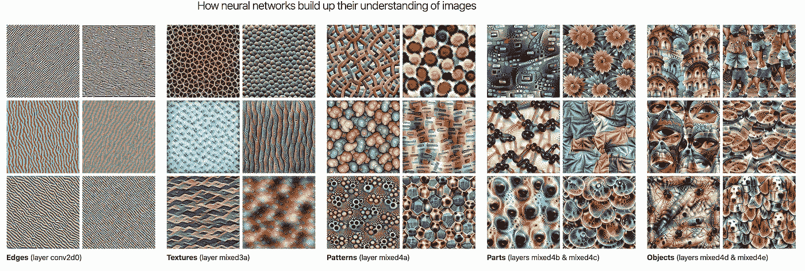*

# ***什么是渐变和边缘？***

*我们将梯度 称为一系列像素的亮度变化。*

*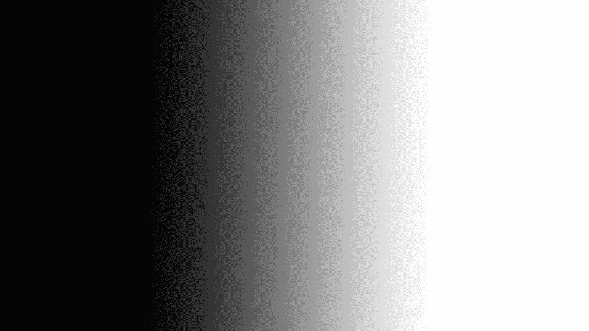*

*上图是从黑到白的线性渐变。这个渐变是平滑的，我们不会说这个图像有边缘。上图中的边缘有点模糊。在真实物体中，那些“T4”*边缘* 可以通过观察尖锐的过渡来发现。你可以在下图中找到边缘*

**

# ***什么是卷积？***

*卷积通过从输入图像中学习特征来处理像素之间的空间关系。*

*让我们来看看，当看一幅图像时，人眼看到的是什么，机器看到的是什么。*

**

*   *第一个图像是你所看到的；*
*   *第二个图像是解释图像的方式(像素值矩阵)；*
*   *第三个图像是机器看到的(n x n 数字矩阵)。*

***卷积如何保持空间关系？***

*考虑一个像素值只有 0 和 1 的 5x5 图像。*

*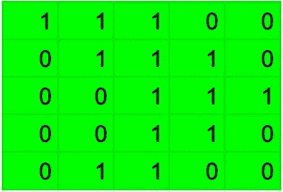*

*并且还考虑如下所示的 3×3 矩阵*

*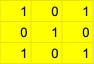*

*然后，可以如下所示计算 5×5 图像和 3×3 图像的卷积:*

**

***让我们了解发生了什么？计算是如何进行的？***

*我们将黄色矩阵在绿色图像上滑动 1 个像素，对于每个位置，我们计算元素乘法(两个矩阵之间),并将乘法输出相加，以获得最终的整数，该整数形成粉红色卷积特征矩阵中的元素。*

*上面发生的每一步都有一些术语。*

*假设我们有蓝色的盒子作为我们的图像，深色的小块作为我们的黄色矩阵，白色的盒子作为我们的卷积特征矩阵。*

*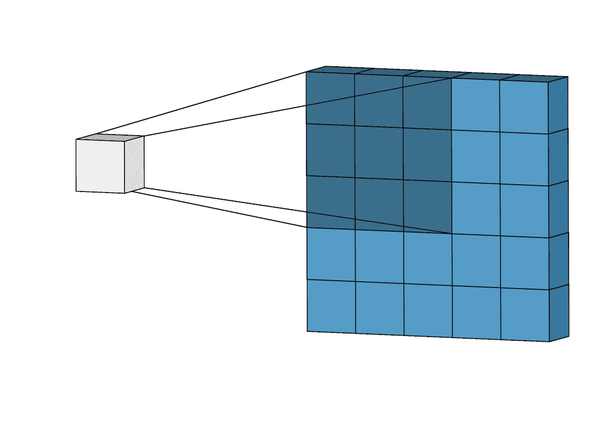*

*蓝色的物体是你的大小为(5x5)的图像(5 是你的宽度和高度)，你看到的深色的补丁是我们的` ***内核*** `，它是用随机值初始化的。*

*图像的 3x3 滤镜和 3x3 补片之间存在点积。此滤镜一次在图像上滑动一步。*

*这个*步骤*被称为` ***步距*** `(这里步距=1 ),点积的结果是创建我们的输出通道。*

> **这种 n×n 滤镜在图像上滚动，逐步计算点积的过程，称为* ***卷积*** *。**

*这些内核在开始时用随机值初始化。这些值将在模型训练中改变。我说的模型是指，当你训练你的深度学习模型时。滤波器矩阵的不同值将为相同的输入图像产生不同的特征图。*

*考虑另一个图像，*

**

*让我们看看上面的图像不同的过滤器的效果，*

*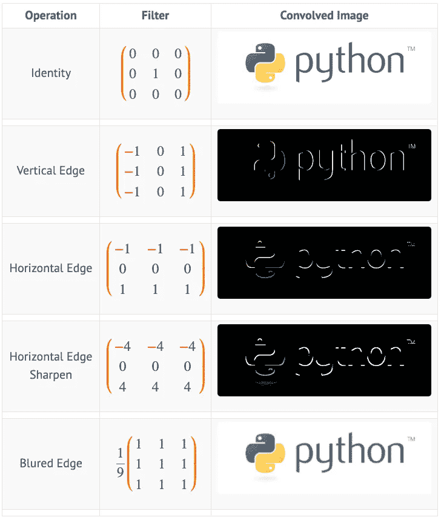*

*实际上，CNN 在训练过程中学习这些滤波器的值。*

*看到发生了什么吗？*

*垂直边缘滤波器检测垂直边缘，水平边缘滤波器检测水平边缘。输出图像中的亮像素表示原始图像中有强边缘。*

# ***输出通道***

*当我们在 6×6 图像上卷积 3×3 滤波器时，我们得到 4×4 对象矩阵。*

*无论我们得到的结果是什么，我们都要对它应用其他过滤器来得到下一组对象。(我说的是神经网络的层次)。*

*输出通道的大小可以使用下面的公式来计算，*

*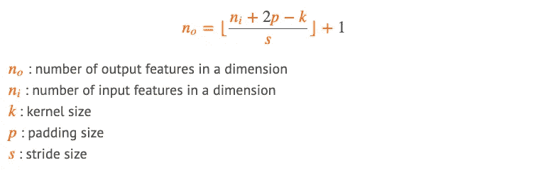*

*我稍后会解释什么是填充以及我们为什么使用它。*

# ***内核参数***

*这些内核具有被称为 ***参数*** 的值。我们可以说一个 3x3 内核有 9 个参数。*

*现在来看一些数学概念。*

*   *如果我们在 5x5 图像上使用 5x5 内核进行卷积，我们将得到大小为 1x1 的输出对象。*
*   *如果我们在 5x5 图像上使用 3x3 内核进行卷积，我们将得到大小为 3x3 的输出对象，再次用 3x3 内核卷积输出将得到大小为 1x1 的输出对象。*

*所以我可以说，用 5x5 内核卷积和用 3x3 内核卷积是一样的(两次)。*

*现在问题来了，**用什么尺寸的内核？***

*上述问题的答案存在于另一个问题中，*

***如果使用 3x3 或 5x5 内核，我们需要训练多少个参数？***

*看看下面的表格，如果我们使用 n×n 大小的内核，它会告诉你需要训练的参数总数。*

*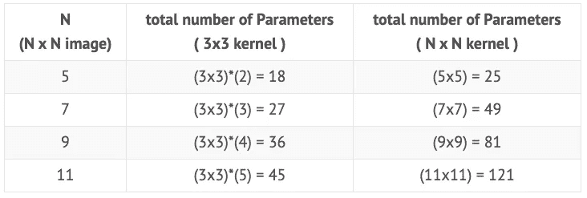*

*上表告诉我们为什么使用 3x3 内核比其他大小的内核更好。*

*参数越少，模型训练的时间就越少。会更快。我们需要建立一个 CNN 架构，用更少的参数，给我们最好的结果。*

*参数和结果之间会有权衡。但是我们需要提出一个优雅的架构，因此我们将选择我们的内核大小。*

*在许多其他博客或研究论文中，你可能会看到研究人员使用奇形怪状的内核。*

***有必要只用奇数形核吗？***

*把我们的内核做成奇数形状是有道理的，因为它有对称轴。*

*让我们在一张纸上画一条黑线。如果我想让我的机器学习白线和黑线的区别。我需要告诉它，线的左边是白色的，右边也是白色的，中间一列是黑色的。机器需要区分黑色像素和非直线像素，即白色像素。我们需要提供这两种信息。机器需要知道特征的开始和结束。*

*你可以查看上面的边缘检测表，我们的内核是由什么值组成的？产量是多少。*

# ***感受野***

*这是 CNN 中最重要的概念之一。*

> **感受野被定义为特定中枢神经网络特征所关注的输入区域。**

*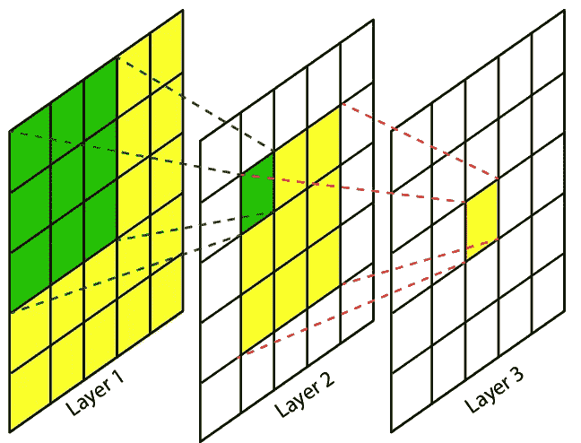*

*假设层 1 是你的 5x5 大小的图像，绿色矩阵是你的 3x3 大小的内核。*

*如果你在图像上卷积内核，你将得到 3x3 的对象，这是你的第二层，在第二层上再次卷积，你将得到大小为 1x1 的对象，这是你的第三层。*

*让我们从第二层拿绿色细胞。*

*它在第一层能看到多少个细胞？答案是 9。*

*所以，那个细胞的` ***局部感受野*** 为 3。*

*   *如果我问第一层的(25，25)单元格中有什么？
    回答:“我不知道”。*
*   *现在如果我问第三层的黄色细胞，它能看到多少个细胞？回答:“我看过整幅图像”。*

***想知道如何？***

*一个 5x5 内核可能已经看到了整个映像，正如前面所解释的，使用 3x3 内核(两次)类似于使用 5x5 内核。因此，来自层 3 的那个黄色细胞的“全局感受野*”将是完整的 5x5 图像，并且细胞的局部感受野将总是内核大小。**

**所以最后一个细胞应该看到了整个图像，否则它不会知道猫是否在图像中。**

**现在，如果我们必须为 401x401 图像建立一个网络，**

****仅使用 3x3 内核，我们需要多少层？****

**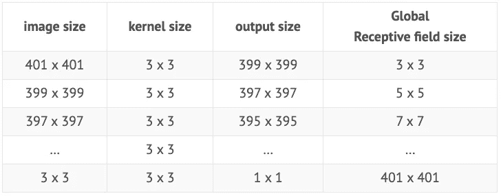**

**答案会是，200 层。**

**这不是训练模特的好方法。加 200 层简直是噩梦。因此，我们必须在层间进行下采样，也称为“最大池”。我们将在下一篇文章中讨论这个概念。**

# ****初始化内核值****

**神经网络的值必须初始化为随机数。**

**理解这两个概念:**

****确定性算法 vs 非确定性算法****

**给定一个无序的数字数组，冒泡排序算法将总是以相同的方式执行，以给出相同的有序结果。**

**但是由于数据的复杂性，这种方法不能有效地解决一些问题。该算法可能运行，但可能永远不会给你所需的解决方案，或者可能无限运行。**

**为了解决这样的问题，我们使用非确定性算法。**

**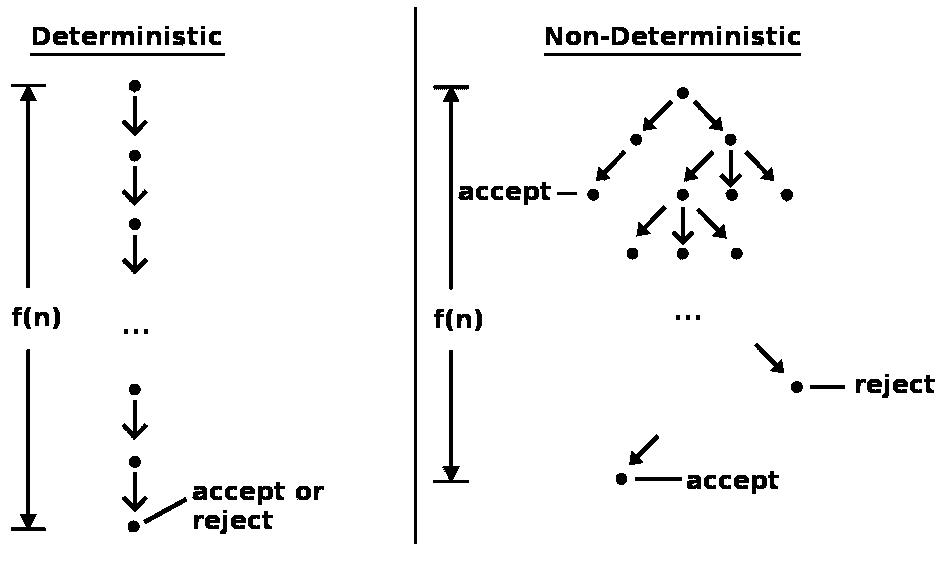**

**执行 f(n)步的确定性算法总是以 f(n)步结束，并且总是返回相同的结果。具有 f(n)级的非确定性算法在不同的运行中可能不会返回相同的结果。由于固定高度树的潜在无限大小，非确定性算法可能永远不会完成。**

**这些非确定性算法将达到近似解，但是会很快。这些解决方案对于这样问题通常是令人满意的。**

**这种算法利用了随机性。你可能学过梯度下降算法，这些被称为[随机算法](https://en.wikipedia.org/wiki/Stochastic_optimization)。**

**寻找解决方案的过程是递增的，从可能的解决方案空间中的一点开始，到足够好的解决方案。由于我们对空间一无所知，我们从随机选择的点开始。**

**神经网络是用这种算法训练的。**

> **深度学习模型的训练算法通常本质上是迭代的，因此需要用户指定一些初始点，从这些点开始迭代。此外，训练深度模型是一项非常困难的任务，大多数算法都受到初始化选择的强烈影响。**
> 
> ***也许唯一完全确定的性质是，初始参数需要在 different 单位之间*【打破对称性】*。如果具有相同激活函数的两个隐藏单元连接到相同的输入，那么这些单元必须具有 different 初始参数。如果它们具有相同的初始参数，那么应用于确定性常数模型的确定性学习算法将以相同的方式不断更新这两个单元。***
> 
> **——第 296、297 页，[深度学习书籍](https://www.deeplearningbook.org/contents/optimization.html)**

**仔细初始化网络可以加快学习过程。**

**在下一篇文章中，我们将浏览 pytorch 笔记本，我们将在 MNIST 数据集上训练一个网络，并了解我们的网络正在学习什么。**

**敬请期待！！！**

**如果你觉得我能为你提供价值，我鼓励你联系我，关注我，把我加入你的圈子等等。**