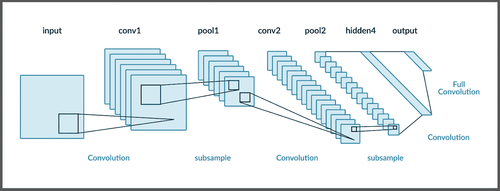
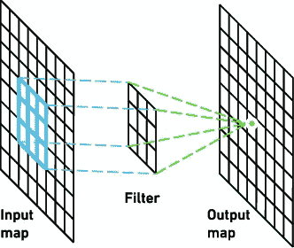
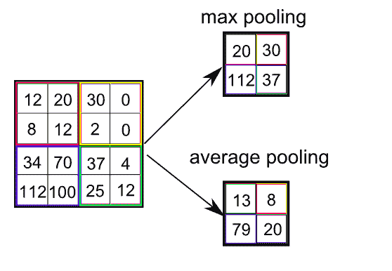
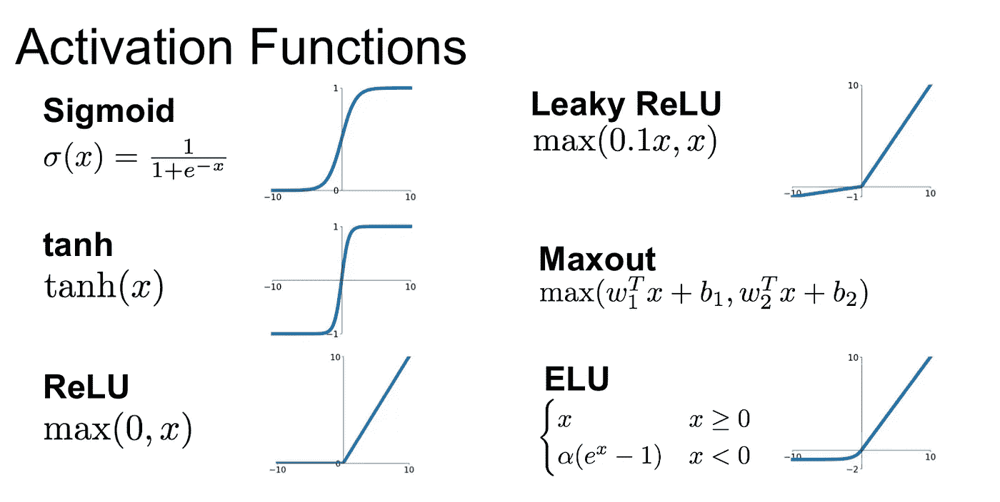
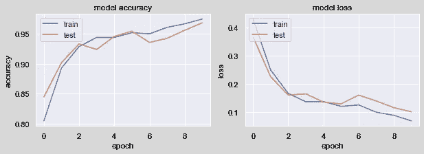
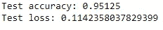

# 卷积神经网络(CNN)

> 原文：<https://medium.com/analytics-vidhya/convolutional-neural-network-cnn-1bd606078aa5?source=collection_archive---------22----------------------->

同胞们，当计算机行业变得越来越重要、越来越繁荣的时候，追溯它在愿景、理想主义、创造力、浪漫和纯粹乐趣方面的衰落是很有教育意义的。

在这里，让我们看看计算神经网络体系结构，并构建一个 cnn 模型，用于使用卫星图像检测船只。

# CNN 是什么？

1.它们被广泛用于计算机视觉问题。他们不同于多层感知器的方式和相对便宜的计算。

2.它们主要用于从图像或视频数据中分类、检测或识别物体。

# CNN 的架构:

1.  **输入层:**读取所需的输入数据，将其缩放至 0–255 之间的像素尺寸，并指定带宽范围(灰度或 RGB)
2.  **卷积层:**

通过检测图片中的特定图案来提取图像上存在的对象的特征。计算机将扫描图像的一部分，通常使用称为**滤波器**的矩阵维数，即 3×3 矩阵。卷积层的输出被称为 F **特征图。**

**步距:**像素数量在输入矩阵中移动。当**步距**为 1 时，我们将过滤器一次移动一个像素。当**步距**为 2 时，我们将过滤器一次移动 2 个像素，依此类推。

3.**汇集层:**

进行汇集是为了减少输入图像的维数。

查看图表。“池化”将筛选一个 4x4 的特征图，并返回最大值。池取 2x2 数组的最大值，然后将此窗口移动两个像素。

4.**全连接层:**神经网络中的全连接层是那些来自一层的所有输入都连接到下一层的每个激活单元的层。

5.**密集层或输出层:**使用适当的激活函数获取输入并返回输出。

> **注意:每一层都有相关的激活功能。其中该函数用于向数据引入非线性。适当的权重和偏置被引入到每个输入像素或对象。基于模型要求，使用各种激活函数。**

# 让我们训练一个 CNN 模型来使用卫星图像探测船只:

下载数据的链接:

 [## 你的数据科学之家

### Kaggle 是世界上最大的数据科学社区，拥有强大的工具和资源来帮助您实现您的数据…

www.kaggle.com](https://www.kaggle.com/rhammell/ships-in-satellite-imagery/download) 

**第一步:**读取数据:

**步骤 2:** 缩放和整形图像:

**第三步:**数据拆分成训练、验证和测试测试:

**第四步:**模型构建和编译:

**第六步:**拟合模型进行训练:

**步骤 7:** 让我们查看模型的训练历史:

**第八步:**模型评估:

**模型的准确率为 95%**

# 结论:

我们刚刚了解了 CNN 的架构和构建基本卷积神经网络模型的步骤。希望这篇文章买了 CNN 的 jist。感激不尽！