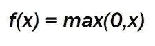
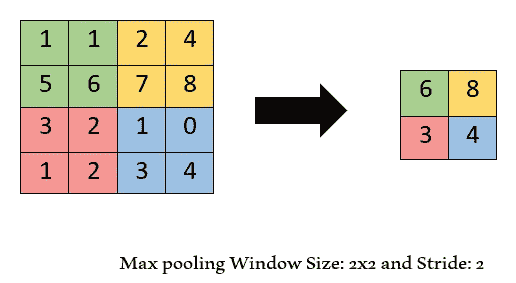

# 卷积神经网络:概念观点。

> 原文：<https://medium.com/analytics-vidhya/convolutional-neural-network-conceptual-view-e2f42bf93b70?source=collection_archive---------19----------------------->

信用:[https://cogniinsight.com/research/](https://cogniinsight.com/research/)

卷积神经网络(ConvNet / CNN)是一种主要用于图像分类和图像识别的神经网络。ConvNet 的架构灵感来自视觉皮层的组织。

ConvNet 由具有权重的神经元组成，可以从数据中学习。一个神经网络在三个维度上排列它的神经元:宽度、高度和深度。每个神经元接收输入并执行点积。这个输入通过隐藏层。每个隐藏层由一组神经元组成，其中每个神经元都与前一层中的所有其他神经元完全连接。在同一层内，每个神经元都是独立的，不共享任何连接。最后一个完全连接的层被称为**输出层。**

ConvNet 有四个功能

1.卷积的

2.热卢

3.联营

4.全连接层。

**卷积运算:**

该操作的主要目的是从输入图像中提取特征。执行这个操作所涉及的元素被称为**内核或过滤器。**该过滤器以某个值在整个矩阵上移动，直到完成。滤波器移动的这个特定值被称为**步幅值**。卷积运算后产生的输出矩阵称为**特征图**。例如:

信用: [F D 博客](/@phidaouss/convolutional-neural-networks-cnn-or-convnets-d7c688b0a207)

**ReLU :**

ReLU 代表校正线性单位。像任何其他神经网络一样，CNN 也需要保持非线性。如果输入为负，ReLU 单元的输出为 0，否则，它将与输入相同。卷积运算的输出之后是 ReLU 激活函数，用于从矩阵中移除所有负值。

**汇集:**

在 ReLU 激活函数之后，我们执行下一个被称为池化的操作。这种操作有助于降低图像的维数，从而减少过拟合的可能性。

最常见的池化方法是最大池化，它选取定义窗口的最大值。类似于卷积，我们决定最大池的窗口和步幅。它减小了特征图的大小，但同时保留了重要的信息。

**全连接层:**

最后，池化步骤的输出传递给完全连接的层。该全连接层神经元与所有先前的神经元连接，并接收输入和执行分类。这些完全连接的图层只接受 1D 的数据。因此，我们需要将数据从三维平面展开到 1D 矢量。

**性能优化/超参数调整:**

在卷积神经网络中，我们有 4 个超参数

1.过滤器尺寸

2.进展

3.使用的过滤器数量。

4.填料

5.图像增强

**滤镜尺寸**:滤镜尺寸作为取决于图像的超参数非常重要。我们主要考虑 3x3，但其他也用于根据图像大小。通常，我们不考虑过滤器尺寸中的深度，因为它总是与输入深度相同。

**使用的滤镜数量**:滤镜数量通常由开发者决定，开发者大多是 2 的幂。基本上，我们应该从小数量开始，然后相应地增加。

**步幅**:正如我们上面讨论的，步幅是过滤器在图像矩阵上移动的步数。

**填充**:在原始图像上应用滤镜后，特征图的尺寸总是会减小。因此，为了保持特征图的相同尺寸，我们使用填充。向特征地图中添加了一个额外的零列，以便它不会收缩并保持空间大小不变。这提高了性能。

**图像增强**:为了使模型尺寸更大，我们添加了不同角度的不同尺寸的图像。这是防止过度拟合的一种方法。

上面的博客帮助你理解卷积神经网络的基本概念。在下一篇博客中，我们将通过代码解释上述所有步骤，并在 Keras 的帮助下编写一个模型。