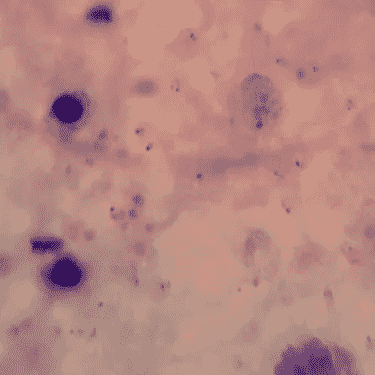
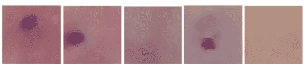
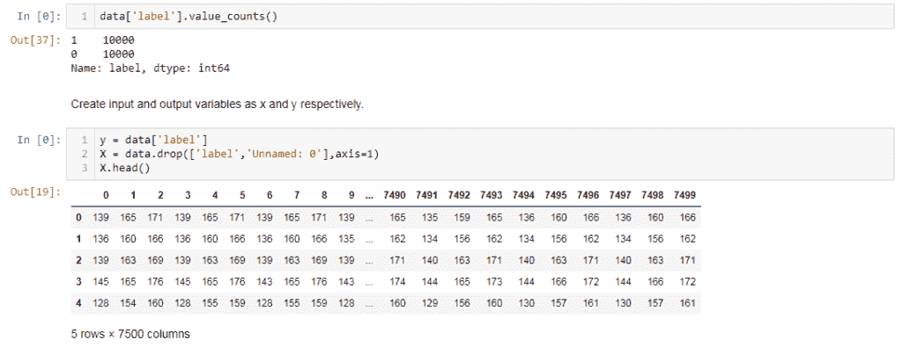
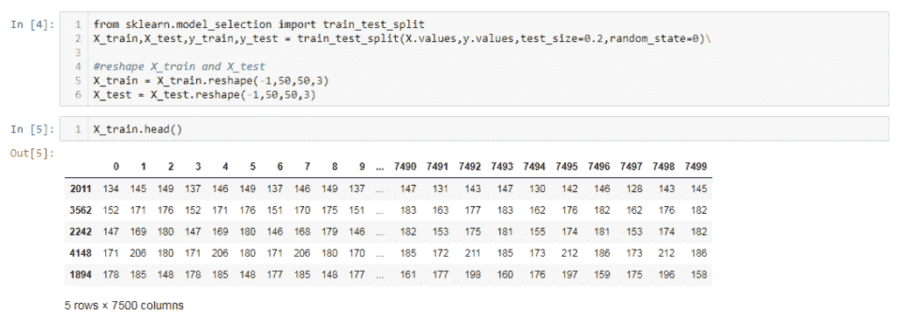
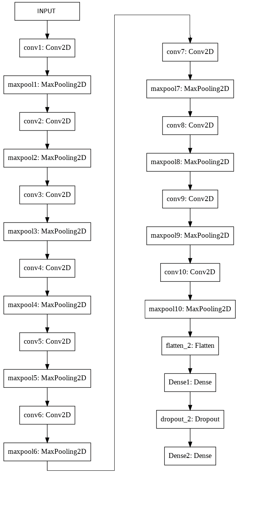
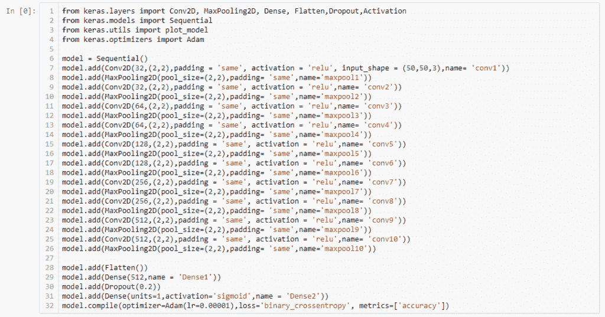
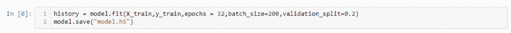
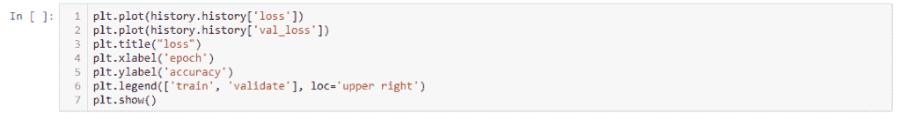
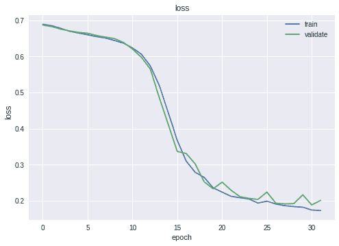
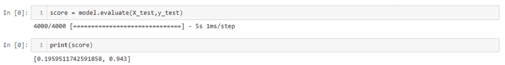

# 卷积神经网络诊断疟疾

> 原文：<https://medium.com/analytics-vidhya/convolutional-neural-network-to-diagnose-malaria-80062c5683d1?source=collection_archive---------21----------------------->

疟疾导致许多人死亡，受疟疾影响最大的年龄组在 5 岁以下。它是由受感染的雌性按蚊传播的疟原虫寄生虫引起的。有几种技术用于疟疾的血液测试，但它们需要专家来检查病人的血液样本。在这里，我们将创建一个深度学习模型来完成这项由专家执行的任务。

在本文中，您将看到深度学习在图像数据上的表现。本文中提到的任务可以由任何初学者来完成，因为这是 CNN 的一个简单应用，没有什么特别的

## **数据集**

这里我们有一组染色血液样本的显微镜图像和每个图像的注释文件。我们需要从这些给定的数据中提取补丁，这样我们就可以用它来训练我们的模型。下面是示例图像。

注释文件只是包含图像中疟原虫寄生虫的 x 和 y 坐标的 XML 文件。我们已经使用注释文件从两种类型的图像中提取了补丁。

下面是一些摘录的补丁。这里的补丁大小是 50X50。

现在，我们已经从图像中提取了需要将其转换为数据框的补丁。RGB 图像是像素值的集合，像素值是介于 0 到 255 之间的数值，有三个通道。因此，由于我们有三个通道的 50×50 的面片，数据帧中的总列数将是 50*50*3 = 7500，从 0 到 7499 开始。下面是熊猫数据框的像素值及其标注。这里标签 1 表示寄生虫存在，0 表示寄生虫不存在。

由于我们不希望我们的模型偏向任何特定的标签，我们从两个类中选择了相同数量的数据点。

## **将数据分成训练集和测试集**

将数据拆分为训练集和测试集，将数据整形为模型的输入形状。

## **型号**

当我们准备好数据后，让我们创建一个 CNN 模型。我创建了一个 10 层的模型，包括 Conv2D，MaxPooling2D，Flatten 和 Dropout。人们可以随意试验模型的架构和其他参数，看看模型的性能如何变化。

*   Conv2D:卷积将一个函数与另一个函数混合，以减少数据空间，同时保留信息。使用激活函数生成特征图。
*   MaxPooling2D:它通过应用最大过滤器对图像进行下采样。
*   展平:它将前一层的输入转换为 1D 矢量，并输入到致密层
*   退出:这是一种防止 CNN 过度拟合的正则化技术

下面是模型架构。

现在我们已经创建了模型，是时候训练模型了。训练后保存模型，以便我们以后使用。

现在，让我们绘制模型损耗随时期的变化。

上图显示训练和验证损失之间的差异并不大，我们可以说模型既没有过拟合也没有欠拟合。训练之后，是时候评估我们的模型，并在测试数据上检查它的性能了。

这里 model.evaluate()返回模型的损失值和精度的列表。该模型在测试数据集上的损失为 0.1959，准确率为 94%。这个经过训练的模型可以用来预测未来看不见的图像。

感谢阅读。

人工智能和机器学习爱好者。[查看 csvankhede 的所有帖子](https://csvankhede.wordpress.com/author/csvankhede/)

**发表**

*原载于 2019 年 9 月 4 日*[*http://csvankhede.wordpress.com*](https://csvankhede.wordpress.com/2019/09/04/convolutional-neural-network-to-diagnose-malaria/)*。*