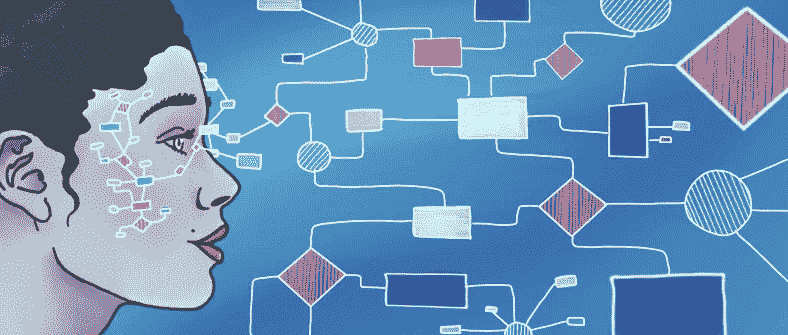
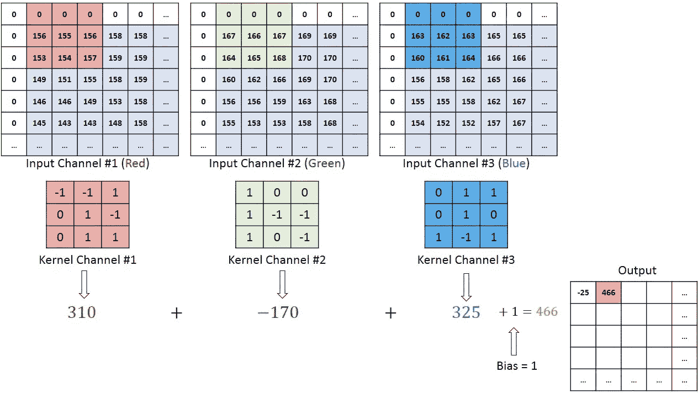
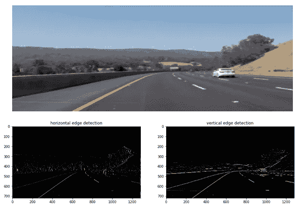
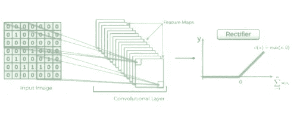
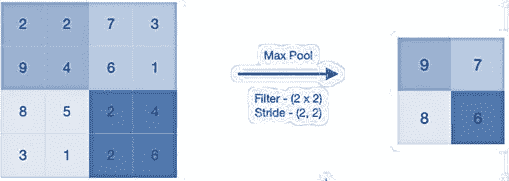
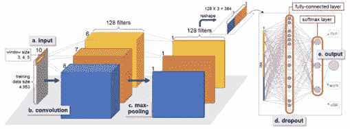

# 卷积神经网络——通过视觉理解

> 原文：<https://medium.com/analytics-vidhya/convolutional-neural-network-understanding-through-visuals-4b62f28d67c5?source=collection_archive---------19----------------------->

[图片由](https://www.lucidchart.com/blog/the-power-of-visual-communication)提供

我一直是一个非常视觉化的人，当我看到步骤的视觉表现和解释时，我倾向于更快地掌握一个概念。当我开始阅读 CNN 时，我遵循同样的策略来理解卷积神经网络的基础，在这篇文章中，我将分享一些帮助我更好地理解概念的视觉效果。希望你也觉得它们有用。

在我们开始之前，让我们回答一些关于 CNN 的基本问题。

**为什么我们这么关心 CNN？我们能不能不把 ANN 用于计算机视觉的目的？**

*经典的神经网络对于计算机视觉来说是非常低效的。图像代表神经网络的大量输入(它们可以有数百或数千个像素和多达 3 个颜色通道)。在经典的全连接网络中，这需要大量的连接和网络参数。*

*卷积神经网络利用了图像由更小的细节或特征组成的事实，并创建了一种用于孤立地分析每个特征的机制，这为关于图像整体的决策提供了信息。*

但是我们确实在卷积/汇集过程的末尾使用全连接层来进行一些预测。

**美国有线电视新闻网的主要层次是什么？**

输入层

Conv 层

ReLu 层

游泳池层

全连接层

**什么是输入层？**

它只保存原始像素值。假设图像是彩色的 32×32，那么图像的形状是 32×32×3，其中 3 是红色、绿色和蓝色通道。

[图片由](/@raycad.seedotech/convolutional-neural-network-cnn-8d1908c010ab)提供

**什么是 conv 层？**

这是卷积神经网络的核心。

[图片由](https://www.researchgate.net/post/How_will_channels_RGB_effect_convolutional_neural_network)提供

在这一层，我们尝试在 R、G、B 通道上滑动滤镜，基本上是像素值，以检测不同的特征，例如图像的垂直和水平边缘。在上图中，只有一个输出，因为我们试图检测垂直边缘(单个特征)，所以对于多个特征，我们需要多个过滤器。注意下图，

[图像](http://datahacker.rs/convolution-rgb-image/)

有 2 个大小为 4 x 4 的输出，因为我们试图检测两个特征，所以我们可以将整个输出写成 4 x 4 x 2。

需要注意的重要一点是，输出的通道数总是等于我们试图检测的特征数。在训练阶段，通过反向传播，以与超参数相同的方式学习这些滤波器。

通过垂直和水平边缘检测器滤波器后的图像的另一个例子，

[图片由](https://kharshit.github.io/blog/2018/12/14/filters-in-convolutional-neural-networks)提供

**什么是热路层？**

ReLu 现在应用逐元素激活函数，例如 max(0，x)阈值为零。这使得体积的大小保持不变，这意味着最终输出仍将与 conv 图层的输出相同。

应用整流器功能的目的是增加图像中的非线性。我们想这么做的原因是图像天生就是非线性的。当你看任何图像时，你会发现它包含许多非线性特征(例如，像素之间的过渡、边界、颜色等。).整流器用于进一步分解线性度，以补偿当我们对图像进行卷积运算时可能强加的线性度。

**什么是池层？**

池图层用于减少要素地图的维度。因此，它减少了要学习的参数数量和网络中执行的计算量。它通常是 2-d 滤波器，步长为 2，并且总是小于特征图。有不同类型的池，如最大池，平均池等。最大池是流行的一种。

**什么是 FCN 层或全连接层？**

[图片由](https://stats.stackexchange.com/questions/360692/what-is-the-optimal-number-of-neurons-in-fully-connected-layer-in-cnn)提供

这一层不是单一的一层，而是多层的组合。第一个 FCN 层从池化过程中获取输出，并将这些值展平为一个向量，然后将该向量馈送到下一层。

然后，第二 FCN 层获取输入，应用权重，然后将它们传递给激活函数，例如 ReLu、Softmax 等。

最终 FCN 输出图层给出了每个标注的最终概率。基于这些概率值，做出类别的决定。

这里重要的是，CNN 网络的全连接部分通过自己的反向传播过程来确定最准确的权重。因此，它实际上是为了预测的目的，有趣的是，如果我们认为，我们可以使用任何分类器，如决策树，SVM 对扁平向量值。但是安更有道理:)

因此，我将结束我的写作，如果你现在对不同层次的基本原理感到舒适，你可以跳到这些概念的数学表示。

在我的下一篇文章中，我将使用 PyTorch 为图像分类创建一个 CNN 模型。希望在那里也能见到你！！

*参考文献:*

 [## 卷积神经网络中的全连接层:完全指南

### 卷积神经网络全连接层是卷积神经网络的基本组成部分…

missinglink.ai](https://missinglink.ai/guides/convolutional-neural-networks/fully-connected-layers-convolutional-neural-networks-complete-guide/)  [## 卷积神经网络(CNN):步骤 1(b) - ReLU 层-博客 SuperDataScience -大数据|…

### 步骤 1(B):整流线性单位(RELU)整流线性单位，或 ReLU，不是一个独立的组成部分…

www.superdatascience.com](https://www.superdatascience.com/blogs/convolutional-neural-networks-cnn-step-1b-relu-layer/) 

[https://www . geeksforgeeks . org/CNN-introduction-to-pooling-layer/](https://www.geeksforgeeks.org/cnn-introduction-to-pooling-layer/)

【http://datahacker.rs/convolution-rgb-image/ 

[https://cs231n.github.io/convolutional-networks/](https://cs231n.github.io/convolutional-networks/)