# 卷积神经网络-图解说明

> 原文：<https://medium.com/analytics-vidhya/convolutional-neural-networks-an-illustrated-explanation-f9450ecc1bb1?source=collection_archive---------8----------------------->

> 编辑:写完这篇文章后不久，我做了一个解释 CNN 的 YouTube 视频。请随意查看！

到目前为止，神经网络的主要用途之一是对数据进行分类。这些数据可以是任何东西，从判断肿瘤是否恶性到你从尼日利亚王子那里收到的电子邮件是否是垃圾邮件。

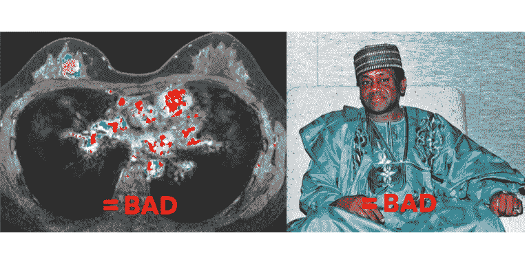

图像/视频是最受欢迎的数据类型之一。 ***计算机视觉*** 是深度学习中的子领域，处理图像和视频以及其中包含的内容。

计算机视觉有许多流行的应用，如图像搜索算法、自动车辆中的物体检测和疾病诊断。

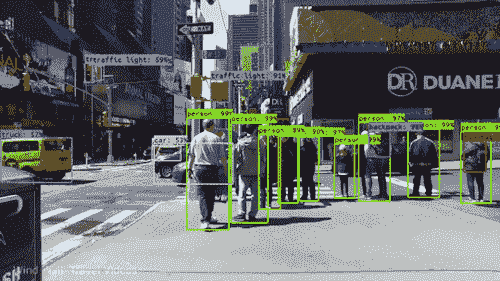

资料来源:Rahul Agarwal

用于图像数据的最流行的神经网络之一是卷积神经网络，也称为 CNN。CNN 的亮点是能够从图像中提取边缘、纹理和形状等特征。

在这篇文章中，我想通过一系列的插图来解释 CNN 中的主要层是如何工作的。

## 卷积步骤

想象你有一只狗的图像。

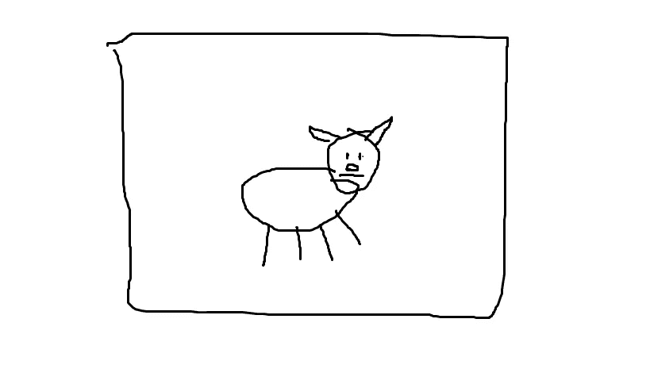

一张非常逼真的狗的照片

现在我们在这张照片中看到一只狗，尽管我的绘图能力很差，但计算机看到的是不同的。计算机将其视为一系列像素，每个像素都有一个 RGB 值。

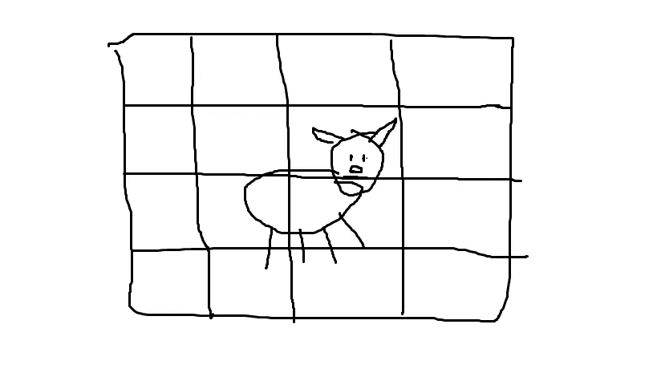

电脑看到的

在这种情况下，每个方框代表一个像素。当然，在真实的图片中，像素会小得多。接下来是卷积层。

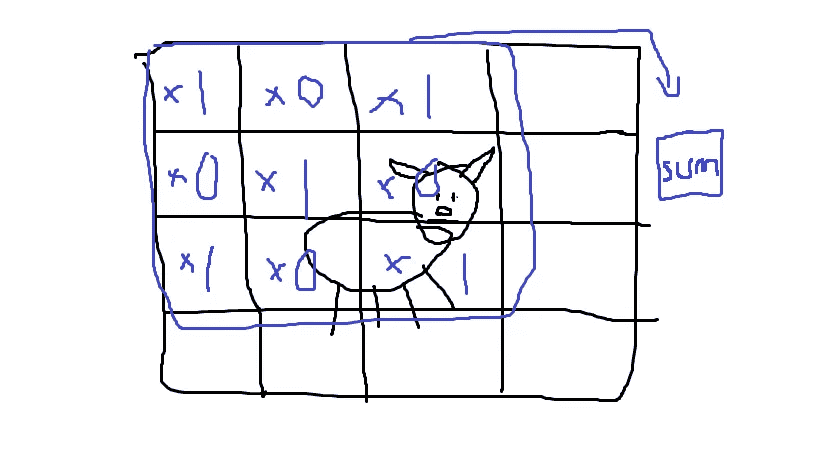

卷积滤波器

卷积层所做的是将滤镜应用于图块，图块是图像的一个子部分。然后，滤波器将输入值乘以滤波器值，然后将它们相加，得到一个和。该模型在训练期间学习过滤器的正确值，因此它可以提取好的特征。

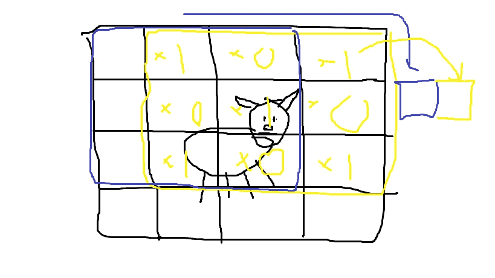

过滤器翻转了

然后，过滤器滑过，做同样的过程。你可以注意到一些像素实际上是如何重叠的。然后模型继续这个过程。

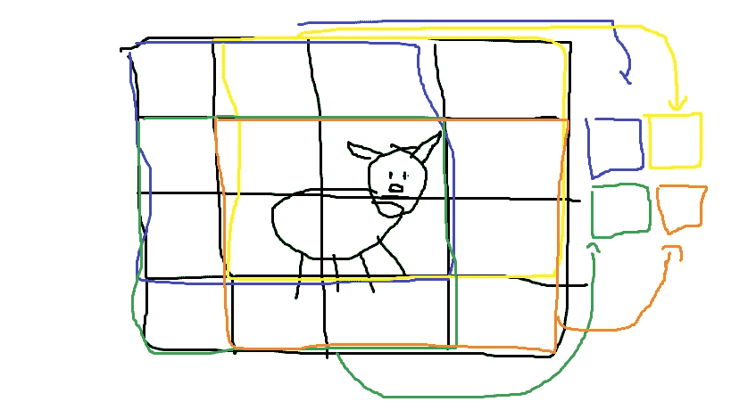

然后我们剩下的是一个输出特征图，它(希望)从输入中提取了一些有用的特征。

卷积完成后，对特征图进行 ReLU 变换。要阅读更多关于激活功能的信息，请查看[这篇](https://developers.google.com/machine-learning/practica/image-classification/convolutional-neural-networks)文章。

## 汇集步骤

典型 CNN 结构的下一部分是一个汇集步骤。合并步骤的作用是获取由卷积生成的输出特征图，并缩小尺寸以减少模型中的维数，从而节省处理时间。

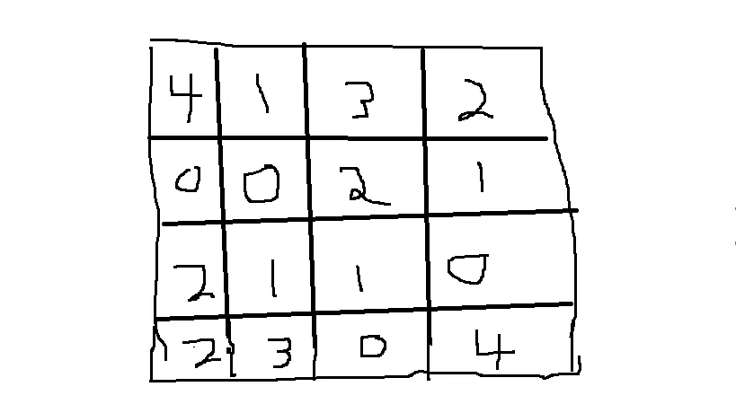

复杂特征图

想象这是 dog 卷积+ ReLU 示例的输出。我们想缩小这个特征地图，一个非常常见的方法是通过最大池。

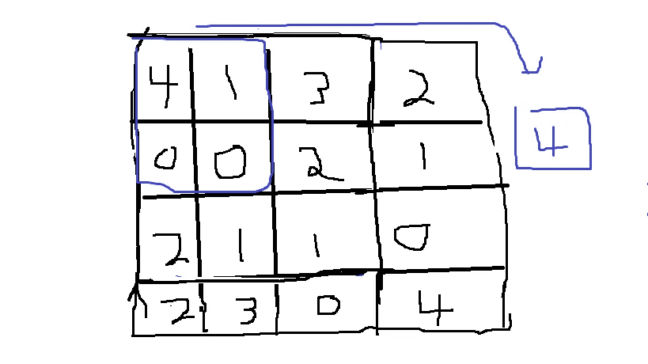

最大池所做的只是取一个图块的最大值(通常为 2x2)。它非常类似于卷积步骤，在输入中滑动。我们继续这个过程，直到汇集完成。

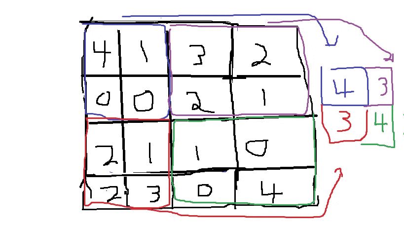

然后，这最终连接到一个密集层，这是你的典型，香草多层感知器。查看[这篇文章](/datadriveninvestor/deep-learning-is-not-just-import-tensorflow-c27136aaa65e)以了解更多相关信息。

## 在 CIFAR-10 数据集中使用 CNN

最近，我使用 CNN 在一个名为 [CIFAR-10](https://www.cs.toronto.edu/~kriz/cifar.html) 的数据集上进行图像分类。数据集由 10 个不同物体的 60，000 幅图像组成(因此是 CIFAR-10 中的 10 幅)。

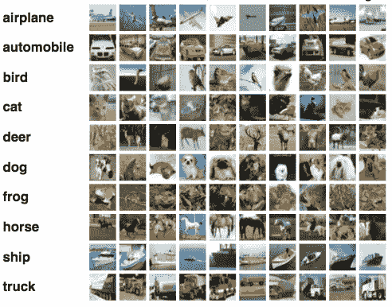

结果非常好，仅经过 3 个时期的训练，测试数据的损失就达到了 74%。下面是一段代码。

```
model = models.Sequential()model.add(layers.Conv2D(32, (3, 3), activation='relu', input_shape=(32, 32, 3)))
model.add(layers.MaxPooling2D((2, 2)))
model.add(layers.Conv2D(64, (3, 3), activation='relu'))
model.add(layers.MaxPooling2D((2, 2)))
model.add(layers.Conv2D(64, (3, 3), activation='relu')) model.add(layers.Flatten())
model.add(layers.Dense(64, activation='relu'))
model.add(layers.Dense(10, activation='softmax')) model.compile(optimizer='adam',              loss='sparse_categorical_crossentropy',metrics=['accuracy'])
```

通过额外的数据扩充和正则化，精确度可能会变得更高，因为这将解决一些问题，如过度拟合和增加数据集大小。

另一种可能性是在[迁移学习](https://en.wikipedia.org/wiki/Transfer_learning)中，它使用预先训练的模型，如谷歌的 Inception，然后将其应用到我们的模型中。

你可以通过这个[链接](https://github.com/lewwwis/cifarrcnnreplicate)在 Github 上查看我的模型的完整代码。

## 在你走之前！

*我目前正在继续进行额外的 ML 项目，我将在未来几周内在 Medium 上分享这些项目！*

*   在 [Linkedin](https://www.linkedin.com/in/aaron-lewis-64284a188/) 上连接
*   在我的[网站](http://aaronvlewis.me)上查看我的其他作品
*   或者[订阅](http://eepurl.com/gENgmb)我的时事通讯
*   谢谢大家！:-)