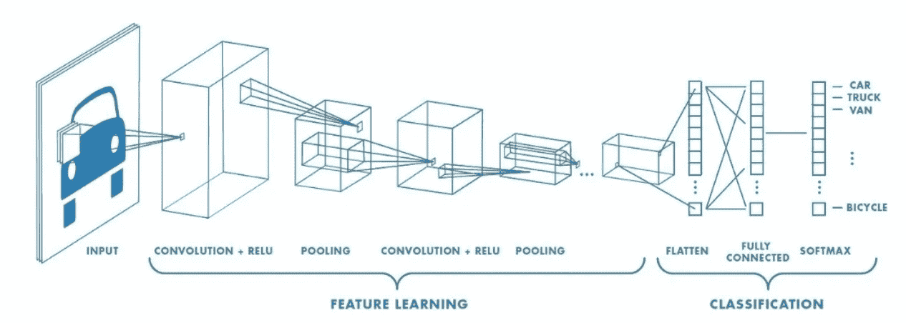
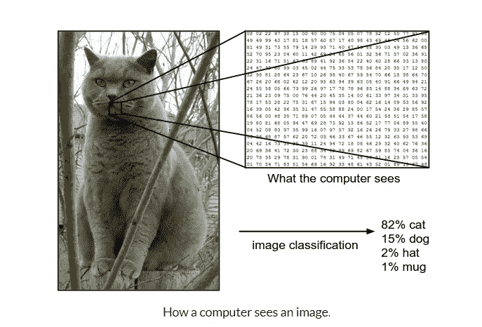
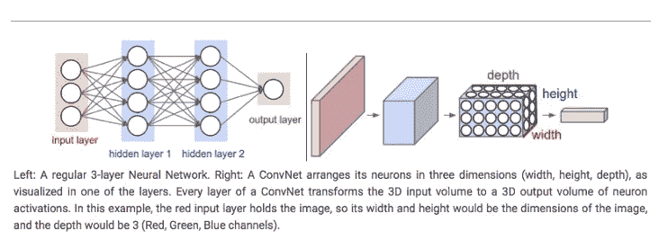
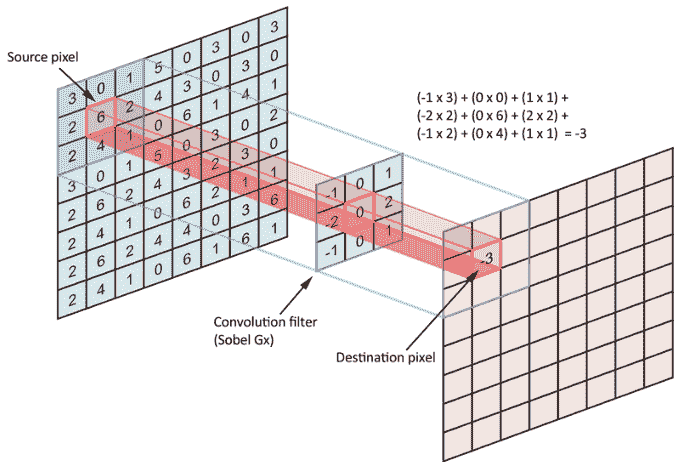
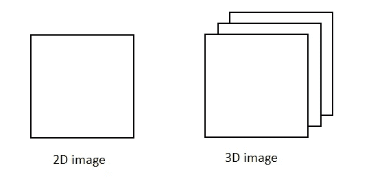
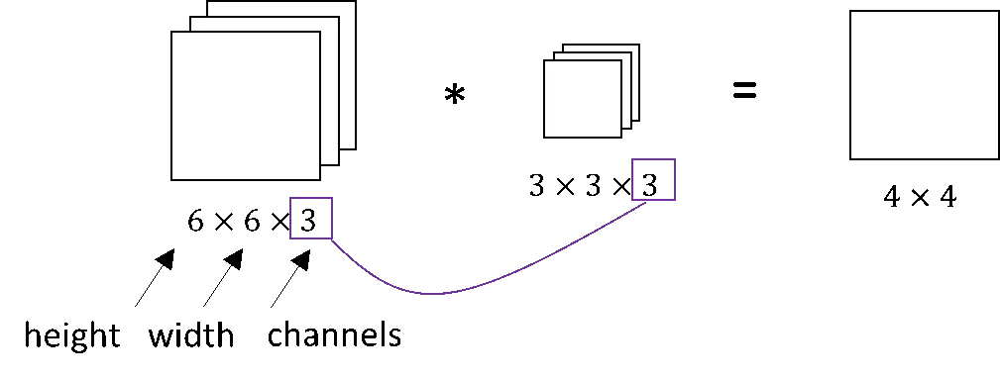
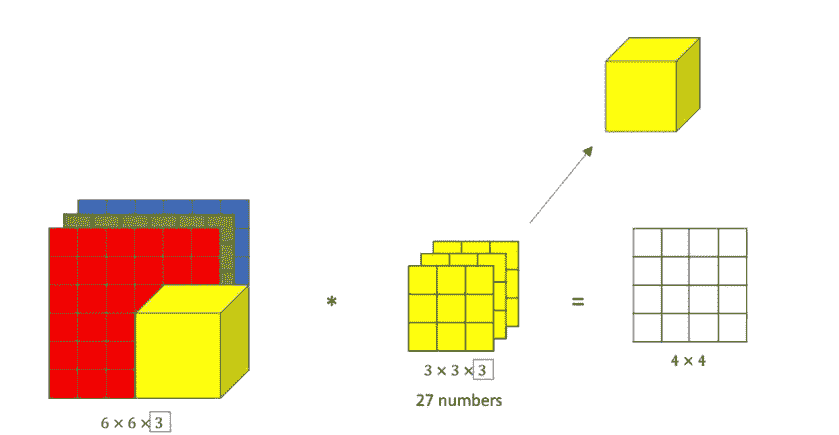
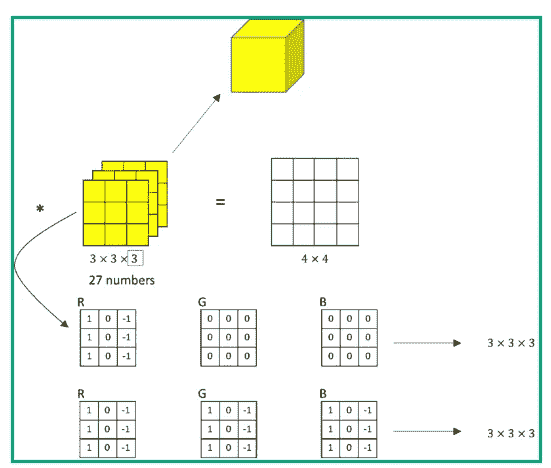
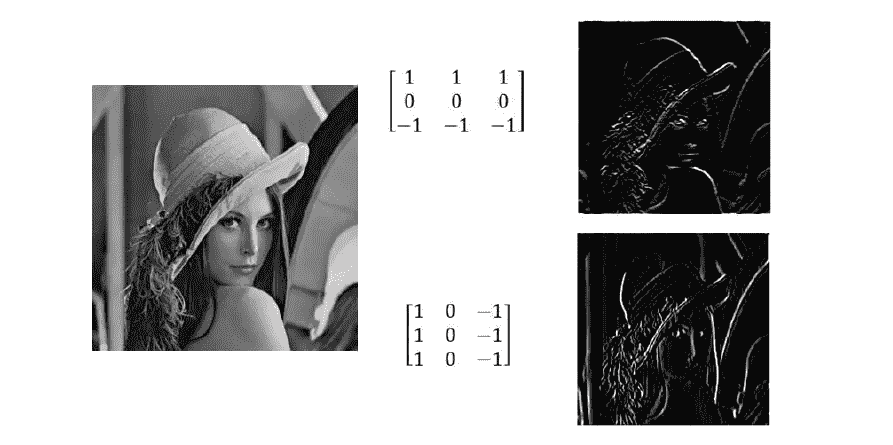

# 卷积神经网络-直观的方法-第 1 部分

> 原文：<https://medium.com/analytics-vidhya/convolutional-neural-networks-an-intuitive-approach-part-1-c8d526a43e3e?source=collection_archive---------15----------------------->

简单而全面的概念方法

卷积神经网络

人工智能在过去几年里有了巨大的发展，机器和人类之间的差距正在缓慢但稳步地缩小。人类和机器的一个重要区别是(或者说曾经是！)关于人类对图像和声音的感知。我们如何训练机器像我们一样识别图像和声音？

此时我们可以问自己几个问题！！！！

这些机器如何感知图像和声音？

*机器如何区分不同的图像，比如说一只猫和一只狗？*

*机器能识别和区分不同的人吗，比如说，通过输入他们的图像来区分男性和女性，或者识别莱昂纳多·迪卡普里奥或布拉德·皮特？*

让我们试着找出答案吧！！！

**颜色编码系统:**

让我们对机器的颜色编码系统有一个基本的概念

**RGB 十进制**:表示为 rgb(255，0，0)。它由三个通道组成，分别代表红色、蓝色和绿色。RGB 定义了多少红色、绿色或蓝色值以十进制数值显示，介于 0(不代表颜色)和 255(颜色的最高浓度)之间。因此，在 rgb(255，0，0)的例子中，我们会得到非常亮的红色。如果我们想要全绿，我们的 RGB 应该是 rgb(0，255，0)。对于简单的蓝色，它应该是 rgb(0，0，255)。正如我们所知，所有的颜色都可以由红、绿、蓝三种颜色组合而成，因此我们可以得到我们想要的任何颜色的编码。

**灰度**:灰度仅由 1 个通道(0 到 255)组成，0 代表黑色，255 代表白色。中间的颜色代表不同的灰色阴影。

电脑和我们“看”的方式不同。他们的世界只由数字组成。

***每幅图像都可以表示为二维数组的数字，称为像素*** 。

但是他们以不同的方式感知图像的事实，并不意味着我们不能训练他们像我们一样识别模式。我们只需要以不同的方式思考图像是什么。

现在，我们对如何表现图像有了一个基本的概念，让我们试着去理解 CNN 的架构

**CNN 架构**

卷积神经网络具有不同于常规神经网络的架构。常规神经网络通过一系列隐藏层来转换输入。每一层都由一组**神经元**组成，其中每一层都与前一层中的所有神经元完全连接。最后，还有最后一个完全连接的图层-输出图层-用于表示预测。

卷积神经网络有点不同。首先，这些层是按照 3 个维度组织的:宽度、高度和深度。此外，一层中的神经元并不连接到下一层中的所有神经元，而是仅连接到其一小部分区域。最后，最终的输出将减少到一个单一的概率得分向量，沿着深度维度组织

安 vs CNN

典型的 CNN 架构

如上所述，CNN 有两个组成部分:

*   **隐藏层/特征提取部分**

在这一部分中，网络将执行一系列的**卷积**和**汇集**操作，在此期间检测**特征**。如果你有一张老虎的照片，这是网络可以识别条纹、四条腿、两只眼睛、一个鼻子、独特的橙色等的部分。

*   **分类部分**

这里，完全连接的层将在这些提取的特征之上充当**分类器**。他们将为图像上的物体分配一个**概率**，该物体就是算法预测的物体。

在我们继续之前，我们需要了解什么是“卷积”，稍后我们将回到架构:

**卷积神经网络中的“卷积”是什么意思？**

让我们解码吧！！！

**卷积**是一种简单的数学运算，是许多常见的**图像**处理运算符的基础。**卷积**提供了一种将通常大小不同但维数相同的两个数字数组“相乘”的方法，以产生维数相同的第三个数字数组。

术语[卷积](http://timdettmers.com/2015/03/26/convolution-deep-learning/)是指两个函数的数学组合产生第三个函数。它融合了两组信息。

在 CNN 的情况下，使用**滤波器**或**内核**(这些术语可互换使用)对输入数据执行卷积，然后产生**特征图**。

我们通过在输入上滑动滤波器来执行卷积。在每个位置，执行矩阵乘法，并将结果加到特征图上。

在下面的动画中，你可以看到卷积运算。你可以看到**滤波器**(绿色方块)滑过我们的**输入**(蓝色方块)，卷积的总和进入**特征图**(红色方块)。

我们过滤器的区域也被称为**感受野**，以神经元细胞命名！这个滤镜的大小是 3x3。

左图:过滤器滑过输入。右图:将结果相加并添加到特征图中。

为了便于解释，我已经向你们展示了 2D 的操作，但实际上卷积是在 3D 中进行的。在下面的图片中，只显示了一个图层，将会有很多图层一个接一个的堆叠在一起。每个图像被表示为一个 3D 矩阵，其宽度、高度和深度的尺寸为。深度是一个维度，因为图像中使用了颜色通道(RGB)。

滤镜滑过输入并在目标像素上执行操作

让我们试着深入理解上面的概念！！！

RGB 图像上的卷积

左边是 2d 图像，右边是 3d 图像(RGB)

如上所示，左边的图像是 2d 矩阵，通常代表彩色编码的灰度方案，而左边的图像是彩色编码的 RGB 方案，三维分别代表高度、宽度和 3 个颜色通道，即 RGB。

大小为 3*3 的滤波器用于产生 4*4 的 2d 矩阵

让我们给它们命名:这里的第一个 6 是图像的高度，第二个 6 是宽度，第三个是通道的数量。同样，我们的过滤器也有高度、宽度和通道数。**我们图像中的通道数必须与我们过滤器中的通道数相匹配，**所以这两个数字必须相等。它的输出将是一个 4×4 的图像，注意这是 4×4×1，末尾不再有 3。

RGB 卷积

为了执行卷积运算，让我们用一个立方体来表示滤波器(3*3*3)，现在这个立方体总共有 27 个数。因此，当我们在 RGB 矩阵上滑动立方体时，如上图左侧所示。立方体的第一层覆盖 9 个红色数字，立方体的第二层覆盖 9 个与红色相邻的绿色通道数字，而过滤器的最后一层覆盖 9 个与红色和绿色相邻的蓝色数字。我们将 RGB 矩阵和滤波器中完全重叠的相应数字相乘，并将它们相加，以获得我们的第一个输出。我们不断滑动滤波器以获得不同的输出。

特征检测:

假设我们想检测图像的边缘，我们如何选择一个过滤器

**检测一个通道中边缘的特征:**

我们选择第一个滤波器为 1，0，1，1，0，1，1，0，1(如前所述)。这可以是对于红色，对于绿色通道，值将全为零，对于蓝色滤光器也是如此。我们将这三个矩阵堆叠在一起，形成我们的 3×3×3 滤波器。然后，这将是一个过滤器，检测垂直边缘，但只有在红色通道。如上图所示

**检测任何颜色或所有三个通道的特征:**

或者，如果垂直边缘的颜色不重要，那么我们可以在所有三个通道中使用 1 和 1 的滤波器(如上图第二个示例所示)。这样，我们得到了一个 3×3×3 的边缘检测器，它可以检测任何颜色的边缘。

**同样不同的参数选择会导致不同的特征检测器。**

检测多个特征:

让我们问自己一个问题

我们如何同时检测水平和垂直边缘？

我们如何检测 45 度或 70 度的特征？

嗯！！答案很简单，我们使用两个/多个过滤器。我们使用黄色滤光器和橙色滤光器获得卷积输出，得到的矩阵是 4×4×2，通过适当地改变滤光器参数，根据需要分别表示水平和垂直边缘或者沿着 45°或 70°。

**注意:可能有 15 个或者 100 个或者几百个不同的特性。最后，输出将具有与我们试图检测的特征数量相等的通道数量。**

真实世界的例子如下所示:在第一幅图像中，沿水平方向的特征(白色)更加明显，因为第一个参数在滤波器中保持全 1，类似地，沿水平方向的第二个特征更加明显。

现在我们已经理解了 RGB 矩阵中卷积的基本概念，让我们进一步研究 CNN 架构

**使用卷积网络优于常规前馈神经网络的优势**

如左图所示，为什么不将一个 3×3 的矩阵展平，然后作为 9×1 的输入输入到传统的神经网络中？

上面的过程在大多数二进制图像的情况下工作得很好，也有低于标准的准确度和精确度。

通过应用相关过滤器，ConvNet 能够**成功捕捉图像中的空间和时间相关性**。由于所涉及的参数数量的减少和权重的可重用性，该架构对图像数据集执行了更好的拟合。换句话说，可以训练网络更好地理解图像的复杂程度。

**现在我们已经了解了卷积的含义及其在颜色编码系统中的基本应用！！！！**

请在本文的第 2 部分找到更多详细信息。

 [## 卷积神经网络-直观的方法-第二部分

### 前一篇文章的续篇

medium.com](/@nikethnarasimhan/convolutional-neural-networks-an-intuitive-approach-part-2-729bfb5e4d87)