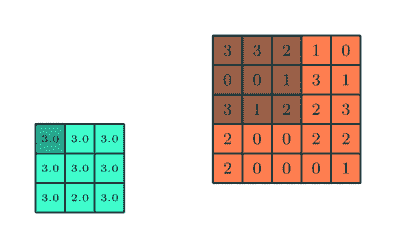
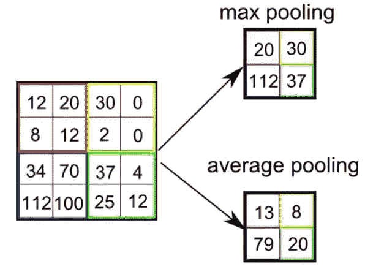

# 卷积神经网络-直观的方法-第二部分

> 原文：<https://medium.com/analytics-vidhya/convolutional-neural-networks-an-intuitive-approach-part-2-729bfb5e4d87?source=collection_archive---------20----------------------->

前一篇文章的续篇

请找到第 1 部分的链接

 [## 卷积神经网络-直观的方法-第 1 部分

### 简单而全面的概念方法

medium.com](/@nikethnarasimhan/convolutional-neural-networks-an-intuitive-approach-part-1-c8d526a43e3e) 

现在我们已经知道了卷积到底是什么，让我们看看如何使用它来完成各种任务，如图像分类等

**CNN 架构**

如上所述，CNN 有两个组成部分:

*   **隐藏层/特征提取部分**

在这一部分中，网络将执行一系列的**卷积**和**汇集**操作，在此期间检测**特征**。如果你有一张老虎的照片，这是网络可以识别条纹、四条腿、两只眼睛、一个鼻子、独特的橙色等的部分。

*   **分类部分**

这里，完全连接的层将在这些提取的特征之上充当**分类器**。他们将为图像上的物体分配一个**概率**，该物体就是算法预测的物体。

输入馈入卷积层

卷积层:

我们前面已经了解了卷积的基本概念。

让我们学习两个新的重要概念

# 步幅:

跨距是在输入矩阵上移动的像素数。当步幅为 1 时，我们一次移动一个像素的过滤器。当步幅为 2 时，我们每次将过滤器移动 2 个像素，依此类推。**步幅**是卷积滤波器每次移动的步长。步幅大小通常为 1，这意味着过滤器逐像素滑动。通过增加步长，滤波器以更大的间隔在输入上滑动，从而减少像元之间的重叠。这意味着激活中的每个输出值将更加独立于相邻值。从下面可以看出

内核在输入上移动，大小为 1，填充为 1(边界处为 1 层)

# 填充:

有时，滤波器并不完全适合输入图像。我们有两个选择:

*   用零填充图片，使其适合
*   删除图像中不适合滤镜的部分。这称为有效填充，仅保留图像的有效部分。

用零填充 5x5 图像以获得 5x5x1 输出

当我们将 5x5x1 图像放大为 6x6x1 图像，然后对其应用 3x3x1 内核时，我们发现卷积矩阵的维数为 5x5x1。因此得名— **同填充**。

另一方面，如果我们在没有填充的情况下执行相同的操作，我们会看到一个矩阵，它具有内核(3x3x1)本身的维度— **有效填充**。

**注意:添加填充会增加输出音量，而 stride 会降低输出音量。**

# **特征图**

在 CNN 的情况下，使用**滤波器**或**核**(两者指同一事物)对输入数据执行卷积，然后产生**特征图(输出)**。

**计算参数个数:**

以下是计算参数的步骤:

上述公式中的输入和输出维度相同

**非线性(ReLU)**

ReLU 代表用于非线性操作的整流线性单元。输出为***(x)= max(0，x)。***

为什么 ReLU 很重要:ReLU 的目的是在我们的 ConvNet 中引入非线性。因为，真实世界的数据需要我们的 ConvNet 学习非负线性值。

ReLU 很重要，因为它不会饱和；如果神经元激活，梯度总是高的(等于 1)。只要不是死神经元，连续更新还是相当有效的。ReLU 评价也很快。

与 sigmoid 或 tanh 相比，两者都是饱和的(如果输入非常高或非常低，梯度非常非常小)。

更一般地说，非线性激活函数很重要，因为你试图学习的函数通常是非线性的。如果不使用非线性激活函数，网络将是一个大的线性分类器，并且可以通过简单地将权重矩阵相乘来简化(考虑偏差)。它不能做任何有趣的事情，比如图像分类或文本预测。

## 池层:

当图像太大时，池层部分将减少参数的数量。空间池也称为二次采样或下采样，可减少每个地图的维度，但保留重要信息。空间池可以有不同的类型:

*   最大池化
*   平均池

最大池化

左边是最大池的示例，其中最大值选自每个 slde 期间形成的矩阵。

如左图所示，平均池选择幻灯片中形成的矩阵中所有数字的平均值。

例如 12，20，8 和 12 的平均数是 13。

;

联营的优势:

1.  **降维:**在深度学习中，当我们训练一个模型时，由于数据量过大，模型可能需要花费大量的时间进行训练。现在考虑使用 5x5 大小的最大池，1 步。它将给定图像的大小为 5×5 的连续区域缩小为 1×1 区域，最大值为 5×5 区域。在这里，池化将 25 (5x5)个像素减少到单个像素(1x1)，以避免“维数灾难”(参见该术语，机器学习中的重要概念)。
2.  **旋转/位置不变特征提取:** Pooling 也可以用于提取旋转和位置不变特征。考虑使用大小为 5x5 的池的相同示例。池化从给定的 5x5 区域提取最大值。基本上从给定区域提取主要特征值(最大值),而不管特征值的位置。最大值将来自区域内的任何位置。池化不捕获最大值的位置，因此提供了旋转/位置不变的特征提取。
3.  **减少过度拟合:**输入中更高的维数意味着我们需要使用更多的参数，这会导致过度拟合。因此，我们需要一种方法来减少这种维数，以便我们可以避免过度拟合，这是由池层执行的。

联营业务。

分类:

CNN 架构

**全连接图层:**

从上图中可以看出，一个 14x14x3 的矩阵被展平成一个 588x1 的单层

既然我们已经将输入图像转换成适合多层感知器的形式，我们应该将图像展平成一个列向量。平坦化的输出被馈送到前馈神经网络，并且**反向传播**被应用于训练的每次迭代。在一系列时期内，该模型能够区分图像中的主要特征和某些低级特征，并使用 **Softmax 分类**技术(使用 Softmax 激活功能)对其进行分类。

**总结**

*   将输入图像提供给卷积层
*   选择参数，如果需要，使用步长、填充来应用过滤器。对图像执行卷积，并对矩阵应用 ReLU 激活。
*   执行池化以减少维度大小
*   添加尽可能多的卷积层，直到满意为止
*   展平输出并馈入完全连接的层(FC 层)
*   使用激活函数(带有成本函数的逻辑回归)输出类并对图像进行分类。

CNN 的架构有多种类型，下面列出了一些，感兴趣的人可以研究一下！！！我会试着在后续的文章中介绍它们！！

1.  LeNet
2.  AlexNet
3.  VGGNet
4.  谷歌网
5.  雷斯内特
6.  ZFNet