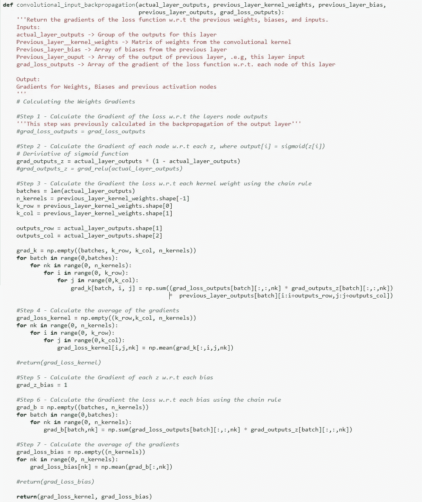

# 卷积神经网络和使用 Numpy 的反向传播

> 原文：<https://medium.com/analytics-vidhya/convolutional-neural-networks-and-backpropagation-using-numpy-4da2c9d14fdd?source=collection_archive---------1----------------------->

好吧！我们开始吧..

因此，我准备了这个故事，试图模拟一个卷积神经网络，并通过反向传播仅使用 numpy 更新它。

所有这些背后的想法是为了进一步理解反向传播。

在我开始之前，我想否认以下声明:

1.我不打算在这个时候建立最精确的模型，因为这个想法是解开反向传播。

2.运行所有这些将会消耗你大量的内存，而且会花很长时间，主要是因为我想在我的编码中更具教学性，并且使用大量的 for 循环。所以我为效率不高道歉，但这并不是我在这个内核中的真正目标。

对于这个故事，我将使用古老而著名的 MNIST 数据(神经网络的 hello world)

现在数据已经被加载和转换了，是时候为我们的神经网络建模了。

在这个练习中，我将使用以下架构:

**定义计算卷积向前传递的函数**

**定义计算最大池向前传球的函数**

**定义计算压平前进刀路的功能**

**定义计算密集向前传球的函数**

**定义用于计算向前传递的最终输出的函数**

**定义损失函数的计算**

好的。现在，对那些还和我在一起的人来说，棘手的部分来了。
我们现在已经定义了在我们的 CNN 模型中进行一次向前传递所需的所有函数。
为了让我们的模型学习，我们需要定义反向传播函数。

如您所知，反向传播使用偏导数和梯度下降来更新参数(权重和偏差)，以便将损失降至最低，从而进行学习。

如果你对这个问题有疑问，我鼓励你去 youtube 上看看 3blue1brown、Siraj Raval 和吴恩达的资料。

**输出层反向传播**

**展平图层反向传播**

**最大池层反向传播**

**卷积层反向传播**

好了，最糟糕的部分(或者最好的部分，如果你喜欢这个东西)已经过去了。既然已经声明了所有的函数，我们就可以开始训练我们的数据了。

为此，我们必须定义一个新的函数..所有功能之母..

“一个功能是统治他们，一个功能是发现他们，一个功能是把他们带到一起，在黑暗中把他们绑起来”

行..现在一切准备就绪。让我们开始训练吧

经过长时间的训练，测试模型的准确率从 14.8%提高到 37.7%。我已经停止了，因为学习的速度非常慢，改进需要更多的时间。虽然准确性不是很高，但编码证明了模型正在学习(这毕竟是目标)。

希望它是有用的，感谢阅读！

如果有人想使用代码，可以在我在 Kaggle 的个人资料中找到

[https://www.kaggle.com/kmaciver](https://www.kaggle.com/kmaciver)