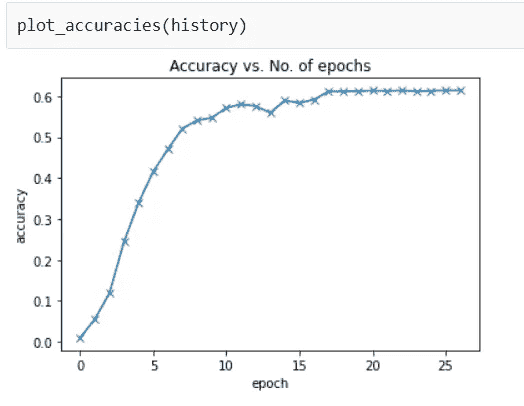

# 卷积神经网络，它超级酷！

> 原文：<https://medium.com/analytics-vidhya/convolutional-neural-networks-and-its-super-cool-4f8c05937601?source=collection_archive---------28----------------------->

卷积神经网络(CNN 或 ConvNets)是深度神经网络下的一类，主要应用于视觉数据。与前馈神经网络相比，CNN 是一种提高模型精度的聪明方法。

卷积是一种非常简单的数学运算，其核心是。核只是一个小的权重矩阵。这个内核在 2D 输入数据上“滑动”,对它当前所在的输入部分执行逐元素乘法，然后将结果相加到单个输出像素中。

## 为什么神经网络比传统的前馈神经网络性能更好？

有人可能会想，为什么不干脆把图像弄平，然后输入前馈神经网络。毕竟，图像只是像素值的矩阵。但事实并非如此…

在非常基本的图像的情况下，前馈神经网络可能能够执行得非常好，但是当涉及到具有像素相关性的复杂图像时，它具有很低甚至没有准确性。

通过应用相关过滤器，ConvNet 能够成功捕捉图像中的空间和时间依赖性。由于所涉及的参数数量的减少和权重的可重用性，该架构对图像数据集执行更好的拟合。换句话说，可以训练网络更好地理解图像的复杂程度。

*   **更少的参数**:一小组参数(内核)用于计算整个图像的输出，因此与完全连接的层相比，该模型具有更少的参数。
*   **连接的稀疏性**:在每一层中，每个输出元素只依赖于少量的输入元素，这使得向前和向后的传递更加高效。
*   **参数共享和空间不变性**:一个内核在图像的一部分中学习到的特征可以用来检测另一个图像的不同部分中的相似模式。

## 水果分类的 CNN

这是我从零开始做的第一个深度学习项目。它使用 CNN 对 131 种不同类型的水果进行分类，准确率达到 85%。

它使用 Kaggle 上一个名为 Fruits 360 的数据集。该数据集由超过 60，000 张不同类型水果的图像组成，用于训练模型。每个图像都是 RGB 格式，尺寸为 100 像素乘 100 像素。

训练数据的一个例子，

虽然，训练模型只是等待，但这是我最兴奋的部分。我的模型的初始验证损失和验证准确率分别为 4.876 和 1.01%。

在第一个时期的训练之后，验证损失降低到 1.2080，验证准确度增加到 93%。我又训练了 5 个时期的模型，最终验证损失为 0.0452，最终验证准确率为 99%。

最初，精确度以较高的速率增加，然后曲线变平。

损失的性质也类似于精度，唯一的区别是它只是凹了起来。

在测试数据集上测试模型时，最终损失为 0.7845，准确率为 85.4%

## 使用前馈神经网络的相似模型

我使用前向神经网络使用相同的数据集制作了一个类似的分类模型。经过超过 25 个时期的训练，我能得到的最好的验证损失和验证准确度分别是 2.008 和 61.4%。

这清楚地表明了 CNN 比前馈神经网络优越得多。

> CNN 笔记本链接:[https://jovian . ml/aaryan reegmi 39/course-project-fruits-3-CNN](https://jovian.ml/aaryanreegmi39/course-project-fruits-3-cnn)
> 
> 链接到前馈神经网络笔记本:【https://jovian.ml/aaryanreegmi39/course-project-fruits-2 
> 
> 链接到该项目的 Github 页面:
> 
> 【https://github.com/Aaryan73/Fruit_Classification_using_CNN 
> 
> 参考资料:
> 
> [https://towards data science . com/intuitive-understanding-convolutions-for-deep-learning-1 F6 f 42 faee 1](https://towardsdatascience.com/intuitively-understanding-convolutions-for-deep-learning-1f6f42faee1)