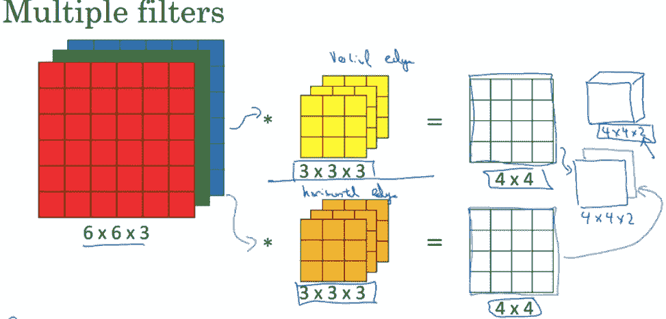

# 卷积神经网络

> 原文：<https://medium.com/analytics-vidhya/convolutional-neural-networks-c123798bd9a4?source=collection_archive---------6----------------------->

## 试图解释所有涉及卷积神经网络的技术细节

(来源:[卷积神经网络—塞尚·卡马乔—机器和深度学习教育家。](https://cezannec.github.io/Convolutional_Neural_Networks/))

**什么是 CNN？**

一种深度学习算法，可以接受输入图像，为不同的特征分配不同的权重和偏好/赋予不同的特征不同的重要性，同时能够区分输入图像

**为什么使用 CNN？**

在我们进入使用 CNN 的好处是什么之前，让我们讨论一下为什么我们首先使用它们，为什么我们不仅仅使用普通的神经网络？

CNN 的整个想法是有效地将图像数据映射到输出变量，使用普通神经网络的问题是，你不会从图像数据集中提取出最佳特征，事实上，你甚至可能会丢失重要的特征，因为你需要展平图像，以便在你甚至可以获得对建立良好的深度学习模型至关重要的必要特征之前，将该图像用作输入

**我们需要提取哪些特征？**

CNN 模型在训练时将学习几个特征，并且随着我们深入 CNN，该模型将学习更复杂的特征，其中最重要的是输入图像中对象的边缘，并且通过执行所谓的卷积运算来提取这样的特征

(来源: [#002 CNN 边缘检测|主数据科学(datahacker.rs)](http://datahacker.rs/edge-detection/)

**边缘检测示例**

为了检测边缘，我们采用一个滤波器(也称为核)并将其与我们所拥有的输入图像进行卷积，为了便于解释，输入图像和滤波器都被假定为 2-D 矩阵。

卷积运算用星号“*”表示

我们通过可视化滤波器遍历整个图像并对相应的元素执行矩阵乘法来获得卷积的输出，在这个例子中，我们使用 3*3 滤波器检测 6*6 的垂直边缘(滤波器可以转置为水平边缘),结果是 4*4 矩阵

(来源: [#002 CNN 边缘检测|主数据科学(datahacker.rs)](http://datahacker.rs/edge-detection/)

正如我们在下面的例子中看到的，矩阵中的数字或值定义了图像中颜色的强度(越正表示越亮，越负表示越暗)，结果是中间的一个亮部分夹在两个暗部分之间，在较大的比例上，这看起来像一条线，在完整的图像上，这看起来像一条边缘，基本上这些颜色之间的过渡对我们来说就是边缘

(来源: [#002 CNN 边缘检测|主数据科学(datahacker.rs)](http://datahacker.rs/edge-detection/)

**过滤器的尺寸和类型**

滤波器的典型大小通常是 3*3，有时甚至是 5*5，使用偶数维滤波器没有固有的问题，但是使用奇数维滤波器允许边缘位于输出图像的中心，有不同种类的滤波器用于边缘检测的不同变化，如 Sobel 和 Scharr，我们甚至可以将滤波器值初始化为权重，并在反向传播过程中训练它们

(来源:coursera)

**填充**

当我们用 3*3 滤波器卷积 6*6 图像时，有 4*4 的地方适合它，这里的威胁是遗漏了外部边缘特征，因为滤波器在图像中间卷积的频率非常高，另一个威胁是可能使输出太小而不明显，因此我们使用填充，通过向边缘添加额外的维度来增加图像的大小，以便更频繁地卷积先前的边缘，我们不会遗漏特征或使输出太小。在本例中，我们将 6*6 图像转换为 8*8 图像，并使用 3*3 过滤器对其进行卷积，得到另一个 6*6 图像=图像的原始大小

(来源:coursera)

**卷积的类型**

**N —图像尺寸，F —滤波器尺寸，P —填充尺寸**

a)有效(无填充) :

N x N(图像)* f x f(滤镜)= (n-f+1)*(n-f+1)(输出图像大小)

b)相同(填充，因此初始图像大小=输出图像大小)

这里的输出图像大小由(n+2p-f+1)*(n+2p-f+1)给出，并且可以通过使用公式 p = (f-1)/2 来计算必要的填充

相同的填充可视化:

**交错卷积**

卷积中的步距是我们在图像上进行卷积时所采取的步长，如果步距是 2，我们不是向右移动 1，而是移动 2，通过减少计算，步距过程可以节省大量时间，同时保留必要的特征

(来源:Coursera)

(来源:Coursera)

**步幅= 2 卷积可视化**

**RGB 图像和体积的卷积**

**RGB —红绿蓝图像**

像前面解释的典型 2-D 卷积一样，这个卷积只有另一个通道或第三维，要在 RGB 图像或体积上卷积，您需要滤波器有一个额外的通道，**一个等于 RGB 图像中第三通道**的通道。

我们使用的滤波器数量决定了输出的第三维，例如，如果我们将 6*6*3(高度*宽度*通道)与一个 3*3*3 滤波器进行卷积，则结果输出是 4*4*1 或 4*4 图像，但如果滤波器数量为 2，则结果是 4*4*2 图像

(来源:谷歌图片)

(来源:谷歌图片)

**在单个卷积层中**

a)图像被过滤

b)通过非线性(类似 ReLU 的激活函数)并添加偏差

c)最后，我们用多个过滤器应用的所有卷积被加在一起以完成一个 conv 层

(来源:Coursera)

**参数计算和输出尺寸:**

您不需要记住所有这些符号和公式，输出图像大小基本上是((输入大小+2 *填充大小-过滤器大小)除以步长大小+ 1)四舍五入，符号中的方括号表示最大整数函数

(来源:谷歌图片)

**conv 网中的层类型**

a)卷积层(CONV)

b)汇集层(POOL)

c)全连接层(FC)

**池层:**

减少计算量，加快计算速度，使功能更加强大。

**两种类型:**

a)最大池化

b)平均池

**最大池:**

想象一个 4*4 的输入图像和一个 2*2 的池层，将图像分割成池层的大小，并从特定的池矩阵中选择最大值

池化的超参数是过滤器大小和步幅，在这种情况下，两者都取为 2，池化层没有其他参数要训练。

在最大池中，区别特征(最大数量)被保留，因此变得更加健壮

池化也不会影响图像中的第三个通道

(来源:Coursera)

**平均池:**

想象一个 4*4 的输入图像和一个 2*2 的池层，将图像分割成池层的大小，并选择该特定池矩阵中所有值的平均值。

**池化时通常没有填充，因此输出公式可以简化为:**

**[(Nh-f)/s+1]*[(Nw-f)/s+1]* Nc**

(来源:Coursera)

**CNN 的例子和架构:**

完全连接的层是指其每个像元都完全连接到前一层和后一层的层，尽管 softmax 函数并不特定于 CNN，但可以将其视为预测每个类的概率的广义 sigmoid，由以下公式给出:

在这个例子中，让我们看看用于从 0 到 9 分类手写数字的 LeNet-5 架构

(来源:coursera)

(来源:coursera)

**其他流行的 CNN 架构:**

LeNet-5

AlexNet

VGG 16

盗梦空间(谷歌网)

雷斯内特

DenseNet

**在 PyTorch 中实现 CNN:**

**最后，它们有什么好处，为什么/如何减少计算时间？**

如前所述，CNN 允许我们提取更好的特征并显著加快计算速度，但它们是如何做到的呢？

conv 层相对于标准全连接层有两个主要优点，即:

a)参数共享

b)连接的稀疏性

**参数共享:**

示例:32*32*3 输入与具有 6 个滤波器的 5*5*3 滤波器卷积，以给出 28*28*6 特征图:

32*32*3 = 3072

28*28*6 = 4704

不使用卷积层的典型 fc 层中的 3072 * 4704 大约等于 14M 参数。

参数共享本质上意味着在图像的一部分有用的特征检测器(滤波器)可能在另一部分也有用，因此参数的总数显著减少

**连接的稀疏度:**

在每一层中，每个输出值仅取决于少量的输入，在下面的例子中，输出 0 仅取决于输入图像的前 3*3 部分

(来源:Coursera)

**参考书目/参考文献:**

[卷积神经网络](https://www.coursera.org/learn/convolutional-neural-networks/) ←超链接

Coursera 的深度学习专业化课程(deeplearning.ai)，吴恩达授课，图片和插图

其他 gif 来源:

[卷积神经网络综合指南 ELI5 之路| Sumit Saha |迈向数据科学](https://towardsdatascience.com/a-comprehensive-guide-to-convolutional-neural-networks-the-eli5-way-3bd2b1164a53) ←超链接