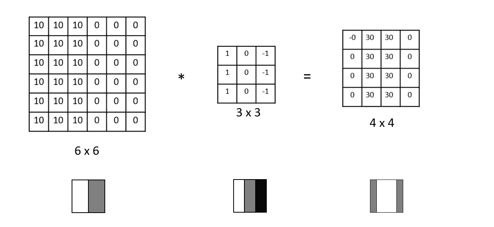
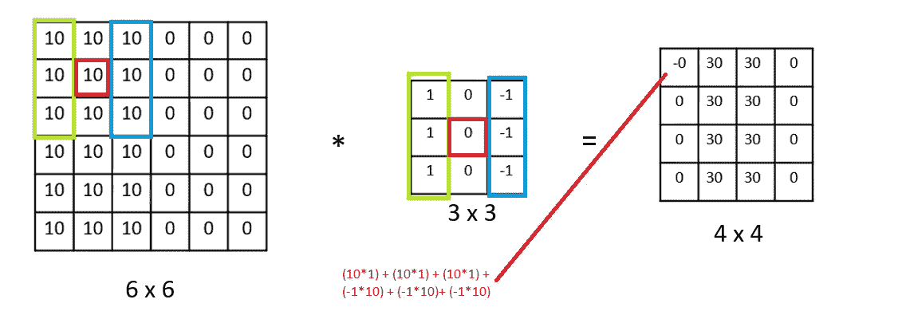
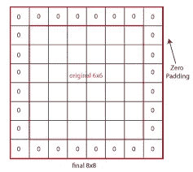
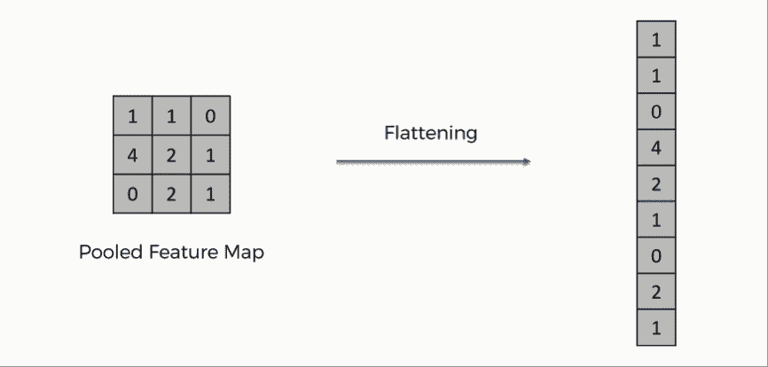
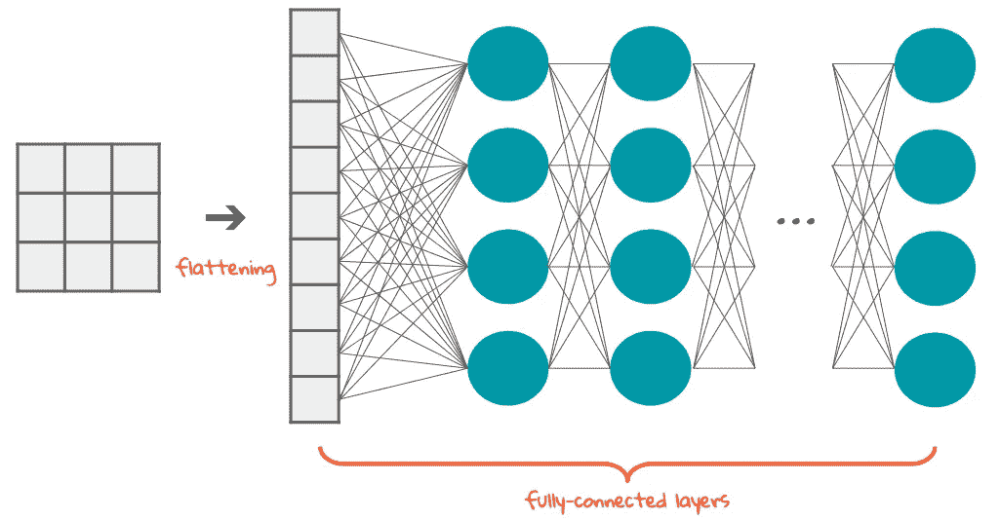
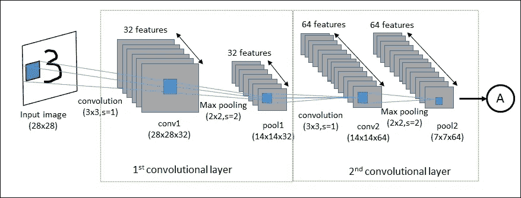
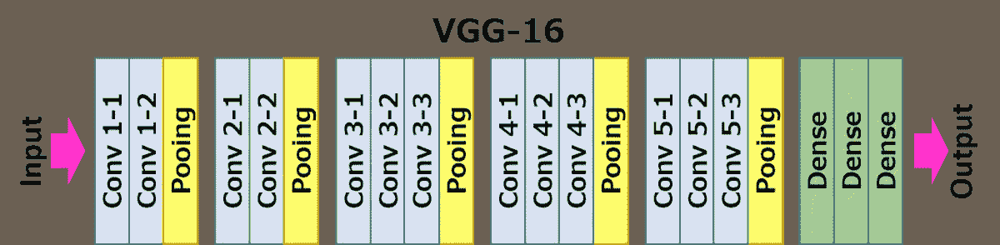
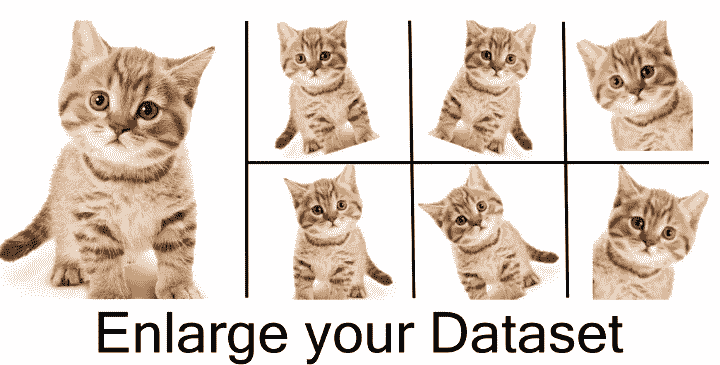

# 卷积神经网络(CNN)教程

> 原文：<https://medium.com/analytics-vidhya/convolutional-neural-networks-cnn-a78e78c1ba94?source=collection_archive---------5----------------------->

# 我为初学者准备了这个教程。

本教程是理解什么是 CNN 的指南。

## 计算机视觉问题:

*   图像分类
*   物体检测或识别
*   神经类型转移

**CNN 中层的类型:**

1.  盘旋
2.  联营
3.  完全连接

# 卷积神经网络

# 1.卷积运算

*   卷积运算是构建 CNN 的基础之一。
*   * '是卷积的符号
*   我们有一个输入矩阵(输入图片)和一个过滤器(特征检测器)。
*   过滤器通常是一个 3x3 的矩阵，但它不是一个规则。
*   过滤器检测图片上的水平线或垂直线以及凸起形状。例如，在一个人的照片中，我们可以找到耳朵或噪音等。

# 边缘检测

当给你一张这样的图片来找出图片中的物体时。我们可以做的第一件事是垂直或水平边缘检测。

上面，我们有 6x6 输入矩阵和 3x3 滤波器。卷积运算结束后，我们将得到 4x4 矩阵。原因是:

nxn(输入矩阵)* fxf(滤波器)= > n—f(6–3)+1(步长)= 4x4

如果我们增加步数，结果就会改变。例如:

对于 nxn(6) * fxf(3)，步距(s)为 2 = >(n—f+1)/2 = 3×3

当我们使用边缘检测时，我们丢失了信息，但是模型工作得更快。

# 填料

边缘检测后，我们需要使用填充。在边缘检测步骤中，我们看到，如果我们使用 6×6 输入和 3×3 滤波器，最终会得到 4×4 矩阵。每次我们应用卷积运算，然后我们的图像缩小。如果应用上述卷积运算，我们可以重复这个运算两到三次，因为我们的图像开始变得非常小。所以我们丢弃了图像边缘附近的信息。为了解决这个问题，我们可以填充图像。如果我们填充额外的一个边界 6x6 的图像，我们得到 8x8 的图像而不是 6x6 的图像。填充后，我们再次应用 3x3 的过滤器，最终得到 6x6 的矩阵。因此，我们保留原始输入大小。

# 2.联营业务

我们使用池来缩小网络规模，加快计算速度。我们可以采用平均池或最大池。假设我们有 4x4 输入矩阵，如果我们应用最大池，那么输出将是 2x2 矩阵。你做那件事的方法真的很简单。它有两个超参数，过滤器大小(f)和步幅(s)。

# 变平

展平是将卷积层的输出转换成一维数组，以便输入到下一层。它连接到完全连接的层。

# 3.全连接层

FC 是网络中的最后一层。FC 的输入是被展平的最终卷积或汇集层的输出。

# 经典网络

1.  **Lenet-5** 是 20 世纪 90 年代为识别手写字符而创建的

**2。AlexNet** 参加了 2012 年 ImageNet 大规模视觉识别挑战赛。

**3。vgg 16**2016 年在 Imagenet 上培训。它有 16 层。

# 数据扩充

数据扩充是一种提高计算机视觉系统性能的技术。它通过在数据集中创建图像的修改版本来扩大数据集的大小。修改图像的方法；镜像、随机裁剪、旋转、剪切、颜色偏移等。

