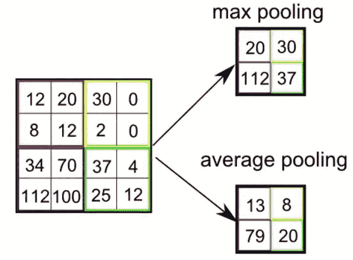

# 卷积神经网络——去神秘化

> 原文：<https://medium.com/analytics-vidhya/convolutional-neural-networks-demystified-80f72c1ea31b?source=collection_archive---------17----------------------->

人工智能在过去十年里变得非常先进。它甚至在一些任务中表现出接近人类水平的准确性，如图像分类和物体检测。

2012 年，当 Alex Krizhevsky 和他的队友赢得 ImageNet 比赛时，计算机视觉领域出现了突破。他们建立了一个卷积神经网络架构来解决图像分类问题。

这是计算机视觉新时代的开始，到目前为止，我们已经即兴构建了几个架构，如 VGG16、VGG19、ResNet50、ResNet150，这些架构几乎以人类水平的精度解决了计算机视觉问题。卷积神经网络是所有这些架构的基础。

但是这个卷积神经网络是什么，它是如何工作的。我将在本文中一步一步地解释它，但首先，我们需要有一些基础知识，比如什么是神经网络，它与卷积神经网络有什么不同( ***CNN*** )

# 什么是神经网络？

在非常高的层次上，神经网络是一种能够学习输入和输出之间关系的神经元架构。输入可以是图像的像素，输出可以是图像属于哪一类，像狗还是猫。如果你想了解更多关于神经网络的内容，你可以在这里 **查看我之前关于神经网络的博客 [**。**](/swlh/introduction-to-neural-networks-d0ff7e9a647b)**

# 为什么卷积神经网络优于传统方法？

有一些传统的方法来解决图像问题，如使用模板匹配和酉图像变换等特征工程的机器学习算法。它们是图像相关问题的解决方案，如人脸检测、人脸识别、图像分类或物体检测。但所有这些方法都是基于手工编码的特征，当你将这些特征输入到机器学习算法中时，它们不会将其推广到更广泛的数据集。因此，它们在现实世界中是行不通的。

# 卷积神经网络如何优于传统方法？

高级卷积神经网络

CNN 网络将输入视为图像，并尝试从中提取特征，而不是手动编码的特征，因此它在学习特征方面具有更大的灵活性。

人工神经网络( ***ANN*** )将输入作为所有特征，并试图学习所有输入特征和输出之间的函数。

在这种情况下，我们的输入特征是图像原始像素，可能与输出没有良好的关系，因此，如果我们直接使用 **ANN** 来完成图像分类等任务，它会将所有像素视为特征，并遇到一个称为维数灾难的问题。

但是如果我们使用 CNN，它将首先尝试使用称为**滤波器**的权重矩阵从图像中提取特征，然后创建一个通常被称为**特征图**的特征图。然后，该特征图将被传递到人工神经网络或网络的密集层上，以进行预测。

特征地图是在训练过程中学习的，因此我们可以给出任何类型的图像，网络将尝试提取和学习它生成的特征。

# 这些地图是如何创建的，过滤器在这个过程中有什么帮助？

使用称为**过滤器**或**内核**的权重矩阵来创建特征图。最初，这些权重是随机分配的，就像网络中的其他权重一样，但它们是在训练过程中学习的。

使用滤波器的特征提取

在这个例子中，图像输入为 6*6，我们有一个 3*3 的滤波器来提取特征。首先，我们从 6*6 的图像中提取 3*3 的一部分，然后我们计算过滤器和图像的这一部分之间的点积，最终生成一个数字。在本例中，我们生成了 31 个。

实际上，我们有 RGB 通道的图像，这意味着在这种情况下图像将是 6*6*3，部分将是 3*3*3，过滤器也是如此。想象一下，只需将 3*3*3 的向量展平为 1*27，然后在内核和图像部分之间取点积。

现在，我们对整个图像重复这一过程，通过在整个图像上移动过滤器，最终生成二维**图**或矩阵。我们把这个图叫做**特征图**。在实践中，我们使用不止一个滤波器来从图像中提取更多的特征。通常使用的过滤器数量通常是 2 的倍数，如 32、64、128 或 256。

假设我们采用了 **n** 个滤波器，那么我们从卷积层输出的大小将是*某个数字*某个数字*****n****。*

填料

有时在实践中，我们希望使用图像的每个部分提取更多的特征，所以我们使用填充。填充只是在图像的角上加零，这有助于我们创建一个更大的图像，这样我们就可以提取更多的特征。也是一种生成一定大小的特征地图的技术。

我们还在卷积层中使用 stride，这是您在生成特征地图时希望在图像上采取的步骤。我们可以使用此公式来计算将要创建的要素地图的大小:

> **n-2 * p+f/s→某数**

n 是图像的输入尺寸。*(如果图像是 100*100，那么 n 就是 100)*

p 是填充*(某数)*

f 是过滤器尺寸*(如果过滤器尺寸是 3*3，则 f 是 3)*

s 是步幅*(某数)。*

现在我们已经了解了要素地图和卷积图层。我们使用一些额外的技术来改进结果。CNN 架构中还有两个常见组件。这些是**池层**和 **Relu** 激活功能

# 汇集层

一个**池层**是一个 **CNN** 的另一个积木。它的功能是逐渐减小表示的空间大小，以减少网络中的参数和计算的数量。汇集**层**在每个特征地图上独立操作。

整体思路是缩小要素地图的大小，仅保留网络中的重要要素。

## 共用的常见方式

1.  最大池化
2.  最小池
3.  平均池

在了解每种类型的池之前，让我们先了解池是如何工作的。

CNN 中的池层

在上图中，假设我们已经创建了一个 **4*4** 的特征图，现在我们想缩小这个特征图的尺寸。我们可以使用池层和池大小。

池大小就是在缩小规模的每个步骤中使用的特征图的大小。这里我们用了 2*2。这将从特征地图中裁剪出 2*2 的地图，然后从中提取最大数量。( ***最大汇集*** )

将对每个特征地图独立地重复该过程。我们可以使用最大池来获取最大数量。我们可以使用 Min Pooling 获取最小数量，也可以使用 Average pooling 获取该区域所有数量的平均值。最常见的是最大和平均池。

既然我们已经使用了池层来缩小特征地图，我们可以使用 Relu 激活功能来优化特征地图。

# Relu 激活功能

> 给定一个输入或一组输入，节点的**激活函数**定义该节点的输出。激活函数决定哪些信息应该在网络中前进，哪些信息应该被忽略。

神经网络中使用了不同的激活函数，如 sigmoid、Relu、Tanh、leaky Relu，但 CNN 的 **Relu** 是使用最多的激活函数。

Relu 激活功能- CNN

Relu( *整流线性单元*)就是给定输入正 x 的正 x，以及负 x 的零。这有助于改进特征，并且计算梯度也变得更快，因为对于所有负 x，它将是 0。

Relu 对特征地图的影响

使用 Relu 激活函数细化特征映射中的值。所有负值变为零，所有正值保持不变。这有助于我们确定要素的重要性以及该要素在网络中的位置。

有时我们在池层之后使用 Relu，有时在池层之前使用它。它是实践者和问题陈述的完整架构选择。

这个过程可以重复几层，如 Vgg16、Vgg19，但卷积神经网络的基本组件保持不变。

一旦我们提炼了这些特征，我们就使用人工神经网络或密集层，最终学习输入和输出之间的函数。

让我们假设我们最终有一个 30*30*20 的特征图，然后我们可以将该特征图展平并将其传递给人工神经网络。在这种情况下，输入将是 1*18000。这是一个非常大的向量，处理起来会很昂贵。

这就是我们使用池层和激活函数的原因，这样我们可以减少最终向量的大小，并且只保留手头问题陈述所需的信息。

一旦我们提取了所有的特征并提炼出来。我们可以使用神经网络来完成这项任务。我们可以使用这种神经网络来完成各种任务，如图像分类、目标定位、图像分割。架构将根据问题陈述而变化，但核心思想将保持不变。

我希望你从这篇文章中学到了一些东西。我会写更多关于循环神经网络的文章。