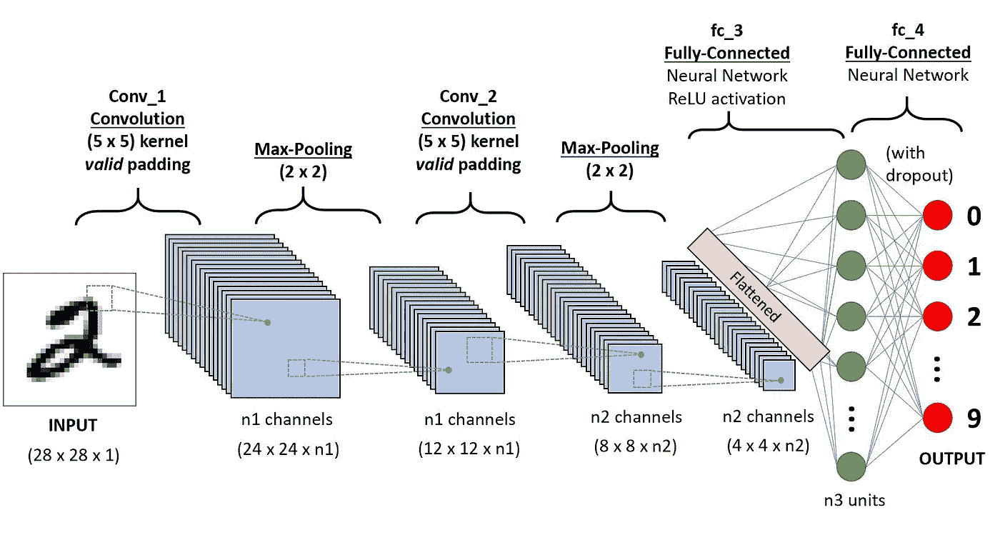
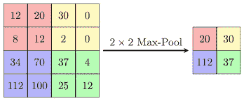
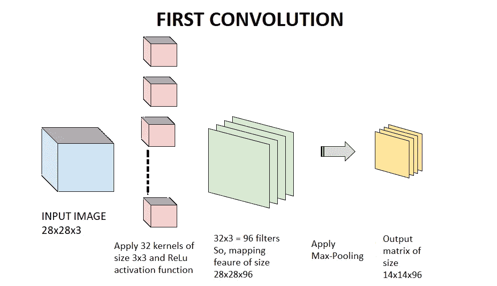
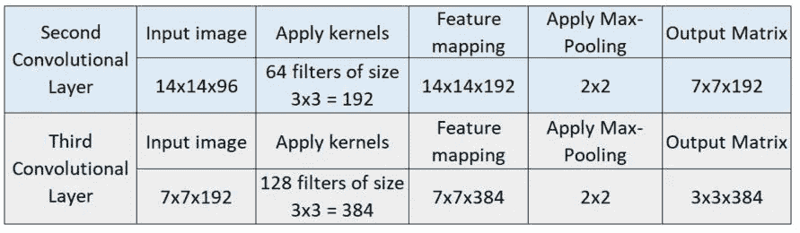
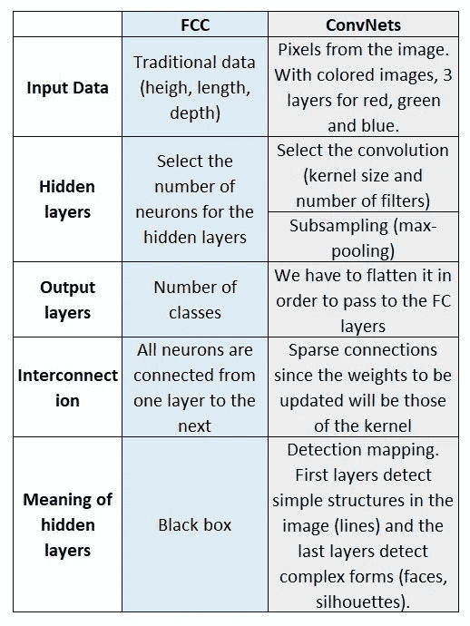

# 简明英语中的卷积神经网络

> 原文：<https://medium.com/analytics-vidhya/convolutional-neural-networks-in-plain-english-b5464f704a50?source=collection_archive---------23----------------------->

在深度学习中，卷积神经网络(也称为 CNN 或 ConvNet)是一类深度神经网络，最常用于分析图像和视觉图像。为此，ConvNets 有几个专门的和分层的隐藏层。这意味着第一层可以检测直线或曲线，而更深的层可以识别更复杂的形状，如人脸或动物轮廓。

卷积神经网络的典型架构([来源](https://towardsdatascience.com/a-comprehensive-guide-to-convolutional-neural-networks-the-eli5-way-3bd2b1164a53)

# **康文内斯的食谱**

1.  **大量带标签的数字图像**用于训练**。**对于计算机来说，数字图像就是只不过是表示像素网格上特定位置的红色、绿色和蓝色变化的数字。这些矩阵应该进行预处理，这意味着扁平化和规范化。
2.  现在开始了 ConvNets 的独特过程:**卷积**。这包括从输入图像中提取一组相近的像素，并对一个称为内核的小矩阵进行卷积(实际上它是一个标量积)，从而生成输出矩阵。实际上，我们不仅仅应用一个内核，而是应用几个内核(内核的集合被称为过滤器)来产生几个输出图像。这些新图像用于检测与原始图像不同的特征。
3.  **激活功能**。ConvNets 中最常见的隐藏层激活函数是整流线性单元或 ReLu，定义为 *f(x) = max(0，x)。*
4.  除了卷积，ConvNets 几乎总是使用另一种叫做**池的操作。**其功能是逐步减少层的尺寸，从而*减少网络中的参数数量* *和计算量*。联营最常用的方法是**最大联营**。

2x2 最大池(图片由作者制作)

卷积层、激活功能和池层的组被称为**卷积层**。那么，在一个卷积层之后，我们是否已经完成了模型？不要！！！现在更多的回旋！

第一个卷积层(图片由作者制作)

在第一次卷积中，我们的模型只能检测简单的特征，如直线或曲线。因此，为了能够识别更复杂的形式，我们需要添加更多的层。下表总结了多层网络的发展

(表格由作者制作)

在第三个卷积层之后，我们得到一个大小为 3x3 的图像。所以不可能继续了。有了更大的图像，我们可以继续进行卷积。

现在，我们已经接近终点了！

## **连接到完全连接的层。**

为了最终构建我们的模型，我们需要将最后一个输出层连接到一个完全连接的层。然而，由于最后一层是一个 3D 数组(3x3x384)，我们需要将其转换为一个矢量，因此我们将其展平(并获得一个 3x3x384=3456 的矢量)。

然后，在一个或多个完全连接的层之后，我们应用最终的激活函数。通常，Softmax 激活功能。

**全连接层与 ConvNet 的比较。**

(表格由作者制作)

**康文网络的优势是什么？**

在完全连接的层中，每个输出单元都与每个输入单元交互，这使得训练和适应存储器的训练成本极高。然而，卷积网络具有稀疏的相互作用，因此我们需要存储更少的参数，这既降低了模型的内存需求，也减少了操作的数量。此外，ConvNets 不容易过度拟合数据。

在接下来的博文中，我们将在 TensorFlow 2.0 中编写一些经典的 ConvNets