# 使用 Numpy 的卷积神经网络

> 原文：<https://medium.com/analytics-vidhya/convolutional-neural-networks-using-numpy-part-1-f4f8ab26cccb?source=collection_archive---------5----------------------->

## 第 1 部分:在两类时尚 MNIST 图像分类任务上使用单层卷积滤波器和单个密集层


在 [Unsplash](https://unsplash.com?utm_source=medium&utm_medium=referral) 上由 [Franck V.](https://unsplash.com/@franckinjapan?utm_source=medium&utm_medium=referral) 拍摄的照片

有许多强大的工具，如 Keras 和 Tensorflow，可以用来制作卷积神经网络(CNN)。然而，除非我已经打开了引擎盖，偷看了里面，我并不真正满意我知道一些事情。如果您和我一样，请继续阅读，看看如何使用 Numpy(和 Scipy)从头构建 CNN。

*这个帖子的代码在我的* [*资源库*](https://github.com/borundev/DNN_Lectures) *里有。*

我将这篇文章分成多个部分。到目前为止，我已经计划了两个部分。首先，我将只做一个关于时尚 MNIST 的两类分类问题，仅限于两类。图像是单色的，CNN 将只有一个卷积滤波器，后面是一个致密层。这种简单性将使我们能够专注于卷积的细节，而不必担心附带的复杂性。在第二篇文章中，我将处理完整的时尚 MNIST 数据集(10 类)和多重卷积滤波器。我还将查看 CIFAR-10 数据集，该数据集包含 10 类彩色图像。我可能会在第三篇文章中强调一些关于卷积的其他方面。

这是一个技术性的职位，并且假定你对代数和微积分有一定的了解。虽然我知道一个不懂高等数学的人可以用 tensorflow 做很多事情，但我不明白没有 tensor flow 怎么可能在引擎盖下偷看。代数在前向传递中是必不可少的，并且代数和微积分对于计算损失函数相对于网络权重的导数是有用的，这是我以封闭形式导出的。这些用于更新权重，通常称为反向传播。不愿意经历推导过程但能够理解最终表达式的读者仍然可以通过理解最终结果并在 numpy 中实现(或遵循我的实现)而受益。

# 盘旋

在本节中，我们将讨论图像处理中卷积的确切含义，以及它与 scipy 中实现的关系。这很有用，因为 scipy 实现比简单的 numpy 实现快得多。最后，我们将考虑一个手动计算卷积的例子，并使用 scipy 作为健全性检查。为简单起见，本节我们将在 1 维中工作，但论点可以简单地扩展到任何维数。

数学上，函数 f 与函数 g 的卷积被定义为

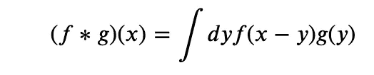

物理学中的卷积

这个定义在物理学和信号处理中是有用的。例如，在电磁学中，g 可以是电荷密度，f(在这种情况下称为格林函数)将帮助我们计算由于所述电荷分布而产生的电势。(详见杰克逊等电磁学书籍或佩斯金、施罗德等粒子物理学书籍)。

在图像处理中，这个定义有点落后，因为对于长度为 *𝐾、*的卷积窗 g，我们希望在 *𝑥* 的卷积是 *𝑓* 的加权平均值，使得在*𝑥*-*𝐾*/2+*𝑦*的值被 *𝑔* ( *𝑦* )加权。因此，为了图像处理的目的，正确的定义是

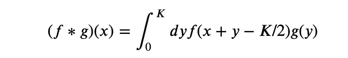

图像处理卷积

*请注意，这将需要 f(x)的值作为 x 的负值，如果按原样放入，则 numpy 会将负数解释为从数组末尾开始的索引。因此，在 numpy 中实现这一点时，我们需要确保原始数组嵌入到一个更大的 0 填充数组中，并且正确理解负索引。*

在我们的 CNN 实现中，我们将使用 scipy.convolve，因为它将比 numpy 中的简单实现更快。因此，了解 scipy.convolve 与我们想要的东西之间的联系是很有用的。Scipy 的卷积用于信号处理，因此它类似于传统的物理定义，但由于数组位置从 0 开始的 numpy 约定，g 的窗口中心不在 0 处，而是在 K/2 处。所以 scipy.convolve 使用了这个定义

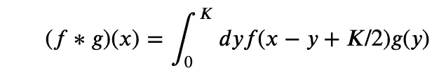

scipy .旋花

现在，如果我们反转这个卷积窗，我们得到 y ->K-y，这就是积分

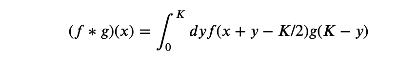

在将卷积滤波器数组交给 scipy.convolve 之前对其进行反转的结果

因此**我们将通过把卷积窗口的反转数组交给 scipy.convolve 来得到我们想要的结果。**

例如，考虑下面给出的信号和滤波器。

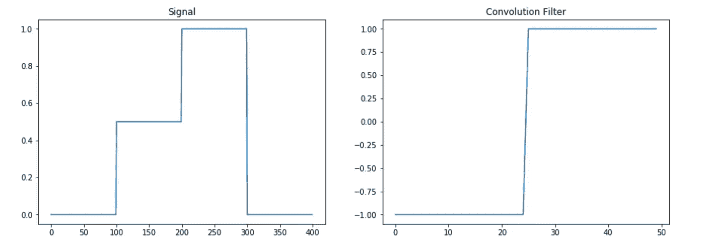

信号和与之卷积的滤波器

然后，我们手动实现卷积，并在下面的命令中使用 scipy

```
convolve(sig,win[::-1],'same')
```

结果绘制如下。建议读者通过目测图表或自己实施这两种方法来说服自己结果是相同的。

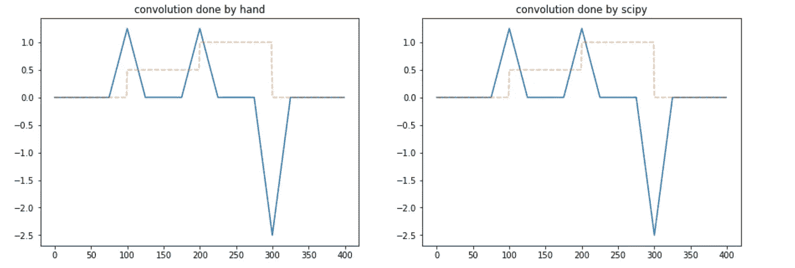

手动和手动卷积的结果。

我们现在准备使用 numpy 实现 CNN。

# 两级分类

作为我们的第一个例子，我们使用 numpy 实现了两个类的分类。我会详细讨论这一点，对于后面帖子中的其他示例，我希望读者已经详细理解了这个示例，并且理解得更快一些。

对于数据，我们将使用时尚 MNIST。我们从 Keras 那里得到这个，因为它很容易得到，但是请注意这是 Keras 在这篇文章中的唯一用途。

```
(X_train_full, y_train_full), (X_test, y_test) = keras.datasets.fashion_mnist.load_data()
```

然后我们将数据集限制在第 1 类和第 3 类。

```
cond=np.any([y_train_full==1,y_train_full==3],0)X_train_full=X_train_full[cond]
y_train_full=y_train_full[cond]
X_test=X_test[np.any([y_test==1,y_test==3],0)]
y_test=y_test[np.any([y_test==1,y_test==3],0)]y_train_full=(y_train_full==3).astype(int)
y_test=(y_test==3).astype(int)
```

然后，我们将训练集分成训练集和验证集

```
X_train, X_valid = X_train_full[:-1000], X_train_full[-1000:]
y_train, y_valid = y_train_full[:-1000], y_train_full[-1000:]
```

最后，我们将数据标准化，因为神经网络最适合处理平均值和单位标准偏差为零的数据。

```
X_mean = X_train.mean(axis=0, keepdims=True)
X_std = X_train.std(axis=0, keepdims=True) + 1e-7
X_train = (X_train - X_mean) / X_std
X_valid = (X_valid - X_mean) / X_std
X_test = (X_test - X_mean) / X_std
```

我们的数据是单色图像，以 L×L(这里 L=28)的矩阵形式出现。为了简单起见，我们只有一个卷积层(我们将在后面的文章中放宽这一限制)，它是一个大小为 K×K(在我们的例子中我们取 K=3)的矩阵，其权重可以学习。此外，我们还有一个密集层，它是一个大小为(L*L) x 1 的矩阵。注意，我们没有保留偏见术语，一旦读者理解了这个例子，就可以把它们作为练习。

我们现在详细描述正向传递、误差和反向传播。

## 前进传球

*   我们得到的图像，并将其作为第 0 层𝑙
*   我们将居中的图像嵌入到大小为( *𝐿* + *𝐾* ， *𝐿* + *𝐾* )的图像中，并填充零

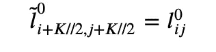

*   然后，我们将它通过一个卷积层和一个激活函数 f1(我们将把它称为 Relu)。这是第一层 l1。

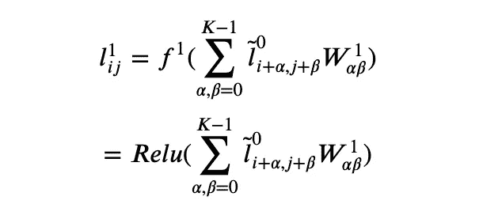

*   最后，我们制作一个包裹在函数 f2 中的稠密层(在这种情况下，我们认为它是一个 sigmoid 函数)。这是第二层 l2。

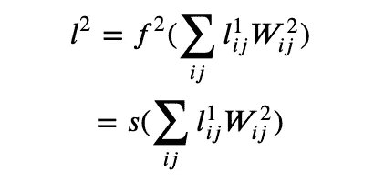

*请注意，尽管权重 W2 是针对密集层的，但我们在此处写入的指数没有进行展平，因为它有一个直观的解释，即它取卷积图像的每个像素并进行加权求和。然而，将两者拉平并做一个数字点会更有性能，这就是我们在下面的代码中所做的。*

## 损失函数

对于损失函数，我们采用通常的对数损失

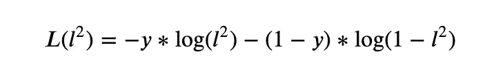

损失函数

其中 y 是真实结果。

## 反向传播

反向传播只是一个花哨的词，用来表示所有可学习的权重都通过损失函数相对于正在学习的权重的梯度来校正。使用链式法则来区分关于 W1 和 W2 的损失函数是很简单的。

*   损失函数相对于层 2 的导数为

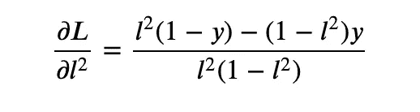

*   损失函数相对于密集层权重的**导数为**

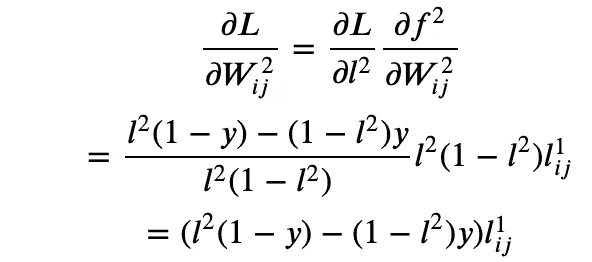

其中我们使用了 l2 是 sigmoid 函数 s(x)的输出以及 s'(x)=s(x)(1-s(x))的事实。

*   类似地，损失函数相对于层 1 的导数为

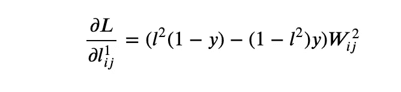

*   损失函数相对于卷积滤波器的**导数为**

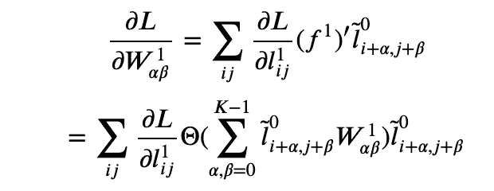

现在，我们已经有了损失函数的导数相对于卷积滤波器的权重以及最终密集矩阵的封闭形式的表达式，因此我们可以将权重(具有学习速率的超参数)更新为

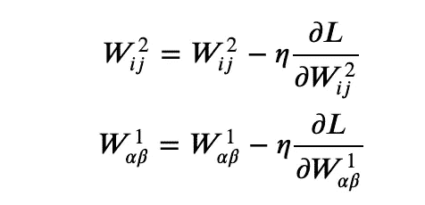

**就这样。**

这就是编写 CNN 实现所需的全部内容。在此之前，我们首先注意初始随机权重的损失函数和准确性，以便有一个基准。

## 训练前的损失和准确性

在训练开始之前，平均损失可以从损失的表达式中分析获得，并且是 1。精度为 0.5。我们将在五个时期内运行我们的代码，并在测试和验证集上查看损失和准确性。

## 代码

首先，我们为 Relu、它的导数和 sigmoid 函数编写一些自定义函数，这是主代码和一个函数所需要的，该函数只进行前向传递，并在验证集上计算损失和精度

```
def relu(x):
    return np.where(x>0,x,0)

def relu_prime(x):
    return np.where(x>0,1,0)def sigmoid(x):
    return 1./(1.+np.exp(-x))def forward_pass(W1,W2,X,y):
    l0=X
    l0_conv=convolve(l0,W1[::-1,::-1],'same','direct') l1=relu(l0_conv) l2=sigmoid(np.dot(l1.reshape(-1,),W2))
    l2=l2.clip(10**-16,1-10**-16) loss=-(y*np.log(l2)+(1-y)*np.log(1-l2))
    accuracy=int(y==np.where(l2>0.5,1,0)) return accuracy,loss
```

现在我们编写代码的主要部分

```
# learning rate
eta=.001for epoch in range(5): # custom code to keep track of quantities to 
    # keep a running average. it is not shown for clarity. 
    # the reader can implement her own or ask me in the comments. train_loss, train accuracy=averager(), averager()

    for i in range(len(y_train)):

        # Take a random sample from train set
        k=np.random.randint(len(y_train))
        X=X_train[k]
        y=y_train[k]

        ##### FORWARD PASS ###### # First layer is just the input
        l0=X

        # Embed the image in a bigger image. 
        # It would be useful in computing corrections 
        # to the convolution filter lt0=np.zeros((l0.shape[0]+K-1,l0.shape[1]+K-1))
        lt0[K//2:-K//2+1,K//2:-K//2+1]=l0

        # convolve with the filter
        # Layer one is Relu applied on the convolution        l0_conv=convolve(l0,W1[::-1,::-1],'same','direct')
        l1=relu(l0_conv) # Compute layer 2
        l2=sigmoid(np.dot(l1.reshape(-1,),W2))
        l2=l2.clip(10**-16,1-10**-16)

        ####### LOSS AND ACCURACY #######
        loss=-(y*np.log(l2)+(1-y)*np.log(1-l2))
        accuracy=int(y==np.where(l2>0.5,1,0))

        # Save the loss and accuracy to a running averager
        train_loss.send(loss)
        train_accuracy.send(accuracy) ##### BACKPROPAGATION #######

        # Derivative of loss wrt the dense layer
        dW2=(((1-y)*l2-y*(1-l2))*l1).reshape(-1,)

        # Derivative of loss wrt the output of the first layer
        dl1=(((1-y)*l2-y*(1-l2))*W2).reshape(28,28)

        # Derivative of the loss wrt the convolution filter f1p=relu_prime(l0_conv)
        dl1_f1p=dl1*f1p
        dW1=np.array([[
           (lt0[alpha:+alpha+image_size,beta:beta+image_size]\
           *dl1_f1p).sum() for beta in range(K)
        ]for alpha in range(K)]) W2+=-eta*dW2
        W1+=-eta*dW1 loss_averager_valid=averager()
    accuracy_averager_valid=averager()   

    for X,y in zip(X_valid,y_valid):
        accuracy,loss=forward_pass(W1,W2,X,y)
        loss_averager_valid.send(loss)
        accuracy_averager_valid.send(accuracy)

    train_loss,train_accuracy,valid_loss,valid_accuracy\
            =map(extract_averager_value,[train_loss,train_accuracy,
                 loss_averager_valid,accuracy_averager_valid])

    # code to print losses and accuracies suppressed for clarity
```

在我的试运行中，我得到了以下结果。你的应该差不多

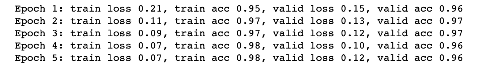

我们可以看到，即使这个简单的模型也将损失从大约 1 减少到 0.1，并将准确度从 0.5 增加到大约 0.96(在验证集上)。

我们可以通过绘制一些(标准化的)图像以及它们与原始随机滤波器和最终训练的滤波器的卷积来可视化卷积。

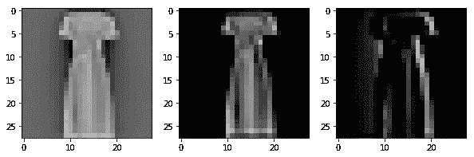

使用初始随机滤波器和最终学习滤波器的图像 1 的卷积

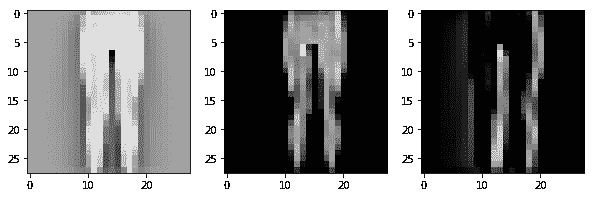

使用初始随机滤波器和最终学习滤波器的图像 2 的卷积

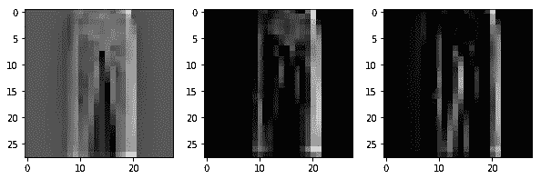

使用初始随机滤波器和最终学习滤波器的图像 3 的卷积

我们看到卷积滤波器似乎已经学会了识别右边缘。当我们训练多个过滤器时应该更好，但是我们通过只有一个过滤器来保持事情简单。(这个选择本身就是一个超参数)。在结束这篇文章的第一部分之前，我们还可以做一件事。我们可以制作另外两个模型:1)我们冻结卷积层权重，2)我们冻结密集层权重。这将有助于我们了解这些层是否有助于该过程。这很容易。对于前者，我们注释掉 W1 的更新行

```
W2+=-eta*dW2
# W1+=-eta*dW1
```

对于后者，我们注释掉 W2 的更新行

```
# W2+=-eta*dW2
W1+=-eta*dW1
```

由此产生的损耗和精度为

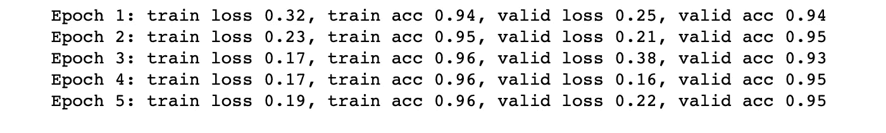

冻结卷积层的性能

和

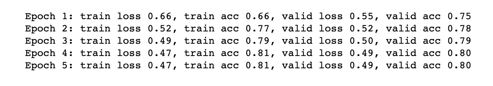

冻结致密层的性能

分别是。很明显，大部分工作是由密集层完成的，但我们仍然可以通过卷积层获得 0.5 的损失和 0.8 的精度。据推测，随着过滤器数量的增加，这种性能将会提高。我们将在以后的文章中探讨这个问题。