# 使用 Numpy 的卷积神经网络—第 2 部分

> 原文：<https://medium.com/analytics-vidhya/convolutional-neural-networks-using-numpy-part-2-27bdd34a32a3?source=collection_archive---------14----------------------->

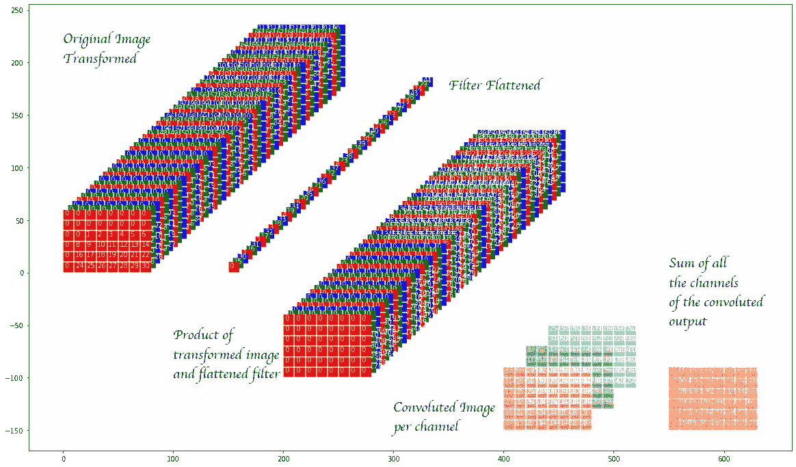

# **动机**

这篇文章展示了使用 numpy 实现卷积神经网络(CNN)。我早些时候在[写过一篇类似的文章](https://blog.lore.ai/convolutional-neural-networks-using-numpy-part-1/)，但那篇文章更侧重于解释什么是卷积，特别是 CNN，而在这篇文章中，重点将更多地放在*通过使用矢量化*在 numpy 中有效地实现它们。

值得指出的是，与 tensorflow、pytorch 等软件包相比。一般来说，使用 numpy 在速度上没有任何好处。事实上，如果包括开发时间，它很可能更慢。帖子的想法不是宣传 numpy 对速度的使用，而是分享作者重建轮子的经验。虽然同样的东西经常被嘲笑，甚至被妖魔化，但只有改造几个轮子，人们才能发明新的机器。更不用说，有时重建车轮只是普通的乐趣！

我们将只关注它的 CNN 部分，其他相关方面如激活函数和 maxpooling 等将不会在这里讨论，因为它们可以作为作用于 CNN 层输出的独立层来实现。然而，我们确实讨论了卷积过程固有的填充和步幅。

这篇文章的代码可以在[资源库](https://github.com/borundev/DNN_Lectures)中找到，大部分代码包含在文件 [CNN.py](https://github.com/borundev/DNN_Lectures/blob/master/Layers/CNN.py) 中

因为这篇文章的目标是展示如何在 numpy 中高效地实现 CNN，所以我不会在这篇文章中提供所有代码，而是解释用大量可视化和相关代码来做什么的想法。当然，所有代码都可以在前面提到的存储库中找到。

# 卷积神经网络

## 前进传球

我们将使用多通道处理**二维图像。对于实际图像，单色图像的通道数为 1，彩色图像的通道数为 3(简称为红/绿/蓝或 RGB)。然而，CNN 本身可以作用于前一个 CNN 的输出，然后通道的含义是前一层的不同滤波器的输出，因此通道的数量可以是任何正整数。然而，在下面的**中，我们具体讨论了 3 个通道，同时将它们着色为 RGB，以帮助可视化该过程**。**

卷积层具有作为可学习参数的过滤器权重和两个超参数-步幅和填充。这些在下面表示为

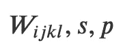

重量、步幅和衬垫。对于权重，第一和第二索引以及卷积滤波器行和列以及第三和第四索引标识输入和输出通道的滤波器。原则上，对于不同的方向，步幅和填充可以不同，但是为了符号的简单，我们保持它们相同。存储库中的代码更加通用。

它们分别是一个四维张量和两个标量。权重的前两个维度在卷积滤波器的行和列上运行，而第三个维度在输入通道上运行，第四个维度在输出通道上运行。注意，对于图像的每个维度，步幅和填充可以不同，但是为了表示简单，我们在下面保持它们相同(尽管在实际代码中允许不同的值)。

我们将卷积层的输入表示为

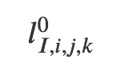

CNN 的输入。第一个索引是 minibatch 索引，第二个和第三个是行和列，第四个是通道。

其中索引分别是小批次、行、列和通道。输出类似地表示为

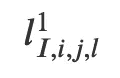

CNN 的输出。索引与输入的意义相同。

但是，请注意，除了小批量指数之外，其他指数的范围可能与输入指数的范围不同。这意味着输出图像大小和通道数量可能不同。

**填充**的概念来自于将该图像嵌入(可能)更大的 0 填充数组中

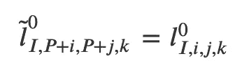

输入图像被填充(如果需要)在一个在行和列方向较大的数组中，并且被零填充。

其中 *𝑃* 是填充。**卷积**运算定义为

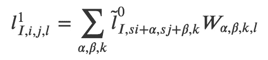

卷积运算。求和指数覆盖卷积滤波器的整个尺寸。

其中 *𝑠* 为**步距**。

为了理解上面的内容，我们通过拍摄一个大小为 6×8 的“图像”来可视化这个过程，该图像有三个通道，我们在其中顺序地填充值。因此，红色通道的第一行从 0 到 7，第二行从 8 到 15，依此类推，直到第六行上升到 47。绿色通道从 48 开始，以同样的方式填充。

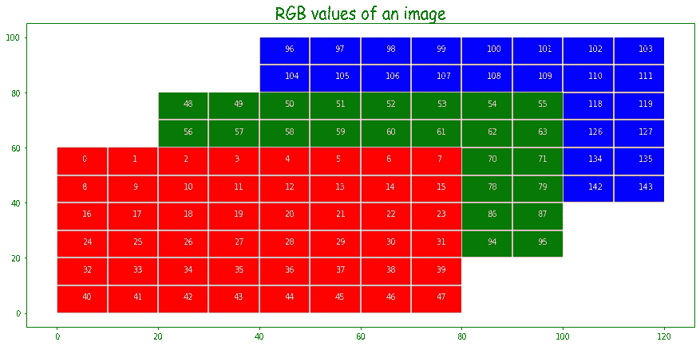

图像是三维阵列

在上面我们沿着深度方向绘制了通道。

我们制作了一个结构相同但大小不同的“过滤器”。具体来说，我们采用 5×3 尺寸的过滤器。*请注意，虽然这里有三个滤波器，每个滤波器对应一个输入通道，但这组滤波器只会产生一个输出通道。对于输出的每个通道，我们需要这三个滤波器的单独副本*。

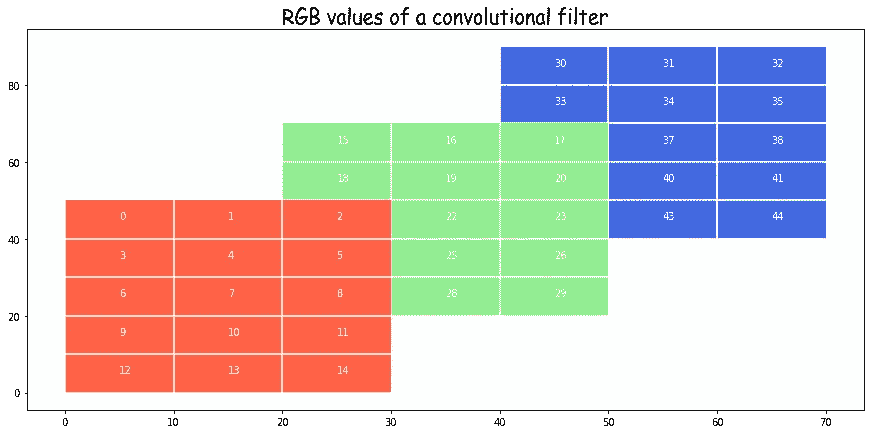

卷积滤波器是一个四维阵列，这里显示的是前三个维度。这三个与图像一起将在卷积上产生单个通道输出。因此，必须对输出的每个通道进行下面详述的操作。这听起来比实际困难，因为 numpy 矢量化处理了所有这些问题。

现在我们考虑红色滤光片对红色通道的影响。在此之前，再看一下上面的卷积表达式，试着理解发生了什么。

在下图的例子中，我们在 y 方向上采用了 2 的**填充**,在 x 方向上采用了 1 的填充。这意味着原始图像嵌入在一个 0 填充的数组的中心，该数组在 y 方向上大 4 倍，在 x 方向上大 2 倍。这确保了卷积的输出与输入大小相同(在没有步幅的情况下)，但我们不必这样做。填充可大可小。

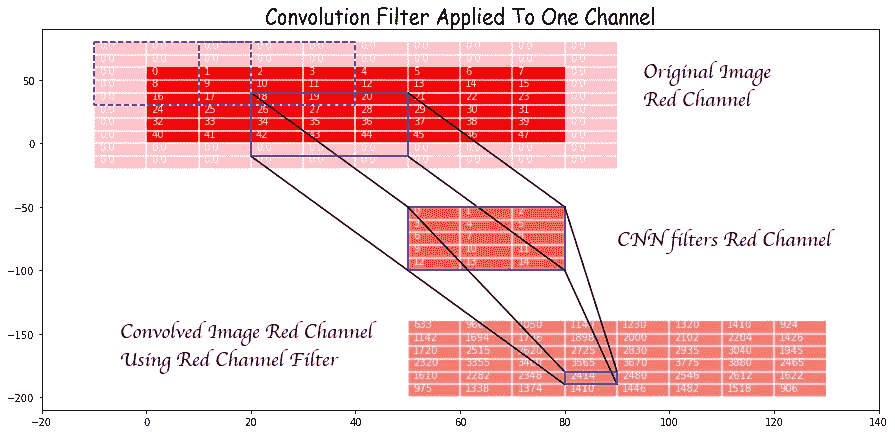

补零的原始红色通道与红色通道滤镜的卷积。敦促读者验证一些结果，以确保他们理解什么是卷积运算。

现在，看看红色滤镜对(较大的嵌入)图像部分的卷积效果，该图像位于从(4，3)开始的框中，大小与用纯蓝绘制的滤镜相同。窗口的每个元素乘以滤波器的相应元素，然后将结果相加。请注意，这涉及一行用零填充的值。这个和是红色通道卷积的第(4，3)个元素。如果我们没有零填充，我们甚至不能有这个条目，并且输出将被限制为来自完全适合原始(非零填充)图像的卷积滤波器的那些值。

让我们也来看看**大步走**。步幅的影响可以从理论表达式中看出。默认步幅为 1，其结果如上所示。然而，例如，如果我们选择步幅为 2，那么所使用的窗口将类似于蓝色虚线窗口，我们看到它们以步长 2 移动。

三个通道的*一个滤波器*的最终输出通过对三个通道的卷积求和给出，如下所示。

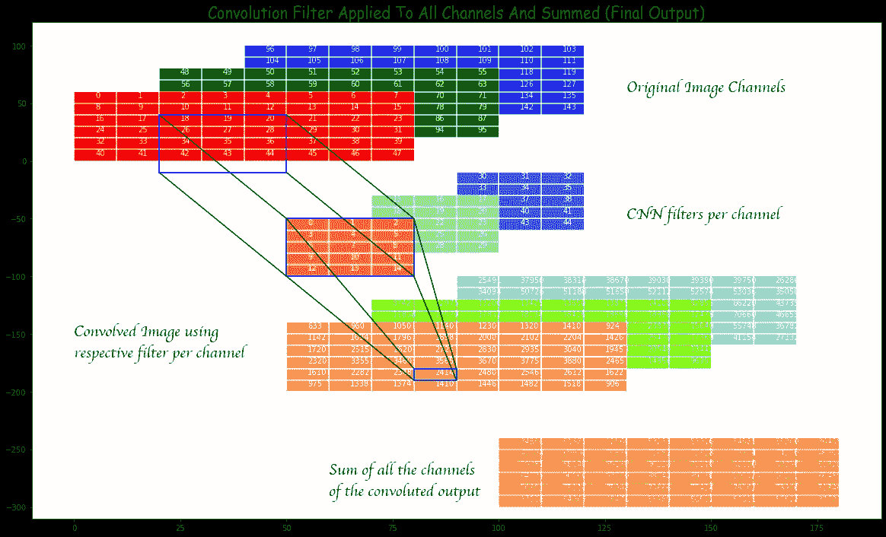

通过对每个输入通道的卷积值求和，产生最终输出。再次注意，这是单个输出通道上的输出。其他信道的输出使用相应的卷积权重组类似地产生。

## 反向传播

在反向传播期间，层**接收损耗相对于正向传递输出的导数作为输入**，并且**输出损耗相对于正向传递输入的导数**。如果权重是可学习的，则在反向传播期间，该层还根据权重更新规则调整权重。为了**权重更新**，需要损失相对于权重的导数。(*注意，我们隐含地只考虑依赖于损失的一阶导数的更新，但是讨论可以直接推广到使用高阶导数计算动量等的更新方法。)*
损失相对于权重的导数(熟悉微积分的人可以容易地导出)由下式给出

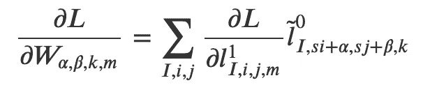

从损耗相对于输出的偏导数获得损耗相对于滤波器的偏导数。

损耗相对于输入的导数由下式给出

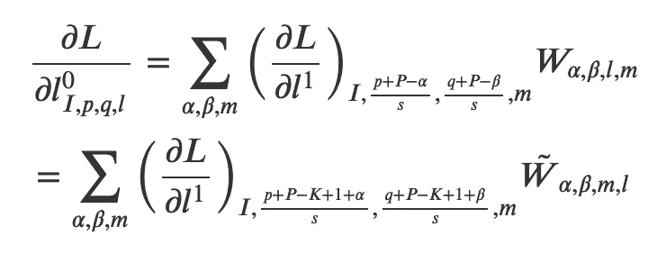

从损耗相对于输出的偏导数获得损耗相对于输入的偏导数。

在哪里

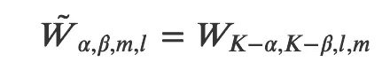

并且 *𝐾* 是过滤器尺寸。所有这些都可以用简单的代数和微积分的链式法则来计算。

并且 *𝐾* 是过滤器尺寸。所有这些都可以用简单的代数和微积分的链式法则来计算。

我们观察到，损耗相对于输入层的导数仅仅是误差相对于损耗相对于输出的导数的卷积，其中滤波器具有沿前两个方向相反的折射率。

这一观察告诉我们，我们可以重复使用卷积代码，但在此之前，我们仍需要处理包含损耗对输出的导数的数组。我们可以首先将关于输出的错误嵌入到一个数组中

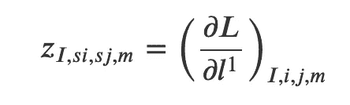

零填充损耗相对于输出的导数

根据*𝑃*—*𝐾*+1 的符号，z 的一部分被嵌入到右零填充的数组 y 中，或者 z 被嵌入到左零填充和右零填充的数组 y 中。这种推理不容易解释，我必须做的是仔细考虑填充大小的所有可能性，并找出正确的逻辑。当然，填充大小超过过滤器大小的一半似乎是不合理的，但是必须解决逻辑问题，以确保代码不会中断。如果读者找到一个简单的解释，我会很高兴收到同样的解释并更新这篇文章。这部分的代码如下。

```
def _prepare_back(self,der_y):
    mb, n1, n2, _ = self.prev_layer.shape
    ch = der_y.shape[3]

    m1 = max(self.stride_1 * der_y.shape[1], n1)
    m2 = max(self.stride_2 * der_y.shape[2], n2)

    z = np.zeros(shape=(mb, m1, m2, ch))
    y = np.zeros(shape=(
    mb, m1 + self.filter_size_1 - 1, m2 + self.filter_size_2 - 1, ch))

    z[:,
    :self.stride_1 * der_y.shape[1]:self.stride_1,
    :self.stride_2 * der_y.shape[2]:self.stride_2
    ] = der_y

    p1_left = self.padding_1 + 1 - self.filter_size_1
    p2_left = self.padding_2 + 1 - self.filter_size_2

    # i1,i2 are the start positions in z and iy1,iy2 are the start
    # positions in y
    i1 = i2 = iy1 = iy2 = 0

    if p1_left > 0:
        i1 = p1_left
    else:
        iy1 = -p1_left

    if p2_left > 0:
        i2 = p2_left
    else:
        iy2 = -p2_left

    # size of array taken from x
    f1 = z.shape[1] - i1
    f2 = z.shape[2] - i2

    y[:,
    iy1:iy1 + f1,
    iy2:iy2 + f2
    ] = z[:, i1:, i2:, :]
    return y
```

最后，我们有

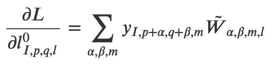

这只是一个简单的卷积。

# 一种高效的数字实现

这一切都很好，但以上述方式天真地实施，过程非常缓慢。这是因为有几个循环:

(I)在整个声道上移动声道特定滤波器(实际卷积)，
(ii)在输入声道上循环，
(iii)在输出声道上循环。
(四)在迷你吧上循环

如果实现巧妙，代码不仅可以使用 numpy 矢量化，还可以使用已经编写好的密集层(您可以在上面提到的库中找到实现)。在思考如何做到这一点时，我看到了西尔万·格鲁格的一个帖子，他做了一些类似的事情，我的想法也受到了同样的启发。但是，有两个不同之处:

(I)对于他的分析，通道索引是第二个，紧接在 minibatch 之后，标准图像格式将其作为最后一个，这就是我实现代码的方式

(ii)我对反向传播的实现是不同的。老实说，我不能跟随他的实现，我(显然)认为我的更干净，但他可能不同意。我将让读者自己决定哪个更好。

让我们再来看看卷积的表达式

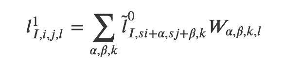

我们看到可以将滤镜*的指标 *𝛼* 、 *𝛽* 、*𝑘*𝑊*折叠成一个指标*𝜇*=*𝛼*∫*𝑓*2∫*𝑐*+*t22∫*在 numpy 中，这可以简单地通过**

```
W.reshape(-1,W.shape[-1])
```

我们需要相应地建立一个新的张量，它的元素要乘以整形后的𝑊的元素。可以肯定的是，这是一个复杂的过程，输出会有冗余，但它将允许加速，更重要的是，看看表达式

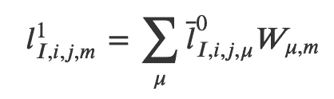

我们看到，它现在只是一个密集层，我们可以使用相同的前向传递和反向传播过程中的权重更新。寻找损失相对于 *𝑙* 0 的导数的反向传播是我们将很快解决的事情。

从" tilde l0 "(我希望 medium 允许 MathJax)获取" bar l0 "的过程非常简单，下面给出的代码很好地解释了这一过程。然而，让我们首先想象正在发生什么。

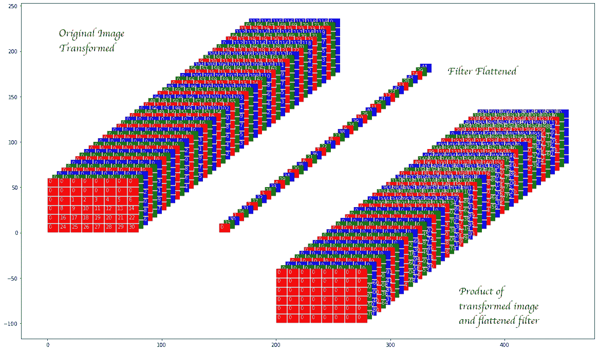

在上面的图像中，转换的原始图像由重新排列的零填充图像的元素组成(带有副本),因此每个面板(面板在深度方向上布局)包含所有要乘以卷积滤波器的一个元素的元素。卷积滤镜本身在深度方向上是散开的(在上面的图像中我们称之为扁平滤镜)。这两者乘积如下所示。

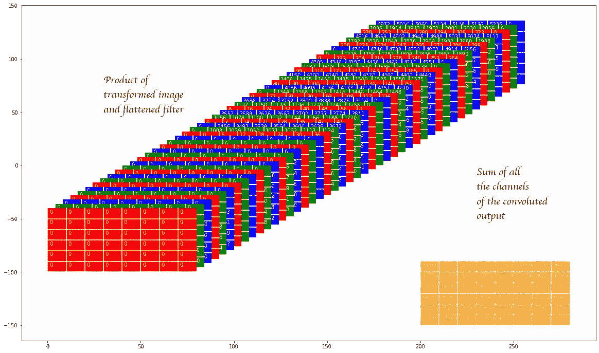

再次显示转换图像和平坦化滤波器的乘积，然后我们显示所有这些面板的总和。人们可以证实结果是相同的。

下面给出了从零填充图像获得上述变换图像的代码，这是本文的要点。同样，代码是 CNN 层的一部分，因此引用了“自我”,但是意思应该很清楚。

```
def _take(self, y, stride=(1, 1)): stride_1, stride_2 = stride
    mb, en1, en2, ch = y.shape # Till we discuss the minibatch index, all comments are for the first
    # image # Make a 2d array of indices of the top-left edges of the windows
    # from which to take elements. These are to be the indices on the
    # first channel. This makes the indices the top-left-back end of the
    # cuboid to be taken
    s1 = np.arange(0, en1 - self.filter_size_1 + 1, stride_1)
    s2 = np.arange(0, en2 - self.filter_size_2 + 1, stride_2)
    start_idx = (s1[:, None] * en2 * ch + s2[None, :] * ch) # Make a grid of elements to be taken in the entire cuboid whose
    # top-left-back indices we have taken above. This is done only for
    # the first of the above cuboids in mind.
    # Note the cuboid elements are flattened and will now be along the
    # 4th direction of the output
    g1 = np.arange(self.filter_size_1)
    g2 = np.arange(self.filter_size_2)
    g3 = np.arange(ch)
    grid = (g1[:, None, None] * en2 * ch + g2[None, :, None] *
            ch + g3[None, None, :]).ravel() # Combine the above two to make a 3d array which corresponds to just
    # the first image in a minibatch.
    grid_to_take = start_idx[:, :, None] + grid[None, None, :] # Make and index for the starting entry in every image in a minibatch
    batch = np.array(range(0, mb)) * ch * en1 * en2 # This is the final result
    res = y.take(batch[:, None, None, None] + grid_to_take[None, :, :, :])
    return res
```

相同的代码可用于损失相对于输出的准备好的导数(见上面的代码),以给出相应的变换版本来执行反向传播的卷积。

剩下的代码非常简单，可以在本文开头提到的资源库中找到。