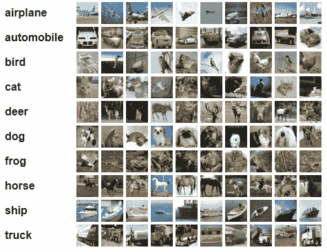
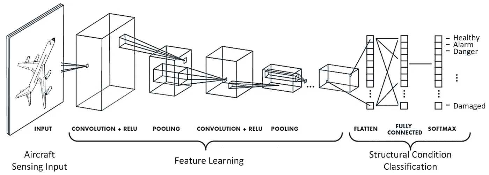
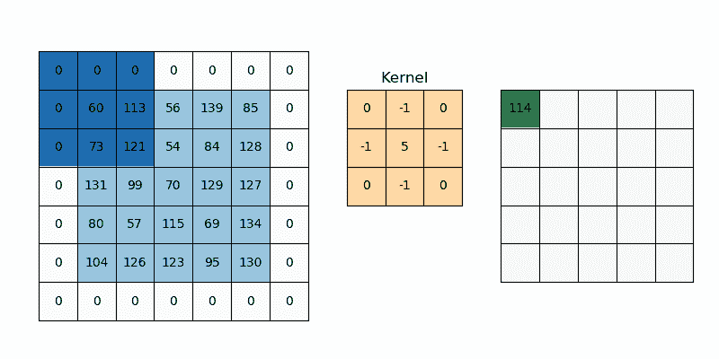
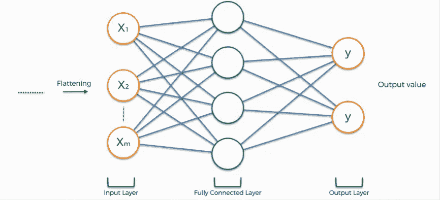
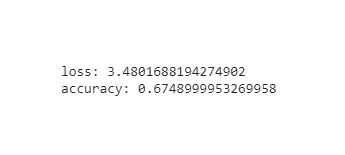
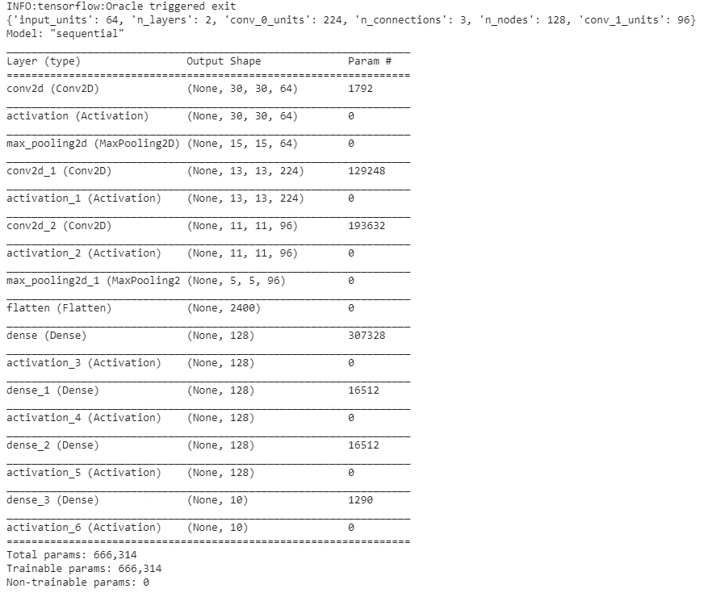
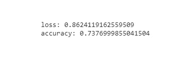

# CIFAR 10 上带有 Keras-Tuner 的卷积神经网络

> 原文：<https://medium.com/analytics-vidhya/convolutional-neuronal-network-with-keras-tuner-on-cifar-10-b4271ca4643d?source=collection_archive---------5----------------------->

*应用 Keras-Tuner 寻找最佳 CNN 结构*



卷积神经网络是一种用于图像数据分析和分类的监督算法。当我开始这个项目时，我知道 CNN 的基本知识和结构，但我不知道我应该放多少。

# 卷积神经网络的结构



https://www.mdpi.com/1424-8220/19/22/4933/htm

*图片摘自* ***《一种用于复杂复合材料结构冲击检测与表征的卷积神经网络》*** *作者* [**尤莲娜·塔比安**](https://sciprofiles.com/profile/876720) 、 [**海陵·傅**](https://sciprofiles.com/profile/379880) 、 [**扎赫拉·沙里夫·科达耶**](https://sciprofiles.com/profile/198359) **。**

卷积神经网络包括:

## 2D·conv:



[https://www . pyimagesearch . com/2018/12/31/keras-conv2d-and-卷积-层/](https://www.pyimagesearch.com/2018/12/31/keras-conv2d-and-convolutional-layers/)

2d 接受一个三维输入，并将其传递给一个**卷积核，**这个是一个矩阵，它与输入相乘，通过这种方法我们可以从输入中得到一些隐含的特征。

Conv2D 的一个优点同时也是一个缺点是，我们可以选择输出的维数，即卷积中应用的滤波器数量，大多数情况下我们选择通道 32 或 64，甚至 2 的幂，但这取决于程序员。

缺点发生在选择通道数量时，
因为原则上我们不知道最精确模型的合适通道数量，并且为每个通道运行代码不是最佳的，并且会持续很长时间。

## **池化(最大值):**


[https://www . geeks forgeeks . org/CNN-introduction-to-pooling-layer/](https://www.geeksforgeeks.org/cnn-introduction-to-pooling-layer/)

池图层会将每个要素地图的大小缩小 1/2，从而将每个要素地图中的像素或值的数量减少到 1/4。

池操作是指定的，而不是学习的。汇集操作中使用的两个常见函数是:

*   **平均汇集**:计算特征图上每个面片的平均值。
*   **最大池(或最大池)**:计算特征图每个面片的最大值。

使用最多的池层是 Max，在这种情况下，我们将把它用于 Cifar。

## 通常在进行展平之前进行至少两到三个连续的卷积和汇集步骤。

这里又出现了另一个问题，原则上我们不知道为了得到最精确的模型应该进行多少次卷积和合并。

# 变平


[https://www . superdata science . com/blogs/convolutionary-neural-networks-CNN-step-3-flatting](https://www.superdatascience.com/blogs/convolutional-neural-networks-cnn-step-3-flattening)

这可能是最容易的一步。

基本上我们要把所有的特征图展平成一列作为图像。

# 全连接层



[https://www . superdata science . com/blogs/convolutionary-neural-networks-CNN-step-4-full-connection](https://www.superdatascience.com/blogs/convolutional-neural-networks-cnn-step-4-full-connection)

CNN 的最后一步是获取前一层的输出，“展平”并将它们转换成一个向量，这个向量可以是一个概率或一个类的输出。

在这一步我们可以选择两件事:

**有多少个节点？**我们的前一层，在一个大小为 n 的列上组织特征，但是我们可以选择在整个层上连接多少个节点，然后返回向量，通常是 2 的幂。但是没有一个最精确模型的幻数。

**这一步我们做了多少次？为了获得最佳精度，我们可以建立尽可能多的连接。**

所以我们在选择上有一定的疑虑:

*   卷积核的通道数
*   我们应该应用 Conv 和统筹的时代
*   全连接层的节点数
*   我们制作完全连接层的次数

# 创建我们的卷积神经网络

在制作我们的 CNN 之前，我们必须安装相应的包，
在 Anaconda *提示符下，e* 在命令提示符下或在 google colab 中执行这个命令:

```
pip install tensorflow
______________________
pip install keras
______________________
pip install keras-tuner
```

# 常规 CNN

## 导入包

因为我们所有的代码都需要下一个包

## 标准化数据

在加载数据之前，为了更好地读取数据，我们将定义一个归一化函数

## 加载和预处理数据

对于这个项目，我们从 keras 获得了 keras.datasets 中的数据

## 带 Keras 的正则 CNN 模型

最初，我们将使用 Keras 执行常规的 CNN 模型。这将有两个卷积，都有 32 个通道，以及他各自的池化，展平，和 1024 个节点的完全连接层。

最后，我们用训练数据拟合 CNN，并与测试数据进行比较

根据我们的电脑，几分钟或几分钟后，我们将得到以下结果:



这些结果并不坏，它有 67%的准确性，但在我的情况下，最初我有很多疑问，如果我能通过改变上面显示的参数来提高它的准确性。但是这是一个非常长且没有成效的等待时间，而且在某些情况下，我们的准确度不是在提高，而是在变化。

# 克拉斯-图纳模型

现在，我们将根据 keras-tuner，
制作最佳模型，并且只会对我们的常规代码进行某些更改。

所有的加载和预处理代码将与常规代码相同

## 带 Keras 调谐器的型号

这里我们的代码与之前的代码有所不同。这将会是

*   卷积上的输入单元数

我们让 CNN 在 32 到 256 之间随机选择 input_channel 参数，步长为 32。

*   卷积和池的数量

使用此参数将得到一个具有 2–5 个卷积的 convnet

*   全连通层上的节点数和连通层数

所以最终我们的 CNN 模型将会是

## 随机搜索

在模型构建中，我们定义了将要随机选择的参数，但是我们现在需要一些其他的代码来使用这个函数。

我们的目标显然是获得最好的准确性

## 拟合并保存模型

最后，我们符合我们的模型

# 这样完整的代码就是

## 结果

编译并运行我们的代码后，我们将会得到下面的输出



这是我们的调谐器选择的具有最佳精度的模型结构。最后的结果会是



# 结论

也许这只是我的想法，但原则上我想找到实现最佳精度的最佳结构，通过 Keras-Tuner，我不仅可以为卷积神经网络和 Keras 上的任何神经网络找到合适的结构。


# 参考

[1] [**阿德里安·罗斯布鲁克**](https://www.pyimagesearch.com/author/adrian/) (2018)，《Keras Conv2D 与卷积层》，[https://www . pyimagesearch . com/2018/12/31/Keras-conv 2d-and-Convolutional-Layers/](https://www.pyimagesearch.com/2018/12/31/keras-conv2d-and-convolutional-layers/)

[2]**[**savyakhosla**](https://auth.geeksforgeeks.org/user/savyakhosla/articles)，“CNN |池层简介”，[https://www . geeks forgeeks . org/CNN-Introduction-to-Pooling-Layer/](https://www.geeksforgeeks.org/cnn-introduction-to-pooling-layer/)**

**[3] [**SuperDataScience 团队**](https://www.superdatascience.com/profile/77Rsq4n6ESZFEb4b9) (2018)，“卷积神经网络(CNN):第三步——扁平化！”，[https://www . superdata science . com/blogs/convolatile-neural-networks-CNN-step-3-flatting](https://www.superdatascience.com/blogs/convolutional-neural-networks-cnn-step-3-flattening)**

**[4] [**SuperDataScience 团队**](https://www.superdatascience.com/profile/77Rsq4n6ESZFEb4b9) (2018)，《卷积神经网络(CNN):第 4 步——全连接》，[https://www . superdata science . com/blogs/convolutionary-Neural-Networks-CNN——第 4 步——全连接](https://www.superdatascience.com/blogs/convolutional-neural-networks-cnn-step-4-full-connection)**

**[5]Sendtex(Harrison @ python programming . net)，用 Keras-Tuner 优化神经网络结构，[https://python programming . net/Keras-Tuner-Optimizing-Neural-Network-tutorial/](https://pythonprogramming.net/keras-tuner-optimizing-neural-network-tutorial/)**