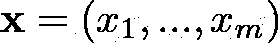

# 卷积序列到序列学习— 2017 年

> 原文：<https://medium.com/analytics-vidhya/convolutional-sequence-to-sequence-learning-2017-16aeb5af4e1c?source=collection_archive---------14----------------------->

摘要

原文(并带有更好的 Latex)位于:[https://atakanokan . com/paper summaries/2017-卷积序列到序列学习/](https://atakanokan.com/papersummaries/2017-convolutional-sequence-to-sequence-learning/)

# 信息

链接: [Arxiv](https://arxiv.org/abs/1705.03122)

论文作者:脸书人工智能研究所(FAIR)

这篇论文为什么重要？:介绍了序列到序列问题的卷积运算。

代码: [Fairseq —脸书研究](https://github.com/facebookresearch/fairseq)

# **总结**

本文处理序列到序列的问题，如机器翻译(MT)和抽象摘要。

## **输入**

从 **x** 开始，它是被标记化的输入序列(通过经典的空格分隔、字节对编码或单词块等)。):

其中 x_{1}将对应于第一个令牌。

所有这些令牌都嵌入在分布空间中

其中 w_{1}对应于第一令牌的嵌入(x_{1})。

这些 w_{i}具有{R}^{f}维数，并且是从作为嵌入矩阵的维数为{R}^{V x f 的矩阵 **D** 中检索的。

为了让模型知道输入记号的位置，我们向每个记号嵌入添加了绝对位置嵌入。位置嵌入:

其中 p_{1}对应于第一令牌(x_{1})的绝对位置嵌入，并且具有维度{R}^{f}.

然后，通过逐元素相加每个向量对，将所有记号嵌入(w_{i})与绝对位置嵌入相结合，以构建输入记号的最终表示:

## **编码器**

编码器中的每个卷积核将 k 个输入元素(e_{i})连接在一起。这种计算的输出是 A。我们使用另一个卷积核来产生另一个向量(具有与 A 相同的维数):B。然后，这个 B 通过非线性，即本文中的门控线性单元(GLU)。然后，A 按元素乘以 GLU 的输出:sigma(B)

到目前为止的计算可以用图表表示如下:

每个卷积块的输入到输出之间也有残差连接(卷积+非线性)。这使得梯度传播能够通过大量的层:

其中 v(…)表示对前一层或输入的级联矢量进行的卷积+非线性运算，z_{i}^{l-1}表示前一层的单个矢量输出。在本文中，剩余连接在这里被强调:

## **多步注意**

该架构对每个解码器层使用单独的注意机制。

其中 h_{i}^{l}是当前解码器状态，g_{i}是先前目标令牌的嵌入。并且状态 I 和源令牌 j 的注意是:

其中 c_{i}^{l}是当前解码器层的条件输入。

## **解码器**

在解码器的最后一层之后，通过下式在 T(=目标词汇大小)可能的目标标记 y_{i+1}上计算分布:

## **数据集**

*翻译

*   WMT 16 年英语-罗马尼亚语
*   WMT 14 年英语德语
*   WMT 14 年英语-法语

*总结(抽象)

*   千兆字
*   DUC-2004 年