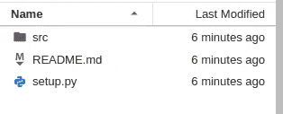
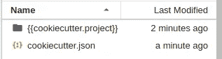
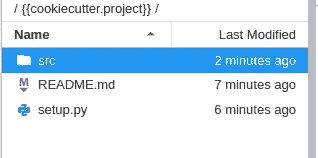

# cookiecutter——软件项目的模板

> 原文：<https://medium.com/analytics-vidhya/cookiecutter-template-for-your-software-projects-20eca407fc5e?source=collection_archive---------15----------------------->


杰米·戴金在 [Unsplash](https://unsplash.com?utm_source=medium&utm_medium=referral) 上拍摄的照片

了解如何创建可在您的软件项目中重用的模板。好处:把它放在 Github 上，直接从 Github 用于你的新项目。


来自 [Github](https://github.com/cookiecutter/cookiecutter) 的 cookiecutter 图片

## **为什么？**

我们大多数项目都遵循某种易于复制的结构。为你所有的 ML/软件项目设计一个模板真的很有帮助。这可以保持东西整洁。假设您的典型项目有一个源文件夹、一个 readme.md 文件和一个 setup.py 文件，如下所示。



项目模板示例

我们想做一个可以重复使用的模板。实现这一点的一个优秀的包叫做 [cookiecutter](https://github.com/cookiecutter/cookiecutter) 。它可以使用 pip 安装，如下所示:

```
!pip install cookiecuttter
```

**该怎么做**

要创建一个模板，cookiecutter 需要两样东西:

*   文件夹/文件结构
*   存储项目配置的 cookiecutter.json 文件。

要实现这一点，创建一个文件夹，并将文件夹名“{{cookiecutter.project}}”和“cookiecutter.json”如下所示。



将用作模板的项目文件夹的内容。

> 配置:cookiecutter.json

打开并编辑 json 文件，如下所示:

```
{ 
    "project": 'project', 
    'author': 'author', 
    'version': '0.1',
    'description': 'description'
}
```

> 文件夹结构:{{cookiecutter.project}}

在{{cookiecutter.project}}文件夹中，创建以下文件:



对 README.md 文件进行任意编辑，例如:

```
## readme of the {{cookiecutter.project}}

Author : {{cookiecutter.author}}
Version: {{cookiecutter.version}}
Descritption: {{cookiecutter.description}}
```

基本上，我们引用了 cookiecutter.json 文件中的项目，并重用了它们。下面是一个 setup.py 文件示例。

```
import setuptools

setuptools.setup(
    name="{{cookiecutter.project}}", 
    author="{{cookiecutter.author}}", 
    version="{{cookiecutter.version}}",
    classifiers=[
        "Programming Language :: Python :: 3",
        "License :: OSI Approved :: MIT License",
        "Operating System :: OS Independent",
    ],
    python_requires='>=3.6',

)
```

这就是全部，它为你的下一个项目做好了准备。

## 模板怎么用？

回到 json 文件所在的根文件夹。作为命令行运行以下命令:

```
cookiecutter  .
```

执行该命令时，要求用户输入项目名称、作者、版本和项目描述(cookiecutter.json 文件中的所有字段)。默认值也显示在[]中。将使用提供的信息创建一个新文件夹。打开该文件夹，您将看到更新的 README.md 和 setup.py 文件以及一个“src”文件夹。下面是 setup.py 文件的快照:

```
import setuptools

setuptools.setup(
    name="test_project", 
    author="user_name",
    version="0.0.1",
    classifiers=[
        "Programming Language :: Python :: 3",
        "License :: OSI Approved :: MIT License",
        "Operating System :: OS Independent",
    ],
    python_requires='>=3.6',

)
```

## 将您的模板存储在 Github 上以备将来重用:

一个简单的方法是将你的 cookiecutter 模板推送到你的 github，当需要的时候，只需要拉 repo 并使用它创建新的项目。就这么办吧。转到您的 github 帐户，创建一个名为: **cookiecutter 的新 repo。**转到模板所在的根文件夹，运行下面的 git 命令。

```
!echo "# cookiecutter" >> README.md
!git init
!git add
!git commit -m "first commit"
!git remote add origin https://github.com/username/cookiecutter.git
!git push -u origin maste
```

确保将**用户名**替换为你的 Github 用户名。

## 直接从 Github 使用模板

创建一个新文件夹，并在终端运行以下命令

```
!cookiecutter https://github.com/username/cookiecutter.git
```

您将被询问与之前相同的信息。简单的模板就是这样。快乐编码:)

喜欢这个故事就鼓掌。关注我了解更多故事:)