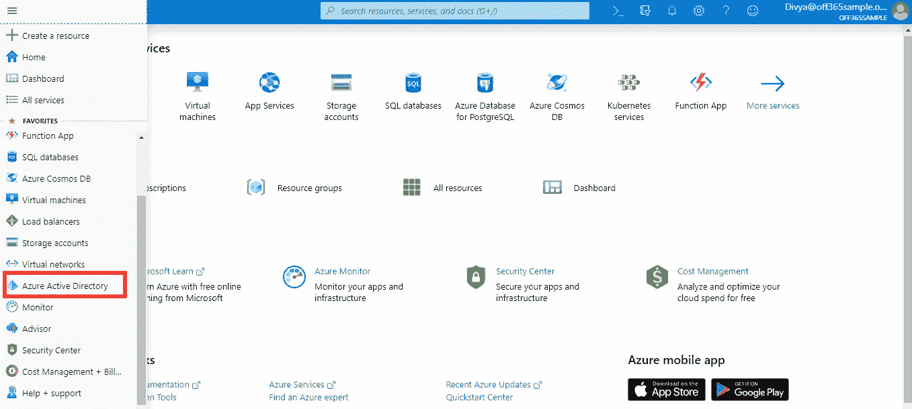
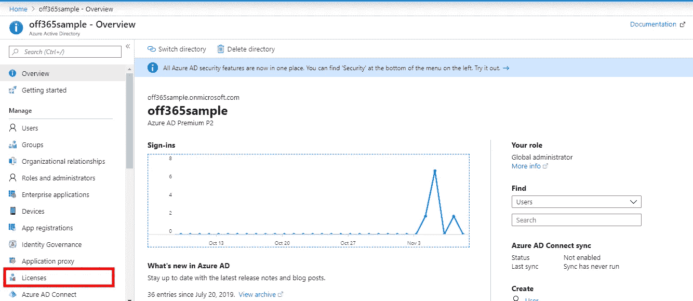
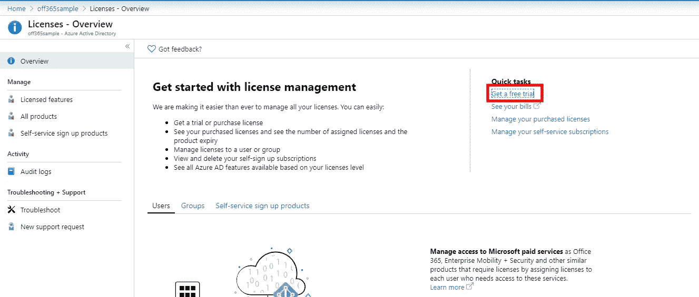
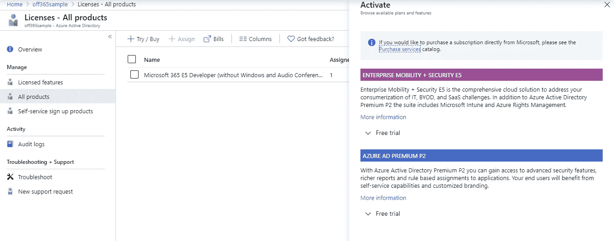
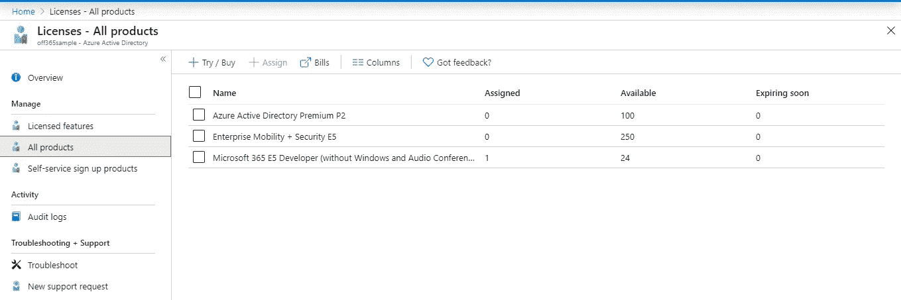
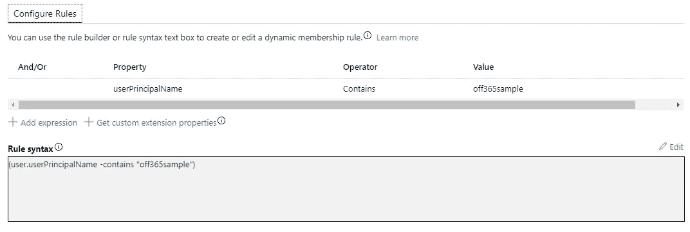
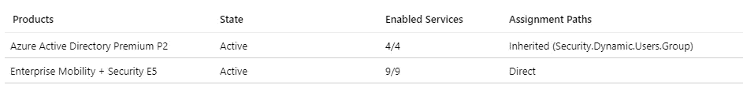
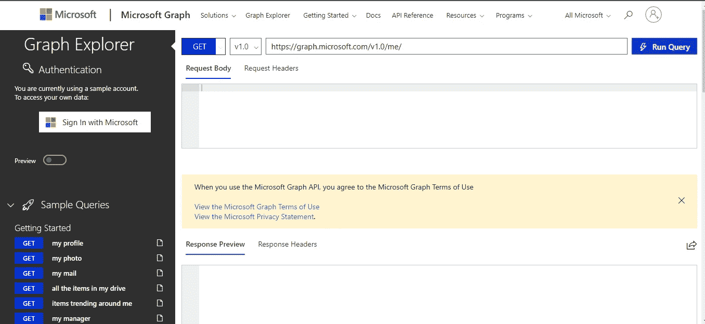
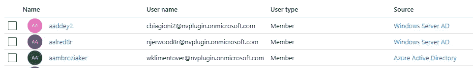
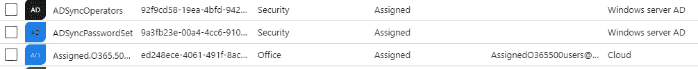

# 关于 Azure AD 的酷黑客

> 原文：<https://medium.com/analytics-vidhya/cool-hacks-about-azure-ad-603133eb5da2?source=collection_archive---------18----------------------->

在上一篇文章中，我们创建了一个免费的 Office365 开发者帐户。在这篇文章中，我们将做一些很酷的事情。

# 获取更多免费许可证

是啊！每个人都希望他们的测试环境中有更多的许可证。这里有一个简单的方法，不用给出任何信用卡信息就可以得到它们。

1.  转到 [Azure 活动目录门户](https://portal.azure.com/\)。
2.  使用我们在上一篇文章中创建的全局管理员登录。例如，对我来说是 divya@off365sample.onmicrosoft.com。
3.  点击 Azure 活动目录。

4.点击许可证。

5.点击快速链接中的免费试用选项。如果您看不到此选项，请转到“所有产品”并单击“尝试/购买”。

6.免费试用企业移动+安全 E5 和 Azure AD Premium P2。

激活免费试用版后，可能需要几分钟时间进行同步。刷新页面以查看您在所有产品中的许可证。

万岁！现在我有 374 个执照。

# 动态组和许可证

给每个用户单独分配许可证是一件痛苦的事情。令人惊叹！Azure 允许你用一些逻辑创建动态用户成员类型组。满足该逻辑的用户会自动添加到该组中。

> 注意:不能手动在动态组中添加或删除用户。基于逻辑匹配添加或删除用户。

让我们创建一个动态组。

1.  在 Azure 广告门户上，转到组。
2.  点击添加组。
3.  为安全组编写名称和描述，并将分配类型选择为“动态用户”。
4.  单击添加动态查询。
5.  添加查询:userPrincipalName 包含<you domain="" name="">。单击添加表达式并保存。</you>
6.  单击创建组。

一段时间后，当组更新时，您将在该组的成员中看到您的域的所有用户。

现在，要将许可证分配给所有用户，需要完成以下步骤:

1.  转到新创建的动态组。
2.  点击许可证。
3.  单击分配并选择一个或多个要分配给域中所有用户的许可证。

一段时间后，所有用户都将获得分配给动态组的许可证。类似地，如果不想将许可证分配给所有用户，可以创建许多其他类型的动态成员资格组。

在用户的许可证中，许可证被列为继承的。当组被删除或用户成员资格被更改时，用户的许可证将被删除。

# 使用 Microsoft 图形浏览器

无论你是开发人员、测试人员还是普通技术专家，你都需要了解微软的这个图形浏览器。

网址:[https://developer.microsoft.com/en-us/graph/graph-explorer](https://developer.microsoft.com/en-us/graph/graph-explorer)

使用它可以完成以下惊人的事情:

1.  它列出了连接的 Azure 目录的所有用户、组和其他实体。
2.  列出 Azure 目录中特定对象的属性及其值。一些 Azure AD 无法直接看到的属性，可以从这里探究。

要使用它，请使用 Azure AD 的全局管理员登录，并授予所需的权限。如果您使用没有任何权限的普通用户登录，那么您将看不到除该用户之外的任何其他对象的属性。

> *注意:在图形浏览器上查询更多属性时切换到测试版。*

# 将内部广告与 Azure 广告同步

如果你已经有一个活动目录，并希望在你的 Azure 活动目录上使用相同的用户和组帐户，那么 Azure 提供了一个非常容易配置的工具 Azure AD connect。

1.  在本地 active directory 服务器上下载 [Azure AD connect](https://www.microsoft.com/en-us/download/details.aspx?id=47594) 。
2.  安装时配置[快速设置。](https://docs.microsoft.com/en-us/azure/active-directory/hybrid/how-to-connect-install-express)

> 注意:对于此设置，您需要 Azure Active Directory 全局管理员和本地 Active Directory 管理员的凭据。

一段时间后，同步过程将完成。以下是一些有帮助的 PowerShell 命令:

*   **导入模块 ADSync** :如果 PowerShell 中没有 ADSync 模块，则导入该模块。
*   **Get-ADSyncScheduler** :查看调度器配置。
*   **Start-ADSyncSyncCycle-policy type Delta**:运行手动同步周期。
*   **Set-adsync scheduler-SyncCycleEnabled $ false**:禁用同步调度器。

同步后，您将看到用户的两个来源:

*   Windows Server AD(内部同步用户)
*   Azure Active Directory(在 Azure 中创建的用户)

同样，对于团体来说，将有两个来源:

*   Windows Server AD(内部同步组)
*   云(在 Azure AD 中创建的组)

> 注意:启用同步时，不能从 Azure AD 删除或编辑内部同步的用户和组。用户/组中的任何更改都需要在内部 AD 中完成，并同步到 Azure AD。

# 结论

Azure Active Directory 简单易用，易于学习。你探索得越多，你就会发现越多新的技巧和有趣的特性。所以，让你的手弄脏微软的这项惊人的服务。

如果你喜欢这些小技巧，请为这篇文章鼓掌，并写下你的发现。