# 神经网络的酷数学

> 原文：<https://medium.com/analytics-vidhya/cool-mathematics-of-neural-networks-3e62da62ebcf?source=collection_archive---------34----------------------->

问候一下，让我们看看神经网络背后的**简单**和**有趣**的数学。

# **第一部分(正向传播):-**

所以，基本上我们可以认为神经网络是排列在不同层的许多**神经元**的集合。
那么，我们知道了神经网络的基本概念，但是什么是**神经元**？

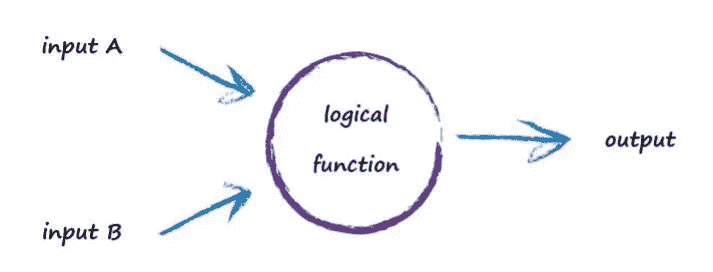

**神经元**

我们可以认为一个神经元接受一些输入，对输入执行一些**计算**并产生输出(相当简单)。我们正在谈论的这些计算是什么？
所以，数学上我们可以把神经元想象成，

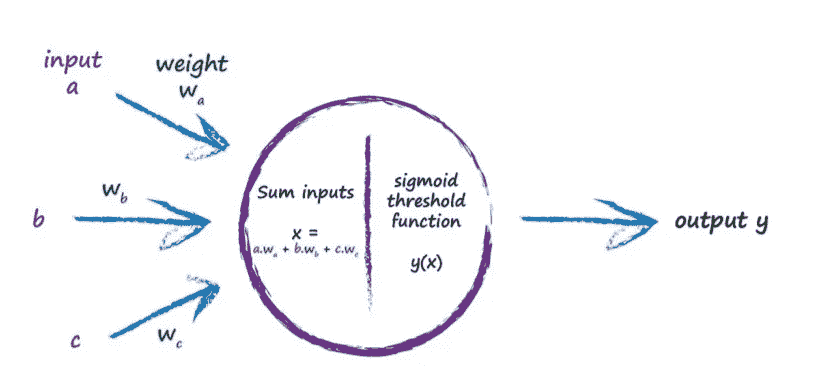

下图再次显示了神经元，但这次显示的是权重和逻辑函数( **sigmoid 函数**)。低权重会削弱信号，高权重会放大信号。

X =重量*输入(W*I)

这里每个神经元会分别找到 **X** 和 **y(X)** (乙状结肠函数)。
如何计算 y(X)？
sigmoid 函数，有时也称为逻辑函数，是

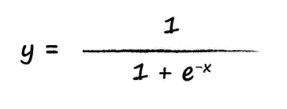

Sigmoid 函数

这就是一个神经元如何计算它的输出:-
1)找到 X
2)通过应用如上所示的公式找到 y(X)3)一个神经元的输出= y(X)

**一个三层的例子:-** 让我们举一个例子，计算一个三层神经网络的输出:)
下图显示了一个三层神经网络的例子，每层有三个节点。为了保持图表清晰，没有标出所有的重量。

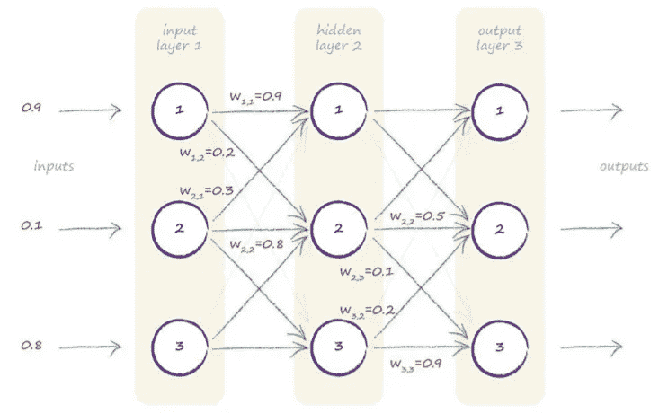

三层神经网络

第一层是输入层，我们知道。最后一层是输出层，我们也知道。中间层称为隐藏层。
那么我们开始计算吧，
我们会用矩阵来降低复杂度。所以我们开始吧:)
**1)** 。我们可以看到三个输入分别是 0.9、0.1 和 0.8。所以输入矩阵 **I.**

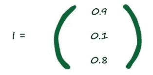

**输入矩阵 I**

**2)。**完成，现在下一步是权重去隐藏层。假设权重矩阵为 **W(input_hidden)** ，因为权重是从输入层到隐藏层的。
图表显示了本例中的一些(虚构的)权重，但不是全部。下面显示了所有这些，也是随机编造的。在这个例子中，它们没有什么特别的。

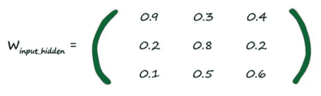

权重矩阵(输入 _ 隐藏)

**3)。**最后，我们也得到了权重。
……现在我们需要计算 X (X = W.I)如前所示。很简单，只要遵循公式，即 X=W.I
我们将 X 表示为 **X(隐藏)**，因为这些是隐藏节点的输入… **X(隐藏)= W(输入 _ 隐藏)。我**

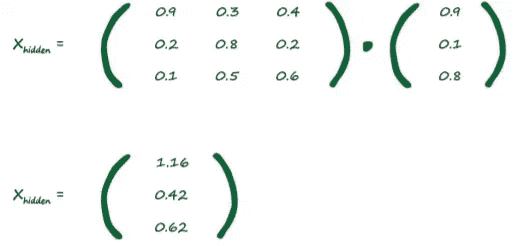

Gr8 伙计们，我们成功了，但是任务还没有结束。
我们已经计算了隐藏层的输入。

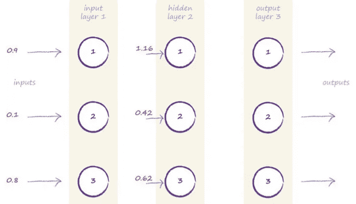

**4)。**让我们计算一个隐藏层的输出，即 **O(隐藏)。** 嗯，那么输出是多少呢？非常简单，输出是 **y(X)** 我们前面已经看到了。所以让我们找到， **O(隐藏)= sigmoid(X(隐藏))**即

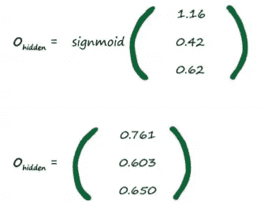

现在我们也得到了输出(万岁)。只有一件事需要考虑，我们得到了隐藏层的输出，但是输出层的输入和输出层的输出呢？
**【EASYYY】**只要按照我们之前做过的相同步骤:-
1)计算 X
2)计算 y(X)
但是输出层的输入有哪些呢？
输出层的输入是前一层的输出(有意义)

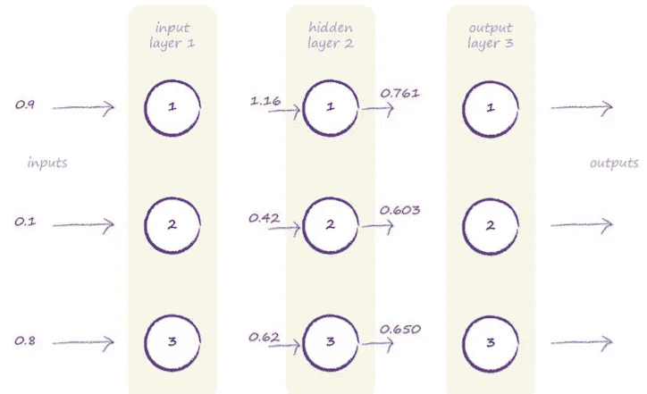

现在你明白了，
所以**输出层的输入(I(output)) = O(hidden)** 那么，让我们找出 X 对于输出层= X(output)
X = W.I，因此
X(output) = W(hidden_output)。o(隐藏)

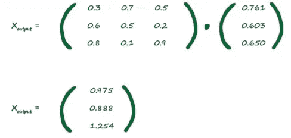

x 表示输出层

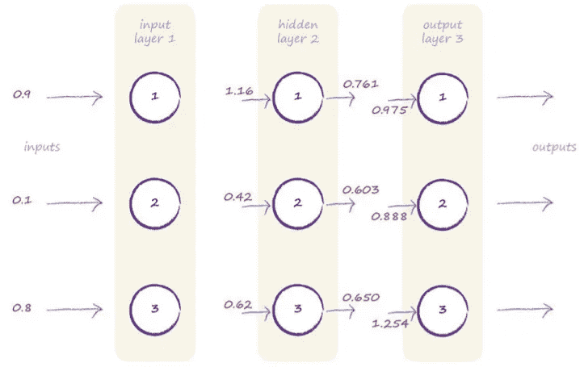

剩下的就是应用 sigmoid 激活函数，这很容易。

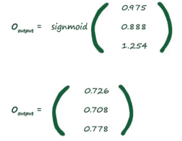

就是这样！我们得到了神经网络的最终输出。让我们也在图上展示一下

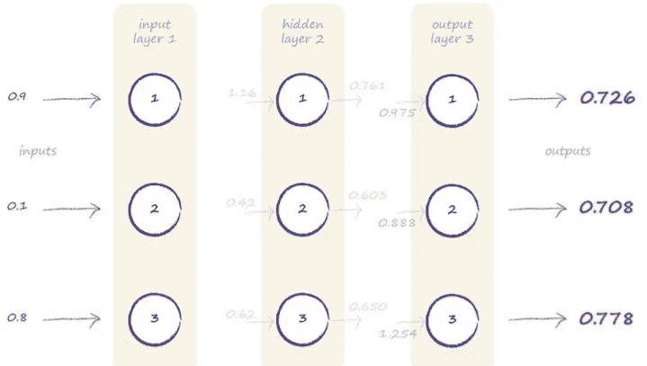

万岁！万岁

*   ****这整个过程称为正向传播*****
    ，因为我们是从输入层到输出层正向传播
*   因此，我们已经了解了神经网络如何产生输出(前向传播)。在我的第二部分中，我们将看到反向传播是如何工作的