# 合作的多智能体系统(JAL 在捉鱼中的应用)

> 原文：<https://medium.com/analytics-vidhya/cooperative-multi-agent-systems-jal-9fcc281fccca?source=collection_archive---------9----------------------->

又见面了。今天，我只想和你分享我在一些坐标游戏上应用联合行动学习(JAL)的实验。

那么，我们现在面对的是什么？

# **1。问题概述**

简而言之，我有两个代理人试图学会合作，以捕捉一些存在于那里的猪。游戏环境由 n×n 个网格组成。当游戏开始时，两个代理人和一头猪被放置在一些随机的格子里。

在游戏的每个阶段，这两个代理都应该观察环境的状态，从五个可能的行动中选择一个(右转、左转、前进、等待或抓住猪)。每个代理采取的动作组成了所谓的动作配置文件。猪还会选择四个动作中的一个(向右转、向左转、向前移动或只是等待)。猪是环境的一部分，这意味着我们不应该控制它。

无论如何，作为对所采取行动的响应，环境奖励或惩罚每个代理，然后，它转换到一个新的状态。

为了赢得游戏，每个代理必须在猪的当前细胞旁边的细胞之一。他们还必须面对猪，然后，他们应该选择“抓”的动作。猪很强壮，你知道，他们必须合作才能抓住它。

在所有这些发生的情况下，两个代理人都获得了高额报酬，游戏刚刚结束。除此之外，根据他们的选择有多糟糕，他们会受到不同价值的惩罚，游戏的新阶段开始了，代理人应该再次尝试协调。

# **2。环境模拟**

一个相当不错的游戏模拟是由某个家伙实现的 [@shuo2019maenvs ☍](https://github.com/Bigpig4396/Multi-Agent-Reinforcement-Learning-Environment) 。游戏的详细描述可以在[他的资源库☍](https://github.com/Bigpig4396/Multi-Agent-Reinforcement-Learning-Environment/blob/master/env_CatchPigs/CatchPigs.pdf) 中找到。

酷的事情是，他的实现是不可知的集成学习算法。它只是让你采取选中的联合行动，然后，它简单地将奖励和新状态返回给你。

我认为它遵循 [OpenAI Gym ☍](https://gym.openai.com) API，但用于多代理学习。它还有其他有趣的游戏。随便看看。

下面是他的实现如何根据选定的大小渲染环境。

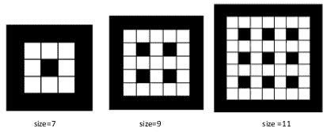

这是游戏的一个随机阶段(n=3)。蓝色和红色是我们的好代理人，而绿色是邪恶的猪。T 如何旋转代表代理或清管器面向哪个方向。我想这很简单。

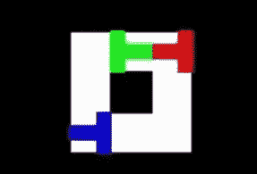

以下是所有可能的联合行动的回报汇总。请注意，根据采取行动方案时的环境状态，相同的行动方案可能会导致不同的奖励。

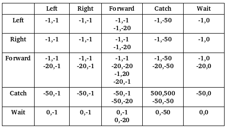

例如，当我前面提到的条件成立时，每个代理的<catch>可能以<500,500>结束。除此之外，两位经纪人都被处以。</catch>

另一个例子是<forward left="">，第一个向前选择的代理可能会收到-1 或-20，这取决于它试图移动到哪个单元。如果它是一堵墙或其他什么东西，代理就会受到惩罚，这样它就能学会在下一次只踩空的细胞。</forward>

这是游戏的另一个阶段，如果两个代理选择“捕捉”动作，这可能是最后一个阶段。

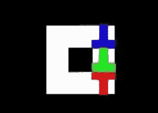

# **3。解决方案**

现在，让我们考虑一下解决这样一个问题的不同方法。让我们把问题分成更小的子问题，并分别讨论。

让我们站在一个特工的立场上想想。在每个阶段，我环顾四周，然后说:'*嗯，我应该选择什么行动呢？*’。假设我是一个理性的代理人，我实际上应该问自己什么样的行动会产生最好的回报？’

为了能够回答这样的问题，我应该有一些东西，一个黑盒，它将当前状态 s 作为输入并输出一些值，每个可能的动作一个值，它告诉我在给定我的当前状态下采取该动作有多好。这些值被正式称为行动值 Q(s，a ),它们被定义为在状态 s 采取行动 a 的期望收益，稍后会详细介绍。

输出这些值的黑盒可以是一个简单的查找表或一个完整的神经网络近似器或其他任何东西。现在，让我们从最简单的例子开始，也就是表，我们假设我们已经得到了查找表。

# **4。动作选择子问题**

这张表可能是两件事之一，取决于我是否意识到有另一个代理人试图与我合作。

如果我没有意识到，其他代理将只是环境的另一部分。在这种情况下，环境对我来说看起来是不稳定的，这意味着它对相同的状态-行为对返回不同的回报。发生这种情况是因为我得到的奖励也是基于其他代理采取的行动，而我甚至不知道它的存在。无论如何，桌子应该是这样的。它只是告诉我当前状态下每个动作的 Q 值。这就是个人学习(IL)代理学习的内容。

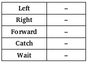

相比之下，如果我完全意识到另一个代理的存在，我会把其他代理的行动纳入我的考虑，这意味着我会有一个 Q 值代表每个可能的联合行动。桌子应该是这样的。这就是联合行动学习(JAL)代理学习的内容。

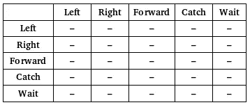

## **博弈论概述**

假设每个代理都有一个类似上面的表，并且它以一种理性的方式行动，这意味着它对当前的情况采取了最佳的反应。我们可以说，在游戏的多个阶段之后，两个代理人将达到所谓的均衡，在这个均衡中，从现在开始没有代理人想要改变其行为方式(称为策略)。

我所说的最佳对策是指每个代理人都会选择行动值 q 最大的行动。

作为行玩家，如果我们遵循纯策略(始终选择一个单一的动作)，假设列玩家始终选择“左”，那么我将查找具有左标题的列中的值，并选择与那里的最大值对应的任何动作。作为响应，列播放器将执行同样的操作，并在与我最近执行的操作相对应的行中查找最大值，依此类推。

另一方面，如果我们遵循混合策略(对所有可能的行动进行概率分布)，作为 row 玩家，我希望用一个值来表示每个行动，这样我就可以选择一个，但在我们的例子中，我最终得到了五个值。

你可能会想，为什么我们不把它们进行加权求和呢？这就是我们要做的。权重应该基于每个值的频率，这意味着它基于五个联合动作(不包括我)发生的概率。

每个联合行动的概率，简单来说就是联合中各部分(不包括我)的概率相乘。不幸的是，我不知道其他部分的概率。我不知道其他代理人参与某项特定行动的可能性。为了得到这些信息，我需要对另一个代理的策略有一个估计。最简单的方法就是所谓的虚拟游戏。你只需要计算每个动作被另一个代理执行的次数。

下面的等式只是用符号来表示:

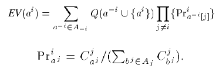

## **最优均衡**

我们说过，如果每个代理人都是理性的，并且选择对另一个代理人的策略做出最佳反应，他们就会达到均衡。那么，这种均衡总是好的吗？这是他们能拿到的最好的东西吗？

一般来说，如果代理人遵循纯策略，博弈(代理人在每个阶段面临的情况)可能有:一个纯优势均衡，多个纯均衡或根本没有纯均衡。

另一方面，如果代理人遵循混合策略，博弈必须至少有一个混合均衡。

在我们的例子中，代理人通常以混合策略结束，所以可能有一个或多个均衡。在只有一个的情况下，我们没有问题，因为代理会在那里结束。但是在有多个的情况下，一些均衡可能是最优的，而另一些不是。事实上，代理人可能会在某种非最优均衡中结束。

在这方面已经做了一些努力，但我不打算讨论它们。只是要意识到这可能会发生。

# **5。学习子问题**

你还记得我刚刚假设所有神奇 Q 值的查找表就在我们手中吗？那张桌子不可能凭空出现。需要学习。我们只是在和对他们的任务和环境一无所知的代理打交道。他们的头脑是一张白纸，他们渴望学习。这只是我们问题的学习部分。

## **强化学习概述**

强化学习使用一个非常简单的学习范式。没有指导者或老师告诉你这是对的或这是错的。你手无寸铁地被丢在那里。

你做你想做的，但是作为回应，你要么得到奖励，要么受到惩罚，这取决于你的选择。奖励或惩罚不必立竿见影。它可能会被推迟到未来的某个时间。显然，你需要学会选择能让你获得最大回报的行动，一路走下去。你也需要避免那些让你被痛打一顿的行为。

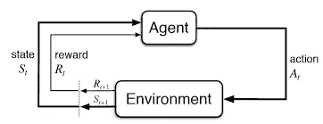

为了做到这一点，你不能仅仅把你的决定建立在选择一个行动后得到的直接回报上，因为选择一个行动的实际结果并不一定会立即得到。

相反，你需要知道从现在开始你将获得的累计折扣奖励。我们称之为回归 g。

状态值函数 V(s)或动作值函数 Q(s，a)是分别给定一些状态或一些状态和动作对(s，a)的期望收益 G。

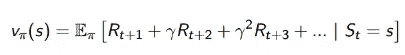

你可以简单地证明价值函数 V(s)和 Q(s，a)实际上是由即时回报 R 加上下一个状态或下一个状态-行动对的贴现价值函数组成的。

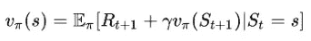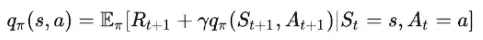

预期收益(特别是 Q)实际上是我们在上面的查找表中得到的。依靠 V 或 Q 来选择行动被称为基于价值的强化学习。那么，每个代理如何计算这些值呢？

## **Q 学习算法**

我们的代理将使用 Q 学习算法，因为它很简单。

简而言之，对于所有的状态-动作对，每个代理从可能为零的初始化 Q 值开始。然后，代理开始通过采取步骤来探索环境。

在每一步，它采取一个动作(由于全 0 初始化，通常在第一步是随机的)，代理会立即获得一些奖励 R。因此，代理会在采取该步骤之前更新状态-动作对的 Q 值，其方向是该对的当前估计值(在知道奖励 R 之后)与其之前认为的值之间的差异。

下面是更新公式:

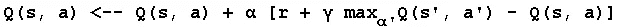

这是完整的算法伪代码:

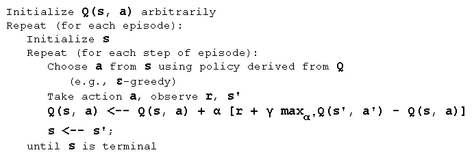

通过对每个状态-动作对进行足够次数的更新，您的 Q 值将最终收敛，假设环境是静态的，并且代理的状态表示是马尔可夫的，这意味着代理状态包含所有需要的信息，通过这种方式，代理如何达到该状态的历史可以被完全忽略。

## 资格跟踪

正如我之前提到的，您只需在采取步骤之前更新状态-动作对的 Q 值。这样做只是许多可能的更新中的一种。

实际上，这种方法有点慢，因为每次更新只会影响你在得到正面或负面奖励之前的最后一个状态-动作对的 Q 值。为了让它也影响到你经过的其他州，需要额外的插曲来传播回来。

在对我们的问题做了一些实验后，我发现它太慢了，尤其是在我们的问题中已经有了大量的状态-动作对的情况下。

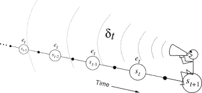

简而言之，为了避免进入过多的细节，一种称为资格跟踪的简单而强大的技术也被集成到更新中，以确保代理在获得特定奖励之前经过的每个状态或状态-动作对，根据代理在获得奖励之前遇到该状态或状态-动作对所经过的时间成比例地获得其份额。

# 6.履行

嗯，说了太多了。让我们试着把这些对话应用到我们的问题上。

首先，为了简单起见，我选择 n=3。所以，我们有一个 3x3 的网格。

第二，我可以选择让代理完全或部分观察环境。同样，为了简单起见，我选择了完全可观察选项。在每个阶段，每个代理可以观察其当前位置(X，Y)和方向，其他代理的位置(X，Y)和方向，最后是清管器的位置。

例如，第一个代理可以在单元中(x=2，y=2)并且面朝上(ori=1)，而第二个代理在单元中(x=4，y=4)并且面朝下(ori=3)，而猪在单元中(x=4，y=2)。

基于此，第一代理的状态将是 2_2_1_4_4_3_4_2，而第二代理的状态将是 4_4_3_2_2_1_4_2。该状态显然由 3 部分(2_2_1)_(4_4_3)_(4_2)组成，代表(代理人 _ 位置 _ori)_(其他 _ 位置 _ori)_(猪 _ 位置)。请注意，猪的方向被忽略了，因为我认为它不应该影响代理的行为。

因为我们正在应用联合动作学习，每个代理需要学习每个可能状态的每个可能联合动作的 Q 值。

让我们快速浏览一下代码:

这是代理选择其动作的部分。它要么随机选取，要么基于其当前 Q 值选取。在后一种情况下，它首先计算每个可能动作的加权和，然后选择具有最大 Q 值的动作。

代理有时需要随机选择行动。这样，他们将能够探索更多有趣的选择。他们不能仅仅坚持他们目前拥有的。简而言之，探索应该被整合到代理人的策略中，以确保他们不会错过更好的选择。

每个代理选择一个动作，我们就可以在游戏中前进一步。

在每一步结束时，您需要更新 Q 值。

完整版本的代码可以通过链接☍ 访问[。](https://github.com/RadwaElaraby/learning-algorithms/blob/master/CatchPigs/joint-action-learn.py)

# 7.实验和结果

嗯，最激动人心的部分是看我们两个特工的行动。下面的 GIF 展示了第一集我们的特工。我不得不手动停止它，因为在他们第一次成功协调之前，他们可能需要几个小时。想象一下他们是如何随机选择行动的。

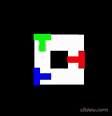

第一集的特工

这是 300 集之后同样的两个特工。正如你所看到的，他们在几个游戏阶段后成功协调。

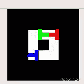

300 集后的特工

让我们快速总结一下实验的设置。首先，代理人玩了大约 300 场游戏。前 200 集/游戏以*贪婪-ε = 0.5* 和*学习率= 0.3* 执行，而后 100 集/游戏以*贪婪-ε = 0.3* 和*学习率= 0.2* 执行

返回 G 很快被优化。正如您在下图中看到的，在不到 100 集的时间里，每个代理的收益 G 从-140，000 到-1000 到+498 不等。

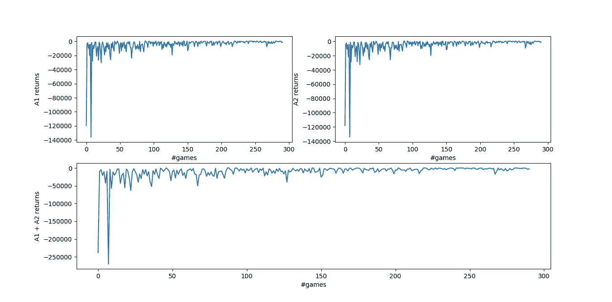

这里是每个代理学习的 Q 值，其中 x 轴代表每个(s，a)对，y 轴是相应的 Q 值:

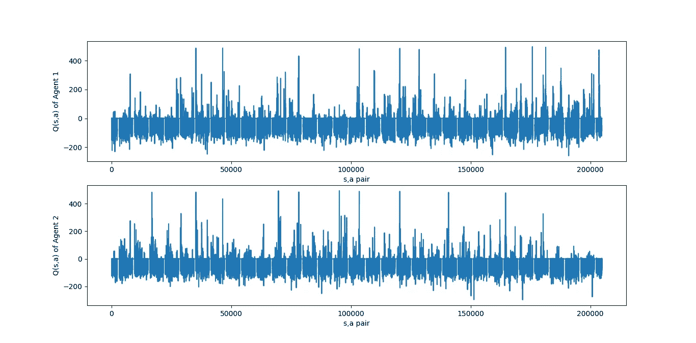

下面的 GIF 说明了第一个代理学习的 Q 值是如何在剧集/游戏中发展的:

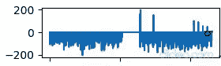

一段时间内第一药剂的 q 值

# 8.最后的话

所以，这只是我试图训练多智能体来协调做这样简单的任务。你只需让你的盲目代理人的行为适应环境的回报，然后，让他们逐渐利用这些信息来选择具有最大 Q 值的行动。最后，他们会达到一个平衡。

请注意，该算法假设了许多无法保证的事情，例如对环境的全面观察、代理能够感知其他代理采取的行动、代理的合理性..等等

无论如何，这是一次有趣的尝试...

# **9。参考文献**

[1]克劳斯，卡罗琳&鲍蒂利尔，克雷格。(1970).合作多智能体系统中强化学习的动力学。全国人工智能会议(AAAI，1998 年)。

[2][https://github . com/big pig 4396/多智能体强化学习环境](https://github.com/Bigpig4396/Multi-Agent-Reinforcement-Learning-Environment)

[3][https://www.cse.unsw.edu.au/~cs9417ml/RL1/algorithms.html](https://www.cse.unsw.edu.au/~cs9417ml/RL1/algorithms.html)