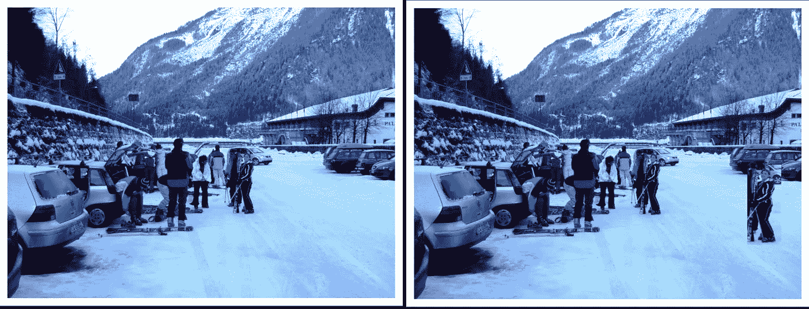
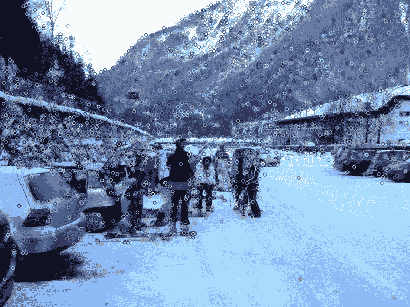
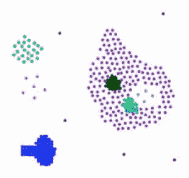
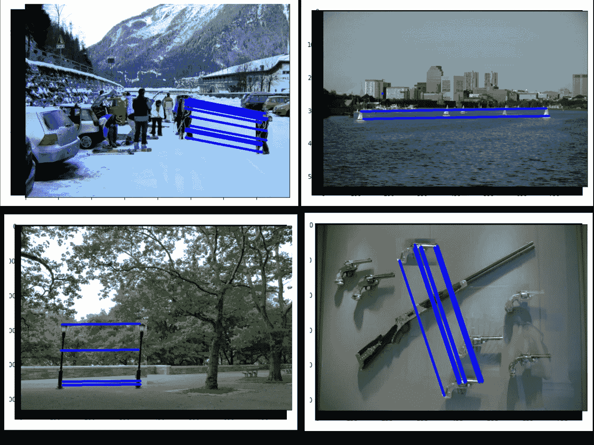

# 基于 SIFT 和 DBSCAN 聚类的复制移动伪造检测。

> 原文：<https://medium.com/analytics-vidhya/copy-move-forgery-detection-using-sift-and-dbscan-clustering-4a179c36293e?source=collection_archive---------4----------------------->

这篇文章将向你提供一个关于检测一种非常常见的伪造技术的基本概念，即使用聚类的复制移动伪造。

获取以下方法的完整代码:

***Github:***[https://Github . com/himj 266/DBS can-Copy-Move-foregy-Detection](https://github.com/Himj266/DBSCAN-Copy-Move-Foregry-Detection)

***ka ggle:***[https://www . ka ggle . com/himj 26/copy-move-forestation-detection-DBS can-clustering](https://www.kaggle.com/himj26/copy-move-forgery-detection-dbscan-clustering)

# 复制移动伪造

让我们从复制移动伪造的简要信息开始。复制移动伪造基本上是克隆/复制图像的一部分，然后将其移动到其他位置以隐藏一些细节或产生一些假信息。
篡改图像以生成伪造的证明来操纵公众的感知，并且人们不善于识别图像何时被操纵，即使变化相当大。这种伪造如今非常普遍，在脸书、Instagram、📸以及其他平台。

复制移动伪造的例子( [MICC-F220](http://lci.micc.unifi.it/labd/2015/01/copy-move-forgery-detection-and-localization/) )

# 尺度不变特征变换

那么，我们为什么要讨论 SIFT，SIFT 到底是什么？

为了检测图像中的对象，我们需要该对象的特征来提取图像中有意义的细节。但有时，图像可能会被缩放、旋转、照亮或视点发生变化。

这意味着我们需要一种算法来提取对象的特征，即使对象被缩放、旋转或出现在不同的位置，这些特征也应该相等/相同或近似相同。
Sift 算法在这里发挥了作用。它可以检测尺度、旋转、噪声不变的特征。借助 SIFT 算法提取的特征能够识别图像中的物体，并且提取的特征具有尺度、旋转、噪声不变性。

那么，SIFT 是如何工作的呢？
SIFT 算法将通过使用边缘/角点检测技术和阈值处理在图像中找到一些“有趣的”关键点(如鼻子、眼睛)。然后，对于每个关键点，它将产生一个描述符，即一个 128 维空间中的特征向量，它通常是一个具有 128 个值的向量。

如何找到这些关键点并计算它们的描述符是 SIFT 算法的美妙之处。你可以在这个精彩的网站上阅读 SIFT 的完整机制。

SIFT 算法产生的输出

上图中标记的圆圈是 SIFT 算法检测到的“有趣”的关键点(我们可能不觉得它们有趣，但 SIFT 和它的 SIFT 选择会觉得有趣😝)对于每个圆，我们都有一个描述符。

python 中的 Sift 检测

**好了，现在我们有了关键点和描述符，但是该怎么处理它们呢？**

由于图像的一部分被复制到另一个位置，它们的特征描述符必须相等或近似相等，这就是我们将用来检测伪造的。这是许多基于关键点的复制-移动伪造检测(CMFD)技术背后的基本思想。

在许多论文中提出了许多方法来比较和识别相似的描述符。这里提出了一种聚类(DBSCAN)方法。

# 基于密度的噪声应用空间聚类(DB-SCAN)

DBSCAN 算法的基本工作可以理解为当你想玩一个要求玩家数量超过一定值的游戏时(比如黑手党😁一种纸牌游戏)你将在你的周围寻找，如果人数足够，你们将走到一起(形成一个集群)并且玩。

类似地，每个点将观察其周围的特定距离，并计算存在的其他点的数量，如果该数量大于特定值，则所有的点被认为是一个簇(高密度区域)，并且新的簇随着每个点而形成或扩展。相邻点很少的点(低密度区域)不会形成聚类。

DBSCAN 算法只需要 2 个参数

***办事:*** *这是一个点所能看到的距离。它指定了被视为聚类一部分的点之间的距离。*

***min points****:形成密集区域的最小点数。例如，如果我们将 minPoints 参数设置为 7，那么我们至少需要 7 个点来形成密集区域。它被称为最小样本。*

要全面理解这个算法，请阅读这篇精彩的文章。

稀疏区域是点密度较小的区域，而点密度较大的部分是密集区域。([图像来源](/analytics-vidhya/how-does-the-dbscan-algorithm-work-5a18098148d6))

为什么聚类(DBSCAN)适用于这项任务？

这里的想法是，相似的描述符将在特征空间中接近，并将通过良好的聚类算法被分组到相同的簇中，这正是我们想要的，伪造和原始区域的描述符将是相似的，因此我们将能够检测伪造。

选择 DBSCAN 算法的范围是，我们不需要像 K-means 和其他聚类算法那样指定要形成的聚类的数量(有时，当没有施加约束时，我们往往工作得更好😝).

使用 DBSCAN 的伪造定位

所讨论的方法的一些结果。

上述方法的结果

好了，现在我们已经讨论了整个方法。需要记住的几点是，SIFT 是一种专利算法，因此不能用于商业用途。此外，这是我的第一个帖子，所以反馈非常感谢。

缺点:对于 CMFD 来说，这是一种简单的方法，如果参数设置不当，例如 eps 值过高，则会产生错误的结果

**一些外部链接**

***DBS can:***[https://medium . com/analytics-vid hya/how-the-DBS can-algorithm-work-5a 18098148 D6](/analytics-vidhya/how-does-the-dbscan-algorithm-work-5a18098148d6)

***SIFT:***[https://ai shack . in/tutorials/SIFT-scale-invariant-feature-transform-introduction/](https://aishack.in/tutorials/sift-scale-invariant-feature-transform-introduction/)

***可视化 DBS can:***[https://www . naftaliharris . com/blog/Visualizing-DBS can-clustering/](https://www.naftaliharris.com/blog/visualizing-dbscan-clustering/)

***MICC 数据集:***[http://LCI . micc . unifi . it/labd/2015/01/copy-move-forgery-detection-and-localization/](http://lci.micc.unifi.it/labd/2015/01/copy-move-forgery-detection-and-localization/)