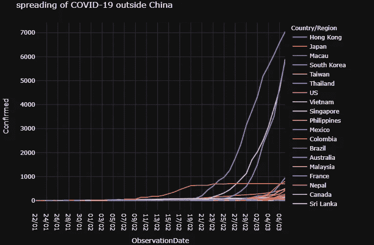

# 电晕，12 个问题和探索性数据分析

> 原文：<https://medium.com/analytics-vidhya/corona-12-questions-and-exploratory-data-analysis-7b0b3c41e5d0?source=collection_archive---------13----------------------->

## 可视化新冠肺炎疫情数据的分析方法

来源:https://www.leehealth.org/public-health

> 冠状病毒(CoV)是一个大的病毒家族，可导致从普通感冒到更严重疾病的疾病，如[中东呼吸综合征(MERS-CoV)](https://www.who.int/emergencies/mers-cov/en/) 和[严重急性呼吸综合征(SARS-CoV)](https://www.who.int/csr/sars/en/) 。[一种新型冠状病毒(nCoV)](https://www.who.int/emergencies/diseases/novel-coronavirus-2019) 是一种新的毒株，此前尚未在人类中发现。—世卫组织

因此，新的十年以最糟糕的方式开始，电晕爆发。在进入细节之前，我想感谢世卫组织大学和约翰·霍普金斯大学将数据公之于众。在对规模有所了解后，我们必须承认，这是一种需要全世界保持强大并共同战斗的事件。

我们将在地理和时间域的基础上对疫情进行可视化。

**我们将寻求的答案**

在这里，我们将寻求 11 个关键问题的答案，以密切分析疫情。

1.  哪些国家受疫情影响最大？
2.  众所周知，中国是此次事件的源头，那么中国和世界其他国家相比情况如何？
3.  确诊病例在全球各地区是如何分布的？
4.  确诊和死亡病例在受影响最严重的国家是如何分布的？
5.  哪些国家的死亡率最高？
6.  哪些国家的回收率最高？
7.  病毒是如何随着时间传播的？
8.  随着时间的推移，病毒是如何在中国境外传播的？
9.  病毒是如何在各个地区传播的？
10.  有死亡病例报告的地区有哪些？
11.  迄今为止，哪些国家已完全康复(所有确诊病例均已康复)？
12.  每天报告多少新事件(确认/恢复/死亡)？

***Q1。哪些国家受疫情影响最大？***

***Q2。众所周知，中国是此次事件的源头，那么中国和世界其他国家相比情况如何？***

尽管大多数确诊病例与中国有关，但疫情也在迅速蔓延至全球其他地区。

***Q3。确诊病例在全球各地区是如何分布的？***

截至本分析之日(2020 年 3 月 7 日)，78%的确诊病例发生在中国，但随着疫情迅速蔓延至其他地区，情况每天都在发生变化。

***Q4。确诊和死亡病例在受影响最严重的国家是如何分布的？***

**Q5*。哪些国家的死亡率最高？***

***Q6。哪些国家的回收率最高？***

***Q7。病毒是如何随着时间传播的？***

***Q8。随着时间的推移，病毒是如何在中国境外传播的？***

***Q9。病毒是如何在各个地区传播的？***

***Q10。有死亡病例报告的地区有哪些？***

***Q11。迄今为止，哪些国家已完全康复(所有确诊病例均已康复)？***

***Q12。每天报告多少新事件(确认/恢复/死亡)？***

## **总结**

## **结束注释**

我用 plotly 创建了这些交互式地图。所有使用的代码都可以在[这个库](https://github.com/arpan65/COVID-19-Analysis)中找到。该分析基于截至 2020 年 3 月 7 日收到的数据。坚强地面对世界！

## 附加链接

 [## arpan 65/新冠肺炎-分析

### 新冠肺炎，12 个问题，可视化和状态报告冠状病毒疾病 2019(新冠肺炎)是一种传染病…

github.com](https://github.com/arpan65/COVID-19-Analysis)  [## CSSEGISandData/新冠肺炎

### 这是由约翰·霍普金斯大学运营的 2019 年新型冠状病毒视觉仪表板的数据存储库…

github.com](https://github.com/CSSEGISandData/COVID-19)  [## 新型冠状病毒 2019 数据集

### 新冠肺炎受影响病例的日水平信息

www.kaggle.com](https://www.kaggle.com/sudalairajkumar/novel-corona-virus-2019-dataset)  [## 新冠肺炎，12 个问题，视觉化和状态

### 使用 Kaggle 笔记本探索和运行机器学习代码|使用来自多个数据源的数据

www.kaggle.com](https://www.kaggle.com/arpandas65/covid-19-11-questions-visualization-and-status?scriptVersionId=29870422)